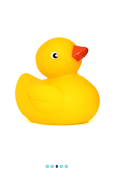
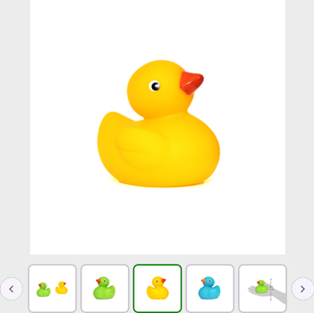
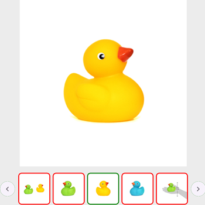
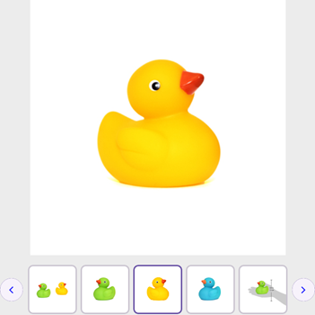
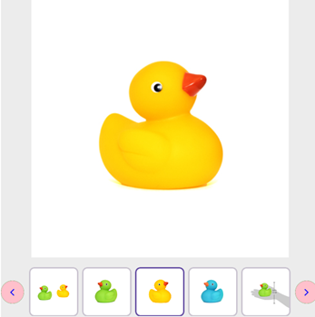
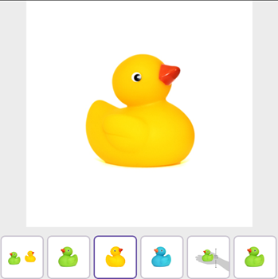

# Navigation Customization in .NET MAUI Rotator (SfRotator)

The Rotator control supports customizing dots, thumbnails and navigation buttons.

## Dots Customization

In Dot Customization we can customise the  dots' stroke, selected and unselected dots' color.

### DotsStroke Color

The [`DotsStroke`](https://help.syncfusion.com/cr/maui/Syncfusion.Maui.Rotator.SfRotator.html#Syncfusion_Maui_Rotator_SfRotator_DotsStroke) property is used to customize the color of the dots stroke in the [`SfRotator`](https://help.syncfusion.com/cr/maui/Syncfusion.Maui.Rotator.SfRotator.html?tabs=tabid-1).



<syncfusion:SfRotator x:Name="rotator" 
            ItemsSource="{Binding ImageCollection}" 
            SelectedIndex="2"
            BackgroundColor="#ececec"
            NavigationStripPosition="Bottom"
            DotsStroke="Aqua"
            WidthRequest="550"
            HeightRequest="550">




rotator.DotsStroke = Colors.Aqua;




### Selected Dot Color

The [`SelectedDotColor`](https://help.syncfusion.com/cr/maui/Syncfusion.Maui.Rotator.SfRotator.html#Syncfusion_Maui_Rotator_SfRotator_SelectedDotColor) property is used to customize the color of selected dot in the [`SfRotator`](https://help.syncfusion.com/cr/maui/Syncfusion.Maui.Rotator.SfRotator.html?tabs=tabid-1).




<syncfusion:SfRotator x:Name="rotator" 
            ItemsSource="{Binding ImageCollection}" 
            SelectedIndex="2"
            BackgroundColor="#ececec"
            NavigationStripPosition="Bottom"
            DotsStroke="Aqua" 
            SelectedDotColor="Blue"
            WidthRequest="550"
            HeightRequest="550">




rotator.DotsStroke = Color.Aqua;
rotator.SelectedDotColor = Color.Blue;
 



### Unselected Dot Color

The [`UnselectedDotColor`](https://help.syncfusion.com/cr/maui/Syncfusion.Maui.Rotator.SfRotator.html#Syncfusion_Maui_Rotator_SfRotator_UnselectedDotColor) property is used to customize the color of unselected dots in the [`SfRotator`](https://help.syncfusion.com/cr/maui/Syncfusion.Maui.Rotator.SfRotator.html?tabs=tabid-1).




<syncfusion:SfRotator x:Name="rotator" 
            ItemsSource="{Binding ImageCollection}" 
            SelectedIndex="2"
            BackgroundColor="#ececec"
            NavigationStripPosition="Bottom"
            DotsStroke="Aqua" 
            SelectedDotColor="Blue"
            UnselectedDotColor="Gray"
            WidthRequest="550"
            HeightRequest="550">




rotator.DotsStroke = Color.Aqua;
rotator.SelectedDotColor = Color.Blue;
rotator.UnselectedDotColor = Color.Gray;




## Thumbnails Customization

In Thumbnail Customization we can customise the  selected and unselected thumbnail's stroke.

### Selected Thumbnail Stroke

The [`SelectedThumbnailStroke`](https://help.syncfusion.com/cr/maui/Syncfusion.Maui.Rotator.SfRotator.html#Syncfusion_Maui_Rotator_SfRotator_SelectedThumbnailStroke) property is used to customize the color of the selected thumbnail stroke in the [`SfRotator`](https://help.syncfusion.com/cr/maui/Syncfusion.Maui.Rotator.SfRotator.html?tabs=tabid-1).




<syncfusion:SfRotator x:Name="rotator" 
            ItemsSource="{Binding ImageCollection}" 
            SelectedIndex="2"
            BackgroundColor="#ececec"
            NavigationStripPosition="Bottom"
            NavigationStripMode="Thumbnail"
            SelectedThumbnailStroke="Green"
            WidthRequest="550"
            HeightRequest="550">




rotator.NavigationStripMode = NavigationStripMode.Thumbnail;
rotator.SelectedThumbnailStroke = Colors.Green;




### UnSelected Thumbnail Stroke

The [`UnSelectedThumbnailStroke`](https://help.syncfusion.com/cr/maui/Syncfusion.Maui.Rotator.SfRotator.html#Syncfusion_Maui_Rotator_SfRotator_UnselectedThumbnailStroke) property is used to customize the color of the unselected thumbnails stroke in the [`SfRotator`](https://help.syncfusion.com/cr/maui/Syncfusion.Maui.Rotator.SfRotator.html?tabs=tabid-1).




<syncfusion:SfRotator x:Name="rotator" 
            ItemsSource="{Binding ImageCollection}" 
            SelectedIndex="2"
            BackgroundColor="#ececec"
            NavigationStripPosition="Bottom"
            NavigationStripMode="Thumbnail"
            SelectedThumbnailStroke="Green"
            UnselectedThumbnailStroke="Red"
            WidthRequest="550"
            HeightRequest="550">




rotator.NavigationStripMode = NavigationStripMode.Thumbnail;
rotator.SelectedThumbnailStroke = Colors.Green;
rotator.UnSelectedThumbnailStroke = Colors.Red;




## Navigation Button Customization

In Navigation Button Customization we can customise the  navigation button's icon and Background color.

### Navigation Button Icon Color

The [`NavigationButtonIconColor`](https://help.syncfusion.com/cr/maui/Syncfusion.Maui.Rotator.SfRotator.html#Syncfusion_Maui_Rotator_SfRotator_NavigationButtonIconColor) property is used to customize the color of the navigation buttons icon in the [`SfRotator`](https://help.syncfusion.com/cr/maui/Syncfusion.Maui.Rotator.SfRotator.html?tabs=tabid-1).




<syncfusion:SfRotator x:Name="rotator" 
            ItemsSource="{Binding ImageCollection}" 
            SelectedIndex="2"
            BackgroundColor="#ececec"
            NavigationStripMode="Thumbnail"
            NavigationButtonIconColor="Blue"
            WidthRequest="550"
            HeightRequest="550">
 



rotator.NavigationStripMode = NavigationStripMode.Thumbnail;
rotator.NavigationButtonIconColor = Colors.Blue;




### Navigation Button Background Color

The [`NavigationButtonBackgroundColor`](https://help.syncfusion.com/cr/maui/Syncfusion.Maui.Rotator.SfRotator.html#Syncfusion_Maui_Rotator_SfRotator_NavigationButtonBackgroundColor) property is used to customize the color of the navigation buttons background in the [`SfRotator`](https://help.syncfusion.com/cr/maui/Syncfusion.Maui.Rotator.SfRotator.html?tabs=tabid-1).




<syncfusion:SfRotator x:Name="rotator" 
            ItemsSource="{Binding ImageCollection}" 
            SelectedIndex="2"
            BackgroundColor="#ececec"
            NavigationStripMode="Thumbnail"
            NavigationButtonBackgroundColor="Pink"
            NavigationButtonIconColor="Blue"
            WidthRequest="550"
            HeightRequest="550">
 



rotator.NavigationStripMode = NavigationStripMode.Thumbnail;
rotator.NavigationButtonBackgroundColor = Colors.Pink;
rotator.NavigationButtonIconColor = Colors.Blue;




## Navigation Visibility

We can show or hide  Navigation Button using [`ShowNavigationButton`](https://help.syncfusion.com/cr/maui/Syncfusion.Maui.Rotator.SfRotator.html#Syncfusion_Maui_Rotator_SfRotator_ShowNavigationButton) property.




<syncfusion:SfRotator x:Name="rotator" 
            ItemsSource="{Binding ImageCollection}" 
            SelectedIndex="2"
            BackgroundColor="#ececec"
            NavigationStripMode="Thumbnail"
            ShowNavigationButton="False"
            WidthRequest="550"
            HeightRequest="550">



rotator.NavigationStripMode = NavigationStripMode.Thumbnail;
rotator.ShowNavigationButton = false;
    



