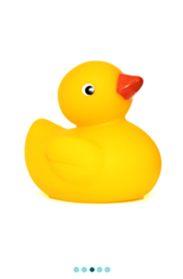
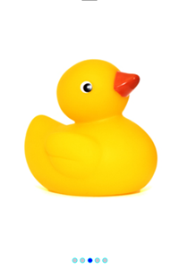
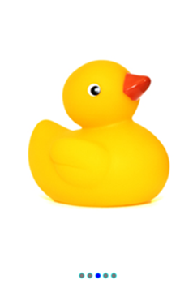
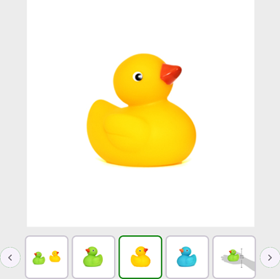
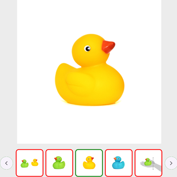
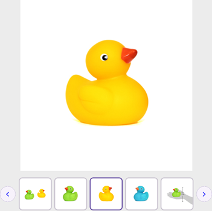
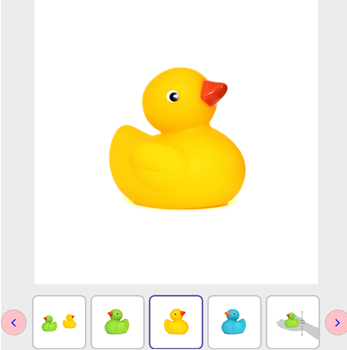
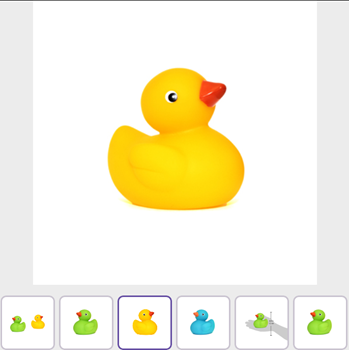

# Navigation Customization in .NET MAUI Rotator (SfRotator)

## Prerequisites

Before using the [SfRotator](https://help.syncfusion.com/cr/maui/Syncfusion.Maui.Rotator.SfRotator.html), ensure the following NuGet package is installed in your .NET MAUI project:

- `Syncfusion.Maui.Rotator`

For step-by-step setup, refer to the [Getting Started](https://help.syncfusion.com/maui/rotator/getting-started) documentation.

## Overview

The [`SfRotator`](https://help.syncfusion.com/cr/maui/Syncfusion.Maui.Rotator.SfRotator.html) control supports customizing the appearance and visibility of the navigation bar, including the dot indicators, the thumbnail indicators, the navigation button, and the position of the strip.

This page covers:

* **Dots Customization** — stroke color, selected dot color, and unselected dot color.
* **Thumbnails Customization** — stroke color of the selected and unselected thumbnail.
* **Customizing Position** — placement of the navigation strip (Top, Bottom, Left, Right).
* **Navigation Button Customization** — icon color and background color of the navigation buttons.
* **Navigation Visibility** — showing or hiding the navigation buttons.

## Properties Reference

| Property | Type | Default | Description |
|----------|------|---------|-------------|
| `DotsStroke` | `Color` | `#B3B3B3` | The stroke color of the dot indicators. |
| `SelectedDotColor` | `Color` | `#F2C849` | The fill color of the currently selected dot. |
| `UnselectedDotColor` | `Color` | `#B3B3B3` | The fill color of the unselected dots. |
| `SelectedThumbnailStroke` | `Color` | `#F2C849` | The stroke color of the currently selected thumbnail. |
| `UnselectedThumbnailStroke` | `Color` | `#B3B3B3` | The stroke color of the unselected thumbnails. |
| `NavigationStripPosition` | `NavigationStripPosition` | `Bottom` | The placement of the navigation bar relative to the slider. |
| `NavigationButtonIconColor` | `Color` | `#FFFFFF` | The icon color of the navigation buttons. |
| `NavigationButtonBackgroundColor` | `Color` | `Transparent` | The background color of the navigation buttons. |
| `ShowNavigationButton` | `bool` | `true` | Whether the navigation buttons are visible. |

## Dots Customization

Customize the dot stroke, the selected dot color, and the unselected dot color.

### DotsStroke Color

The [`DotsStroke`](https://help.syncfusion.com/cr/maui/Syncfusion.Maui.Rotator.SfRotator.html#Syncfusion_Maui_Rotator_SfRotator_DotsStroke) property customizes the color of the dot stroke.





<rotator:SfRotator x:Name="rotator"
                    ItemsSource="{Binding ImageCollection}"
                    SelectedIndex="2"
                    BackgroundColor="#ececec"
                    NavigationStripPosition="Bottom"
                    DotsStroke="Aqua"
                    WidthRequest="550"
                    HeightRequest="550">
    <rotator:SfRotator.ItemTemplate>
        <DataTemplate>
            <Image Source="{Binding Image}" />
        </DataTemplate>
    </rotator:SfRotator.ItemTemplate>
</rotator:SfRotator>
   


    
RotatorViewModel rotatorViewModel = new RotatorViewModel();
SfRotator rotator = new SfRotator()
 {
    SelectedIndex = 2,
    BackgroundColor = Color.FromArgb("#ececec"),
    NavigationStripPosition = NavigationStripPosition.Bottom,
    DotsStroke = Colors.Aqua,
    WidthRequest = 550,
    HeightRequest = 550,
    ItemsSource = rotatorViewModel.ImageCollection,
    ItemTemplate = new DataTemplate(() =>
    {
        var image = new Image();
        image.SetBinding(Image.SourceProperty, "Image");
        return image;
    }),
};
 



// Model
public class RotatorModel
{
    public RotatorModel(string imageString)
    {
        Image = imageString;
    }
    private string _image;
    public string Image
    {
        get { return _image; }
        set { _image = value; }
    }
}

// ViewModel
public class RotatorViewModel
{
    public RotatorViewModel()
    {
        imageCollection = new List<RotatorModel>
        {
            new RotatorModel("image1.png"),
            new RotatorModel("image2.png"),
            new RotatorModel("image3.png"),
            new RotatorModel("image4.png"),
            new RotatorModel("image5.png")
        };
    }
    private List<RotatorModel> imageCollection;
    public List<RotatorModel> ImageCollection
    {
        get { return imageCollection; }
        set { imageCollection = value; }
    }
}




### Selected Dot Color

The [`SelectedDotColor`](https://help.syncfusion.com/cr/maui/Syncfusion.Maui.Rotator.SfRotator.html#Syncfusion_Maui_Rotator_SfRotator_SelectedDotColor) property customizes the color of the selected dot.





<rotator:SfRotator x:Name="rotator"
                    ItemsSource="{Binding ImageCollection}"
                    SelectedIndex="2"
                    BackgroundColor="#ececec"
                    NavigationStripPosition="Bottom"
                    DotsStroke="Aqua"
                    SelectedDotColor="Blue"
                    WidthRequest="550"
                    HeightRequest="550">
    <rotator:SfRotator.ItemTemplate>
        <DataTemplate>
            <Image Source="{Binding Image}" />
        </DataTemplate>
    </rotator:SfRotator.ItemTemplate>
</rotator:SfRotator>



    
RotatorViewModel rotatorViewModel = new RotatorViewModel();
SfRotator rotator = new SfRotator()
 {
    SelectedIndex = 2,
    BackgroundColor = Color.FromArgb("#ececec"),
    NavigationStripPosition = NavigationStripPosition.Bottom,
    DotsStroke = Colors.Aqua,
    SelectedDotColor = Colors.Blue,
    WidthRequest = 550,
    HeightRequest = 550,
    ItemsSource = rotatorViewModel.ImageCollection,
    ItemTemplate = new DataTemplate(() =>
    {
        var image = new Image();
        image.SetBinding(Image.SourceProperty, "Image");
        return image;
    }),
};
 



// Model
public class RotatorModel
{
    public RotatorModel(string imageString)
    {
        Image = imageString;
    }
    private string _image;
    public string Image
    {
        get { return _image; }
        set { _image = value; }
    }
}

// ViewModel
public class RotatorViewModel
{
    public RotatorViewModel()
    {
        imageCollection = new List<RotatorModel>
        {
            new RotatorModel("image1.png"),
            new RotatorModel("image2.png"),
            new RotatorModel("image3.png"),
            new RotatorModel("image4.png"),
            new RotatorModel("image5.png")
        };
    }
    private List<RotatorModel> imageCollection;
    public List<RotatorModel> ImageCollection
    {
        get { return imageCollection; }
        set { imageCollection = value; }
    }
}




### Unselected Dot Color

The [`UnselectedDotColor`](https://help.syncfusion.com/cr/maui/Syncfusion.Maui.Rotator.SfRotator.html#Syncfusion_Maui_Rotator_SfRotator_UnselectedDotColor) property customizes the color of the unselected dots.





<rotator:SfRotator x:Name="rotator"
                    ItemsSource="{Binding ImageCollection}"
                    SelectedIndex="2"
                    BackgroundColor="#ececec"
                    NavigationStripPosition="Bottom"
                    DotsStroke="Aqua"
                    SelectedDotColor="Blue"
                    UnselectedDotColor="Gray"
                    WidthRequest="550"
                    HeightRequest="550">
    <rotator:SfRotator.ItemTemplate>
        <DataTemplate>
            <Image Source="{Binding Image}" />
        </DataTemplate>
    </rotator:SfRotator.ItemTemplate>
</rotator:SfRotator>




    
RotatorViewModel rotatorViewModel = new RotatorViewModel();
SfRotator rotator = new SfRotator()
 {
    SelectedIndex = 2,
    BackgroundColor = Color.FromArgb("#ececec"),
    NavigationStripPosition = NavigationStripPosition.Bottom,
    DotsStroke = Colors.Aqua,
    SelectedDotColor = Colors.Blue,
    UnselectedDotColor = Colors.Gray,
    WidthRequest = 550,
    HeightRequest = 550,
    ItemsSource = rotatorViewModel.ImageCollection,
    ItemTemplate = new DataTemplate(() =>
    {
        var image = new Image();
        image.SetBinding(Image.SourceProperty, "Image");
        return image;
    }),
};
 



// Model
public class RotatorModel
{
    public RotatorModel(string imageString)
    {
        Image = imageString;
    }
    private string _image;
    public string Image
    {
        get { return _image; }
        set { _image = value; }
    }
}

// ViewModel
public class RotatorViewModel
{
    public RotatorViewModel()
    {
        imageCollection = new List<RotatorModel>
        {
            new RotatorModel("image1.png"),
            new RotatorModel("image2.png"),
            new RotatorModel("image3.png"),
            new RotatorModel("image4.png"),
            new RotatorModel("image5.png")
        };
    }
    private List<RotatorModel> imageCollection;
    public List<RotatorModel> ImageCollection
    {
        get { return imageCollection; }
        set { imageCollection = value; }
    }
}




## Thumbnails Customization

Customize the stroke of the selected and unselected thumbnails.

### Selected Thumbnail Stroke

The [`SelectedThumbnailStroke`](https://help.syncfusion.com/cr/maui/Syncfusion.Maui.Rotator.SfRotator.html#Syncfusion_Maui_Rotator_SfRotator_SelectedThumbnailStroke) property customizes the color of the selected thumbnail stroke. Set `NavigationStripMode` to `Thumbnail` for the navigation buttons and thumbnail strip to appear.





<rotator:SfRotator x:Name="rotator"
                    ItemsSource="{Binding ImageCollection}"
                    SelectedIndex="2"
                    BackgroundColor="#ececec"
                    NavigationStripPosition="Bottom"
                    NavigationStripMode="Thumbnail"
                    SelectedThumbnailStroke="Green"
                    WidthRequest="550"
                    HeightRequest="550">
    <rotator:SfRotator.ItemTemplate>
        <DataTemplate>
            <Image Source="{Binding Image}" />
        </DataTemplate>
    </rotator:SfRotator.ItemTemplate>
</rotator:SfRotator>
    



    
RotatorViewModel rotatorViewModel = new RotatorViewModel();
SfRotator rotator = new SfRotator()
 {
    SelectedIndex = 2,
    BackgroundColor = Color.FromArgb("#ececec"),
    NavigationStripPosition = NavigationStripPosition.Bottom,
    NavigationStripMode = NavigationStripMode.Thumbnail;
    SelectedThumbnailStroke = Colors.Green,
    WidthRequest = 550,
    HeightRequest = 550,
    ItemsSource = rotatorViewModel.ImageCollection,
    ItemTemplate = new DataTemplate(() =>
    {
        var image = new Image();
        image.SetBinding(Image.SourceProperty, "Image");
        return image;
    }),
};
 



// Model
public class RotatorModel
{
    public RotatorModel(string imageString)
    {
        Image = imageString;
    }
    private string _image;
    public string Image
    {
        get { return _image; }
        set { _image = value; }
    }
}

// ViewModel
public class RotatorViewModel
{
    public RotatorViewModel()
    {
        imageCollection = new List<RotatorModel>
        {
            new RotatorModel("image1.png"),
            new RotatorModel("image2.png"),
            new RotatorModel("image3.png"),
            new RotatorModel("image4.png"),
            new RotatorModel("image5.png")
        };
    }
    private List<RotatorModel> imageCollection;
    public List<RotatorModel> ImageCollection
    {
        get { return imageCollection; }
        set { imageCollection = value; }
    }
}




### Unselected Thumbnail Stroke

The [`UnselectedThumbnailStroke`](https://help.syncfusion.com/cr/maui/Syncfusion.Maui.Rotator.SfRotator.html#Syncfusion_Maui_Rotator_SfRotator_UnselectedThumbnailStroke) property customizes the color of the unselected thumbnail strokes.





<rotator:SfRotator x:Name="rotator"
                    ItemsSource="{Binding ImageCollection}"
                    SelectedIndex="2"
                    BackgroundColor="#ececec"
                    NavigationStripPosition="Bottom"
                    NavigationStripMode="Thumbnail"
                    SelectedThumbnailStroke="Green"
                    UnselectedThumbnailStroke="Red"
                    WidthRequest="550"
                    HeightRequest="550">
    <rotator:SfRotator.ItemTemplate>
        <DataTemplate>
            <Image Source="{Binding Image}" />
        </DataTemplate>
    </rotator:SfRotator.ItemTemplate>
</rotator:SfRotator>




    
RotatorViewModel rotatorViewModel = new RotatorViewModel();
SfRotator rotator = new SfRotator()
{
    SelectedIndex = 2,
    BackgroundColor = Color.FromArgb("#ececec"),
    NavigationStripPosition = NavigationStripPosition.Bottom,
    NavigationStripMode = NavigationStripMode.Thumbnail,
    SelectedThumbnailStroke = Colors.Green,
    UnselectedThumbnailStroke = Colors.Red,
    WidthRequest = 550,
    HeightRequest = 550,
    ItemsSource = rotatorViewModel.ImageCollection,
    ItemTemplate = new DataTemplate(() =>
    {
        var image = new Image();
        image.SetBinding(Image.SourceProperty, "Image");
        return image;
    }),
};
 



// Model
public class RotatorModel
{
    public RotatorModel(string imageString)
    {
        Image = imageString;
    }
    private string _image;
    public string Image
    {
        get { return _image; }
        set { _image = value; }
    }
}

// ViewModel
public class RotatorViewModel
{
    public RotatorViewModel()
    {
        imageCollection = new List<RotatorModel>
        {
            new RotatorModel("image1.png"),
            new RotatorModel("image2.png"),
            new RotatorModel("image3.png"),
            new RotatorModel("image4.png"),
            new RotatorModel("image5.png")
        };
    }
    private List<RotatorModel> imageCollection;
    public List<RotatorModel> ImageCollection
    {
        get { return imageCollection; }
        set { imageCollection = value; }
    }
}




## Customizing Position

The [`NavigationStripPosition`](https://help.syncfusion.com/cr/maui/Syncfusion.Maui.Rotator.SfRotator.html#Syncfusion_Maui_Rotator_SfRotator_NavigationStripPosition) property specifies the placement of the navigation strip (thumbnails or dots) relative to the slider area. The available values are `Bottom`, `Top`, `Left`, and `Right`. For a complete list of values and per-position examples, see [Navigation Modes in .NET MAUI Rotator](https://help.syncfusion.com/maui/rotator/navigation-modes).

The following example sets the position to `Top`.





<rotator:SfRotator x:Name="rotator"
                    ItemsSource="{Binding ImageCollection}"
                    SelectedIndex="2"
                    NavigationStripMode="Dots"
                    NavigationStripPosition="Top"
                    BackgroundColor="#ececec"
                    WidthRequest="550"
                    HeightRequest="550">
    <rotator:SfRotator.ItemTemplate>
        <DataTemplate>
            <Image Source="{Binding Image}" />
        </DataTemplate>
    </rotator:SfRotator.ItemTemplate>
</rotator:SfRotator>
    




    
RotatorViewModel rotatorViewModel = new RotatorViewModel();
SfRotator rotator = new SfRotator()
{
   SelectedIndex = 2,
    BackgroundColor = Color.FromArgb("#ececec"),
    NavigationStripMode = NavigationStripMode.Dots,
    NavigationStripPosition = NavigationStripPosition.Top,
    WidthRequest = 550,
    HeightRequest = 550,
    ItemsSource = rotatorViewModel.ImageCollection,
    ItemTemplate = new DataTemplate(() =>
    {
        var image = new Image();
        image.SetBinding(Image.SourceProperty, "Image");
        return image;
    }),
};
 



// Model
public class RotatorModel
{
    public RotatorModel(string imageString)
    {
        Image = imageString;
    }
    private string _image;
    public string Image
    {
        get { return _image; }
        set { _image = value; }
    }
}

// ViewModel
public class RotatorViewModel
{
    public RotatorViewModel()
    {
        imageCollection = new List<RotatorModel>
        {
            new RotatorModel("image1.png"),
            new RotatorModel("image2.png"),
            new RotatorModel("image3.png"),
            new RotatorModel("image4.png"),
            new RotatorModel("image5.png")
        };
    }
    private List<RotatorModel> imageCollection;
    public List<RotatorModel> ImageCollection
    {
        get { return imageCollection; }
        set { imageCollection = value; }
    }
}




## Navigation Button Customization

Customize the icon color and background color of the navigation buttons. The navigation buttons are only visible when [`NavigationStripMode`](https://help.syncfusion.com/cr/maui/Syncfusion.Maui.Rotator.SfRotator.html#Syncfusion_Maui_Rotator_SfRotator_NavigationStripMode) is set to `Thumbnail`.

### Navigation Button Icon Color

The [`NavigationButtonIconColor`](https://help.syncfusion.com/cr/maui/Syncfusion.Maui.Rotator.SfRotator.html#Syncfusion_Maui_Rotator_SfRotator_NavigationButtonIconColor) property customizes the icon color of the navigation buttons.





<rotator:SfRotator x:Name="rotator"
                    ItemsSource="{Binding ImageCollection}"
                    SelectedIndex="2"
                    BackgroundColor="#ececec"
                    NavigationStripMode="Thumbnail"
                    NavigationButtonIconColor="Blue"
                    WidthRequest="550"
                    HeightRequest="550">
    <rotator:SfRotator.ItemTemplate>
        <DataTemplate>
            <Image Source="{Binding Image}" />
        </DataTemplate>
    </rotator:SfRotator.ItemTemplate>
</rotator:SfRotator>
    


    
RotatorViewModel rotatorViewModel = new RotatorViewModel();
SfRotator rotator = new SfRotator()
{
    SelectedIndex = 2,
    BackgroundColor = Color.FromArgb("#ececec"),
    NavigationStripMode = NavigationStripMode.Thumbnail;
    NavigationButtonIconColor = Colors.Blue;
    WidthRequest = 550,
    HeightRequest = 550,
    ItemsSource = rotatorViewModel.ImageCollection,
    ItemTemplate = new DataTemplate(() =>
    {
        var image = new Image();
        image.SetBinding(Image.SourceProperty, "Image");
        return image;
    }),
};
 



// Model
public class RotatorModel
{
    public RotatorModel(string imageString)
    {
        Image = imageString;
    }
    private string _image;
    public string Image
    {
        get { return _image; }
        set { _image = value; }
    }
}

// ViewModel
public class RotatorViewModel
{
    public RotatorViewModel()
    {
        imageCollection = new List<RotatorModel>
        {
            new RotatorModel("image1.png"),
            new RotatorModel("image2.png"),
            new RotatorModel("image3.png"),
            new RotatorModel("image4.png"),
            new RotatorModel("image5.png")
        };
    }
    private List<RotatorModel> imageCollection;
    public List<RotatorModel> ImageCollection
    {
        get { return imageCollection; }
        set { imageCollection = value; }
    }
}




### Navigation Button Background Color

The [`NavigationButtonBackgroundColor`](https://help.syncfusion.com/cr/maui/Syncfusion.Maui.Rotator.SfRotator.html#Syncfusion_Maui_Rotator_SfRotator_NavigationButtonBackgroundColor) property customizes the background color of the navigation buttons.





<rotator:SfRotator x:Name="rotator"
                    ItemsSource="{Binding ImageCollection}"
                    SelectedIndex="2"
                    BackgroundColor="#ececec"
                    NavigationStripMode="Thumbnail"
                    NavigationButtonBackgroundColor="Pink"
                    NavigationButtonIconColor="Blue"
                    WidthRequest="550"
                    HeightRequest="550">
    <rotator:SfRotator.ItemTemplate>
        <DataTemplate>
            <Image Source="{Binding Image}" />
        </DataTemplate>
    </rotator:SfRotator.ItemTemplate>
</rotator:SfRotator>
    




    
RotatorViewModel rotatorViewModel = new RotatorViewModel();
SfRotator rotator = new SfRotator()
{
    SelectedIndex = 2,
    BackgroundColor = Color.FromArgb("#ececec"),
    NavigationStripMode = NavigationStripMode.Thumbnail,
    NavigationButtonBackgroundColor = Colors.Pink,
    NavigationButtonIconColor = Colors.Blue,
    WidthRequest = 550,
    HeightRequest = 550,
    ItemsSource = rotatorViewModel.ImageCollection,
    ItemTemplate = new DataTemplate(() =>
    {
        var image = new Image();
        image.SetBinding(Image.SourceProperty, "Image");
        return image;
    }),
};
 



// Model
public class RotatorModel
{
    public RotatorModel(string imageString)
    {
        Image = imageString;
    }
    private string _image;
    public string Image
    {
        get { return _image; }
        set { _image = value; }
    }
}

// ViewModel
public class RotatorViewModel
{
    public RotatorViewModel()
    {
        imageCollection = new List<RotatorModel>
        {
            new RotatorModel("image1.png"),
            new RotatorModel("image2.png"),
            new RotatorModel("image3.png"),
            new RotatorModel("image4.png"),
            new RotatorModel("image5.png")
        };
    }
    private List<RotatorModel> imageCollection;
    public List<RotatorModel> ImageCollection
    {
        get { return imageCollection; }
        set { imageCollection = value; }
    }
}




## Navigation Visibility

Use the [`ShowNavigationButton`](https://help.syncfusion.com/cr/maui/Syncfusion.Maui.Rotator.SfRotator.html#Syncfusion_Maui_Rotator_SfRotator_ShowNavigationButton) property to show or hide the navigation buttons. By default, this property is `true`. The buttons are only relevant when `NavigationStripMode` is set to `Thumbnail`.





<rotator:SfRotator x:Name="rotator"
                    ItemsSource="{Binding ImageCollection}"
                    SelectedIndex="2"
                    BackgroundColor="#ececec"
                    NavigationStripMode="Thumbnail"
                    ShowNavigationButton="False"
                    WidthRequest="550"
                    HeightRequest="550">
    <rotator:SfRotator.ItemTemplate>
        <DataTemplate>
            <Image Source="{Binding Image}" />
        </DataTemplate>
    </rotator:SfRotator.ItemTemplate>
</rotator:SfRotator>
    



    
RotatorViewModel rotatorViewModel = new RotatorViewModel();
SfRotator rotator = new SfRotator()
{
    SelectedIndex = 2,
    BackgroundColor = Color.FromArgb("#ececec"),
    NavigationStripMode = NavigationStripMode.Thumbnail,
    ShowNavigationButton = false,
    WidthRequest = 550,
    HeightRequest = 550,
    ItemsSource = rotatorViewModel.ImageCollection,
    ItemTemplate = new DataTemplate(() =>
    {
        var image = new Image();
        image.SetBinding(Image.SourceProperty, "Image");
        return image;
    }),
};
 



// Model
public class RotatorModel
{
    public RotatorModel(string imageString)
    {
        Image = imageString;
    }
    private string _image;
    public string Image
    {
        get { return _image; }
        set { _image = value; }
    }
}

// ViewModel
public class RotatorViewModel
{
    public RotatorViewModel()
    {
        imageCollection = new List<RotatorModel>
        {
            new RotatorModel("image1.png"),
            new RotatorModel("image2.png"),
            new RotatorModel("image3.png"),
            new RotatorModel("image4.png"),
            new RotatorModel("image5.png")
        };
    }
    private List<RotatorModel> imageCollection;
    public List<RotatorModel> ImageCollection
    {
        get { return imageCollection; }
        set { imageCollection = value; }
    }
}




## See also

- [Getting Started with .NET MAUI Rotator](https://help.syncfusion.com/maui/rotator/getting-started)
- [Navigation Modes in .NET MAUI Rotator](https://help.syncfusion.com/maui/rotator/navigation-modes)
- [Sliding Direction in .NET MAUI Rotator](https://help.syncfusion.com/maui/rotator/sliding-direction)
- [Placement Modes in .NET MAUI Rotator](https://help.syncfusion.com/maui/rotator/placement-modes)
- [Populating Data in .NET MAUI Rotator](https://help.syncfusion.com/maui/rotator/populating-data)
- [Adding Looping and Delays in .NET MAUI Rotator](https://help.syncfusion.com/maui/rotator/adding-looping-and-delays)
