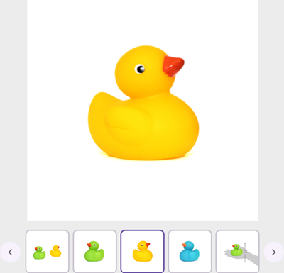
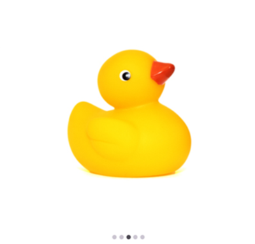

---

layout: post
title: Navigation Modes in .NET MAUI Rotator control | Syncfusion®
description: Learn about the Navigation Modes support in Syncfusion® .NET MAUI Rotator (SfRotator) control and more
platform: maui 
control: Rotator
documentation: ug

---

# Navigation Modes in .NET MAUI Rotator (SfRotator)

The [`NavigationStripMode`](https://help.syncfusion.com/cr/maui/Syncfusion.Maui.Rotator.SfRotator.html#Syncfusion_Maui_Rotator_SfRotator_NavigationStripMode) property specifies the appearance of navigation bar items. The image data can be selected either by [`Thumbnail`](https://help.syncfusion.com/cr/maui/Syncfusion.Maui.Core.Rotator.NavigationStripMode.html#Syncfusion_Maui_Core_Rotator_NavigationStripMode_Thumbnail) or by [`Dots`](https://help.syncfusion.com/cr/maui/Syncfusion.Maui.Core.Rotator.NavigationStripMode.html#Syncfusion_Maui_Core_Rotator_NavigationStripMode_Dots) navigation modes.

## Thumbnail

The slider items will also be loaded in the thumbnail view. When a thumbnail item is clicked, the slider will switch to the corresponding image data.





<?xml version="1.0" encoding="utf-8" ?>
<ContentPage xmlns="http://schemas.microsoft.com/dotnet/2021/maui"
            xmlns:x="http://schemas.microsoft.com/winfx/2009/xaml"
            xmlns:syncfusion="clr-namespace:Syncfusion.Maui.Rotator;assembly=Syncfusion.Maui.Rotator"
            xmlns:local="clr-namespace:Rotator"
            x:Class="Rotator.Rotator">
    <ContentPage.BindingContext>
        <local:RotatorViewModel/>
    </ContentPage.BindingContext>
    <ContentPage.Content>
        <syncfusion:SfRotator x:Name="rotator" 
                        NavigationDelay="2000" 
                        ItemsSource="{Binding ImageCollection}" 
                        SelectedIndex="2"
                        NavigationDirection="Horizontal"
                        NavigationStripMode="Thumbnail" 
                        BackgroundColor="#ececec">
            <syncfusion:SfRotator.ItemTemplate>
                <DataTemplate>
                    <Image  Source="{Binding Image}"/>
                </DataTemplate>
            </syncfusion:SfRotator.ItemTemplate>
        </syncfusion:SfRotator>
    </ContentPage.Content>
</ContentPage>
	




using Syncfusion.Maui.Core.Rotator;
using Syncfusion.Maui.Rotator;

namespace Rotator
{
    public partial class Rotator : ContentPage
    {
        public Rotator()
        {
            InitializeComponent ();
            SfRotator rotator = new SfRotator();
            var ImageCollection = new List<RotatorModel> {
            new RotatorModel ("image1.png"),
            new RotatorModel ("image2.png"),
            new RotatorModel ("image3.png"),
            new RotatorModel ("image4.png"),
            new RotatorModel ("image5.png")
            };
            var itemTemplate = new DataTemplate(() =>
            {
                var grid = new Grid();
                var nameLabel = new Image();
                nameLabel.SetBinding(Image.SourceProperty, "Image");
                grid.Children.Add(nameLabel);
                return grid;
            });
            rotator.ItemTemplate = itemTemplate;
            rotator.NavigationStripMode = NavigationStripMode.Thumbnail;
            rotator.ItemsSource = ImageCollection;
            this.Content = rotator;
        }
    }
    public class RotatorModel
    {
        public RotatorModel(string imageString)
        {
            Image = imageString;
        }
        private String _image;
        public String Image
        {
            get { return _image; }
            set { _image = value; }
        }
    }
}	





## Dots
 The slider items will also be loaded in dots view. When a dot item is clicked, the slider will switch to the corresponding image data.





<?xml version="1.0" encoding="utf-8" ?>
<ContentPage xmlns="http://schemas.microsoft.com/dotnet/2021/maui"
            xmlns:x="http://schemas.microsoft.com/winfx/2009/xaml"
            xmlns:syncfusion="clr-namespace:Syncfusion.Maui.Rotator;assembly=Syncfusion.Maui.Rotator"
            xmlns:local="clr-namespace:Rotator"
            x:Class="Rotator.Rotator">
    <ContentPage.BindingContext>
        <local:RotatorViewModel/>
    </ContentPage.BindingContext>
    <ContentPage.Content>
        <syncfusion:SfRotator x:Name="rotator" 
                        NavigationDelay="2000" 
                        ItemsSource="{Binding ImageCollection}" 
                        SelectedIndex="2"
                        NavigationDirection="Horizontal"
                        NavigationStripMode="Dots" 
                        BackgroundColor="#ececec">
            <syncfusion:SfRotator.ItemTemplate>
                <DataTemplate>
                    <Image  Source="{Binding Image}"/>
                </DataTemplate>
            </syncfusion:SfRotator.ItemTemplate>
        </syncfusion:SfRotator>
    </ContentPage.Content>
</ContentPage>





using Syncfusion.Maui.Core.Rotator;
using Syncfusion.Maui.Rotator;

namespace Rotator
{
    public partial class Rotator : ContentPage
    {
        public Rotator()
        {
            InitializeComponent ();
            SfRotator rotator = new SfRotator();
            var ImageCollection = new List<RotatorModel> {
            new RotatorModel ("image1.png"),
            new RotatorModel ("image2.png"),
            new RotatorModel ("image3.png"),
            new RotatorModel ("image4.png"),
            new RotatorModel ("image5.png")
            };
            var itemTemplate = new DataTemplate(() =>
            {
                var grid = new Grid();
                var nameLabel = new Image();
                nameLabel.SetBinding(Image.SourceProperty, "Image");
                grid.Children.Add(nameLabel);
                return grid;
            });
            rotator.ItemTemplate = itemTemplate;
            rotator.ItemsSource = ImageCollection;
            this.Content = rotator;
        }
    }
    public class RotatorModel
    {
        public RotatorModel(string imageString)
        {
            Image = imageString;
        }
        private String _image;
        public String Image
        {
            get { return _image; }
            set { _image = value; }
        }
    }
}





## Navigation Strip Positions

The [`NavigationStripPosition`](https://help.syncfusion.com/cr/maui/Syncfusion.Maui.Rotator.SfRotator.html#Syncfusion_Maui_Rotator_SfRotator_NavigationStripPosition) specifies the placement position of the navigation bar items, such as thumbnails or dots relative to the slider area.

There are four available positions,

* [`Bottom`](https://help.syncfusion.com/cr/maui/Syncfusion.Maui.Core.Rotator.NavigationStripPosition.html#Syncfusion_Maui_Core_Rotator_NavigationStripPosition_Bottom) - Sets the position of the navigation bar items to the bottom.
* [`Left`](https://help.syncfusion.com/cr/maui/Syncfusion.Maui.Core.Rotator.NavigationStripPosition.html#Syncfusion_Maui_Core_Rotator_NavigationStripPosition_Left)  - Sets the position of the navigation bar items to the left.
* [`Top`](https://help.syncfusion.com/cr/maui/Syncfusion.Maui.Core.Rotator.NavigationStripPosition.html#Syncfusion_Maui_Core_Rotator_NavigationStripPosition_Top)  - Sets the position of the navigation bar items to the top.
* [`Right`](https://help.syncfusion.com/cr/maui/Syncfusion.Maui.Core.Rotator.NavigationStripPosition.html#Syncfusion_Maui_Core_Rotator_NavigationStripPosition_Right    )  - Sets the position of the navigation bar items to the right.





<?xml version="1.0" encoding="utf-8" ?>
<ContentPage xmlns="http://schemas.microsoft.com/dotnet/2021/maui"
            xmlns:x="http://schemas.microsoft.com/winfx/2009/xaml"
            xmlns:syncfusion="clr-namespace:Syncfusion.Maui.Rotator;assembly=Syncfusion.Maui.Rotator"
            xmlns:local="clr-namespace:Rotator"
            x:Class="Rotator.Rotator">
    <ContentPage.BindingContext>
        <local:RotatorViewModel/>
    </ContentPage.BindingContext>
    <ContentPage.Content>
        <syncfusion:SfRotator x:Name="rotator" 
                        NavigationDelay="2000" 
                        ItemsSource="{Binding ImageCollection}" 
                        SelectedIndex="2"
                        NavigationDirection="Horizontal"
                        NavigationStripMode="Dots" 
                        BackgroundColor="#ececec"
                        NavigationStripPosition="Bottom">
            <syncfusion:SfRotator.ItemTemplate>
                <DataTemplate>
                    <Image  Source="{Binding Image}"/>
                </DataTemplate>
            </syncfusion:SfRotator.ItemTemplate>
        </syncfusion:SfRotator>
    </ContentPage.Content>
</ContentPage>	





using Syncfusion.Maui.Core.Rotator;
using Syncfusion.Maui.Rotator;

namespace Rotator
{
    public partial class Rotator : ContentPage
    {
        public Rotator()
        {
            InitializeComponent ();
            SfRotator rotator = new SfRotator();
            var ImageCollection = new List<RotatorModel> {
            new RotatorModel ("image1.png"),
            new RotatorModel ("image2.png"),
            new RotatorModel ("image3.png"),
            new RotatorModel ("image4.png"),
            new RotatorModel ("image5.png")
            };
            var itemTemplate = new DataTemplate(() =>
            {
                var grid = new Grid();
                var nameLabel = new Image();
                nameLabel.SetBinding(Image.SourceProperty, "Image");
                grid.Children.Add(nameLabel);
                return grid;
            });
            rotator.ItemTemplate = itemTemplate;
            rotator.NavigationStripMode = NavigationStripMode.Dots;
            rotator.NavigationStripPosition = NavigationStripPosition.Bottom;
            rotator.ItemsSource = ImageCollection;
            this.Content = rotator;
        }
    }
    public class RotatorModel
    {
        public RotatorModel(string imageString)
        {
            Image = imageString;
        }
        private String _image;
        public String Image
        {
            get { return _image; }
            set { _image = value; }
        }
    }
}





