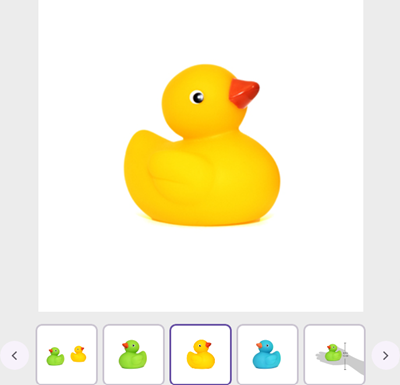
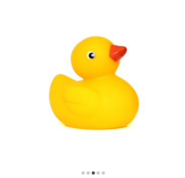
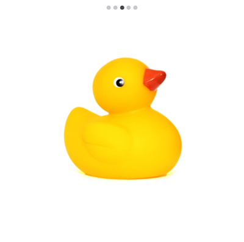

# Navigation Modes in .NET MAUI Rotator (SfRotator)

## Prerequisites

Before using the [SfRotator](https://help.syncfusion.com/cr/maui/Syncfusion.Maui.Rotator.SfRotator.html), ensure the following NuGet package is installed in your .NET MAUI project:

- `Syncfusion.Maui.Rotator`

For step-by-step setup, refer to the [Getting Started](https://help.syncfusion.com/maui/rotator/getting-started) documentation.

## Overview

The [`SfRotator`](https://help.syncfusion.com/cr/maui/Syncfusion.Maui.Rotator.SfRotator.html) control uses two related properties to configure the navigation strip that lets users move between items:

* [`NavigationStripMode`](https://help.syncfusion.com/cr/maui/Syncfusion.Maui.Rotator.SfRotator.html#Syncfusion_Maui_Rotator_SfRotator_NavigationStripMode) — controls the appearance of the navigation bar (for example, `Dots` or `Thumbnail`).
* [`NavigationStripPosition`](https://help.syncfusion.com/cr/maui/Syncfusion.Maui.Rotator.SfRotator.html#Syncfusion_Maui_Rotator_SfRotator_NavigationStripPosition) — controls where the navigation bar is placed relative to the slider area (for example, `Bottom`, `Top`, `Left`, or `Right`).

Use `NavigationStripMode` to choose how the navigation bar is rendered, and `NavigationStripPosition` to choose where it is placed. Both can be combined; for example, you can show thumbnails along the bottom or dots on the left.

## Properties Reference

| Property | Type | Default | Description |
|----------|------|---------|-------------|
| `NavigationStripMode` | `NavigationStripMode` | `Dots` | The appearance of the navigation bar. Supported values are `Dots` and `Thumbnail`. |
| `NavigationStripPosition` | `NavigationStripPosition` | `Bottom` | The placement of the navigation bar relative to the slider area. Supported values are `Bottom`, `Top`, `Left`, and `Right`. |

## Navigation Strip Mode

The [`NavigationStripMode`](https://help.syncfusion.com/cr/maui/Syncfusion.Maui.Rotator.SfRotator.html#Syncfusion_Maui_Rotator_SfRotator_NavigationStripMode) property specifies the appearance of the navigation bar items. The image data can be selected using either the [`Thumbnail`](https://help.syncfusion.com/cr/maui/Syncfusion.Maui.Core.Rotator.NavigationStripMode.html#Syncfusion_Maui_Core_Rotator_NavigationStripMode_Thumbnail) or the [`Dots`](https://help.syncfusion.com/cr/maui/Syncfusion.Maui.Core.Rotator.NavigationStripMode.html#Syncfusion_Maui_Core_Rotator_NavigationStripMode_Dots) mode.

### Thumbnail

When the strip mode is `Thumbnail`, each slider item is loaded as a thumbnail preview. When a thumbnail item is clicked, the slider switches to the corresponding image.





<rotator:SfRotator x:Name="rotator"
                    ItemsSource="{Binding ImageCollection}"
                    SelectedIndex="2"
                    NavigationDirection="Horizontal"
                    NavigationStripMode="Thumbnail"
                    BackgroundColor="#ececec">
    <rotator:SfRotator.ItemTemplate>
        <DataTemplate>
            <Image Source="{Binding Image}" />
        </DataTemplate>
    </rotator:SfRotator.ItemTemplate>
</rotator:SfRotator>




    
RotatorViewModel rotatorViewModel = new RotatorViewModel();
SfRotator rotator = new SfRotator()
{
    SelectedIndex = 2,
    NavigationDirection = NavigationDirection.Horizontal,
    NavigationStripMode = NavigationStripMode.Thumbnail,
    BackgroundColor = Color.FromArgb("#ececec"),
    ItemsSource = rotatorViewModel.ImageCollection,
    ItemTemplate = new DataTemplate(() =>
    {
        var image = new Image();
        image.SetBinding(Image.SourceProperty, "Image");
        return image;
    }),
};
 



// Model
public class RotatorModel
{
    public RotatorModel(string imageString)
    {
        Image = imageString;
    }
    private string _image;
    public string Image
    {
        get { return _image; }
        set { _image = value; }
    }
}

// ViewModel
public class RotatorViewModel
{
    public RotatorViewModel()
    {
        imageCollection = new List<RotatorModel>
        {
            new RotatorModel("image1.png"),
            new RotatorModel("image2.png"),
            new RotatorModel("image3.png"),
            new RotatorModel("image4.png"),
            new RotatorModel("image5.png")
        };
    }
    private List<RotatorModel> imageCollection;
    public List<RotatorModel> ImageCollection
    {
        get { return imageCollection; }
        set { imageCollection = value; }
    }
}




### Dots

When the strip mode is `Dots`, each slider item is represented by a small dot. When a dot is clicked, the slider switches to the corresponding image.





<rotator:SfRotator x:Name="rotator"
                    ItemsSource="{Binding ImageCollection}"
                    SelectedIndex="2"
                    NavigationDirection="Horizontal"
                    NavigationStripMode="Dots"
                    BackgroundColor="#ececec">
    <rotator:SfRotator.ItemTemplate>
        <DataTemplate>
            <Image Source="{Binding Image}" />
        </DataTemplate>
    </rotator:SfRotator.ItemTemplate>
</rotator:SfRotator>
    



    
RotatorViewModel rotatorViewModel = new RotatorViewModel();
SfRotator rotator = new SfRotator()
{
    SelectedIndex = 2,
    NavigationDirection = NavigationDirection.Horizontal,
    NavigationStripMode = NavigationStripMode.Dots,
    BackgroundColor = Color.FromArgb("#ececec"),
    EnableAutoPlay = true,
    NavigationStripPosition = NavigationStripPosition.Bottom,
    ItemsSource = rotatorViewModel.ImageCollection,
    ItemTemplate = new DataTemplate(() =>
    {
        var image = new Image();
        image.SetBinding(Image.SourceProperty, "Image");
        return image;
    }),
};
 



// Model
public class RotatorModel
{
    public RotatorModel(string imageString)
    {
        Image = imageString;
    }
    private string _image;
    public string Image
    {
        get { return _image; }
        set { _image = value; }
    }
}

// ViewModel
public class RotatorViewModel
{
    public RotatorViewModel()
    {
        imageCollection = new List<RotatorModel>
        {
            new RotatorModel("image1.png"),
            new RotatorModel("image2.png"),
            new RotatorModel("image3.png"),
            new RotatorModel("image4.png"),
            new RotatorModel("image5.png")
        };
    }
    private List<RotatorModel> imageCollection;
    public List<RotatorModel> ImageCollection
    {
        get { return imageCollection; }
        set { imageCollection = value; }
    }
}




## Navigation Strip Position

The [`NavigationStripPosition`](https://help.syncfusion.com/cr/maui/Syncfusion.Maui.Rotator.SfRotator.html#Syncfusion_Maui_Rotator_SfRotator_NavigationStripPosition) property specifies the placement of the navigation bar (thumbnails or dots) relative to the slider area.

The `NavigationStripPosition` enum exposes four values:

* [`Bottom`](https://help.syncfusion.com/cr/maui/Syncfusion.Maui.Core.Rotator.NavigationStripPosition.html#Syncfusion_Maui_Core_Rotator_NavigationStripPosition_Bottom) — Places the navigation bar at the bottom of the slider.
* [`Top`](https://help.syncfusion.com/cr/maui/Syncfusion.Maui.Core.Rotator.NavigationStripPosition.html#Syncfusion_Maui_Core_Rotator_NavigationStripPosition_Top) — Places the navigation bar at the top of the slider.
* [`Left`](https://help.syncfusion.com/cr/maui/Syncfusion.Maui.Core.Rotator.NavigationStripPosition.html#Syncfusion_Maui_Core_Rotator_NavigationStripPosition_Left) — Places the navigation bar to the left of the slider.
* [`Right`](https://help.syncfusion.com/cr/maui/Syncfusion.Maui.Core.Rotator.NavigationStripPosition.html#Syncfusion_Maui_Core_Rotator_NavigationStripPosition_Right) — Places the navigation bar to the right of the slider.

The following example sets the position to `Top`.





<rotator:SfRotator x:Name="rotator"
                    ItemsSource="{Binding ImageCollection}"
                    SelectedIndex="2"
                    NavigationDirection="Horizontal"
                    NavigationStripMode="Dots"
                    NavigationStripPosition="Top"
                    BackgroundColor="#ececec">
    <rotator:SfRotator.ItemTemplate>
        <DataTemplate>
            <Image Source="{Binding Image}" />
        </DataTemplate>
    </rotator:SfRotator.ItemTemplate>
</rotator:SfRotator>
    




    
RotatorViewModel rotatorViewModel = new RotatorViewModel();
SfRotator rotator = new SfRotator()
{
    SelectedIndex = 2,
    NavigationDirection = NavigationDirection.Horizontal,
    NavigationStripMode = NavigationStripMode.Dots,
    NavigationStripPosition = NavigationStripPosition.Top,
    BackgroundColor = Color.FromArgb("#ececec"),
    ItemsSource = rotatorViewModel.ImageCollection,
    ItemTemplate = new DataTemplate(() =>
    {
        var image = new Image();
        image.SetBinding(Image.SourceProperty, "Image");
        return image;
    }),
};
 



// Model
public class RotatorModel
{
    public RotatorModel(string imageString)
    {
        Image = imageString;
    }
    private string _image;
    public string Image
    {
        get { return _image; }
        set { _image = value; }
    }
}

// ViewModel
public class RotatorViewModel
{
    public RotatorViewModel()
    {
        imageCollection = new List<RotatorModel>
        {
            new RotatorModel("image1.png"),
            new RotatorModel("image2.png"),
            new RotatorModel("image3.png"),
            new RotatorModel("image4.png"),
            new RotatorModel("image5.png")
        };
    }
    private List<RotatorModel> imageCollection;
    public List<RotatorModel> ImageCollection
    {
        get { return imageCollection; }
        set { imageCollection = value; }
    }
}




## See also

- [Sliding Direction in .NET MAUI Rotator](https://help.syncfusion.com/maui/rotator/sliding-direction)
- [Placement Modes in .NET MAUI Rotator](https://help.syncfusion.com/maui/rotator/placement-modes)
- [Navigation Customization in .NET MAUI Rotator](https://help.syncfusion.com/maui/rotator/navigation-customization)
- [Populating Data in .NET MAUI Rotator](https://help.syncfusion.com/maui/rotator/populating-data)
- [Adding Looping and Delays in .NET MAUI Rotator](https://help.syncfusion.com/maui/rotator/adding-looping-and-delays)
