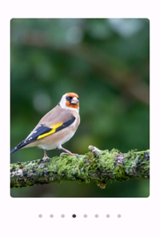

# .NET MAUI Rotator (SfRotator) Overview

The Rotator is a data control used to display image data and navigate through them. The images can be selected either by [`Thumbnail`](https://help.syncfusion.com/cr/maui/Syncfusion.Maui.Core.Rotator.NavigationStripMode.html#Syncfusion_Maui_Core_Rotator_NavigationStripMode_Thumbnail) or by [`Dots`](https://help.syncfusion.com/cr/maui/Syncfusion.Maui.Core.Rotator.NavigationStripMode.html#Syncfusion_Maui_Core_Rotator_NavigationStripMode_Dots) support.

   

## Business use cases

- Image gallery applications that require smooth navigation between multiple images or media items.  
- E-commerce applications that showcase product images using swipe-based navigation.  
- Mobile apps that display banners, promotions, or featured content sections.  
- Content-driven applications that require interactive browsing of visual or informational items.  

## Key features

- **Navigation mode** allows switching between dot indicators or thumbnail-based navigation for item selection.  
- **Flexible position** allows placing navigation indicators on any side of the control layout.  
- **Autoplay** allows automatically transitioning between items without user interaction.  
- **Looping** allows continuously navigating through items in a circular manner.  

## Globalization

The following table summarizes the globalization support available in this control.

    
    Full Support

    
    Not Applicable

<table>
<tr>
<th align="center">Control</th>
<th align="center">Localization</th>
<th align="center">RTL</th>
<th align="center">Time zone</th>
<th align="center">Screen reader</th>
<th align="center">Keyboard navigation</th>
</tr>
<tr>
<td><a href="/maui/rotator/overview">Rotator</a></td>
<td align="center"></td>
<td align="center"></td>
<td align="center"></td>
<td align="center"></td>
<td align="center"></td>
</tr> 
</table>

## Related controls

- [Carousel](https://help.syncfusion.com/maui/carousel-view/overview) for advanced carousel-style data navigation with rich animations.  
- [ListView](https://help.syncfusion.com/maui/listview/overview) for displaying items in structured list formats.  
- [Cards](https://help.syncfusion.com/maui/cards/overview) for presenting content in card-based layouts.  

## See Also

Explore further resources:

- [Getting Started](https://help.syncfusion.com/maui/rotator/getting-started) shows a step‑by‑step guide to begin using the Rotator control.  
- [Navigation](https://help.syncfusion.com/maui/rotator/navigation-modes) explains how to configure navigation modes and placement.  
- [Customization](https://help.syncfusion.com/maui/rotator/navigation-customization) helps customize appearance and behavior.  
- [UI Kit](https://www.syncfusion.com/demos/maui#maui-ui-control) provides interactive demos and ready‑made UI examples.

## Resources

<!-- Card 1 -->
<a href="https://www.syncfusion.com/maui-controls/maui-rotator" class="form-card" target="_blank">
  

    <h3 class="form-title">Feature Tour</h3>
    

      Walk through highlights and core capabilities.
    

  

</a>
<!-- Card 2 -->
<a href="https://github.com/syncfusion/maui-demos/tree/master/MAUI/Rotator" class="form-card" target="_blank">
  

    <h3 class="form-title">Showcase Samples</h3>
    

      Explore sample scenarios for real apps.
    

  

</a>
<!-- Card 3 -->
<a href="https://www.syncfusion.com/tutorial-videos/maui/rotator" class="form-card" target="_blank">
  

    <h3 class="form-title">Tutorial Videos</h3>
    

      Step‑by‑step guidance through video tutorials.
    

  

</a>
<!-- Card 4 -->
<a href="https://support.syncfusion.com/kb/cross-platforms/category/76" class="form-card" target="_blank">
  

    <h3 class="form-title">Explore KB's</h3>
    

      Find quick solutions and step‑by‑step guidance.
    

  

</a>
<!-- Card 5 -->
<a href="https://www.syncfusion.com/blogs/category/net-maui" class="form-card" target="_blank">
  

    <h3 class="form-title">Explore Blogs</h3>
    

      Read insights, tutorials, and developer journeys.
    

  

</a>
