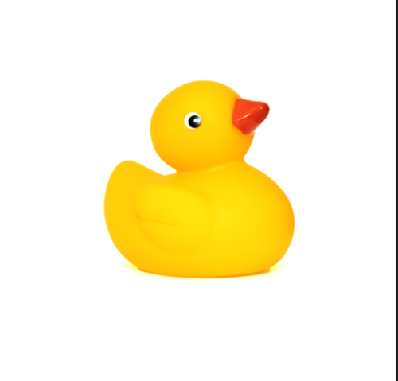

# Placement Modes in .NET MAUI Rotator (SfRotator)

By default, the rotator control displays the dots of each rotator item. It can be changed to any of the following types:

* `Default` - Shows dots for each item in the .NET MAUI Rotator (SfRotator) by default.
* `None`- Hides the dots, creating a clean appearance with no navigation indicators.
* `Outside` - Puts the dots around the rotator, offering a different style for navigation.
 
## DotsPlacement

The Display Type of Rotator can be modified using the `DotsPlacement` Mode. The `“None”` type can be used when the dots are not needed for the rotator control.





    <?xml version="1.0" encoding="utf-8" ?>
    <ContentPage xmlns="http://schemas.microsoft.com/dotnet/2021/maui"
                xmlns:x="http://schemas.microsoft.com/winfx/2009/xaml"
                xmlns:syncfusion="clr-namespace:Syncfusion.Maui.Rotator;assembly=Syncfusion.Maui.Rotator"
                xmlns:local="clr-namespace:Rotator"
                x:Class="Rotator.Rotator">
        <ContentPage.BindingContext>
            <local:RotatorViewModel/>
        </ContentPage.BindingContext>
        <ContentPage.Content>
            <syncfusion:SfRotator x:Name="rotator" 
                                ItemsSource="{Binding ImageCollection}" 
                                SelectedIndex="2"
                                BackgroundColor="#ececec"
                                NavigationStripPosition="Bottom"
                                DotPlacement="None"
                                WidthRequest="550"
                                HeightRequest="550" >
                <syncfusion:SfRotator.ItemTemplate>
                    <DataTemplate>
                        <Image  Source="{Binding Image}"/>
                    </DataTemplate>
                </syncfusion:SfRotator.ItemTemplate>
            </syncfusion:SfRotator>
        </ContentPage.Content>
    </ContentPage>




    
    using Syncfusion.Maui.Core.Rotator;
    using Syncfusion.Maui.Rotator;

    namespace Rotator
    {
        public partial class Rotator : ContentPage
        {
            public Rotator()
            {
                InitializeComponent ();
                SfRotator rotator = new SfRotator();
                var ImageCollection = new List<RotatorModel> {
                new RotatorModel ("image1.png"),
                new RotatorModel ("image2.png"),
                new RotatorModel ("image3.png"),
                new RotatorModel ("image4.png"),
                new RotatorModel ("image5.png")
                };
                var itemTemplate = new DataTemplate(() =>
                {
                    var grid = new Grid();
                    var nameLabel = new Image();
                    nameLabel.SetBinding(Image.SourceProperty, "Image");
                    grid.Children.Add(nameLabel);
                    return grid;
                });
                rotator.ItemTemplate = itemTemplate;
                rotator.DotPlacement = DotsPlacement.None;
                rotator.ItemsSource = ImageCollection;
                this.Content = rotator;
            }
        }
        public class RotatorModel
        {
            public RotatorModel(string imageString)
            {
                Image = imageString;
            }
            private String _image;
            public String Image
            {
                get { return _image; }
                set { _image = value; }
            }
        }
    }





