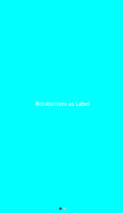

# Populating Data in .NET MAUI Rotator (SfRotator)

The [`SfRotator`](https://help.syncfusion.com/cr/maui/Syncfusion.Maui.Rotator.SfRotator.html?tabs=tabid-1) control supports binding to different data sources such as IList Data Source and Observable Collection Data Source.

## Through Binding

This section explains about setting Item Source and applying custom template to the data.

### Create a Model with Data

The [`SfRotator`](https://help.syncfusion.com/cr/maui/Syncfusion.Maui.Rotator.SfRotator.html?tabs=tabid-1)items can be populated with a collection of image data. Assign a collection to it. Collections include arrays, Lists, and DataTables. For example, you may want to create a Rotator model with an Image as follows.




	
// Model Class for Rotator.

public RotatorModel(string imageString)
{
    Image = imageString;
}
private String _image;
public String Image
{
    get { return _image; }
    set { _image = value; }
}      





Create and populate the [`SfRotator`](https://help.syncfusion.com/cr/maui/Syncfusion.Maui.Rotator.SfRotator.html?tabs=tabid-1) collection as follows.





// ViewModel class for Rotator.

public RotatorViewModel()
{
    ImageCollection.Add(new RotatorModel("image1.png"));
    ImageCollection.Add(new RotatorModel("image2.png"));
    ImageCollection.Add(new RotatorModel("image3.png"));
    ImageCollection.Add(new RotatorModel("image4.png"));
    ImageCollection.Add(new RotatorModel("image5.png"));
}
private List<RotatorModel> imageCollection = new List<RotatorModel>();
public List<RotatorModel> ImageCollection
{
    get { return imageCollection; }
    set { imageCollection = value; }
}





### Binding the Data with Custom Template

The [`SfRotator`](https://help.syncfusion.com/cr/maui/Syncfusion.Maui.Rotator.SfRotator.html?tabs=tabid-1) provides support to add a custom view as RotatorItems by designing a view inside its ItemTemplate. This template will be applied for all its items, and its data will be bound.





<?xml version="1.0" encoding="utf-8" ?>
<ContentPage xmlns="http://schemas.microsoft.com/dotnet/2021/maui"
            xmlns:x="http://schemas.microsoft.com/winfx/2009/xaml"
            xmlns:syncfusion="clr-namespace:Syncfusion.Maui.Rotator;assembly=Syncfusion.Maui.Rotator"
            xmlns:local="clr-namespace:Rotator"
            x:Class="Rotator.Rotator">
    <ContentPage.BindingContext>
        <local:RotatorViewModel/>
    </ContentPage.BindingContext>
    <ContentPage.Content>
        <syncfusion:SfRotator x:Name="rotator" 
                        NavigationDelay="2000" 
                        ItemsSource="{Binding ImageCollection}" 
                        SelectedIndex="2"
                        NavigationDirection="Horizontal"
                        NavigationStripMode="Dots" 
                        BackgroundColor="#ececec">
            <syncfusion:SfRotator.ItemTemplate>
                <DataTemplate>
                    <Image  Source="{Binding Image}"/>
                </DataTemplate>
            </syncfusion:SfRotator.ItemTemplate>
        </syncfusion:SfRotator>
    </ContentPage.Content>
</ContentPage>
	  




using Syncfusion.Maui.Rotator;

namespace Rotator;

public partial class Rotator : ContentPage
{
    public Rotator()
    {
        InitializeComponent();
        SfRotator rotator = new SfRotator();
        var ImageCollection = new List<RotatorModel> {
            new RotatorModel ("image1.png"),
            new RotatorModel ("image2.png"),
            new RotatorModel ("image3.png"),
            new RotatorModel ("image4.png"),
            new RotatorModel ("image5.png")
            };
        var itemTemplate = new DataTemplate(() =>
        {
            var grid = new Grid();
            var nameLabel = new Image();
            nameLabel.SetBinding(Image.SourceProperty, "Image");
            grid.Children.Add(nameLabel);
            return grid;
        });
        rotator.ItemTemplate = itemTemplate;
        rotator.ItemsSource = ImageCollection;
        this.Content = rotator;
    }

    public class RotatorModel
    {
        public RotatorModel(string imageString)
        {
            Image = imageString;
        }
        private String _image;
        public String Image
        {
            get { return _image; }
            set { _image = value; }
        }
    }
}





## Through Rotator Item

The ItemTemplate provides a common template with different data, whereas if different views for every item are needed, it can also be provided using the [`ItemContent`](https://help.syncfusion.com/cr/maui/Syncfusion.Maui.Rotator.SfRotatorItem.html#Syncfusion_Maui_Rotator_SfRotatorItem_ItemContent) property in the [`SfRotatorItem`](https://help.syncfusion.com/cr/maui/Syncfusion.Maui.Rotator.SfRotatorItem.html) class.





using Syncfusion.Maui.Rotator;

namespace Rotator;

public partial class Rotator : ContentPage
{
    public Rotator()
    {
        InitializeComponent();
        // Rotator Item as Label

        SfRotator rotator = new SfRotator();
        SfRotatorItem itemLabel = new SfRotatorItem();
        List<SfRotatorItem> rotatorItem = new List<SfRotatorItem>();
        Label label = new Label();
        label.Text = "RotatorItem as Label";
        label.BackgroundColor = Colors.Aqua;
        label.FontSize = 20;
        label.VerticalTextAlignment = TextAlignment.Center;
        label.HorizontalTextAlignment = TextAlignment.Center;
        label.VerticalOptions = LayoutOptions.Center;
        itemLabel.ItemContent = label;
        rotatorItem.Add(itemLabel);

        // Rotator Item as Image

        SfRotatorItem itemImage = new SfRotatorItem();
        Image image = new Image();
        image.Source = ImageSource.FromFile("image1.png");
        image.Aspect = Aspect.AspectFit;
        image.VerticalOptions = LayoutOptions.Center;
        image.HeightRequest = 400;
        image.WidthRequest = 400;
        itemImage.ItemContent = image;
        rotatorItem.Add(itemImage);
        rotator.ItemsSource = rotatorItem;
        this.Content = rotator;
    }
}	
	  




Also, the rotator provides support to display only the image data with the [`Image`](https://help.syncfusion.com/cr/maui/Syncfusion.Maui.Rotator.SfRotatorItem.html#Syncfusion_Maui_Rotator_SfRotatorItem_Image) property in the [`SfRotatorItem`](https://help.syncfusion.com/cr/maui/Syncfusion.Maui.Rotator.SfRotatorItem.html) class.





using Syncfusion.Maui.Rotator;

namespace Rotator;

public partial class Rotator : ContentPage
{
    SfRotator rotator = new SfRotator();
    StackLayout stackLayout = new StackLayout();
    public Rotator()
    {
        InitializeComponent();
        stackLayout.HeightRequest = 300;
        List<SfRotatorItem> collectionOfItems = new List<SfRotatorItem>();
        collectionOfItems.Add(new SfRotatorItem() { Image = "image1.png" });
        collectionOfItems.Add(new SfRotatorItem() { Image = "image2.png" });
        collectionOfItems.Add(new SfRotatorItem() { Image = "image3.png" });
        collectionOfItems.Add(new SfRotatorItem() { Image = "image4.png" });
        collectionOfItems.Add(new SfRotatorItem() { Image = "image5.png" });
        rotator.ItemsSource = collectionOfItems;
        stackLayout.Children.Add(rotator);
        this.Content = stackLayout;
    }
}





Similarly every item can be created and customized in case of different Rotator item view is needed.
