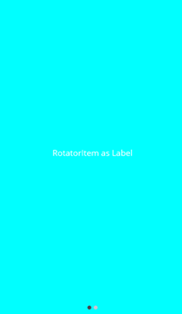

# Populating Data in .NET MAUI Rotator (SfRotator)

The [`.NET MAUI Rotator`](https://help.syncfusion.com/cr/maui/Syncfusion.Maui.Rotator.SfRotator.html) control can be populated with items in two ways:

* **Through Binding** - bind a collection (such as `IList`, `List<T>`, or `ObservableCollection<T>`) to the [`ItemsSource`](https://help.syncfusion.com/cr/maui/Syncfusion.Maui.Rotator.SfRotator.html#Syncfusion_Maui_Rotator_SfRotator_ItemsSource) property and supply a shared layout via `ItemTemplate`.
* **Through Rotator Item** - create a list of [`SfRotatorItem`](https://help.syncfusion.com/cr/maui/Syncfusion.Maui.Rotator.SfRotatorItem.html) objects when each item needs a different view, an image, or arbitrary content via the `ItemContent` property.

Use **Through Binding** when all items share a common layout. Use **Through Rotator Item** when you need per-item customization, mixed content, or quick image-only items.

## Prerequisites

Before using the [SfRotator](https://help.syncfusion.com/cr/maui/Syncfusion.Maui.Rotator.SfRotator.html), ensure the following NuGet package is installed in your .NET MAUI project:

- `Syncfusion.Maui.Rotator`

For step-by-step setup, refer to the [Getting Started](https://help.syncfusion.com/maui/rotator/getting-started) documentation.

## Properties Reference

| Property | Type | Default | Description |
|----------|------|---------|-------------|
| `ItemsSource` | `IList` | `null` | The collection of items to display. Supports `List<T>`, `ObservableCollection<T>`, and arrays. Use `ObservableCollection<T>` for automatic UI updates when the collection changes. |
| `ItemTemplate` | `DataTemplate` | `null` | The shared template applied to every item. The template binds to each item's properties. |
| `SfRotatorItem.Image` | `string` | `null` | The image file name (resolved from the `Resources/Images` folder) for image-only items. |
| `SfRotatorItem.ItemContent` | `View` | `null` | The arbitrary view shown for the item. Takes precedence over `Image` when both are set. |

## Through Binding

This section explains how to set the `ItemsSource` and apply a custom template to the data.

### Create a Model with Data

The `SfRotator` items can be populated with a collection of image data. Assign a collection to the `ItemsSource` property. Collections include arrays, `List<T>`, and `ObservableCollection<T>`. For example, you may want to create a `RotatorModel` with an `Image` property as follows.




// Model Class for Rotator.
public class RotatorModel
{
    public RotatorModel(string imageString)
    {
        Image = imageString;
    }
    public string Image { get; set; }
}




Create and populate the `SfRotator` collection as follows.




// ViewModel class for Rotator.

public class RotatorViewModel
{
    public RotatorViewModel()
    {
        ImageCollection = new List<RotatorModel>
        {
            new RotatorModel("image1.png"),
            new RotatorModel("image2.png"),
            new RotatorModel("image3.png"),
            new RotatorModel("image4.png"),
            new RotatorModel("image5.png")
        };
    }
    public List<RotatorModel> ImageCollection { get; set; }
}




### Binding the Data with Custom Template

The `SfRotator` provides support to add a custom view as Rotator items by designing a view inside its `ItemTemplate`. This template will be applied to all its items, and its data will be bound.





<rotator:SfRotator x:Name="rotator"
                   ItemsSource="{Binding ImageCollection}"
                   SelectedIndex="2"
                   NavigationDirection="Horizontal"
                   NavigationStripMode="Dots"
                   BackgroundColor="#ececec">
    <rotator:SfRotator.ItemTemplate>
        <DataTemplate>
            <Image Source="{Binding Image}" />
        </DataTemplate>
    </rotator:SfRotator.ItemTemplate>
</rotator:SfRotator>
<rotator:SfRotator.BindingContext>
    <local:RotatorViewModel />
</rotator:SfRotator.BindingContext>





RotatorViewModel rotatorViewModel = new RotatorViewModel();
SfRotator rotator = new SfRotator()
{
    SelectedIndex = 2,
    BackgroundColor = Color.FromArgb("#ececec"),
    NavigationStripMode = NavigationStripMode.Dots,
    NavigationDirection = NavigationDirection.Horizontal,
    ItemsSource = rotatorViewModel.ImageCollection,
    ItemTemplate = new DataTemplate(() =>
    {
        var image = new Image();
        image.SetBinding(Image.SourceProperty, "Image");
        return image;
    }),
};




## Through Rotator Item

The `ItemTemplate` provides a common template with different data, whereas if different views for every item are needed, they can be provided using the `ItemContent` property in the `SfRotatorItem` class.

### Using ItemContent

Use `SfRotatorItem.ItemContent` when each item must display a different view, such as a label, an image, or any custom layout.





List<SfRotatorItem> rotatorItem = new List<SfRotatorItem>();

// Rotator Item as Label
rotatorItem.Add(new SfRotatorItem()
{
    ItemContent = new Label()
    {
        Text = "RotatorItem as Label",
        BackgroundColor = Colors.Aqua,
        FontSize = 20,
        VerticalTextAlignment = TextAlignment.Center,
        HorizontalTextAlignment = TextAlignment.Center,
        VerticalOptions = LayoutOptions.Center
    }
});

// Rotator Item as Image
rotatorItem.Add(new SfRotatorItem()
{
    ItemContent = new Image()
    {
        Source = ImageSource.FromFile("image1.png"),
        Aspect = Aspect.AspectFit,
        VerticalOptions = LayoutOptions.Center,
        HeightRequest = 400,
        WidthRequest = 400
    }
});

SfRotator rotator = new SfRotator()
{
    ItemsSource = rotatorItem
};





### Using the Image Property

The `SfRotatorItem` class also provides an `Image` property for quickly displaying image-only items. When both `Image` and `ItemContent` are set, `ItemContent` takes precedence.




SfRotator rotator = new SfRotator()
{
    ItemsSource = new List<SfRotatorItem>()
    {
        new SfRotatorItem() { Image = "image1.png" },
        new SfRotatorItem() { Image = "image2.png" },
        new SfRotatorItem() { Image = "image3.png" },
        new SfRotatorItem() { Image = "image4.png" },
        new SfRotatorItem() { Image = "image5.png" }
    }
};

StackLayout stackLayout = new StackLayout()
{
    HeightRequest = 300,
    Children =
    {
        rotator
    }
};




Similarly, every item can be created and customized when a different Rotator item view is needed.

## See also

- [Sliding Direction in .NET MAUI Rotator](https://help.syncfusion.com/maui/rotator/sliding-direction)
- [Adding Looping and Delays in .NET MAUI Rotator](https://help.syncfusion.com/maui/rotator/adding-looping-and-delays)
- [DataTemplateSelector in .NET MAUI Rotator](https://help.syncfusion.com/maui/rotator/datatemplateselector)
- [Loading Online Images in .NET MAUI Rotator](https://help.syncfusion.com/maui/rotator/loading-online-images)
