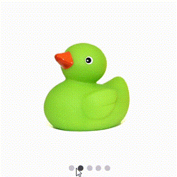

# Sliding Direction in .NET MAUI Rotator (SfRotator)

There are Six available positions,

* `Horizontal` - Rotator Items can be navigated in horizontal direction.
* `Vertical` - Rotator Items can be navigated in vertical direction.
* `LeftToRight` - Rotator items can be navigate from Left to Right only.
* `RightToLeft` - Rotator items can be navigate from Right to Left only.
* `TopToBottom` - Rotator items can be navigate from Top to Bottom only.
* `BottomToTop` - Rotator items can be navigate from Bottom to Top only.





    <?xml version="1.0" encoding="utf-8" ?>
    <ContentPage xmlns="http://schemas.microsoft.com/dotnet/2021/maui"
                xmlns:x="http://schemas.microsoft.com/winfx/2009/xaml"
                xmlns:syncfusion="clr-namespace:Syncfusion.Maui.Rotator;assembly=Syncfusion.Maui.Rotator"
                xmlns:local="clr-namespace:Rotator"
                x:Class="Rotator.Rotator">
        <ContentPage.BindingContext>
            <local:RotatorViewModel/>
        </ContentPage.BindingContext>
        <ContentPage.Content>
            <syncfusion:SfRotator x:Name="rotator" 
                            NavigationDelay="2000" 
                            ItemsSource="{Binding ImageCollection}" 
                            SelectedIndex="2"
                            NavigationDirection="BottomToTop"
                            NavigationStripMode="Thumbnail" 
                            BackgroundColor="#ececec"
                            EnableAutoPlay="true"
                            EnableLooping="true"
                            NavigationStripPosition="Bottom">
                <syncfusion:SfRotator.ItemTemplate>
                    <DataTemplate>
                        <Image  Source="{Binding Image}"/>
                    </DataTemplate>
                </syncfusion:SfRotator.ItemTemplate>
            </syncfusion:SfRotator>
        </ContentPage.Content>
    </ContentPage>





    using Syncfusion.Maui.Core.Rotator;
    using Syncfusion.Maui.Rotator;
    
    namespace Rotator
    {
        public partial class Rotator : ContentPage
        {
            public Rotator()
            {
                InitializeComponent ();
                SfRotator rotator = new SfRotator();
                var ImageCollection = new List<RotatorModel> {
                new RotatorModel ("image1.png"),
                new RotatorModel ("image2.png"),
                new RotatorModel ("image3.png"),
                new RotatorModel ("image4.png"),
                new RotatorModel ("image5.png")
                };
                var itemTemplate = new DataTemplate(() =>
                {
                    var grid = new Grid();
                    var nameLabel = new Image();
                    nameLabel.SetBinding(Image.SourceProperty, "Image");
                    grid.Children.Add(nameLabel);
                    return grid;
                });
                rotator.ItemTemplate = itemTemplate;
                rotator.NavigationStripMode = NavigationStripMode.Thumbnail;
                rotator.NavigationDirection = NavigationDirection.BottomToTop;
                rotator.ItemsSource = ImageCollection;
                this.Content = rotator;
            }
        }
        public class RotatorModel
        {
            public RotatorModel(string imageString)
            {
                Image = imageString;
            }
            private String _image;
            public String Image
            {
                get { return _image; }
                set { _image = value; }
            }
        }
    }





