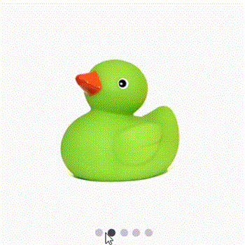

# Sliding Direction in .NET MAUI Rotator (SfRotator)

## Prerequisites

Before using the [SfRotator](https://help.syncfusion.com/cr/maui/Syncfusion.Maui.Rotator.SfRotator.html), ensure the following NuGet package is installed in your .NET MAUI project:

- `Syncfusion.Maui.Rotator`

For step-by-step setup, refer to the [Getting Started](https://help.syncfusion.com/maui/rotator/getting-started) documentation.

## Overview

The [`NavigationDirection`](https://help.syncfusion.com/cr/maui/Syncfusion.Maui.Core.Rotator.NavigationDirection.html) property controls the direction in which [`SfRotator`](https://help.syncfusion.com/cr/maui/Syncfusion.Maui.Rotator.SfRotator.html) items are navigated. The property is of type `NavigationDirection` and the default value is [`Horizontal`](https://help.syncfusion.com/cr/maui/Syncfusion.Maui.Core.Rotator.NavigationDirection.html#Syncfusion_Maui_Core_Rotator_NavigationDirection_Horizontal). When `EnableAutoPlay` is `true`, the rotator advances through the items in the selected direction.

The following `NavigationDirection` values are available:

* [`Horizontal`](https://help.syncfusion.com/cr/maui/Syncfusion.Maui.Core.Rotator.NavigationDirection.html#Syncfusion_Maui_Core_Rotator_NavigationDirection_Horizontal) — Rotator items can be navigated in the horizontal direction.
* [`Vertical`](https://help.syncfusion.com/cr/maui/Syncfusion.Maui.Core.Rotator.NavigationDirection.html#Syncfusion_Maui_Core_Rotator_NavigationDirection_Vertical) — Rotator items can be navigated in the vertical direction.
* [`LeftToRight`](https://help.syncfusion.com/cr/maui/Syncfusion.Maui.Core.Rotator.NavigationDirection.html#Syncfusion_Maui_Core_Rotator_NavigationDirection_LeftToRight) — Rotator items can be navigated from Left to Right only.
* [`RightToLeft`](https://help.syncfusion.com/cr/maui/Syncfusion.Maui.Core.Rotator.NavigationDirection.html#Syncfusion_Maui_Core_Rotator_NavigationDirection_RightToLeft) — Rotator items can be navigated from Right to Left only.
* [`TopToBottom`](https://help.syncfusion.com/cr/maui/Syncfusion.Maui.Core.Rotator.NavigationDirection.html#Syncfusion_Maui_Core_Rotator_NavigationDirection_TopToBottom) — Rotator items can be navigated from Top to Bottom only.
* [`BottomToTop`](https://help.syncfusion.com/cr/maui/Syncfusion.Maui.Core.Rotator.NavigationDirection.html#Syncfusion_Maui_Core_Rotator_NavigationDirection_BottomToTop) — Rotator items can be navigated from Bottom to Top only.

Use the generic `Horizontal` and `Vertical` options when you want the rotator to follow the swipe gesture. Use the directional options (`LeftToRight`, `RightToLeft`, `TopToBottom`, `BottomToTop`) to lock navigation to a specific direction regardless of swipe input.

## Set the Sliding Direction

Use the [`NavigationDirection`](https://help.syncfusion.com/cr/maui/Syncfusion.Maui.Core.Rotator.NavigationDirection.html) property to set the sliding direction of [`SfRotator`](https://help.syncfusion.com/cr/maui/Syncfusion.Maui.Rotator.SfRotator.html). The following example sets the direction to `BottomToTop`.





<rotator:SfRotator x:Name="rotator"
                    ItemsSource="{Binding ImageCollection}"
                    SelectedIndex="2"
                    NavigationDirection="BottomToTop">
    <rotator:SfRotator.ItemTemplate>
        <DataTemplate>
            <Image Source="{Binding Image}" />
        </DataTemplate>
    </rotator:SfRotator.ItemTemplate>
</rotator:SfRotator>
    



    
 RotatorViewModel rotatorViewModel = new RotatorViewModel();
 SfRotator rotator = new SfRotator()
 {
    SelectedIndex = 2,
    NavigationDirection = NavigationDirection.BottomToTop,
    ItemsSource = rotatorViewModel.ImageCollection,
    ItemTemplate = new DataTemplate(() =>
    {
        var image = new Image();
        image.SetBinding(Image.SourceProperty, "Image");
        return image;
    }),
};
 



// Model
public class RotatorModel
{
    public RotatorModel(string imageString)
    {
        Image = imageString;
    }
    private string _image;
    public string Image
    {
        get { return _image; }
        set { _image = value; }
    }
}

// ViewModel
public class RotatorViewModel
{
    public RotatorViewModel()
    {
        imageCollection = new List<RotatorModel>
        {
            new RotatorModel("image1.png"),
            new RotatorModel("image2.png"),
            new RotatorModel("image3.png"),
            new RotatorModel("image4.png"),
            new RotatorModel("image5.png")
        };
    }
    private List<RotatorModel> imageCollection;
    public List<RotatorModel> ImageCollection
    {
        get { return imageCollection; }
        set { imageCollection = value; }
    }
}




## See Also

- [Getting Started with .NET MAUI Rotator (SfRotator)](https://help.syncfusion.com/maui/Rotator/getting-started)
- [Navigation Customization in .NET MAUI Rotator](https://help.syncfusion.com/maui/rotator/navigation-customization)
- [Navigation Mode in .NET MAUI Rotator](https://help.syncfusion.com/maui/rotator/navigation-modes)
- [Populating data in .NET MAUI Rotator](https://help.syncfusion.com/maui/rotator/populating-data)
- [Events in .NET MAUI Rotator](https://help.syncfusion.com/maui/rotator/events)
- [Placement Modes in.NET MAUI Rotator](https://help.syncfusion.com/maui/rotator/placement-modes)
