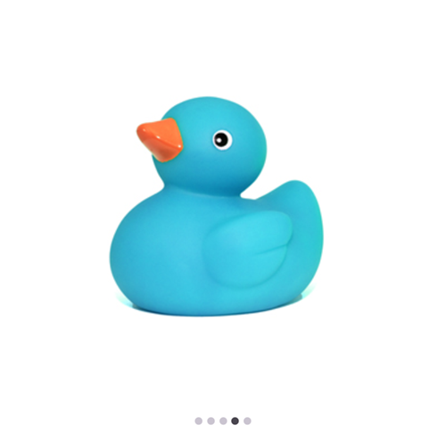
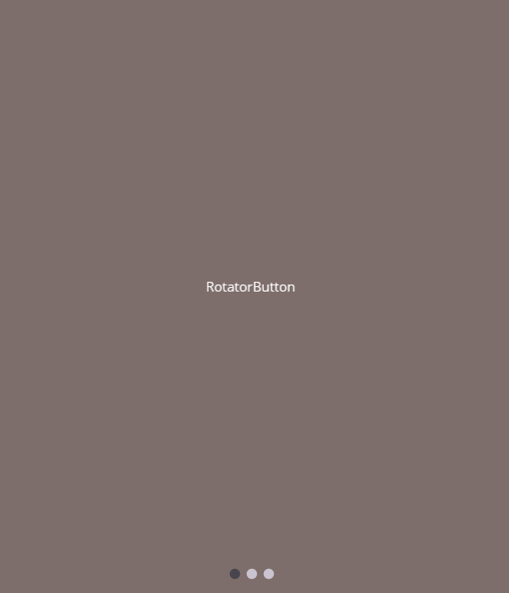

# Getting Started with .NET MAUI Rotator (SfRotator)

This section explains how to add the Rotator control and bind data to it. This section covers only the basic features needed to get started with the Syncfusion [.NET MAUI Rotator](https://www.syncfusion.com/maui-controls/maui-carousel) control.

## Adding a .NET MAUI Rotator reference

The Syncfusion .NET MAUI controls are available in [Nuget.org](https://www.nuget.org/). To add [.NET MAUI Rotator](https://www.syncfusion.com/maui-controls/maui-carousel) to your project, open the NuGet package manager in Visual Studio, search for [`Syncfusion.Maui.Rotator`](https://www.nuget.org/packages/Syncfusion.Maui.Carousel), and install it.

## Handler registration 

In the MauiProgram.cs file, register the handler for the Syncfusion core.



    using Microsoft.Maui;
    using Microsoft.Maui.Hosting;
    using Microsoft.Maui.Controls.Compatibility;
    using Microsoft.Maui.Controls.Hosting;
    using Microsoft.Maui.Controls.Xaml;
    using Syncfusion.Maui.Core.Hosting;

    namespace Rotator
    {
        public static class MauiProgram
        {
            public static MauiApp CreateMauiApp()
            {
                var builder = MauiApp.CreateBuilder();
                builder
                .UseMauiApp<App>()
                .ConfigureSyncfusionCore()
                .ConfigureFonts(fonts =>
                {
                    fonts.AddFont("OpenSans-Regular.ttf", "OpenSansRegular");
                });

                return builder.Build();
            }      
        }
    }   

 

## Adding the .NET MAUI Rotator control

Step 1: Add the NuGet to the project as discussed in the above reference section. 

Step 2: Add the namespace as shown in the following code sample.




	xmlns:syncfusion="clr-namespace:Syncfusion.Maui.Rotator;assembly=Syncfusion.Maui.Rotator"




	using Syncfusion.Maui.Rotator;




## Create a Simple SfRotator 

The [`SfRotator`](https://help.syncfusion.com/cr/xamarin/Syncfusion.SfRotator.XForms.SfRotator.html) control is configured entirely in C# code or by using XAML markup. The following steps explain on how to create a [`SfRotator`](https://help.syncfusion.com/cr/xamarin/Syncfusion.SfRotator.XForms.SfRotator.html) and configure its elements,

* Adding namespace for the added assemblies. 





	xmlns:syncfusion="clr-namespace:Syncfusion.Maui.Rotator;assembly=Syncfusion.Maui.Rotator"





	using Syncfusion.Maui.Rotator; 
	




* Now add the [`SfRotator`](https://help.syncfusion.com/cr/xamarin/Syncfusion.SfRotator.XForms.SfRotator.html) control with a required optimal name by using the included namespace.





    <?xml version="1.0" encoding="utf-8" ?>
    <ContentPage xmlns="http://schemas.microsoft.com/dotnet/2021/maui"
        xmlns:x="http://schemas.microsoft.com/winfx/2009/xaml"
        xmlns:local="clr-namespace:GettingStarted" 
        xmlns:syncfusion="clr-namespace:Syncfusion.SfRotator.XForms;assembly=Syncfusion.SfRotator.XForms"
        x:Class="GettingStarted.Rotator">
    <ContentPage.Content>
    <syncfusion:SfRotator x:Name="rotator" />	
    </ContentPage.Content>
    </ContentPage>
	
	


		

    using Syncfusion.Maui.Rotator;

    namespace GettingStarted
    {
    public partial class RotatorControlPage : ContentPage
        {
            public RotatorControlPage()
            {
                InitializeComponent();
                SfRotator rotator = new SfRotator();
                this.Content = rotator;
            }
        }
    }
        




## Add Rotator Items

We can populate the rotator's items by using any one of the following ways,

* Through [`SfRotatorItem`](https://help.syncfusion.com/cr/xamarin/Syncfusion.SfRotator.XForms.SfRotatorItem.html)

* Through [`ItemTemplate`](https://help.syncfusion.com/cr/xamarin/Syncfusion.SfRotator.XForms.SfRotator.html#Syncfusion_SfRotator_XForms_SfRotator_ItemTemplate)

### Through SfRotatorItem

By passing the list of [`SfRotatorItem`](https://help.syncfusion.com/cr/xamarin/Syncfusion.SfRotator.XForms.SfRotatorItem.html) , we can get the view of [`SfRotator`](https://help.syncfusion.com/cr/xamarin/Syncfusion.SfRotator.XForms.SfRotator.html) control. In that we can pass Images as well as Item content.

The following code example illustrates to add list of Images in Rotator ,





    using Syncfusion.Maui.Core.Rotator;

    namespace Rotator
    {
        public partial class Rotator : ContentPage
        {
            SfRotator rotator = new SfRotator();
            StackLayout stackLayout = new StackLayout();
            public Rotator()
            {
                InitializeComponent ();
                stackLayout.HeightRequest = 300;
                List<SfRotatorItem> collectionOfItems = new List<SfRotatorItem>();
                collectionOfItems.Add(new SfRotatorItem() { Image = "movie1.png" });
                collectionOfItems.Add(new SfRotatorItem() { Image = "movie2.png" });
                collectionOfItems.Add(new SfRotatorItem() { Image = "movie3.png" });
                collectionOfItems.Add(new SfRotatorItem() { Image = "movie4.png" });
                collectionOfItems.Add(new SfRotatorItem() { Image = "movie5.png" });
                rotator.ItemsSource = collectionOfItems;
                stackLayout.Children.Add(rotator);
                this.Content = stackLayout;
            }
        }
    }





The following code example illustrates to add list of items through ItemContent API in Rotator ,





    using Syncfusion.Maui.Rotator;

    namespace Rotator
    {
        public partial class Rotator : ContentPage
        {
            SfRotator rotator;
            public Rotator()
            {
                InitializeComponent();
                SfRotator rotator = new SfRotator();
                List<SfRotatorItem> collectionOfItems = new List<SfRotatorItem>();
                collectionOfItems.Add(new SfRotatorItem() { ItemContent = new Button() { Text = "RotatorButton", TextColor = Colors.White, BackgroundColor = Color.FromArgb("#7E6E6B"), FontSize = 12 } });
                collectionOfItems.Add(new SfRotatorItem() { ItemContent = new Label() { Text = "RotatorLabel", BackgroundColor = Color.FromArgb("#7E6E6B"), FontSize = 12 } });
                collectionOfItems.Add(new SfRotatorItem() { ItemContent = new Image() { Source = "image1.png", Aspect = Aspect.AspectFit } });
                rotator.ItemsSource = collectionOfItems;
                this.Content = rotator;
            }
        }
    }





### Through ItemTemplate

[`ItemTemplate`](https://help.syncfusion.com/cr/xamarin/Syncfusion.SfRotator.XForms.SfRotator.html#Syncfusion_SfRotator_XForms_SfRotator_ItemTemplate) property of [`SfRotator`](https://help.syncfusion.com/cr/xamarin/Syncfusion.SfRotator.XForms.SfRotator.html) control is used to customize the contents of [`SfRotator`](https://help.syncfusion.com/cr/xamarin/Syncfusion.SfRotator.XForms.SfRotator.html) items. [`ItemTemplate`](https://help.syncfusion.com/cr/xamarin/Syncfusion.SfRotator.XForms.SfRotator.html#Syncfusion_SfRotator_XForms_SfRotator_ItemTemplate) provides common template with different data. [`SfRotator`](https://help.syncfusion.com/cr/xamarin/Syncfusion.SfRotator.XForms.SfRotator.html) items can be populated with a collection of image data. This collection includes Arrays, Lists and DataTables. 





    // Model Class for Rotator.

    public RotatorModel(string imageString)
    {
        Image = imageString;
    }
    private String _image;
    public String Image
    {
        get { return _image; }
        set { _image = value; }
    }





Create and populate Rotator collection as follows





    // ViewModel class for Rotator.

    public RotatorViewModel()
    {
        ImageCollection.Add(new RotatorModel("image1.png"));
        ImageCollection.Add(new RotatorModel("image2.png"));
        ImageCollection.Add(new RotatorModel("image3.png"));
        ImageCollection.Add(new RotatorModel("image4.png"));
        ImageCollection.Add(new RotatorModel("image5.png"));
    }
    private List<RotatorModel> imageCollection = new List<RotatorModel>();
    public List<RotatorModel> ImageCollection
    {
        get { return imageCollection; }
        set { imageCollection = value; }
    }









    <?xml version="1.0" encoding="utf-8" ?>
    <ContentPage xmlns="http://schemas.microsoft.com/dotnet/2021/maui"
                xmlns:x="http://schemas.microsoft.com/winfx/2009/xaml"
                xmlns:syncfusion="clr-namespace:Syncfusion.Maui.Rotator;assembly=Syncfusion.Maui.Rotator"
                xmlns:local="clr-namespace:Rotator"
                x:Class="Rotator.Rotator">
        <ContentPage.BindingContext>
            <local:RotatorViewModel/>
        </ContentPage.BindingContext>
        <ContentPage.Content>
            <syncfusion:SfRotator x:Name="rotator" 
                            NavigationDelay="2000" 
                            ItemsSource="{Binding ImageCollection}" 
                            SelectedIndex="2"
                            NavigationDirection="Horizontal"
                            NavigationStripMode="Dots" 
                            BackgroundColor="#ececec"
                            WidthRequest="550"
                            HeightRequest="550">
                <syncfusion:SfRotator.ItemTemplate>
                    <DataTemplate>
                        <Image  Source="{Binding Image}"/>
                    </DataTemplate>
                </syncfusion:SfRotator.ItemTemplate>
            </syncfusion:SfRotator>
        </ContentPage.Content>
    </ContentPage>
	  




    using Syncfusion.Maui.Core.Rotator;

    namespace Rotator
    {
        public partial class Rotator : ContentPage
        {
            public Rotator()
            {
                InitializeComponent ();
                SfRotator rotator = new SfRotator();
                var ImageCollection = new List<RotatorModel> {
                new RotatorModel ("image1.png"),
                new RotatorModel ("image2.png"),
                new RotatorModel ("image3.png"),
                new RotatorModel ("image4.png"),
                new RotatorModel ("image5.png")
                };
                var itemTemplate = new DataTemplate(() =>
                {
                    var grid = new Grid();
                    var nameLabel = new Image();
                    nameLabel.SetBinding(Image.SourceProperty, "Image");
                    grid.Children.Add(nameLabel);
                    return grid;
                });
                rotator.ItemTemplate = itemTemplate;
                rotator.ItemsSource = ImageCollection;
                this.Content = rotator;
            }
        }
        public class RotatorModel
        {
            public RotatorModel(string imageString)
            {
                Image = imageString;
            }
            private String _image;
            public String Image
            {
                get { return _image; }
                set { _image = value; }
            }
        }
    }





* Set the `BindingContext` for the items collection.





    <ContentPage.BindingContext>
        <local:RotatorViewModel/>
	</ContentPage.BindingContext>





	rotator.BindingContext = new RotatorViewModel();





I> Rotator's Images are placed within the application folder for Android, iOS and UWP with build action Android Resource, Bundled Resource and Content respectively. 

N> In addition, rotator provides a support to load the Images from `URL` and `SD Card` location.
 
## Setting Navigation Mode

[`SfRotator`](https://help.syncfusion.com/cr/xamarin/Syncfusion.SfRotator.XForms.SfRotator.html) provides option to display the navigating items either in Thumbnail or Dots mode. The navigation mode for navigating the items can be decided using [`NavigationStripMode`](https://help.syncfusion.com/cr/xamarin/Syncfusion.SfRotator.XForms.SfRotator.html#Syncfusion_SfRotator_XForms_SfRotator_NavigationStripMode) property.





    <?xml version="1.0" encoding="utf-8" ?>
    <ContentPage xmlns="http://schemas.microsoft.com/dotnet/2021/maui"
                xmlns:x="http://schemas.microsoft.com/winfx/2009/xaml"
                xmlns:syncfusion="clr-namespace:Syncfusion.Maui.Rotator;assembly=Syncfusion.Maui.Rotator"
                xmlns:local="clr-namespace:Rotator"
                x:Class="Rotator.Rotator">
        <ContentPage.BindingContext>
            <local:RotatorViewModel/>
        </ContentPage.BindingContext>
        <ContentPage.Content>
            <syncfusion:SfRotator x:Name="rotator" 
                            NavigationDelay="2000" 
                            ItemsSource="{Binding ImageCollection}" 
                            SelectedIndex="2"
                            NavigationDirection="Horizontal"
                            NavigationStripMode="Thumbnail" 
                            BackgroundColor="#ececec"
                            WidthRequest="550"
                            HeightRequest="550">
                <syncfusion:SfRotator.ItemTemplate>
                    <DataTemplate>
                        <Image  Source="{Binding Image}"/>
                    </DataTemplate>
                </syncfusion:SfRotator.ItemTemplate>
            </syncfusion:SfRotator>
        </ContentPage.Content>
    </ContentPage>



	

    using Syncfusion.Maui.Core.Rotator;
    using Syncfusion.Maui.Rotator;

    namespace Rotator
    {
        public partial class Rotator : ContentPage
        {
            public Rotator()
            {
                InitializeComponent ();
                SfRotator rotator = new SfRotator();
                var ImageCollection = new List<RotatorModel> {
                new RotatorModel ("image1.png"),
                new RotatorModel ("image2.png"),
                new RotatorModel ("image3.png"),
                new RotatorModel ("image4.png"),
                new RotatorModel ("image5.png")
                };
                var itemTemplate = new DataTemplate(() =>
                {
                    var grid = new Grid();
                    var nameLabel = new Image();
                    nameLabel.SetBinding(Image.SourceProperty, "Image");
                    grid.Children.Add(nameLabel);
                    return grid;
                });
                rotator.ItemTemplate = itemTemplate;
                rotator.NavigationStripMode = NavigationStripMode.Thumbnail;
                rotator.ItemsSource = ImageCollection;
                this.Content = rotator;
            }
        }
        public class RotatorModel
        {
            public RotatorModel(string imageString)
            {
                Image = imageString;
            }
            private String _image;
            public String Image
            {
                get { return _image; }
                set { _image = value; }
            }
        }
    }





## Customizing Position

The placement position of navigation strip items such as [`Thumbnail`](https://help.syncfusion.com/cr/xamarin/Syncfusion.SfRotator.XForms.NavigationStripMode.html#Syncfusion_SfRotator_XForms_NavigationStripMode_Thumbnail) or [`Dots`](https://help.syncfusion.com/cr/xamarin/Syncfusion.SfRotator.XForms.NavigationStripMode.html#Syncfusion_SfRotator_XForms_NavigationStripMode_Dots) can be customized in [`SfRotator`](https://help.syncfusion.com/cr/xamarin/Syncfusion.SfRotator.XForms.SfRotator.html). This can be specified using [`NavigationStripPosition`](https://help.syncfusion.com/cr/xamarin/Syncfusion.SfRotator.XForms.SfRotator.html#Syncfusion_SfRotator_XForms_SfRotator_NavigationStripPosition) property.   





    <?xml version="1.0" encoding="utf-8" ?>
    <ContentPage xmlns="http://schemas.microsoft.com/dotnet/2021/maui"
                xmlns:x="http://schemas.microsoft.com/winfx/2009/xaml"
                xmlns:syncfusion="clr-namespace:Syncfusion.Maui.Rotator;assembly=Syncfusion.Maui.Rotator"
                xmlns:local="clr-namespace:Rotator"
                x:Class="Rotator.Rotator">
        <ContentPage.BindingContext>
            <local:RotatorViewModel/>
        </ContentPage.BindingContext>
        <ContentPage.Content>
            <syncfusion:SfRotator x:Name="rotator" 
                            NavigationDelay="2000" 
                            ItemsSource="{Binding ImageCollection}" 
                            SelectedIndex="2"
                            NavigationDirection="Horizontal"
                            NavigationStripMode="Dots" 
                            BackgroundColor="#ececec"
                            NavigationStripPosition="Top"
                            WidthRequest="550"
                            HeightRequest="550">
                <syncfusion:SfRotator.ItemTemplate>
                    <DataTemplate>
                        <Image  Source="{Binding Image}"/>
                    </DataTemplate>
                </syncfusion:SfRotator.ItemTemplate>
            </syncfusion:SfRotator>
        </ContentPage.Content>
    </ContentPage>	



	

    using Syncfusion.Maui.Core.Rotator;
    using Syncfusion.Maui.Rotator;

    namespace Rotator
    {
        public partial class Rotator : ContentPage
        {
            public Rotator()
            {
                InitializeComponent ();
                SfRotator rotator = new SfRotator();
                var ImageCollection = new List<RotatorModel> {
                new RotatorModel ("image1.png"),
                new RotatorModel ("image2.png"),
                new RotatorModel ("image3.png"),
                new RotatorModel ("image4.png"),
                new RotatorModel ("image5.png")
                };
                var itemTemplate = new DataTemplate(() =>
                {
                    var grid = new Grid();
                    var nameLabel = new Image();
                    nameLabel.SetBinding(Image.SourceProperty, "Image");
                    grid.Children.Add(nameLabel);
                    return grid;
                });
                rotator.ItemTemplate = itemTemplate;
                rotator.NavigationStripMode = NavigationStripMode.Dots;
                rotator.NavigationStripPosition = NavigationStripPosition.Top;
                rotator.WidthRequest=550;
                rotator.HeightRequest=550;
                rotator.ItemsSource = ImageCollection;
                this.Content = rotator;
            }
        }
        public class RotatorModel
        {
            public RotatorModel(string imageString)
            {
                Image = imageString;
            }
            private String _image;
            public String Image
            {
                get { return _image; }
                set { _image = value; }
            }
        }
    }
	




You can find the complete getting started sample from this [link.](page)