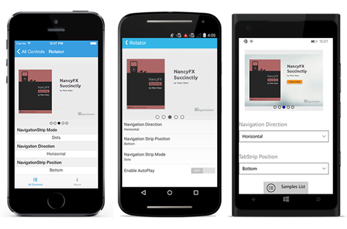

# .NET MAUI Rotator (SfRotator) Overview

The Rotator is a data control used to display image data and navigate through them. The images can be selected either by [`Thumbnail`](https://help.syncfusion.com/cr/xamarin/Syncfusion.SfRotator.XForms.NavigationStripMode.html#Syncfusion_SfRotator_XForms_NavigationStripMode_Thumbnail) or by [`Dots`](https://help.syncfusion.com/cr/xamarin/Syncfusion.SfRotator.XForms.NavigationStripMode.html#Syncfusion_SfRotator_XForms_NavigationStripMode_Dots) support.

 
## Key Features

* `Modes` - Options to navigate data using dots or thumbnail navigation modes.
* `Position` - Support to decide the placement position of dots or thumbnail items in any of the four sides.
* `Autoplay and Items Looping` - Options for auto playing items and navigate items in loop.