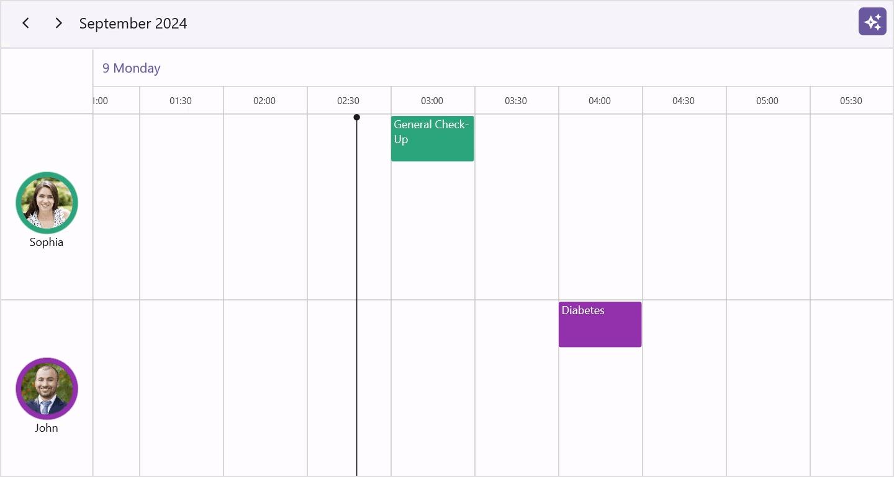

# AI-powered Smart Appointment Booking in .NET MAUI Scheduler (SfScheduler)

This guide walks you through building a smart scheduling interface using .NET MAUI Scheduler ([SfScheduler](https://help.syncfusion.com/cr/maui/Syncfusion.Maui.Scheduler.SfScheduler.html)) powered by AI via Azure OpenAI. Utilizing the new AI AssistView ([SfAIAssistView](https://help.syncfusion.com/cr/maui/Syncfusion.Maui.AIAssistView.SfAIAssistView.html)) control, users can easily book appointments and check resource availability with the help of AI assistance.

## Integrating Azure OpenAI with the .NET MAUI App

### Step 1: Set Up the .NET MAUI Project

- Create a new [.NET MAUI app](https://learn.microsoft.com/en-us/dotnet/maui/get-started/first-app?view=net-maui-9.0&viewFallbackFrom=net-maui-7.0&tabs=vswin&pivots=devices-android) using [Visual Studio](https://visualstudio.microsoft.com/).
- Add the required [NuGet](https://www.nuget.org/) packages:
`Syncfusion.Maui.Scheduler`
`Syncfusion.Maui.AIAssistView` and [`Azure.AI.OpenAI`](https://www.nuget.org/packages/Azure.AI.OpenAI/1.0.0-beta.12)

### Step 2: Set Up Azure OpenAI

To enable AI functionality in your .NET MAUI Scheduler, first ensure that you have access to [Azure OpenAI](https://azure.microsoft.com/en-in/products/ai-services/openai-service). In the Azure portal, create an Azure OpenAI resource and deploy a model such as GPT-35. Assign a deployment name (for example, GPT35Turbo) that you’ll reference in your application code. Finally, copy the API key and endpoint URL from the resource settings, as these are required for authentication and communication with the OpenAI service.

### Step 3: Connect to the Azure OpenAI.

To connect your .NET MAUI app to Azure OpenAI, create a service class that handles communication with the AI model. Start by initializing the OpenAIClient using your Azure endpoint and API key.

```
internal class AzureOpenAIService
{
    const string endpoint = "https://{YOUR_END_POINT}.openai.azure.com";
    const string deploymentName = "GPT35Turbo";
    string key = "API key";

    OpenAIClient? client;
    ChatCompletionsOptions? chatCompletions;

    internal AzureOpenAIService()
    {
    }
}
```

```
this.client = new OpenAIClient(new Uri(endpoint), new AzureKeyCredential(key));
```

In this service, define a method called `GetResponseFromGPT`. This method takes a user prompt from the SfAIAssistView control as input, sends it to the deployed model (e.g., GPT35Turbo), and returns the AI-generated response.

```
internal class AzureOpenAIService
{
    const string endpoint = "https://{YOUR_END_POINT}.openai.azure.com";
    const string deploymentName = "GPT35Turbo";
    string key = "API key";

    OpenAIClient? client;
    ChatCompletionsOptions? chatCompletions;

    internal AzureOpenAIService()
    {

    }

    internal async Task<string> GetResponseFromGPT(string userPrompt)
    {
        this.chatCompletions = new ChatCompletionsOptions
        {
            DeploymentName = deploymentName,
            Temperature = (float)0.5f,
            MaxTokens = 800,
            NucleusSamplingFactor = (float)0.95f,
            FrequencyPenalty = 0,
            PresencePenalty = 0,
        };

        this.client = new OpenAIClient(new Uri(endpoint), new AzureKeyCredential(key));
        if (this.client != null)
        {
            // Add the user's prompt as a user message to the conversation.
            this.chatCompletions?.Messages.Add(new ChatRequestSystemMessage("You are a predictive analytics assistant."));

            // Add the user's prompt as a user message to the conversation.
            this.chatCompletions?.Messages.Add(new ChatRequestUserMessage(userPrompt));
            try
            {
                // Send the chat completion request to the OpenAI API and await the response.
                var response = await this.client.GetChatCompletionsAsync(this.chatCompletions);

                // Return the content of the first choice in the response, which contains the AI's answer.
                return response.Value.Choices[0].Message.Content;
            }
            catch
            {
                // If an exception occurs (e.g., network issues, API errors), return an empty string.
                return "";
            }
        }
        return "";
    }
}
```

## Implementing AI-powered Smart Appointment Booking in .NET MAUI Scheduler

### Step 1: Add the Scheduler and AIAssistView Controls

To design the scheduling interface, add the Scheduler control to display appointments and the AIAssistView control to collect user input.

The Scheduler supports multiple calendar views allowing users to manage their schedules visually. Resources such as doctors can be added to the Scheduler by defining a resource collection and linked to appointments, enabling the Scheduler to group and display events based on the assigned resource. This helps users view and manage schedules for specific resources more efficiently.

```
xmlns:scheduler="clr-namespace:Syncfusion.Maui.Scheduler;assembly=Syncfusion.Maui.Scheduler"

<Grid.BindingContext>
  <local:SchedulerViewModel />
</Grid.BindingContext>

<scheduler:SfScheduler x:Name="scheduler" View="TimelineDay">
  <scheduler:SfScheduler.TimelineView>
    <scheduler:SchedulerTimelineView StartHour="9"
                                     TimeInterval="0:30:0"
                                     TimeIntervalWidth="90"
                                     TimeFormat="hh:mm"
                                     EndHour="18" />
  </scheduler:SfScheduler.TimelineView>

  <scheduler:SfScheduler.ResourceView>
    <scheduler:SchedulerResourceView Resources="{Binding Resources}">
      <scheduler:SchedulerResourceView.Mapping>
        <scheduler:SchedulerResourceMapping Name="Name"
                                            Id="Id"
                                            Background="Background"
                                            Foreground="Foreground" />
      </scheduler:SchedulerResourceView.Mapping>

      <scheduler:SchedulerResourceView.HeaderTemplate>
        <DataTemplate>
          <StackLayout Padding="5"
                       Orientation="Vertical"
                       VerticalOptions="Center"
                       HorizontalOptions="Fill">
            <Grid>
              <Border StrokeThickness="2"
                      Background="{Binding Background}"
                      HorizontalOptions="Center"
                      HeightRequest="{OnPlatform WinUI=70, MacCatalyst=70, Android=65, iOS=65}"
                      WidthRequest="{OnPlatform WinUI=70, MacCatalyst=70, Android=65, iOS=65}">
                <Border.StrokeShape>
                  <RoundRectangle CornerRadius="150" />
                </Border.StrokeShape>
              </Border>

              <Image WidthRequest="{OnPlatform WinUI=55, MacCatalyst=55, Android=50, iOS=50}"
                     HeightRequest="{OnPlatform WinUI=55, MacCatalyst=55, Android=50, iOS=50}"
                     HorizontalOptions="Center"
                     VerticalOptions="Center"
                     Source="{Binding DataItem.ImageName, Converter={StaticResource imageConverter}}"
                     Aspect="Fill" />
            </Grid>

            <Label Text="{Binding Name}"
                   FontSize="{OnPlatform WinUI=12, MacCatalyst=12, Android=10, iOS=10}"
                   VerticalTextAlignment="Center"
                   HorizontalTextAlignment="Center" />
          </StackLayout>
        </DataTemplate>
      </scheduler:SchedulerResourceView.HeaderTemplate>
    </scheduler:SchedulerResourceView>
  </scheduler:SfScheduler.ResourceView>
</scheduler:SfScheduler>
```

The AIAssistView provides a chat-like interface that allows users to interact with AI services for scheduling assistance.

```
xmlns:aiassistview="clr-namespace:Syncfusion.Maui.AIAssistView;assembly=Syncfusion.Maui.AIAssistView"

<Grid.BindingContext>
 <local:SchedulerViewModel />
</Grid.BindingContext>

<aiassistview:SfAIAssistView Grid.Column="{OnPlatform Android='0',iOS='0', Default='1'}"
                             Margin="0,100,0,0"
                             IsVisible="{Binding ShowAssistView, Mode=TwoWay}"
                             HorizontalOptions="{OnPlatform Android=Fill, iOS=Fill, Default=End}"
                             MaximumWidthRequest="{OnPlatform WinUI=700}"
                             x:Name="aiAssistView"
                             ShowHeader="{Binding ShowHeader}"
                             AssistItems="{Binding Messages}">
 <aiassistview:SfAIAssistView.Shadow>
   <Shadow Brush="Black" Offset="0,0" Radius="1" Opacity="0.5" />
 </aiassistview:SfAIAssistView.Shadow>
</aiassistview:SfAIAssistView>
```

Place both controls in your layout to allow users to interact with the scheduler easily and view their scheduled events.

### Step 2: Capture User Requests in SfAIAssistView

When the user enters text in the SfAIAssistView chat panel, the request is passed to the AI service. You can capture this input by handling the `Request` event in the AssistViewBehavior.cs file:

```
this.assistView.Request += this.OnAssistViewRequest;

private async void OnAssistViewRequest(object? sender, RequestEventArgs e)
{
    if (azureAIServices.Client != null)
    {
        if (string.IsNullOrEmpty(e.RequestItem.Text))
        {
            return;
        }

        string pattern = @"\b\d{2}:\d{2} (AM|PM)\b";
        bool isValidPattern = Regex.IsMatch(requeststring, pattern);
        if (!isValidPattern)
        {
            await this.SchedulerViewModel.GetAIResults(e.RequestItem.Text).ConfigureAwait(true);
        }
    }
}
```

### Step 3: Send User Request to AI

The SchedulerViewModel contains logic to process the request and fetch AI-generated responses.

```
///<summary>
/// Method to get the AI response.
///</summary>
///<param name="query">The query</param>
///<returns></returns>
public async Task GetAIResults(string query)
{
    await Task.Delay(1000).ConfigureAwait(true);
    var reply = await this.GetRecommendation(query);
    AssistItem botMessage = new AssistItem() { Text = reply, ShowAssistItemFooter = false };
    this.Messages.Add(botMessage);
}
```

Here, the user’s request is sent to Azure OpenAI, and the response is shown in the AIAssistView chat.

### Step 4: Generate Appointment Slots with AI

The core logic for finding available slots is inside the `GetRecommendation` method. This builds a prompt with constraints like doctor working hours, appointment duration, and JSON output format.

```
///<summary>
/// Method to contain AI response and updates.
///</summary>
///<param name="userInput">The user input</param>
///<returns></returns>
private async Task<string> GetRecommendation(string userInput)
{
    DateTime todayDate = DateTime.Today;
    string prompt = $"Given data: {userInput}. Based on the given data, provide 10 appointment time details for Doctor1 and Doctor2 on {todayDate}." +
                    $"Availability time is 9AM to 6PM." +
                    $"In 10 appointments, split the time details as 5 for Doctor1 and 5 for Doctor2." +
                    $"Provide complete appointment time details for both Doctor1 and Doctor2 without missing any fields." +
                    $"It should be 30 minutes appointment duration." +
                    $"Doctor1 time details should not collide with Doctor2." +
                    $"Provide ResourceID for Doctor1 as 1000 and for Doctor2 as 1001." +
                    $"Do not repeat the same time. Generate the following fields: StartDate, EndDate, Subject, Location, and ResourceID." +
                    $"The return format should be the following JSON format: Doctor1[StartDate, EndDate, Subject, Location, ResourceID], Doctor2[StartDate, EndDate, Subject, Location, ResourceID]." +
                    $"Condition: provide details without any explanation. Don't include any special characters like ```";

    returnMessage = await azureAIServices.GetResponseFromGPT(prompt);
    var jsonObj = JObject.Parse(returnMessage);
    ...
}
```

The AI service responds with structured appointment slot details in JSON format.

### Step 5: Parse AI Response

Once the AI returns JSON, it is parsed into usable Scheduler collections for both doctors.

```
var jsonObj = JObject.Parse(returnMessage);

var doctorAppointments = new Dictionary<string, (List<DateTime> StartTimes, List<DateTime> EndTimes, List<string> Subjects, List<string> Locations, List<string> ResourceIDs)>
{
    { "Doctor1", (new List<DateTime>(), new List<DateTime>(), new List<string>(), new List<string>(), new List<string<()) },
    { "Doctor2", (new List<DateTime>(), new List<DateTime>(), new List<string>(), new List<string>(), new List<string>()) }
};

foreach (var doctor in doctorAppointments.Keys)
{
    foreach (var appointment in jsonObj[doctor])
    {
        if (DateTime.TryParse((string)appointment["StartDate"], out DateTime startTime) && DateTime.TryParse((string)appointment["EndDate"], out DateTime endTime))
        {
            doctorAppointments[doctor].StartTimes.Add(startTime);
            doctorAppointments[doctor].EndTimes.Add(endTime);
        }

        doctorAppointments[doctor].Subjects.Add((string)appointment["Subject"]);
        doctorAppointments[doctor].Locations.Add((string)appointment["Location"]);
        doctorAppointments[doctor].ResourceIDs.Add((string)appointment["ResourceID"]);
    }
}
this.SophiaStartTimeCollection = doctorAppointments["Doctor1"].StartTimes;
this.SophiaEndTimeCollection = doctorAppointments["Doctor1"].EndTimes;
this.SophiaSubjectCollection = doctorAppointments["Doctor1"].Subjects;
this.SophiaLocationCollection = doctorAppointments["Doctor1"].Locations;
this.SophiaResourceIDCollection = doctorAppointments["Doctor1"].ResourceIDs;
this.JohnStartTimeCollection = doctorAppointments["Doctor2"].StartTimes;
this.JohnEndTimeCollection = doctorAppointments["Doctor2"].EndTimes;
this.JohnSubjectCollection = doctorAppointments["Doctor2"].Subjects;
this.JohnLocationCollection = doctorAppointments["Doctor2"].Locations;
this.JohnResourceIDCollection = doctorAppointments["Doctor2"].ResourceIDs;

this.SophiaAvailableTimeSlots = GenerateTimeSlots(SophiaStartTimeCollection);
this.JohnAvailableTimeSlots = GenerateTimeSlots(JohnStartTimeCollection);
return GenerateFinalTimeSlots(userInput);
```

This ensures Doctor1 and Doctor2 get separate collections of appointments.

### Step 6: Display Available Slots

The parsed results are then shown to the user in natural text format via AssistView:

```
///<summary>
/// Method to generate the final time slots.
///<summary>
///<param name="userInput">The user input</param>
///<returns></returns>
private string GenerateFinalTimeSlots(string userInput)
{
    string sophiaAvailedTimeSlots = string.Join(" \n ", this.SophiaAvailableTimeSlots);
    string johnAvailedTimeSlots = string.Join(" \n ", this.JohnAvailableTimeSlots);
    if (userInput.Contains("Sophia"))
    {
        return $"Doctor Sophia available appointment slots are\n {sophiaAvailedTimeSlots} \nEnter the time (hh:mm tt) to book an appointment.";
    }
    else if (userInput.Contains("John"))
    {
        return $"Doctor John available appointment slots are\n {johnAvailedTimeSlots} \nEnter the time (hh:mm tt) to book an appointment.";
    }
    else
    {
        return $"Doctor Sophia available appointment slots are\n {sophiaAvailedTimeSlots}\nDoctor John available appointment slots are\n {johnAvailedTimeSlots}\nEnter the time (hh:mm tt) to book an appointment.";
    }
}
```

The user can then select a specific time slot to confirm an appointment.

### Step 7: Fetch Response from Azure OpenAI

The communication with Azure OpenAI is handled in the `GetResponseFromGPT` method:

```
internal async Task<string> GetResponseFromGPT(string userPrompt)
    {
        this.chatCompletions = new ChatCompletionsOptions
        {
            DeploymentName = deploymentName,
            Temperature = (float)0.5f,
            MaxTokens = 800,
            NucleusSamplingFactor = (float)0.95f,
            FrequencyPenalty = 0,
            PresencePenalty = 0,
        };

        this.client = new OpenAIClient(new Uri(endpoint), new AzureKeyCredential(key));
        if (this.client != null)
        {
            // Add the user's prompt as a user message to the conversation.
            this.chatCompletions?.Messages.Add(new ChatRequestSystemMessage("You are a predictive analytics assistant."));

            // Add the user's prompt as a user message to the conversation.
            this.chatCompletions?.Messages.Add(new ChatRequestUserMessage(userPrompt));
            try
            {
                // Send the chat completion request to the OpenAI API and await the response.
                var response = await this.client.GetChatCompletionsAsync(this.chatCompletions);

                // Return the content of the first choice in the response, which contains the AI's answer.
                return response.Value.Choices[0].Message.Content;
            }
            catch
            {
                // If an exception occurs (e.g., network issues, API errors), return an empty string.
                return "";
            }
        }
        return "";
    }
```

This ensures the AI always responds with structured, appointment-ready data.

### Step 8: Confirm and Add Appointments

Once the user selects or confirms a suggested slot, the AI finalizes the appointment details. The confirmed appointment is then programmatically added to the scheduler’s appointments collection. As a result, the scheduler UI automatically updates to reflect the newly created event.

```
private async void OnAssistViewRequest(object? sender, RequestEventArgs e)
{
    string requeststring = e.RequestItem.Text;
    DateTime sophiaStartTime;
    DateTime sophiaEndTime;
    string sophiaSubject = string.Empty;
    string sophiaLocation = string.Empty;
    string sophiaResourceID = string.Empty;
    DateTime johnStartTime;
    DateTime johnEndTime;
    string johnSubject = string.Empty;
    string johnLocation = string.Empty;
    string johnResourceID = string.Empty;

    if (azureAIServices.Client != null)
    {
        if (string.IsNullOrEmpty(e.RequestItem.Text))
        {
            return;
        }

        string pattern = @"\b\d{2}:\d{2} (AM|PM)\b";
        bool isValidPattern = Regex.IsMatch(requeststring, pattern);

        if (!isValidPattern)
        {
            await this.SchedulerViewModel.GetAIResults(e.RequestItem.Text).ConfigureAwait(true);
        }
        else
        {
            for (int i = 0; i < this.SchedulerViewModel.SophiaAvailableTimeSlots?.Count; i++)
            {
                if (requeststring == this.SchedulerViewModel.SophiaAvailableTimeSlots[i].ToString())
                {
                    sophiaStartTime = this.SchedulerViewModel.SophiaStartTimeCollection[i];
                    sophiaEndTime = this.SchedulerViewModel.SophiaEndTimeCollection[i];
                    sophiaSubject = this.SchedulerViewModel.SophiaSubjectCollection[i];
                    sophiaLocation = this.SchedulerViewModel.SophiaLocationCollection[i];
                    sophiaResourceID = this.SchedulerViewModel.SophiaResourceIDCollection[i];
                    this.AppointmentBooking(sophiaStartTime, sophiaEndTime, sophiaSubject, sophiaLocation, sophiaResourceID);
                    await Task.Delay(1000);
                    AssistItem botMessage = new AssistItem() { Text = "Doctor Sophia appointment successfully booked.\nThank you!", ShowAssistItemFooter = false };
                    this.SchedulerViewModel.Messages.Add(botMessage);
                }
            }

            for (int j = 0; j < this.SchedulerViewModel.JohnAvailableTimeSlots?.Count; j++)
            {
                if (requeststring == this.SchedulerViewModel.JohnAvailableTimeSlots[j].ToString())
                {
                    johnStartTime = this.SchedulerViewModel.JohnStartTimeCollection[j];
                    johnEndTime = this.SchedulerViewModel.JohnEndTimeCollection[j];
                    johnSubject = this.SchedulerViewModel.JohnSubjectCollection[j];
                    johnLocation = this.SchedulerViewModel.JohnLocationCollection[j];
                    johnResourceID = this.SchedulerViewModel.JohnResourceIDCollection[j];
                    this.AppointmentBooking(johnStartTime, johnEndTime, johnSubject, johnLocation, johnResourceID);
                    await Task.Delay(1000);
                    AssistItem botMessage = new AssistItem() { Text = "Doctor John appointment successfully booked.\nThank you!", ShowAssistItemFooter = false };
                    this.SchedulerViewModel.Messages.Add(botMessage);
                }
            }
        }
    }
}
```
```
 /// <summary>
 /// Method to book the online appointments.
 /// </summary>
 /// <param name="startTime">The start time</param>
 /// <param name="endTime">The end time</param>
 /// <param name="subject">The subject</param>
 /// <param name="location">The location</param>
 /// <param name="resourceID">The resource id</param>
 private void AppointmentBooking(DateTime startTime, DateTime endTime, string subject, string location, string resourceID)
 {
     this.Scheduler!.DisplayDate = startTime;
     this.SchedulerViewModel?.Appointments?.Add(new SchedulerAppointment()
     {
         StartTime = startTime,
         EndTime = endTime,
         Subject = subject,
         Location = location,
         ResourceIds = new ObservableCollection<object>() { resourceID },
         Background = resourceID == "1000" ? new SolidColorBrush(Color.FromArgb("#36B37B")) : new SolidColorBrush(Color.FromArgb("#8B1FA9")),
     });

     (this.Scheduler!.AppointmentsSource as ObservableCollection<SchedulerAppointment>)?.AddRange(this.SchedulerViewModel?.Appointments!);
 }
```



You can download the complete sample from this [link](https://github.com/SyncfusionExamples/AI-Powered-Smart-Scheduler-for-Easy-Appointment-Booking-in-.NET-MAUI)