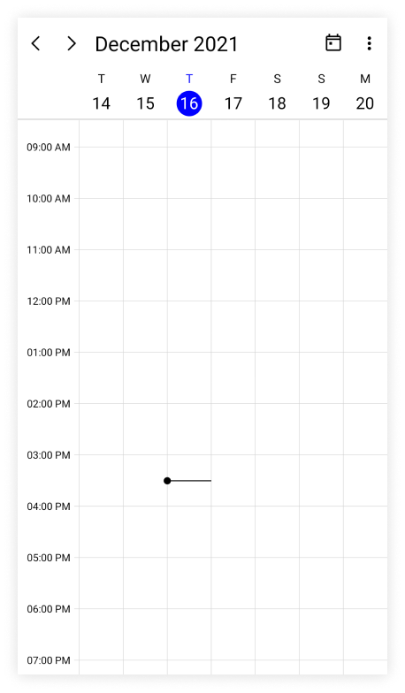
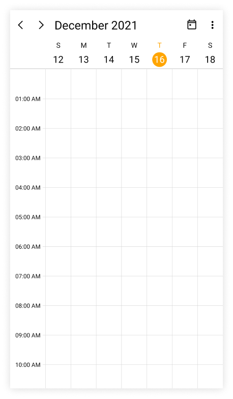
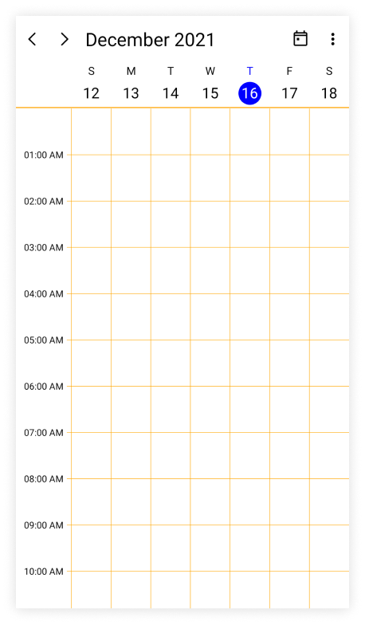
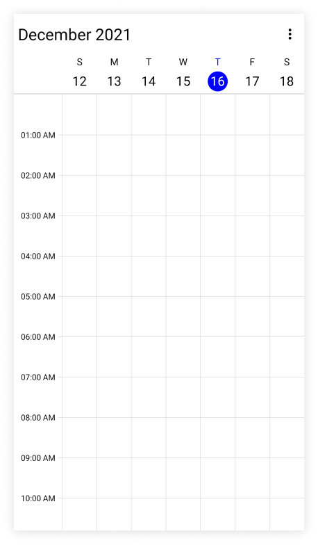
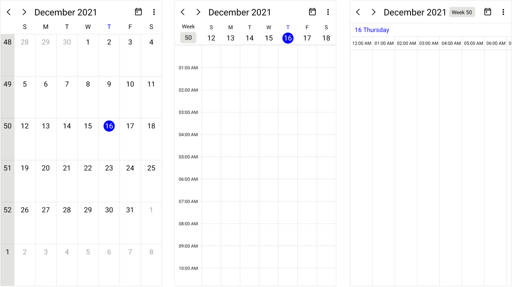
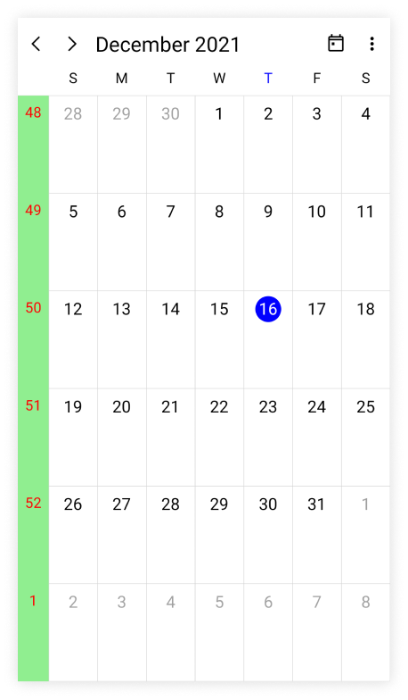

## Change first day of week

The scheduler allows customization on the first day of the week with the [FirstDayOfWeek](https://help.syncfusion.com/cr/maui/Syncfusion.Maui.Scheduler.SfScheduler.html#Syncfusion_Maui_Scheduler_SfScheduler_FirstDayOfWeek) property. The Scheduler will default to `Sunday` as the first day of the week.

The following code shows the Scheduler with `Tuesday` as the first day of the week.

  


<scheduler:SfScheduler x:Name="scheduler" FirstDayOfWeek="Tuesday"/>




SfScheduler scheduler = new SfScheduler();
scheduler.FirstDayOfWeek = DayOfWeek.Tuesday;
this.Content = scheduler;

  
  

## Today highlight brush

The today highlight brush of Scheduler can be customized by using the [TodayHighlightBrush](https://help.syncfusion.com/cr/maui/Syncfusion.Maui.Scheduler.SfScheduler.html#Syncfusion_Maui_Scheduler_SfScheduler_TodayHighlightBrush) property in the [SfScheduler](https://help.syncfusion.com/cr/maui/Syncfusion.Maui.Scheduler.SfScheduler.html), which will highlight the today's circle and text in Scheduler view header and month cell.

  


<scheduler:SfScheduler x:Name="scheduler" TodayHighlightBrush="Orange"/>




SfScheduler scheduler = new SfScheduler();
scheduler.TodayHighlightBrush = Brush.Orange;
this.Content = scheduler;

  
 

## Cell border brush

The vertical and horizontal line color of the Scheduler can be customized by using the [CellBorderBrush](https://help.syncfusion.com/cr/maui/Syncfusion.Maui.Scheduler.SfScheduler.html#Syncfusion_Maui_Scheduler_SfScheduler_CellBorderBrush) property in the [SfScheduler](https://help.syncfusion.com/cr/maui/Syncfusion.Maui.Scheduler.SfScheduler.html).

  


<scheduler:SfScheduler x:Name="scheduler" CellBorderBrush="Orange"/>




SfScheduler scheduler = new SfScheduler();
scheduler.CellBorderBrush = Brush.Orange;
this.Content = scheduler;

  
 

## Background color

The Scheduler background color can be customized by using the `BackgroundColor` property in the [SfScheduler](https://help.syncfusion.com/cr/maui/Syncfusion.Maui.Scheduler.SfScheduler.html).

  


<scheduler:SfScheduler x:Name="scheduler" BackgroundColor="LightBlue"/>




SfScheduler scheduler = new SfScheduler();
scheduler.BackgroundColor = Colors.LightBlue;
this.Content = scheduler;

  


## Show navigation arrow

By Using the [ShowNavigationArrows](https://help.syncfusion.com/cr/maui/Syncfusion.Maui.Scheduler.SfScheduler.html#Syncfusion_Maui_Scheduler_SfScheduler_ShowNavigationArrows) property of the [SfScheduler](https://help.syncfusion.com/cr/maui/Syncfusion.Maui.Scheduler.SfScheduler.html), you can navigate to the previous or next views of the Scheduler. By default, the value `ShowNavigationArrows` is `true,` which displays the navigation icons and `Today` button in the header view. It allows to quickly navigate to today and previous or next views.

  


<scheduler:SfScheduler x:Name="scheduler" ShowNavigationArrows="False"/>




SfScheduler scheduler = new SfScheduler();
scheduler.ShowNavigationArrows = false;
this.Content = scheduler;

  


## Show week number

Display the week number of the year in all Scheduler views of the [SfScheduler](https://help.syncfusion.com/cr/maui/Syncfusion.Maui.Scheduler.SfScheduler.html) by setting the [ShowWeekNumber](https://help.syncfusion.com/cr/maui/Syncfusion.Maui.Scheduler.SfScheduler.html#Syncfusion_Maui_Scheduler_SfScheduler_ShowWeekNumber) property as `true` and by default it is `false.` The Week numbers will be displayed based on the ISO standard.

  


<scheduler:SfScheduler x:Name="scheduler" ShowWeekNumber="True"/>




SfScheduler scheduler = new SfScheduler();
scheduler.ShowWeekNumber = true;
this.Content = scheduler;

  


N> This property will not be applicable for the `SchedulerView` is `Timeline Month.`

#### Customize the week number text style

The Week number text style of the Scheduler can be customized by using the [WeekNumberStyle](https://help.syncfusion.com/cr/maui/Syncfusion.Maui.Scheduler.SfScheduler.html#Syncfusion_Maui_Scheduler_SfScheduler_WeekNumberStyle) property and it allows to customize the [TextStyle](https://help.syncfusion.com/cr/maui/Syncfusion.Maui.Scheduler.SchedulerWeekNumberStyle.html#Syncfusion_Maui_Scheduler_SchedulerWeekNumberStyle_TextStyle) and the [Background](https://help.syncfusion.com/cr/maui/Syncfusion.Maui.Scheduler.SchedulerWeekNumberStyle.html#Syncfusion_Maui_Scheduler_SchedulerWeekNumberStyle_Background) color in the Week number of the [SfScheduler](https://help.syncfusion.com/cr/maui/Syncfusion.Maui.Scheduler.SfScheduler.html).

  


<scheduler:SfScheduler x:Name="scheduler" ShowWeekNumber="True"/>




SfScheduler scheduler = new SfScheduler();
scheduler.ShowWeekNumber = true;

var schedulerTextStyle = new SchedulerTextStyle()
{
    TextColor = Colors.Red,
    FontSize = 14
};

var schedulerWeekNumberStyle = new SchedulerWeekNumberStyle()
{
    Background = Brush.LightGreen,
    TextStyle = schedulerTextStyle
};

scheduler.WeekNumberStyle = schedulerWeekNumberStyle;
this.Content = scheduler;




N> It is not applicable if the `View` is `Timeline Month` and it is applied only when the `ShowWeekNumber` property is `enabled.`

N> You can refer to our [.NET MAUI Scheduler](https://www.syncfusion.com/maui-controls/maui-scheduler) feature tour page for its groundbreaking feature representations. You can also explore our [.NET MAUI Scheduler Example](https://github.com/syncfusion/maui-demos/tree/master/MAUI/Scheduler) that shows you how to render the Scheduler in .NET MAUI.
