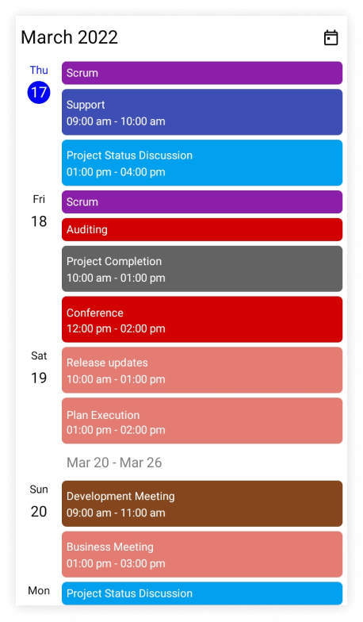
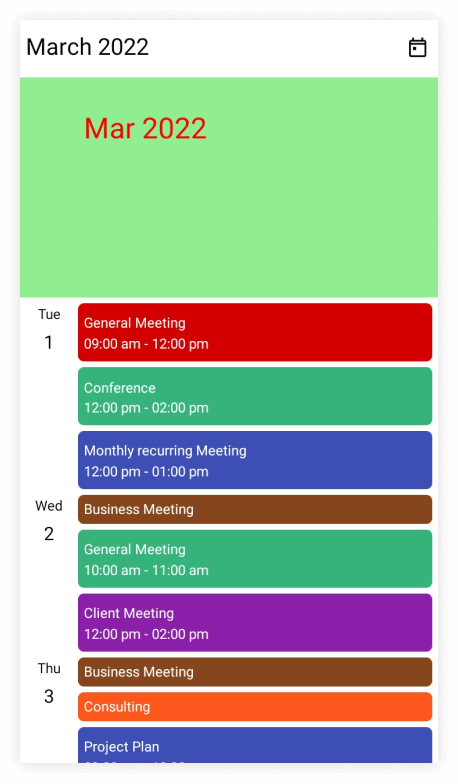
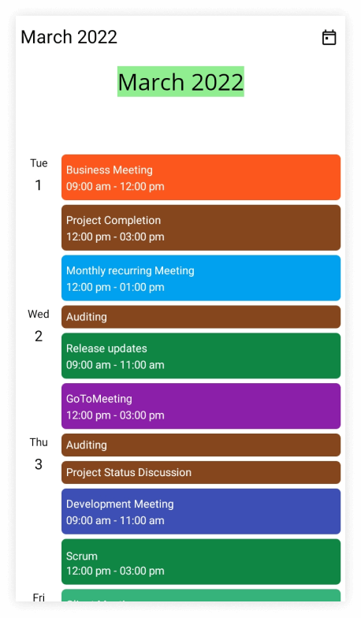
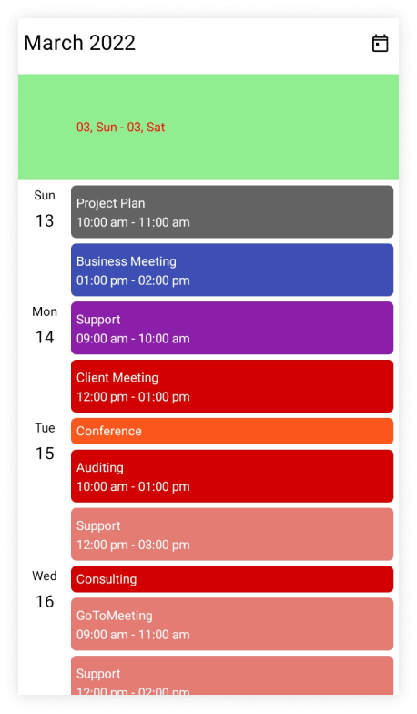
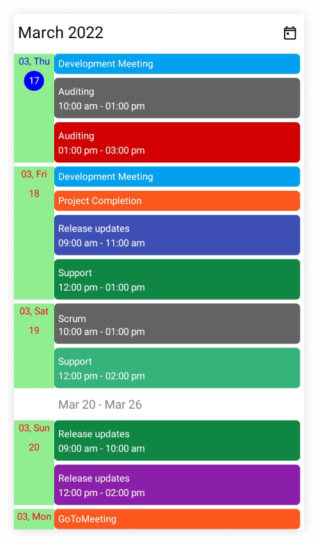
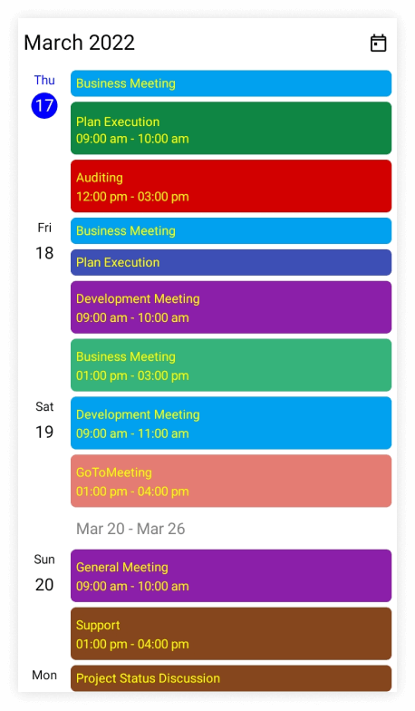

# Agenda view in .NET MAUI Scheduler (SfScheduler)

The agenda view displays the events or appointments (normal appointments, all-day appointments, recurring appointments, and span appointments) in chronological order, grouped by date between the minimum and maximum dates and the current date displayed by default. When the [AppointmentsSource](https://help.syncfusion.com/cr/maui/Syncfusion.Maui.Scheduler.SfScheduler.html#Syncfusion_Maui_Scheduler_SfScheduler_AppointmentsSource) property of [SfScheduler](https://help.syncfusion.com/cr/maui/Syncfusion.Maui.Scheduler.SfScheduler.html) is `null`, the agenda view will show only the month, week, and date headers for mobile view and responsive UI, and for desktop UI it will display only the date header of display date.

A agenda view displays different UI for mobile and desktop, for mobile it displays the month header, the week header, and the date header, whereas for desktop, it displays the appointment only.

N> When the desktop view width is less than 600, the scheduler will display the mobile agenda UI on the desktop.









this.Scheduler.View = SchedulerView.Agenda;
// Creating an instance for the scheduler appointment collection.
var appointments = new ObservableCollection<SchedulerAppointment>();
// Adding scheduler appointment in the scheduler appointment collection.
appointments.Add(new SchedulerAppointment()
{
    Subject = "Meeting",
    StartTime = DateTime.Now,
    EndTime = DateTime.Now.AddHours(1),
    Background = Brush.Orange,
});
// Adding scheduler appointment into the AppointmentsSource.
this.Scheduler.AppointmentsSource = appointments;




## Month header appearance customization

The agenda month header view can be customized by using the [MonthHeaderSettings](https://help.syncfusion.com/cr/maui/Syncfusion.Maui.Scheduler.SchedulerAgendaView.html#Syncfusion_Maui_Scheduler_SchedulerAgendaView_MonthHeaderSettings) property of [AgendaView](https://help.syncfusion.com/cr/maui/Syncfusion.Maui.Scheduler.SchedulerAgendaView.html) in the [SfScheduler](https://help.syncfusion.com/cr/maui/Syncfusion.Maui.Scheduler.SfScheduler.html).

#### Customize month header appearance using style

You can style the date format, height, text style, and background color by using the properties such as [DateFormat](https://help.syncfusion.com/cr/maui/Syncfusion.Maui.Scheduler.SchedulerMonthHeaderSettings.html#Syncfusion_Maui_Scheduler_SchedulerMonthHeaderSettings_DateFormat), [Height](https://help.syncfusion.com/cr/maui/Syncfusion.Maui.Scheduler.SchedulerMonthHeaderSettings.html#Syncfusion_Maui_Scheduler_SchedulerMonthHeaderSettings_Height), [TextStyle](https://help.syncfusion.com/cr/maui/Syncfusion.Maui.Scheduler.SchedulerMonthHeaderSettings.html#Syncfusion_Maui_Scheduler_SchedulerMonthHeaderSettings_TextStyle), and [Background](https://help.syncfusion.com/cr/maui/Syncfusion.Maui.Scheduler.SchedulerMonthHeaderSettings.html#Syncfusion_Maui_Scheduler_SchedulerMonthHeaderSettings_Background) properties of [MonthHeaderSettings](https://help.syncfusion.com/cr/maui/Syncfusion.Maui.Scheduler.SchedulerAgendaView.html#Syncfusion_Maui_Scheduler_SchedulerAgendaView_MonthHeaderSettings).




 <scheduler:SfScheduler x:Name="Scheduler"
                        View="Agenda">
    <scheduler:SfScheduler.AgendaView>
        <scheduler:SchedulerAgendaView>
            <scheduler:SchedulerAgendaView.MonthHeaderSettings>
                <scheduler:SchedulerMonthHeaderSettings DateFormat="MMM yyy"
                                                        Height="200"
                                                        Background="LightGreen" />
            </scheduler:SchedulerAgendaView.MonthHeaderSettings>
        </scheduler:SchedulerAgendaView>
    </scheduler:SfScheduler.AgendaView>
 </scheduler:SfScheduler>




this.Scheduler.View = SchedulerView.Agenda;
var textStyle = new SchedulerTextStyle()
{
    TextColor = Colors.Red,
    FontSize = 25,
};

this.Scheduler.AgendaView.MonthHeaderSettings.DateFormat = "MMM yyy";
this.Scheduler.AgendaView.MonthHeaderSettings.Height = 200;
this.Scheduler.AgendaView.MonthHeaderSettings.TextStyle = textStyle;
this.Scheduler.AgendaView.MonthHeaderSettings.Background = Brush.LightGreen;




#### Customize month header appearance using DataTemplate

You can customize the month header appearance of scheduler by using the [MonthHeaderTemplate](https://help.syncfusion.com/cr/maui/Syncfusion.Maui.Scheduler.SchedulerAgendaView.html#Syncfusion_Maui_Scheduler_SchedulerAgendaView_MonthHeaderTemplate) property of [AgendaView](https://help.syncfusion.com/cr/maui/Syncfusion.Maui.Scheduler.SchedulerAgendaView.html).




  <scheduler:SfScheduler x:Name="Scheduler"
                         View="Agenda">
    <scheduler:SfScheduler.AgendaView>
        <scheduler:SchedulerAgendaView>
            <scheduler:SchedulerAgendaView.MonthHeaderTemplate>
                <DataTemplate>
                    <Grid>
                        <Label x:Name="label" HorizontalOptions="Center" Background="LightGreen" VerticalOptions="Center" TextColor="Black" FontSize="25"  Text="{Binding StringFormat='{0:MMMM yyyy}'}" />
                    </Grid>
                </DataTemplate>
            </scheduler:SchedulerAgendaView.MonthHeaderTemplate>
        </scheduler:SchedulerAgendaView>
    </scheduler:SfScheduler.AgendaView>
 </scheduler:SfScheduler>




N> 
* The default values for `DateFormat` and `Height` are `MMMM yyyy` and `150,` respectively.
* For desktop UI, The agenda view displays the appointment only.

#### Customize month header appearance using DataTemplateSelector

You can customize the month header appearance by using the [MonthHeaderTemplate](https://help.syncfusion.com/cr/maui/Syncfusion.Maui.Scheduler.SchedulerAgendaView.html#Syncfusion_Maui_Scheduler_SchedulerAgendaView_MonthHeaderTemplate) property of [AgendaView](https://help.syncfusion.com/cr/maui/Syncfusion.Maui.Scheduler.SchedulerAgendaView.html) in the [SfScheduler](https://help.syncfusion.com/cr/maui/Syncfusion.Maui.Scheduler.SfScheduler.html). The `DataTemplateSelector` can choose a `DataTemplate` at runtime based on the value of a data-bound to month header by using the `MonthHeaderTemplate.` It allows you to choose a different data template for each month header, as well as customize the appearance of a particular month header based on certain conditions.




<Grid>
    <Grid.Resources>
        <DataTemplate x:Key="todayDateTemplate">
            <Grid>
                <Label x:Name="label" HorizontalOptions="Center" Background="MediumPurple" VerticalOptions="Center" TextColor="Yellow" FontSize="25"  Text="{Binding StringFormat='{0:MMMM yyyy}'}" />
            </Grid>
        </DataTemplate>
        <DataTemplate x:Key="normalDateTemplate">
            <Grid>
                <Label x:Name="label" HorizontalOptions="Center" Background="MediumPurple" VerticalOptions="Center" TextColor="White" FontSize="25"  Text="{Binding StringFormat='{0:MMMM yyyy}'}" />
            </Grid>
        </DataTemplate>
        <local:AgendaViewTemplateSelector x:Key="agendaViewTemplateSelector" TodayDateTemplate="{StaticResource todayDateTemplate}" NormalDateTemplate="{StaticResource normalDateTemplate}"/>
    </Grid.Resources>
    <scheduler:SfScheduler x:Name="Scheduler" 
                           View="Agenda" >
        <scheduler:SfScheduler.AgendaView>
            <scheduler:SchedulerAgendaView MonthHeaderTemplate="{StaticResource agendaViewTemplateSelector}" />
        </scheduler:SfScheduler.AgendaView>
    </scheduler:SfScheduler>
 </Grid>




public class AgendaViewTemplateSelector : DataTemplateSelector
{
    public AgendaViewTemplateSelector()
    {
    }
    public DataTemplate NormalDateTemplate { get; set; }
    public DataTemplate TodayDateTemplate { get; set; }
    protected override DataTemplate OnSelectTemplate(object item, BindableObject container)
    {
        var dateTime = (DateTime)item;
        if (dateTime.Month == DateTime.Today.Month)
            return TodayDateTemplate;
        else
            return NormalDateTemplate;
    }
}

  


this.Scheduler.View = SchedulerView.Agenda;

 


N>
* The default value for `DateFormat` and `Height` are `MMMM yyyy` and `150,` respectively.
* For desktop UI, The agenda view displays the appointment only.
* When using data template selector, performance issues occur as the conversion template views take time within the framework.

## Week header appearance customization

The agenda week header view can be customized by using the [WeekHeaderSettings](https://help.syncfusion.com/cr/maui/Syncfusion.Maui.Scheduler.SchedulerAgendaView.html#Syncfusion_Maui_Scheduler_SchedulerAgendaView_WeekHeaderSettings) property of [AgendaView](https://help.syncfusion.com/cr/maui/Syncfusion.Maui.Scheduler.SchedulerAgendaView.html) in the [SfScheduler](https://help.syncfusion.com/cr/maui/Syncfusion.Maui.Scheduler.SfScheduler.html).

You can style the date format, height, text style, and background color by using the properties such as [DateFormat](https://help.syncfusion.com/cr/maui/Syncfusion.Maui.Scheduler.SchedulerWeekHeaderSettings.html#Syncfusion_Maui_Scheduler_SchedulerWeekHeaderSettings_DateFormat), [Height](https://help.syncfusion.com/cr/maui/Syncfusion.Maui.Scheduler.SchedulerWeekHeaderSettings.html#Syncfusion_Maui_Scheduler_SchedulerWeekHeaderSettings_Height), [TextStyle](https://help.syncfusion.com/cr/maui/Syncfusion.Maui.Scheduler.SchedulerWeekHeaderSettings.html#Syncfusion_Maui_Scheduler_SchedulerWeekHeaderSettings_TextStyle), and [Background](https://help.syncfusion.com/cr/maui/Syncfusion.Maui.Scheduler.SchedulerWeekHeaderSettings.html#Syncfusion_Maui_Scheduler_SchedulerWeekHeaderSettings_Background) properties of [WeekHeaderSettings](https://help.syncfusion.com/cr/maui/Syncfusion.Maui.Scheduler.SchedulerAgendaView.html#Syncfusion_Maui_Scheduler_SchedulerAgendaView_WeekHeaderSettings).




 <scheduler:SfScheduler x:Name="Scheduler"
                        View="Agenda">
    <scheduler:SfScheduler.AgendaView>
        <scheduler:SchedulerAgendaView>
            <scheduler:SchedulerAgendaView.WeekHeaderSettings>
                <scheduler:SchedulerWeekHeaderSettings  DateFormat="MM, ddd"
                                                        Height="100"
                                                        Background="LightGreen" />
            </scheduler:SchedulerAgendaView.WeekHeaderSettings>
        </scheduler:SchedulerAgendaView>
    </scheduler:SfScheduler.AgendaView>
 </scheduler:SfScheduler>




this.Scheduler.View = SchedulerView.Agenda;
var textStyle = new SchedulerTextStyle()
{
    TextColor = Colors.Red,
    FontSize = 12,
};

this.Scheduler.AgendaView.WeekHeaderSettings.DateFormat = "MM, ddd";
this.Scheduler.AgendaView.WeekHeaderSettings.Height = 100;
this.Scheduler.AgendaView.WeekHeaderSettings.TextStyle = textStyle;
this.Scheduler.AgendaView.WeekHeaderSettings.Background = Brush.LightGreen;




N> 
* The default value for `DateFormat,` and `Height` are `MMM dd,` and `30` respectively.
* For desktop UI, The agenda view displays the appointment only.

## Day header appearance customization

The agenda day header view can be customized by using the [DayHeaderSettings](https://help.syncfusion.com/cr/maui/Syncfusion.Maui.Scheduler.SchedulerAgendaView.html#Syncfusion_Maui_Scheduler_SchedulerAgendaView_DayHeaderSettings) property of [AgendaView](https://help.syncfusion.com/cr/maui/Syncfusion.Maui.Scheduler.SchedulerAgendaView.html) in the [SfScheduler](https://help.syncfusion.com/cr/maui/Syncfusion.Maui.Scheduler.SfScheduler.html).

You can style the day format, day text style, date text style, and background color by using the properties such as [DayFormat](https://help.syncfusion.com/cr/maui/Syncfusion.Maui.Scheduler.SchedulerDayHeaderSettings.html#Syncfusion_Maui_Scheduler_SchedulerDayHeaderSettings_DayFormat), [DayTextStyle](https://help.syncfusion.com/cr/maui/Syncfusion.Maui.Scheduler.SchedulerDayHeaderSettings.html#Syncfusion_Maui_Scheduler_SchedulerDayHeaderSettings_DayTextStyle), [DateTextStyle](https://help.syncfusion.com/cr/maui/Syncfusion.Maui.Scheduler.SchedulerDayHeaderSettings.html#Syncfusion_Maui_Scheduler_SchedulerDayHeaderSettings_DateTextStyle), and [Background](https://help.syncfusion.com/cr/maui/Syncfusion.Maui.Scheduler.SchedulerDayHeaderSettings.html#Syncfusion_Maui_Scheduler_SchedulerDayHeaderSettings_Background) properties of [DayHeaderSettings](https://help.syncfusion.com/cr/maui/Syncfusion.Maui.Scheduler.SchedulerAgendaView.html#Syncfusion_Maui_Scheduler_SchedulerAgendaView_DayHeaderSettings).




 <scheduler:SfScheduler x:Name="Scheduler"
                        View="Agenda">
    <scheduler:SfScheduler.AgendaView>
        <scheduler:SchedulerAgendaView>
            <scheduler:SchedulerAgendaView.DayHeaderSettings>
                <scheduler:SchedulerDayHeaderSettings DayFormat="MM, ddd"
                                                      Background="LightGreen"/>
            </scheduler:SchedulerAgendaView.DayHeaderSettings>
        </scheduler:SchedulerAgendaView>
    </scheduler:SfScheduler.AgendaView>
 </scheduler:SfScheduler>




this.Scheduler.View = SchedulerView.Agenda;
var textStyle = new SchedulerTextStyle()
{
    TextColor = Colors.Red,
    FontSize = 12,
};

this.Scheduler.AgendaView.DayHeaderSettings.DayFormat = "MM, ddd";
this.Scheduler.AgendaView.DayHeaderSettings.DayTextStyle = textStyle;
this.Scheduler.AgendaView.DayHeaderSettings.DateTextStyle = textStyle;
this.Scheduler.AgendaView.DayHeaderSettings.Background = Brush.LightGreen;




N> The default value of `DayFormat` is `MMM, ddd.`

## Appointment text appearance customization

The appointment text style can be customized by using the [AppointmentTextStyle](https://help.syncfusion.com/cr/maui/Syncfusion.Maui.Scheduler.SfScheduler.html#Syncfusion_Maui_Scheduler_SfScheduler_AppointmentTextStyle) property of the [SfScheduler](https://help.syncfusion.com/cr/maui/Syncfusion.Maui.Scheduler.SfScheduler.html).









this.Scheduler.View = SchedulerView.Agenda;
// Creating an instance for the scheduler appointment collection.
var appointments = new ObservableCollection<SchedulerAppointment>();
// Adding scheduler appointment in the scheduler appointment collection.
appointments.Add(new SchedulerAppointment()
{
    Subject = "Meeting",
    StartTime = DateTime.Now,
    EndTime = DateTime.Now.AddHours(1),
    RecurrenceRule = "FREQ=DAILY;INTERVAL=1",
    Background = Brush.Orange,
});
// Adding scheduler appointment into the AppointmentsSource.
this.Scheduler.AppointmentsSource = appointments;
// Creating the text style for the appointments.
var appointmentTextStyle = new SchedulerTextStyle()
{
    TextColor = Colors.White,
    FontSize = 12,
};
// Setting the text style for the appointments.
this.Scheduler.AppointmentTextStyle = appointmentTextStyle;




## No Events text color customization
The No events text style can be customized by using the NoEventsTextStyle property of [SfScheduler](https://help.syncfusion.com/cr/maui/Syncfusion.Maui.Scheduler.SfScheduler.html).




<scheduler:SfScheduler x:Name="scheduler"
                       View="Agenda"
                       AllowedViews="Day, Agenda">
    <scheduler:SfScheduler.AgendaView>
        <scheduler:SchedulerAgendaView>
            <scheduler:SchedulerAgendaView.NoEventsTextStyle>
                <scheduler:SchedulerTextStyle TextColor="DarkSlateGrey" FontAttributes="Italic" FontSize="15"/>
            </scheduler:SchedulerAgendaView.NoEventsTextStyle>
        </scheduler:SchedulerAgendaView>
    </scheduler:SfScheduler.AgendaView>
</scheduler:SfScheduler>




 // Customizing the No events text style in agenda view
 var textStyle = new SchedulerTextStyle()
 {
     TextColor = Colors.DarkSlateGrey,
     FontAttributes = FontAttributes.Italic,
     FontSize = 15,
     FontAutoScalingEnabled = true
 };
// Setting the TextStyle for the NoEvets text.
 this.scheduler.AgendaView.NoEventsTextStyle = textStyle;


       

N> When there is No appointments in Current Date and [DisplayDate](https://help.syncfusion.com/cr/maui/Syncfusion.Maui.Scheduler.SfScheduler.html#Syncfusion_Maui_Scheduler_SfScheduler_DisplayDate) of the scheduler [AgendaView](https://help.syncfusion.com/cr/maui/Syncfusion.Maui.Scheduler.SchedulerAgendaView.html), No Events Text will appear.

## Change the appointment time format

You can customize the appointment time format of the scheduler by using the [AppointmentTimeFormat](https://help.syncfusion.com/cr/maui/Syncfusion.Maui.Scheduler.SchedulerAgendaView.html#Syncfusion_Maui_Scheduler_SchedulerAgendaView_AppointmentTimeFormat) property of [AgendaView](https://help.syncfusion.com/cr/maui/Syncfusion.Maui.Scheduler.SchedulerAgendaView.html).




 <scheduler:SfScheduler x:Name="Scheduler" 
                        View="Agenda">
    <scheduler:SfScheduler.AgendaView>
        <scheduler:SchedulerAgendaView AppointmentTimeFormat="HH:mm:tt"/>
    </scheduler:SfScheduler.AgendaView>
 </scheduler:SfScheduler>




SfScheduler scheduler = new SfScheduler();
scheduler.View = SchedulerView.Agenda;
scheduler.AgendaView.AppointmentTimeFormat = "HH:mm:tt";
this.Content = scheduler;




## Agenda appointment template 

The Syncfusion .NET MAUI Scheduler allows users to customize the visual representation of agenda appointments by defining data templates, enhancing usability within the application. Users can customize the appointment text, icon, image, or view based on their needs and appointment details.




<Grid>
    <Grid.Resources>
        <DataTemplate x:Key="mainTemplate">
            <Grid Background = "Purple" HeightRequest="30" >
                <Label HorizontalTextAlignment="Center" VerticalTextAlignment="Center" TextColor="Black" Text="Client Meeting"/>
            </Grid>
        </DataTemplate>
    </Grid.Resources>
    <Scheduler:SfScheduler x:Name="DataTemplateScheduler"
                           View="Agenda">
        <Scheduler:SfScheduler.AgendaView>
            <Scheduler:SchedulerAgendaView AppointmentTemplate="{StaticResource mainTemplate}">
                <Scheduler:SchedulerAgendaView.MonthHeaderTemplate>
                    <DataTemplate>
                        <Grid>
                            <Label x:Name="label"
                                   HorizontalOptions="Center"
                                   Background="MediumPurple"
                                   VerticalOptions="Center"
                                   TextColor="White"
                                   FontSize="25"
                                   Text="{Binding StringFormat='{0:MMMM yyyy}'}" />
                        </Grid>
                    </DataTemplate>
                </Scheduler:SchedulerAgendaView.MonthHeaderTemplate>
            </Scheduler:SchedulerAgendaView>
        </Scheduler:SfScheduler.AgendaView>
    </Scheduler:SfScheduler>
</Grid>




N>
* By default, the [SchedulerAppointment](https://help.syncfusion.com/cr/maui/Syncfusion.Maui.Scheduler.SchedulerAppointment.html) is set as the `BindingContext` for [AppointmentTemplate](https://help.syncfusion.com/cr/maui/Syncfusion.Maui.Scheduler.SchedulerAgendaView.html#Syncfusion_Maui_Scheduler_SchedulerAgendaView_AppointmentTemplate) for both [SchedulerAppointment](https://help.syncfusion.com/cr/maui/Syncfusion.Maui.Scheduler.SchedulerAppointment.html) and custom data object in `AppointmentsSource.`
* The Custom data object can be bound in [AppointmentTemplate](https://help.syncfusion.com/cr/maui/Syncfusion.Maui.Scheduler.SchedulerAgendaView.html#Syncfusion_Maui_Scheduler_SchedulerAgendaView_AppointmentTemplate) by using `SchedulerAppointment.DataItem.`