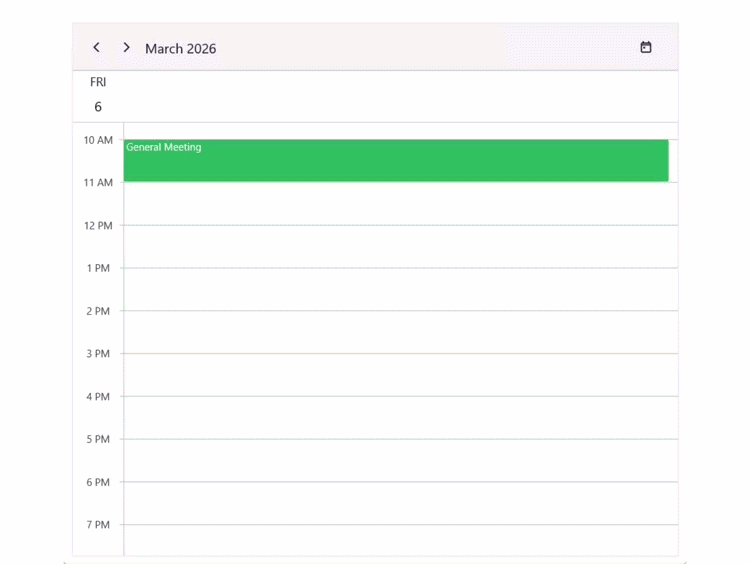
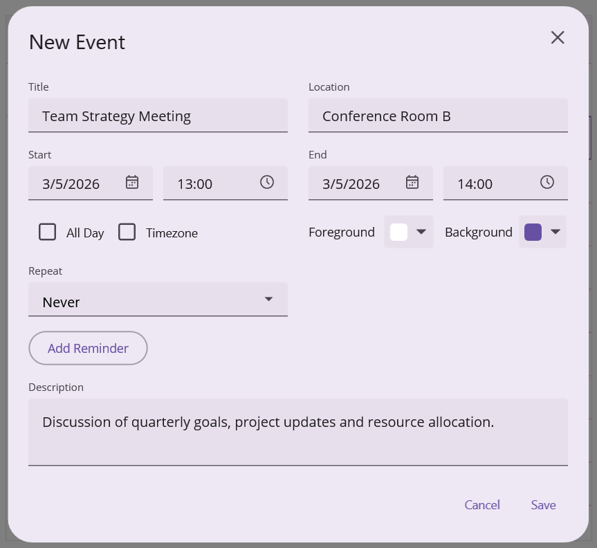
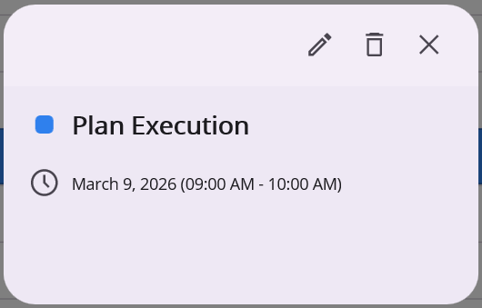
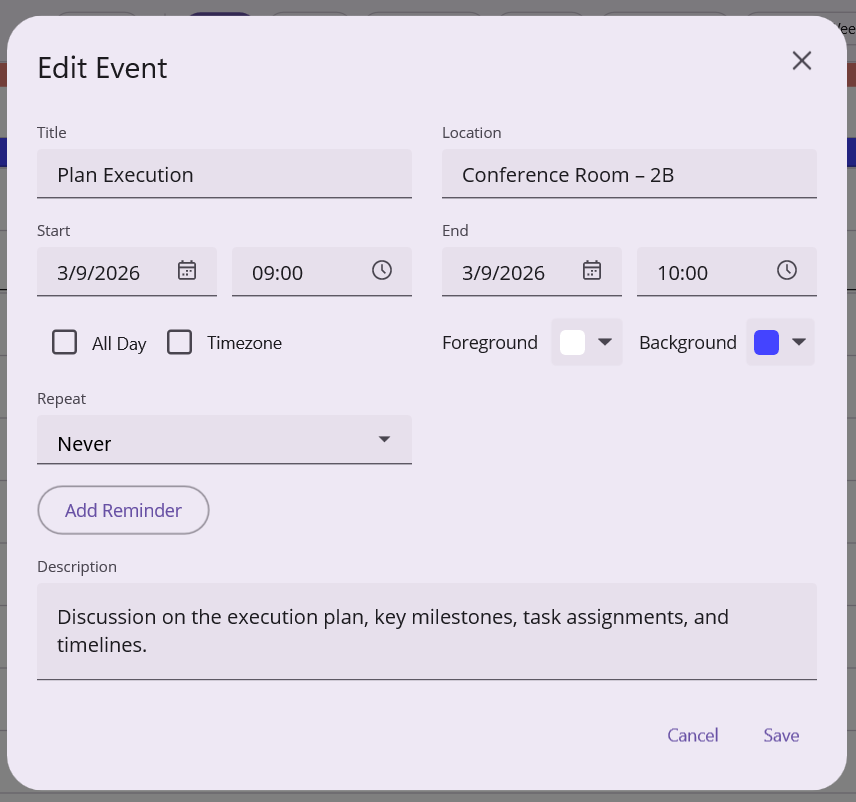
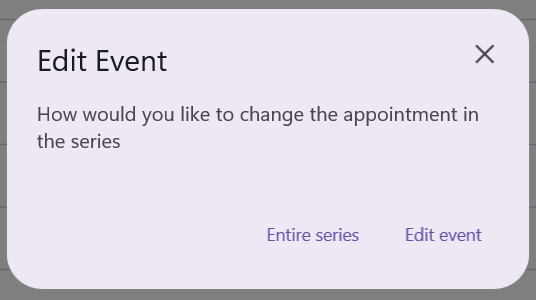

# Appointment Editor in .NET MAUI Scheduler (SfScheduler)

The Appointment Editor is a popup dialog used for adding, editing, or deleting appointments in the Scheduler. It provides fields for entering detailed event information, along with options for color customization, recurrence configuration, and timezone selection. The editor can be opened by double‑tapping a time slot or an existing appointment.

You can control when the editor is available by using the [AppointmentEditorMode](https://help.syncfusion.com/cr/maui/Syncfusion.Maui.Scheduler.AppointmentEditorMode.html) property:

- [Add](https://help.syncfusion.com/cr/maui/Syncfusion.Maui.Scheduler.AppointmentEditorMode.html#Syncfusion_Maui_Scheduler_AppointmentEditorMode_Add) – Allows users to create new appointments.
- [Edit](https://help.syncfusion.com/cr/maui/Syncfusion.Maui.Scheduler.AppointmentEditorMode.html#Syncfusion_Maui_Scheduler_AppointmentEditorMode_Edit) – Allows users to modify existing appointments.
- [None](https://help.syncfusion.com/cr/maui/Syncfusion.Maui.Scheduler.AppointmentEditorMode.html#Syncfusion_Maui_Scheduler_AppointmentEditorMode_None) – Disables the editor entirely.

By default, `AppointmentEditorMode` is set to `None`. To enable the Appointment Editor for user interaction, set the AppointmentEditorMode property to `Add`, `Edit`, or both.



<ContentPage xmlns="http://schemas.microsoft.com/dotnet/2021/maui"
             xmlns:x="http://schemas.microsoft.com/winfx/2009/xaml"
             xmlns:scheduler="clr-namespace:Syncfusion.Maui.Scheduler;assembly=Syncfusion.Maui.Scheduler"
             x:Class="GettingStarted.MainPage">
    <scheduler:SfScheduler x:Name="scheduler"
                           View="Day"
                           AppointmentEditorMode="Add,Edit">
    </scheduler:SfScheduler>
</ContentPage>


using Syncfusion.Maui.Scheduler;

namespace GettingStarted
{
    public partial class MainPage : ContentPage
    {
        public MainPage()
        {
            InitializeComponent();
            this.scheduler.AppointmentEditorMode = AppointmentEditorMode.Add | AppointmentEditorMode.Edit;
        }
    }
}



## Adding Appointments

Appointments can be created using the appointment editor window.
 
Double-tapping a time slot opens the editor, where appointment details can be entered and saved.
 
To allow appointment creation, configure the [AppointmentEditorMode](https://help.syncfusion.com/cr/maui/Syncfusion.Maui.Scheduler.AppointmentEditorMode.html) property with the `Add` option. If the `AppointmentEditorMode` does not include `Add`, double‑tapping a time slot will not open the editor.



<ContentPage xmlns="http://schemas.microsoft.com/dotnet/2021/maui"
             xmlns:x="http://schemas.microsoft.com/winfx/2009/xaml"
             xmlns:scheduler="clr-namespace:Syncfusion.Maui.Scheduler;assembly=Syncfusion.Maui.Scheduler"
             x:Class="GettingStarted.MainPage">
    <scheduler:SfScheduler x:Name="scheduler"
                           View="Day"
                           AppointmentEditorMode="Add">
    </scheduler:SfScheduler>
</ContentPage>


using Syncfusion.Maui.Scheduler;

namespace GettingStarted
{
    public partial class MainPage : ContentPage
    {
        public MainPage()
        {
            InitializeComponent();
            this.scheduler.AppointmentEditorMode = AppointmentEditorMode.Add;
        }
    }
}



## Editing Appointment

Existing appointments can be modified through the appointment editor. To allow editing, set the [AppointmentEditorMode](https://help.syncfusion.com/cr/maui/Syncfusion.Maui.Scheduler.AppointmentEditorMode.html) to `Edit`.



<ContentPage xmlns="http://schemas.microsoft.com/dotnet/2021/maui"
             xmlns:x="http://schemas.microsoft.com/winfx/2009/xaml"
             xmlns:scheduler="clr-namespace:Syncfusion.Maui.Scheduler;assembly=Syncfusion.Maui.Scheduler"
             x:Class="GettingStarted.MainPage">
    <scheduler:SfScheduler x:Name="scheduler"
                           View="Day"
                           AppointmentEditorMode="Edit">
    </scheduler:SfScheduler>
</ContentPage>


using Syncfusion.Maui.Scheduler;

namespace GettingStarted
{
    public partial class MainPage : ContentPage
    {
        public MainPage()
        {
            InitializeComponent();
            this.scheduler.AppointmentEditorMode = AppointmentEditorMode.Edit;
        }
    }
}


 
Double-tapping an appointment displays a dialog that shows the appointment details such as subject and time. The dialog includes the following options:
 
- **Edit** – Opens the appointment editor to modify the appointment.
- **Delete** – Deletes the appointment.
- **Close** – Closes the dialog.

 
Selecting `Edit` opens the editor filled in with the current appointment details. After making changes, select `Save` to update the appointment or `Cancel` to discard changes.

 
When the scheduler is bound to a data source, the updated values are automatically reflected in the underlying data object.



<ContentPage xmlns="http://schemas.microsoft.com/dotnet/2021/maui"
             xmlns:x="http://schemas.microsoft.com/winfx/2009/xaml"
             xmlns:scheduler="clr-namespace:Syncfusion.Maui.Scheduler;assembly=Syncfusion.Maui.Scheduler"
             x:Class="GettingStarted.MainPage">
    <scheduler:SfScheduler x:Name="scheduler"
                           View="Day"
                           AppointmentEditorMode="Add,Edit"
                           ItemsSource="{Binding Appointments}">
        <scheduler:SfScheduler.Appointments>
            <scheduler:SchedulerAppointmentMapping
                     Subject="EventName"
                     StartTime="From"
                     EndTime="To" />
        </scheduler:SfScheduler.Appointments>
    </scheduler:SfScheduler>
</ContentPage>


using Syncfusion.Maui.Scheduler;
using System.Collections.ObjectModel;

namespace GettingStarted
{
    public partial class MainPage : ContentPage
    {
        public MainPage()
        {
            InitializeComponent();
            var appointments = new ObservableCollection<SchedulerAppointment>();
            // Assign SchedulerAppointment properties (Subject, StartTime, EndTime, etc.)
            this.scheduler.ItemsSource = appointments;
        }
    }
}



### Editing recurring appointment

When editing a recurring appointment, a dialog appears requesting confirmation on whether to modify:
 
- The entire series, or
- Only the selected occurrence

 
After selecting the required option, the appointment editor opens with the corresponding appointment details. Changes can then be applied to either the entire series or the selected occurrence.

## Events

### Appointment Editor Opening

The [AppointmentEditorOpening](https://help.syncfusion.com/cr/maui/Syncfusion.Maui.Scheduler.SfScheduler.html#Syncfusion_Maui_Scheduler_SfScheduler_AppointmentEditorOpening) event is raised before the appointment editor dialog appears. It occurs when an appointment is double‑tapped for modification or when a time slot is double‑tapped to create a new appointment. Set the event args' `Cancel` property to `true` to prevent the editor from opening.



<ContentPage xmlns="http://schemas.microsoft.com/dotnet/2021/maui"
             xmlns:x="http://schemas.microsoft.com/winfx/2009/xaml"
             xmlns:scheduler="clr-namespace:Syncfusion.Maui.Scheduler;assembly=Syncfusion.Maui.Scheduler"
             x:Class="GettingStarted.MainPage">
    <scheduler:SfScheduler x:Name="Scheduler"
                           View="Day"
                           AppointmentEditorMode="Add,Edit"
                           AppointmentEditorOpening="Scheduler_AppointmentEditorOpening">
    </scheduler:SfScheduler>
</ContentPage>


using Syncfusion.Maui.Scheduler;

namespace GettingStarted
{
    public partial class MainPage : ContentPage
    {
        public MainPage()
        {
            InitializeComponent();
        }

        private void Scheduler_AppointmentEditorOpening(object? sender, AppointmentEditorOpeningEventArgs e)
        {
            e.Cancel = true;
        }
    }
}



The [AppointmentEditorOpeningEventArgs](https://help.syncfusion.com/cr/maui/Syncfusion.Maui.Scheduler.AppointmentEditorOpeningEventArgs.html) provides information about the editor opening operation.

- [Appointment](https://help.syncfusion.com/cr/maui/Syncfusion.Maui.Scheduler.AppointmentEditorOpeningEventArgs.html#Syncfusion_Maui_Scheduler_AppointmentEditorOpeningEventArgs_Appointment) : Retrieves the appointment that is being edited. The value will be null when the editor is opened to create a new appointment.
- [DateTime](https://help.syncfusion.com/cr/maui/Syncfusion.Maui.Scheduler.AppointmentEditorOpeningEventArgs.html#Syncfusion_Maui_Scheduler_AppointmentEditorOpeningEventArgs_DateTime) : Indicates the date and time of the selected time slot.
- [Resource](https://help.syncfusion.com/cr/maui/Syncfusion.Maui.Scheduler.AppointmentEditorOpeningEventArgs.html#Syncfusion_Maui_Scheduler_AppointmentEditorOpeningEventArgs_Resource) : Returns the resource associated with the appointment. This is the single resource under the tapped time slot. When the editor is opened without a resource context, the value is null.
- [RecurringAppointmentEditMode](https://help.syncfusion.com/cr/maui/Syncfusion.Maui.Scheduler.AppointmentEditorOpeningEventArgs.html#Syncfusion_Maui_Scheduler_AppointmentEditorOpeningEventArgs_RecurringAppointmentEditMode) : Specifies the edit mode applied when modifying a recurring appointment.
- [Cancel](https://help.syncfusion.com/cr/maui/Syncfusion.Maui.Scheduler.AppointmentEditorOpeningEventArgs.html#Syncfusion_Maui_Scheduler_AppointmentEditorOpeningEventArgs_Cancel) : Set to `true` to prevent the appointment editor from opening.



<ContentPage xmlns="http://schemas.microsoft.com/dotnet/2021/maui"
             xmlns:x="http://schemas.microsoft.com/winfx/2009/xaml"
             xmlns:scheduler="clr-namespace:Syncfusion.Maui.Scheduler;assembly=Syncfusion.Maui.Scheduler"
             x:Class="GettingStarted.MainPage">
    <scheduler:SfScheduler x:Name="Scheduler"
                           View="Day"
                           AppointmentEditorMode="Add,Edit"
                           AppointmentEditorOpening="Scheduler_AppointmentEditorOpening">
    </scheduler:SfScheduler>
</ContentPage>


using Syncfusion.Maui.Scheduler;

namespace GettingStarted
{
    public partial class MainPage : ContentPage
    {
        public MainPage()
        {
            InitializeComponent();
        }

        private void Scheduler_AppointmentEditorOpening(object? sender, AppointmentEditorOpeningEventArgs e)
        {
            var appointment = e.Appointment;
            var dateTime = e.DateTime;
            var resource = e.Resource;
            var recurringAppointmentEditMode = e.RecurringAppointmentEditMode;
            // To prevent the editor from opening, uncomment the line below.
            // e.Cancel = true;
        }
    }
}



### Appointment Editor Closing

The [AppointmentEditorClosing](https://help.syncfusion.com/cr/maui/Syncfusion.Maui.Scheduler.SfScheduler.html#Syncfusion_Maui_Scheduler_SfScheduler_AppointmentEditorClosing) event is triggered when the appointment editor is about to close after performing an action such as Add, Edit, Delete, or Cancel. This event allows you to control the close operation and optionally handle the performed action. Set the event args' `Cancel` property to `true` to stop the editor from closing.



<ContentPage xmlns="http://schemas.microsoft.com/dotnet/2021/maui"
             xmlns:x="http://schemas.microsoft.com/winfx/2009/xaml"
             xmlns:scheduler="clr-namespace:Syncfusion.Maui.Scheduler;assembly=Syncfusion.Maui.Scheduler"
             x:Class="GettingStarted.MainPage">
    <scheduler:SfScheduler x:Name="Scheduler"
                           View="Day"
                           AppointmentEditorMode="Add,Edit"
                           AppointmentEditorClosing="Scheduler_AppointmentEditorClosing">
    </scheduler:SfScheduler>
</ContentPage>


using Syncfusion.Maui.Scheduler;

namespace GettingStarted
{
    public partial class MainPage : ContentPage
    {
        public MainPage()
        {
            InitializeComponent();
        }

        private void Scheduler_AppointmentEditorClosing(object? sender, AppointmentEditorClosingEventArgs e)
        {
            e.Cancel = true;
        }
    }
}


 
The [AppointmentEditorClosingEventArgs](https://help.syncfusion.com/cr/maui/Syncfusion.Maui.Scheduler.AppointmentEditorClosingEventArgs.html) contains details about the operation performed in the editor.

- [Action](https://help.syncfusion.com/cr/maui/Syncfusion.Maui.Scheduler.AppointmentEditorClosingEventArgs.html#Syncfusion_Maui_Scheduler_AppointmentEditorClosingEventArgs_Action) : Indicates the action executed in the editor. Possible values are members of the [AppointmentEditorAction](https://help.syncfusion.com/cr/maui/Syncfusion.Maui.Scheduler.AppointmentEditorAction.html) enum: `Add`, `Edit`, `Delete`, or `Cancel`.
- [Appointment](https://help.syncfusion.com/cr/maui/Syncfusion.Maui.Scheduler.AppointmentEditorClosingEventArgs.html#Syncfusion_Maui_Scheduler_AppointmentEditorClosingEventArgs_Appointment) : Contains the appointment details associated with the performed action.
- [Resources](https://help.syncfusion.com/cr/maui/Syncfusion.Maui.Scheduler.AppointmentEditorClosingEventArgs.html#Syncfusion_Maui_Scheduler_AppointmentEditorClosingEventArgs_Resources) : Provides the collection of resources assigned to the appointment. Note the difference from the `Resource` property of `AppointmentEditorOpeningEventArgs` — this is a collection that contains all resources linked to the appointment, not the single resource under a tapped slot.
- [Handled](https://help.syncfusion.com/cr/maui/Syncfusion.Maui.Scheduler.AppointmentEditorClosingEventArgs.html#Syncfusion_Maui_Scheduler_AppointmentEditorClosingEventArgs_Handled) : Determines whether the scheduler should process the action automatically. When set to `true`, the scheduler skips its default add/edit/delete logic and the action must be persisted manually in the event handler (for example, by writing to a database or remote service).
- [Cancel](https://help.syncfusion.com/cr/maui/Syncfusion.Maui.Scheduler.AppointmentEditorClosingEventArgs.html#Syncfusion_Maui_Scheduler_AppointmentEditorClosingEventArgs_Cancel) : Set to `true` to keep the editor open and prevent it from closing.



<ContentPage xmlns="http://schemas.microsoft.com/dotnet/2021/maui"
             xmlns:x="http://schemas.microsoft.com/winfx/2009/xaml"
             xmlns:scheduler="clr-namespace:Syncfusion.Maui.Scheduler;assembly=Syncfusion.Maui.Scheduler"
             x:Class="GettingStarted.MainPage">
    <scheduler:SfScheduler x:Name="Scheduler"
                           View="Day"
                           AppointmentEditorMode="Add,Edit"
                           AppointmentEditorClosing="Scheduler_AppointmentEditorClosing">
    </scheduler:SfScheduler>
</ContentPage>


using Syncfusion.Maui.Scheduler;

namespace GettingStarted
{
    public partial class MainPage : ContentPage
    {
        public MainPage()
        {
            InitializeComponent();
        }

        private void Scheduler_AppointmentEditorClosing(object? sender, AppointmentEditorClosingEventArgs e)
        {
            var appointment = e.Appointment;
            var action = e.Action;
            var resources = e.Resources;

            // Example: take responsibility for saving and stop the scheduler from applying the change itself.
            // e.Handled = true;
            // MyAppointmentRepository.Save(appointment);
        }
    }
}



### Recurring Appointment Beginning Edit

The [RecurringAppointmentBeginningEdit](https://help.syncfusion.com/cr/maui/Syncfusion.Maui.Scheduler.SfScheduler.html#Syncfusion_Maui_Scheduler_SfScheduler_RecurringAppointmentBeginningEdit) event occurs when a recurring appointment is edited or deleted. This event lets you control how recurring appointments are modified.
 
The [RecurringAppointmentBeginningEditEventArgs](https://help.syncfusion.com/cr/maui/Syncfusion.Maui.Scheduler.RecurringAppointmentBeginningEditEventArgs.html) contains details about the editing behavior of a recurring appointment.

- [EditMode](https://help.syncfusion.com/cr/maui/Syncfusion.Maui.Scheduler.RecurringAppointmentBeginningEditEventArgs.html#Syncfusion_Maui_Scheduler_RecurringAppointmentBeginningEditEventArgs_EditMode) : Defines how the recurring appointment should be edited.
 
#### RecurringAppointmentEditMode Options

- [User](https://help.syncfusion.com/cr/maui/Syncfusion.Maui.Scheduler.RecurringAppointmentEditMode.html#Syncfusion_Maui_Scheduler_RecurringAppointmentEditMode_User) : Displays a dialog prompting whether to edit a single occurrence or the entire series.
- [Occurrence](https://help.syncfusion.com/cr/maui/Syncfusion.Maui.Scheduler.RecurringAppointmentEditMode.html#Syncfusion_Maui_Scheduler_RecurringAppointmentEditMode_Occurrence) : Edits only the selected occurrence in the series.
- [Series](https://help.syncfusion.com/cr/maui/Syncfusion.Maui.Scheduler.RecurringAppointmentEditMode.html#Syncfusion_Maui_Scheduler_RecurringAppointmentEditMode_Series) : Edits the entire recurring appointment series.



<ContentPage xmlns="http://schemas.microsoft.com/dotnet/2021/maui"
             xmlns:x="http://schemas.microsoft.com/winfx/2009/xaml"
             xmlns:scheduler="clr-namespace:Syncfusion.Maui.Scheduler;assembly=Syncfusion.Maui.Scheduler"
             x:Class="GettingStarted.MainPage">
    <scheduler:SfScheduler x:Name="scheduler"
                           View="Day"
                           AppointmentEditorMode="Add,Edit"
                           RecurringAppointmentBeginningEdit="Scheduler_RecurringAppointmentBeginningEdit">
    </scheduler:SfScheduler>
</ContentPage>


using Syncfusion.Maui.Scheduler;

namespace GettingStarted
{
    public partial class MainPage : ContentPage
    {
        public MainPage()
        {
            InitializeComponent();
        }

        private void Scheduler_RecurringAppointmentBeginningEdit(object? sender, RecurringAppointmentBeginningEditEventArgs e)
        {
            var editMode = e.EditMode;

            // Example: bypass the dialog and always edit the entire series.
            // e.EditMode = RecurringAppointmentEditMode.Series;
        }
    }
}


