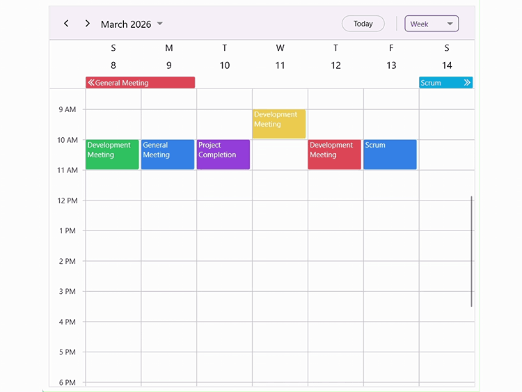

# Appointment Resizing in .NET MAUI SfScheduler

Appointments can be resized interactively to adjust their start or end times. In Day, Week, and Work Week views, you can resize an appointment by dragging its top or bottom edges. In Month, Week, All‑Day, and Timeline views, resizing is performed by dragging the left or right edges of the appointment. By default, the `AllowAppointmentResize` property is set to `false`. To enable appointment resizing, set the `AllowAppointmentResize` property to `true`.



<scheduler:SfScheduler x:Name="scheduler" 
                       View="Day" 
                       AllowAppointmentResize="True">
</scheduler:SfScheduler>


public partial class MainPage : ContentPage
{
    public MainPage()
    {
        InitializeComponent();
        this.scheduler.AllowAppointmentResize = true;
    }
}



N>
- Appointment resizing is supported only on desktop platforms.
- Resizing works exclusively through mouse interactions, using the built‑in mouse resize cursors of the native platform.

## Appointment Resize Settings

The `AppointmentResizeSettings` property lets you configure automatic scrolling, time indicators with customizable format and style, and the border appearance when an appointment is resized.

### Allow Resize Scroll

You can enable automatic scrolling during appointment resizing using the `AllowResizeScroll` property. As the appointment is being resized and reaches the boundary of the visible timeslots, the scheduler scrolls to display additional timeslots. This allows the resizing process to continue smoothly. By default, `AllowResizeScroll` is set to `true`. To disable automatic scrolling during appointment resizing, set the `AllowResizeScroll` property to `false`.



<scheduler:SfScheduler x:Name="scheduler" 
                       View="Day" 
                       AllowAppointmentResize="True">
    <scheduler:SfScheduler.AppointmentResizeSettings>
        <scheduler:AppointmentResizeSettings AllowResizeScroll="False"/>
    </scheduler:SfScheduler.AppointmentResizeSettings>
</scheduler:SfScheduler>


public partial class MainPage : ContentPage
{
    public MainPage()
    {
        InitializeComponent();
        this.scheduler.AllowAppointmentResize = true;
        this.scheduler.AppointmentResizeSettings.AllowResizeScroll = false;
    }
}



### Show Time Indicator

You can display a time indicator while resizing an appointment by using the `ShowTimeIndicator` property. By default, `ShowTimeIndicator` is set to `true`. To hide the time indicator during resizing, set the `ShowTimeIndicator` property to `false`.



<scheduler:SfScheduler x:Name="scheduler" 
                       View="Day" 
                       AllowAppointmentResize="True">
    <scheduler:SfScheduler.AppointmentResizeSettings>
        <scheduler:AppointmentResizeSettings ShowTimeIndicator="False"/>
    </scheduler:SfScheduler.AppointmentResizeSettings>
</scheduler:SfScheduler>


public partial class MainPage : ContentPage
{
    public MainPage()
    {
        InitializeComponent();
        this.scheduler.AllowAppointmentResize = true;
        this.scheduler.AppointmentResizeSettings.ShowTimeIndicator = false;
    }
}



N>
- The time indicator is not displayed in Month view, the All‑Day layout, and TimelineMonthView.

### Time Indicator Text Format

The format of the time displayed in the time indicator while resizing an appointment can be customized using the `TimeIndicatorTextFormat` property.



<scheduler:SfScheduler x:Name="scheduler" 
                       View="Day" 
                       AllowAppointmentResize="True">
    <scheduler:SfScheduler.AppointmentResizeSettings>
        <scheduler:AppointmentResizeSettings TimeIndicatorTextFormat="HH:MM"/>
    </scheduler:SfScheduler.AppointmentResizeSettings>
</scheduler:SfScheduler>


public partial class MainPage : ContentPage
{
    public MainPage()
    {
        InitializeComponent();
        this.scheduler.AllowAppointmentResize = true;
        this.scheduler.AppointmentResizeSettings.TimeIndicatorTextFormat="HH:MM";
    }
}



### Time Indicator Style

The appearance of the time indicator text, including color, font size, font family, and font attributes, can be customized using the `TimeIndicatorStyle` property.



<scheduler:SfScheduler x:Name="scheduler" 
                       View="Day" 
                       AllowAppointmentResize="True">
    <scheduler:SfScheduler.AppointmentResizeSettings>
        <scheduler:AppointmentResizeSettings>
            <scheduler:AppointmentResizeSettings.TimeIndicatorStyle>
                <scheduler:SchedulerTextStyle TextColor="Green" FontSize="15" FontAttributes="Bold" FontFamily="OpenSansSemibold"/>
            </scheduler:AppointmentResizeSettings.TimeIndicatorStyle>
        </scheduler:AppointmentResizeSettings>
    </scheduler:SfScheduler.AppointmentResizeSettings>
</scheduler:SfScheduler>


public partial class MainPage : ContentPage
{
    public MainPage()
    {
        InitializeComponent();
        this.scheduler.AllowAppointmentResize = true;
        this.scheduler.AppointmentResizeSettings.TimeIndicatorStyle = new SchedulerTextStyle() 
        {
            TextColor = Colors.Green,
            FontSize = 15,
            FontAttributes = FontAttributes.Bold,
            FontFamily = "OpenSansSemibold"
        };
    }
}



### Resize Border Customization
 
The border displayed around an appointment during resizing can be customized using the `ResizeBorderThickness` and `ResizeBorderStroke` properties. ResizeBorderThickness defines how thick the border appears, while ResizeBorderStroke specifies its color.



<scheduler:SfScheduler x:Name="scheduler" 
                       View="Day" 
                       AllowAppointmentResize="True">
    <scheduler:SfScheduler.AppointmentResizeSettings>
        <scheduler:AppointmentResizeSettings ResizeBorderThickness="5" ResizeBorderStroke="Red"/>
    </scheduler:SfScheduler.AppointmentResizeSettings>
</scheduler:SfScheduler>


public partial class MainPage : ContentPage
{
    public MainPage()
    {
        InitializeComponent();
        this.scheduler.AppointmentResizeSettings.ResizeBorderStroke = Colors.Red;
        this.scheduler.AppointmentResizeSettings.ResizeBorderThickness = 5;
    }
}



## Events

### Appointment Resize Start

The `AppointmentResizeStart` event is triggered when resizing of an appointment begins. This event occurs when the pointer is placed on a resizable edge of an appointment and the resize operation is initiated. This event can be used to validate whether the appointment can be resized before the operation proceeds. The resize operation can be cancelled by setting `e.Cancel` to true.



<scheduler:SfScheduler x:Name="Scheduler" 
                       View="Day" 
                       AppointmentResizeStart="Scheduler_AppointmentResizeStart">
</scheduler:SfScheduler>


private void Scheduler_AppointmentResizeStart(object sender, AppointmentResizeStartEventArgs e)
{
    e.Cancel = true;
}



The `AppointmentResizeStartEventArgs` contains the following properties:

<table>
    <tr>
        <th>Property</th>
        <th>Description</th>
    </tr>
    <tr>
        <td>Appointment</td>
        <td>Represents the appointment that is about to be resized.</td>
    </tr>
    <tr>
        <td>Resource</td>
        <td>Indicates the resource associated with the appointment when resource grouping is enabled.</td>
    </tr>
    <tr>
        <td>ResizeEdge</td>
        <td>Specifies the edge from which the resizing action starts. The values include Top, Bottom, Left, and Right.</td>
    </tr>
</table>



<scheduler:SfScheduler x:Name="Scheduler" 
                       View="Day" 
                       AppointmentResizeStart="Scheduler_AppointmentResizeStart">
</scheduler:SfScheduler>


private void Scheduler_AppointmentResizeStart(object sender, AppointmentResizeStartEventArgs e)
{
    var appointment = e.Appointment;
    var resource = e.Resource;
    var resizeEdge = e.ResizeEdge;
}



### Appointment Resizing

The `AppointmentResizing` event is triggered continuously while the appointment is being resized. This event is raised as the resize handle is dragged and the appointment duration changes dynamically. This event can be used to monitor the resizing process or to apply custom validation logic while the appointment duration is changing. The resizing operation can be prevented during interaction by setting `e.Cancel` to true.



<scheduler:SfScheduler x:Name="Scheduler" 
                       View="Day" 
                       AppointmentResizing="Scheduler_AppointmentResizing">
</scheduler:SfScheduler>


private void Scheduler_AppointmentResizing(object sender, AppointmentResizingEventArgs e)
{
    e.Cancel = true;
}



The `AppointmentResizingEventArgs` provides the following information:

<table>
    <tr>
        <th>Property</th>
        <th>Description</th>
    </tr>
    <tr>
        <td>Appointment</td>
        <td>Represents the appointment currently being resized.</td>
    </tr>
    <tr>
        <td>Resource</td>
        <td>Indicates the resource linked to the appointment when resource grouping is applied.</td>
    </tr>
    <tr>
        <td>ResizeEdge</td>
        <td>Specifies the edge used for resizing the appointment. The values include Top, Bottom, Left, and Right.</td>
    </tr>
    <tr>
        <td>ResizingTime</td>
        <td>Represents the date time value that corresponds to the current resize position.</td>
    </tr>
</table>

### Appointment Resize End

The `AppointmentResizeEnd` event occurs when the resizing action is completed and the pointer is released. After this event is triggered, the scheduler updates the appointment duration according to the resized position. You can prevent this update by setting the `Cancel` property to `true`, which keeps the appointment with its original duration.



<scheduler:SfScheduler x:Name="Scheduler" 
                       View="Day" 
                       AppointmentResizeEnd="Scheduler_AppointmentResizeEnd">
</scheduler:SfScheduler>


private void Scheduler_AppointmentResizeEnd(object sender, AppointmentResizeEndEventArgs e)
{
    e.Cancel = true;
}



The `AppointmentResizeEndEventArgs` includes the following properties:

<table>
    <tr>
        <th>Property</th>
        <th>Description</th>
    </tr>
    <tr>
        <td>Appointment</td>
        <td>Represents the appointment whose duration has been modified.</td>
    </tr>
    <tr>
        <td>Resource</td>
        <td>Indicates the resource associated with the appointment when grouping is enabled.</td>
    </tr>
    <tr>
        <td>ResizeEdge</td>
        <td>Specifies the edge from which the appointment was resized. The values include Top, Bottom, Left, and Right.</td>
    </tr>
    <tr>
        <td>ResizedTime</td>
        <td>Represents the final date time value after the resizing operation.</td>
    </tr>
</table>



<scheduler:SfScheduler x:Name="Scheduler" 
                       View="Day" 
                       AppointmentResizeEnd="Scheduler_AppointmentResizeEnd">
</scheduler:SfScheduler>


private void Scheduler_AppointmentResizeEnd(object sender, AppointmentResizeEndEventArgs e)
{
    var appointment = e.Appointment;
    var resource = e.Resource;
    var resizeEdge = e.ResizeEdge;
    var resizedTime = e.ResizedTime;
}

