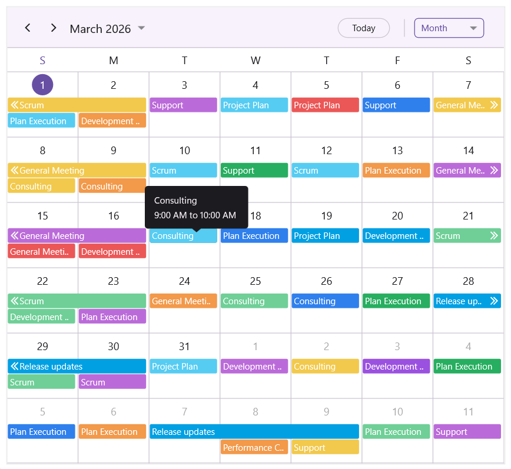
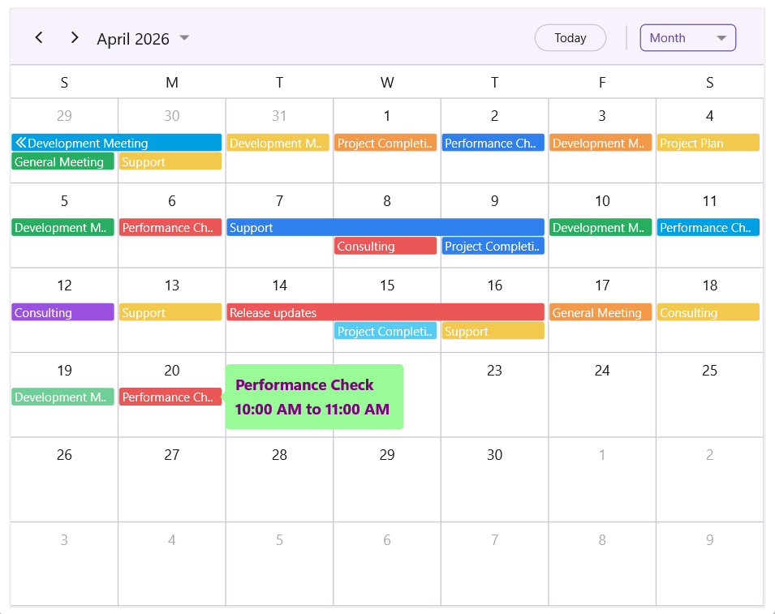
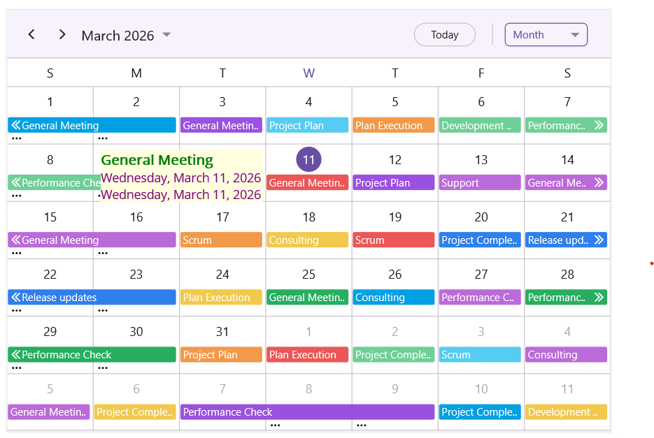

# Appointment Tooltip in .NET MAUI SfScheduler

The appointment tooltip provides a quick, contextual preview of scheduled events. By default, the [IsAppointmentToolTipEnabled](https://help.syncfusion.com/cr/maui/Syncfusion.Maui.Scheduler.SfScheduler.html#Syncfusion_Maui_Scheduler_SfScheduler_IsAppointmentToolTipEnabled) property is set to `false`. To display appointment details such as the subject, start time, and end time when hovering over or tapping an appointment, set the `IsAppointmentToolTipEnabled` property to `true`.



<scheduler:SfScheduler x:Name="scheduler" 
                       View="Day" 
                       IsAppointmentToolTipEnabled="True">
</scheduler:SfScheduler>


public partial class MainPage : ContentPage
{
    public MainPage()
    {
        InitializeComponent();
        this.scheduler.IsAppointmentToolTipEnabled = true;
    }
}



N>
- **Desktop platforms**: A tooltip is shown when you hover the mouse over an appointment.
- **Mobile platforms**: A tooltip is shown when you tap or long‑press an appointment. For long‑press interactions, the tooltip appears only when appointment dragging is disabled.

## Appointment Tooltip Settings

The [AppointmentToolTipSettings](https://help.syncfusion.com/cr/maui/Syncfusion.Maui.Scheduler.SfScheduler.html#Syncfusion_Maui_Scheduler_SfScheduler_AppointmentToolTipSettings) property allows you to customize the appearance and behavior of appointment tooltips. The following settings can be configured:
 
- **Background** – Defines the background color of the tooltip.
 
- **TextStyle** – Specifies the text styling of the tooltip content, including font and text color.
 
- **Padding** – Specifies the spacing inside the tooltip.
 
- **ToolTipPosition** – Determines the placement of the tooltip relative to the appointment. Supported values include Auto (default), Left, Right, Top, and Bottom.



<scheduler:SfScheduler x:Name="scheduler" 
                       View="Day" 
                       EnableAppointmentToolTip="True">
    <scheduler:SfScheduler.AppointmentToolTipSettings>
        <scheduler:AppointmentToolTipSettings Background="PaleGreen" Padding="5" ToolTipPosition="Right">
            <scheduler:AppointmentToolTipSettings.TextStyle>
                <scheduler:SchedulerTextStyle TextColor="Purple" FontSize="15" FontAttributes="Bold"/>
            </scheduler:AppointmentToolTipSettings.TextStyle>
        </scheduler:AppointmentToolTipSettings>
    </scheduler:SfScheduler.AppointmentToolTipSettings>
</scheduler:SfScheduler>


public partial class MainPage : ContentPage
{
    public MainPage()
    {
        InitializeComponent();
        this.scheduler.EnableAppointmentToolTip = true;
        this.scheduler.AppointmentToolTipSettings = new AppointmentToolTipSettings()
        {
            Background = Colors.PaleGreen,
            Padding = new Thickness(5),
            ToolTipPosition = SchedulerToolTipPosition.Right,
            TextStyle = new SchedulerTextStyle
            {
                TextColor = Colors.Purple,
                FontSize = 15,
                FontAttributes = FontAttributes.Bold
            }
        };
    }
}



## Appointment ToolTip Template

The [AppointmentToolTipTemplate](https://help.syncfusion.com/cr/maui/Syncfusion.Maui.Scheduler.SfScheduler.html#Syncfusion_Maui_Scheduler_SfScheduler_AppointmentToolTipTemplate) property lets you create a custom tooltip layout for appointments, allowing you to display additional information or change the tooltip’s appearance as needed.



<scheduler:SfScheduler x:Name="scheduler" 
                       View="Day" 
                       IsAppointmentToolTipEnabled="True">

    <scheduler:SfScheduler.AppointmentToolTipSettings>
        <scheduler:AppointmentToolTipSettings ToolTipPosition="Left"/>
    </scheduler:SfScheduler.AppointmentToolTipSettings>

    <scheduler:SfScheduler.AppointmentToolTipTemplate>
        <DataTemplate x:DataType="scheduler:SchedulerAppointment">
            <Grid ColumnDefinitions="Auto,*">
                <BoxView Grid.Column="0"
                         Background="{Binding Background}"
                         WidthRequest="10"
                         HorizontalOptions="Start"
                         VerticalOptions="Fill"
                         Margin="0,0,5,0" />

                <VerticalStackLayout Grid.Column="1" Spacing="5">
                    <Label Text="{Binding Subject}"
                           FontAttributes="Bold"
                           FontSize="12"
                           TextColor="White"
                           LineBreakMode="TailTruncation"
                           MaxLines="2"
                           Margin="0,0,0,5" />

                    <HorizontalStackLayout Spacing="4">
                        <Label Text="Start Time: "
                               FontAttributes="Bold"
                               FontSize="12"
                               TextColor="White" />
                        <Label Text="{Binding StartTime, StringFormat='{0:MM/dd/yyyy}'}"
                               FontSize="12"
                               TextColor="White" />
                    </HorizontalStackLayout>

                    <HorizontalStackLayout Spacing="4">
                        <Label Text="End Time: "
                               FontAttributes="Bold"
                               FontSize="12"
                               TextColor="White" />
                        <Label Text="{Binding EndTime, StringFormat='{0:MM/dd/yyyy}'}"
                                FontSize="12"
                                TextColor="White" />
                    </HorizontalStackLayout>
                </VerticalStackLayout>
            </Grid>
        </DataTemplate>
    </scheduler:SfScheduler.AppointmentToolTipTemplate>
</scheduler:SfScheduler>



