# Appointments in .NET MAUI Scheduler (SfScheduler)

The [.NET MAUI Scheduler](https://www.syncfusion.com/maui-controls/maui-scheduler) control has the capability to deal with appointment arrangements internally by using [AppointmentsSource](https://help.syncfusion.com/cr/maui/Syncfusion.Maui.Scheduler.SfScheduler.html#Syncfusion_Maui_Scheduler_SfScheduler_AppointmentsSource). In the scheduler, you can create normal, all-day appointments, spanned appointments, recurring appointments, and recurrence exception dates appointments.

The [SchedulerAppointment](https://help.syncfusion.com/cr/maui/Syncfusion.Maui.Scheduler.SchedulerAppointment.html) is a class that corresponds to a specific scheduled appointment. It has some basic properties such as [StartTime](https://help.syncfusion.com/cr/maui/Syncfusion.Maui.Scheduler.SchedulerRegionBase.html#Syncfusion_Maui_Scheduler_SchedulerRegionBase_StartTime), [EndTime](https://help.syncfusion.com/cr/maui/Syncfusion.Maui.Scheduler.SchedulerRegionBase.html#Syncfusion_Maui_Scheduler_SchedulerRegionBase_EndTime), and [Subject](https://help.syncfusion.com/cr/maui/Syncfusion.Maui.Scheduler.SchedulerAppointment.html#Syncfusion_Maui_Scheduler_SchedulerAppointment_Subject). Additional information like [Notes](https://help.syncfusion.com/cr/maui/Syncfusion.Maui.Scheduler.SchedulerAppointment.html#Syncfusion_Maui_Scheduler_SchedulerAppointment_Notes), [Location](https://help.syncfusion.com/cr/maui/Syncfusion.Maui.Scheduler.SchedulerAppointment.html#Syncfusion_Maui_Scheduler_SchedulerAppointment_Location), and [IsAllDay](https://help.syncfusion.com/cr/maui/Syncfusion.Maui.Scheduler.SchedulerAppointment.html#Syncfusion_Maui_Scheduler_SchedulerAppointment_IsAllDay) can be added.









// Creating an instance for the scheduler appointment collection.
var appointment = new ObservableCollection<SchedulerAppointment>();

//Adding scheduler appointment in the scheduler appointment collection. 
appointment.Add(new SchedulerAppointment()
{
    StartTime = DateTime.Today.AddHours(9),
    EndTime = DateTime.Today.AddHours(11),
    Subject = "Client Meeting",
    Location = "Hutchison road",
});

//Adding the scheduler appointment collection to the AppointmentsSource of .NET MAUI Scheduler.
this.Scheduler.AppointmentsSource = appointment;




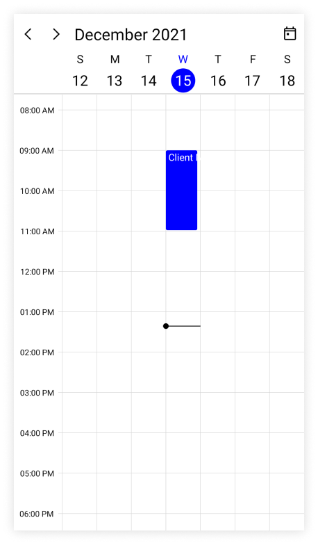

N> 
* In the Scheduler, every appointment can be arranged based on its start time and duration for normal appointments in a day, week, and workweek view.
*  Whenever a timeline is viewed, the appointments (all day, span, and normal) are ordered and rendered based on the appointment start time and time duration of the appointment. This is followed by `IsSpanned,` `IsAllDay,` and normal appointments.

N> [View sample in GitHub](https://github.com/SyncfusionExamples/maui-scheduler-examples/tree/main/GettingStarted)

## Scheduler appointment source mapping

The .NET MAUI Scheduler supports collection that implements the object interface that can be bound to populate appointments. The properties of the business `object` can be mapped to [SchedulerAppointment](https://help.syncfusion.com/cr/maui/Syncfusion.Maui.Scheduler.SchedulerAppointment.html) by configuring the [AppointmentMapping](https://help.syncfusion.com/cr/maui/Syncfusion.Maui.Scheduler.SchedulerAppointmentMapping.html) property.

<table>
<tr><th>Property Name</th><th>Description</th></tr>
<tr><td>{{'[StartTime](https://help.syncfusion.com/cr/maui/Syncfusion.Maui.Scheduler.SchedulerRegionBase.html#Syncfusion_Maui_Scheduler_SchedulerRegionBase_StartTime)'| markdownify }}</td>
<td>This property maps the property name of a business object class to the property name of StartTime in SchedulerAppointment.</td></tr>
<tr><td>{{'[EndTime](https://help.syncfusion.com/cr/maui/Syncfusion.Maui.Scheduler.SchedulerRegionBase.html#Syncfusion_Maui_Scheduler_SchedulerRegionBase_EndTime)'| markdownify }} </td>
<td>This property maps the property name of a business object class to the property name of EndTime in SchedulerAppointment.</td></tr>
<tr><td>{{'[StartTimeZone](https://help.syncfusion.com/cr/maui/Syncfusion.Maui.Scheduler.SchedulerAppointment.html#Syncfusion_Maui_Scheduler_SchedulerAppointment_StartTimeZone)'| markdownify }}</td>
<td>This property maps the property name of a business object class to the property name of StartTimeZone in SchedulerAppointment.</td></tr>
<tr><td>{{'[EndTimeZone](https://help.syncfusion.com/cr/maui/Syncfusion.Maui.Scheduler.SchedulerAppointment.html#Syncfusion_Maui_Scheduler_SchedulerAppointment_EndTimeZone)'| markdownify }}</td>
<td>This property maps the property name of a business object class to the property name of EndTimeZone in SchedulerAppointment.</td></tr>
<tr><td>{{'[Subject](https://help.syncfusion.com/cr/maui/Syncfusion.Maui.Scheduler.SchedulerAppointment.html#Syncfusion_Maui_Scheduler_SchedulerAppointment_Subject)'| markdownify }}</td>
<td>This property maps the property name of a business object class to the property name of Subject in SchedulerAppointment.</td></tr>
<tr><td>{{'[Id](https://help.syncfusion.com/cr/maui/Syncfusion.Maui.Scheduler.SchedulerAppointment.html#Syncfusion_Maui_Scheduler_SchedulerAppointment_Id)'| markdownify }}</td>
<td>This property maps the property name of a business object class to the property name of Id in SchedulerAppointment.</td></tr>
<tr><td>{{'[Background](https://help.syncfusion.com/cr/maui/Syncfusion.Maui.Scheduler.SchedulerRegionBase.html#Syncfusion_Maui_Scheduler_SchedulerRegionBase_Background)'| markdownify }}</td>
<td>This property maps the property name of a business object class to the property name of Background in SchedulerAppointment.</td></tr>
<tr><td>{{'[IsAllDay](https://help.syncfusion.com/cr/maui/Syncfusion.Maui.Scheduler.SchedulerAppointment.html#Syncfusion_Maui_Scheduler_SchedulerAppointment_IsAllDay)'| markdownify }}</td>
<td>This property maps the property name of a business object class to the property name of IsAllDay in SchedulerAppointment.</td></tr>
<tr><td>{{'[RecurrenceRule](https://help.syncfusion.com/cr/maui/Syncfusion.Maui.Scheduler.SchedulerRegionBase.html#Syncfusion_Maui_Scheduler_SchedulerRegionBase_RecurrenceRule)'| markdownify }}</td>
<td>This property maps the property name of a business object class to the property name of RecurrenceRule in SchedulerAppointment.</td></tr>
<tr><td>{{'[RecurrenceId](https://help.syncfusion.com/cr/maui/Syncfusion.Maui.Scheduler.SchedulerAppointment.html#Syncfusion_Maui_Scheduler_SchedulerAppointment_RecurrenceId)'| markdownify }}</td>
<td>This property maps the property name of a business object class to the property name of RecurrenceId in SchedulerAppointment.</td></tr>
<tr><td>{{'[Notes](https://help.syncfusion.com/cr/maui/Syncfusion.Maui.Scheduler.SchedulerAppointment.html#Syncfusion_Maui_Scheduler_SchedulerAppointment_Notes)'| markdownify }}</td>
<td>This property maps the property name of a business object class to the property name of Notes in SchedulerAppointment.</td></tr>
<tr><td>{{'[Location](https://help.syncfusion.com/cr/maui/Syncfusion.Maui.Scheduler.SchedulerAppointment.html#Syncfusion_Maui_Scheduler_SchedulerAppointment_Location)'| markdownify }}</td>
<td>This property maps the property name of a business object class to the property name of Location in SchedulerAppointment.</td></tr>
<tr><td>{{'[RecurrenceExceptionDates](https://help.syncfusion.com/cr/maui/Syncfusion.Maui.Scheduler.SchedulerRegionBase.html#Syncfusion_Maui_Scheduler_SchedulerRegionBase_RecurrenceExceptionDates)'| markdownify }}</td>
<td>This property maps the property name of a business object class to the property name of RecurrenceExceptionDates in SchedulerAppointment.</td></tr>
<tr><td>{{'[IsReadOnly](https://help.syncfusion.com/cr/maui/Syncfusion.Maui.Scheduler.SchedulerAppointment.html#Syncfusion_Maui_Scheduler_SchedulerAppointment_IsReadOnly)'| markdownify}}</td>
<td>This property maps the property name of a business object class to the property name of IsReadOnly in SchedulerAppointment.</td></tr>
<tr><td>{{'[TextColor](https://help.syncfusion.com/cr/maui/Syncfusion.Maui.Scheduler.SchedulerAppointment.html#Syncfusion_Maui_Scheduler_SchedulerAppointment_TextColor)'| markdownify}}</td>
<td>This property maps the property name of a business object class to the property name of TextColor in SchedulerAppointment.</td></tr>
</table>

N> The business object class should contain two date time fields as mandatory.

## Creating business objects

Create a business object class `Meeting` with mandatory fields `From,` `To,` and `EventName.`


  

/// 
    
/// Represents the custom data properties.    
/// 
  
public class Meeting
{
    public DateTime From { get; set; }
    public DateTime To { get; set; }
    public bool IsAllDay { get; set; }
    public string EventName { get; set; }
    public TimeZoneInfo StartTimeZone { get; set; }
    public TimeZoneInfo EndTimeZone { get; set; }
    public Brush Background { get; set; }
    public Color TextColor { get; set; }
}




N> Inherit this class from the `INotifyPropertyChanged` for dynamic changes in custom data.

The [AppointmentMapping](https://help.syncfusion.com/cr/maui/Syncfusion.Maui.Scheduler.SchedulerAppointmentMapping.html) property of the `Meeting` class maps those properties to the `.NET MAUI Scheduler` control.




<scheduler:SfScheduler x:Name="Scheduler" 
                       View="Week" >
    <scheduler:SfScheduler.AppointmentMapping>
        <scheduler:SchedulerAppointmentMapping
                Subject="EventName"
                StartTime="From"
                EndTime="To"
                Background="Background"
                IsAllDay="IsAllDay"
                StartTimeZone="StartTimeZone"
                EndTimeZone="EndTimeZone"
                TextColorMapping="TextColor"/>
    </scheduler:SfScheduler.AppointmentMapping>
</scheduler:SfScheduler>




SfScheduler scheduler = new SfScheduler();
scheduler.View = SchedulerView.Week;
SchedulerAppointmentMapping appointmentMapping = new SchedulerAppointmentMapping();
appointmentMapping.Subject = "EventName";
appointmentMapping.StartTime = "From";
appointmentMapping.EndTime = "To";
appointmentMapping.Background = "Background";
appointmentMapping.IsAllDay = "IsAllDay";
appointmentMapping.StartTimeZone = "StartTimeZone";
appointmentMapping.EndTimeZone = "EndTimeZone";
appointmentMapping.TextColorMapping = "TextColor";
scheduler.AppointmentMapping = appointmentMapping;
this.Content = scheduler;




Create meetings of type `ObservableCollection<Meeting>` and assign those appointments collection to the [AppointmentsSource](https://help.syncfusion.com/cr/maui/Syncfusion.Maui.Scheduler.SfScheduler.html#Syncfusion_Maui_Scheduler_SfScheduler_AppointmentsSource) property of the `SfScheduler.`




// Creating an instance for the business object class.
Meeting meeting = new Meeting();
// Setting the start time of an event.
meeting.From = DateTime.Today.Date.AddHours(9);
// Setting the end time of an event.
meeting.To = meeting.From.AddHours(2);
// Setting the subject for an event.
meeting.EventName = "Meeting";
// Setting the background color for an event.
meeting.Background = Brush.Orange;
// Setting the text color for an event.
meeting.TextColor = Colors.White;
// Creating an instance for the collection of business objects.
var Meetings = new ObservableCollection<Meeting>();
// Adding a business object to the business object Collection.
Meetings.Add(meeting);
// Adding business object in the AppointmentsSource of .NET MAUI Scheduler.
this.Scheduler.AppointmentsSource = Meetings;




N> [View sample in GitHub](https://github.com/SyncfusionExamples/maui-scheduler-examples/tree/main/BusinessObject)

## Spanned appointments

The spanned appointment is the one which lasts longer than 24 hours. The spanned appointment does not block out timeslots in the Scheduler, but it will render in all-day appointment panel exclusively.




<scheduler:SfScheduler x:Name="Scheduler" 
                       View="Week" >
    <scheduler:SfScheduler.AppointmentMapping>
        <scheduler:SchedulerAppointmentMapping
                Subject="EventName"
                StartTime="From"
                EndTime="To"
                Background="Background"
                TextColorMapping="TextColor"
                IsAllDay="IsAllDay"
                StartTimeZone="StartTimeZone"
                EndTimeZone="EndTimeZone"/>
    </scheduler:SfScheduler.AppointmentMapping>
</scheduler:SfScheduler>




// Creating an instance for the business object class.
Meeting meeting = new Meeting();
// Setting the start time of an event.
meeting.From = DateTime.Today.Date.AddHours(9);
// Setting the end time of an event.
meeting.To = meeting.From.AddDays(2).AddHours(2);
// Setting the subject for an event.
meeting.EventName = "Meeting";
// Setting the background color for an event.
meeting.Background = Brush.Orange;
// Setting the text color for an event.
meeting.TextColor = Colors.Blue;
// Creating an instance for the collection of business objects.
var Meetings = new ObservableCollection<Meeting>();
// Adding a business object to the business object Collection.
Meetings.Add(meeting);
// Adding business object in the AppointmentsSource of .NET MAUI Scheduler.
this.Scheduler.AppointmentsSource = Meetings;




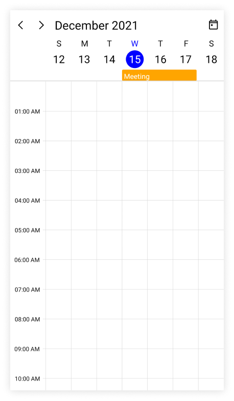

## All day appointments

Appointments that are scheduled for a whole day are known as All-Day Appointments. The [IsAllDay](https://help.syncfusion.com/cr/maui/Syncfusion.Maui.Scheduler.SchedulerAppointment.html#Syncfusion_Maui_Scheduler_SchedulerAppointment_IsAllDay) property of the [SchedulerAppointment](https://help.syncfusion.com/cr/maui/Syncfusion.Maui.Scheduler.SchedulerAppointment.html) can be used to set this property. Appointments that last for a full 24 hours (exact 24 hours) will be considered as all-day appointments without setting the `IsAllDay` property.









// Creating an instance for the scheduler appointment collection.
var appointment = new ObservableCollection<SchedulerAppointment>();

//Adding scheduler appointment in the scheduler appointment collection. 
appointment.Add(new SchedulerAppointment()
{
    StartTime = DateTime.Today.AddHours(9),
    EndTime = DateTime.Today.AddHours(10),
    Subject = "Client Meeting",
    Location = "Hutchison road",
    IsAllDay = true
});

//Adding the scheduler appointment collection to the AppointmentsSource of .NET MAUI Scheduler.
this.Scheduler.AppointmentsSource = appointment;




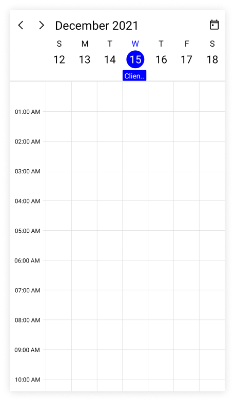

N> 
For example: From 12/13/2021 12:00AM to 12/14/2021 12:00AM.

## Read only appointment

A read-only appointment can be created with [IsReadOnly](https://help.syncfusion.com/cr/maui/Syncfusion.Maui.Scheduler.SchedulerAppointment.html#Syncfusion_Maui_Scheduler_SchedulerAppointment_IsReadOnly) property of the [SchedulerAppointment](https://help.syncfusion.com/cr/maui/Syncfusion.Maui.Scheduler.SchedulerAppointment.html).









this.Scheduler.View = SchedulerView.Week;
// Creating an instance for the scheduler appointment collection.
var appointment = new ObservableCollection<SchedulerAppointment>();

//Adding scheduler appointment in the scheduler appointment collection. 
appointment.Add(new SchedulerAppointment()
{
    StartTime = DateTime.Today.AddHours(9),
    EndTime = DateTime.Today.AddHours(10),
    Subject = "Client Meeting",
    Background = Brush.Orange,
    TextColor = Colors.White,
    IsReadOnly = true,
});

//Adding the scheduler appointment collection to the AppointmentsSource of .NET MAUI Scheduler.
this.Scheduler.AppointmentsSource = appointment;




## Recurrence appointment

The recurring events on a daily, weekly, monthly, or yearly basis with optimized recurrence options. The Recurring appointments can be created by setting the [RecurrenceRule](https://help.syncfusion.com/cr/maui/Syncfusion.Maui.Scheduler.SchedulerRegionBase.html#Syncfusion_Maui_Scheduler_SchedulerRegionBase_RecurrenceRule) property in the [SchedulerAppointment](https://help.syncfusion.com/cr/maui/Syncfusion.Maui.Scheduler.SchedulerAppointment.html).

### Recurrence rule

A [RecurrenceRule](https://help.syncfusion.com/cr/maui/Syncfusion.Maui.Scheduler.SchedulerRegionBase.html#Syncfusion_Maui_Scheduler_SchedulerRegionBase_RecurrenceRule) consists of a string value (RRULE) that contains the details of the daily, weekly, monthly, or yearly recurrence appointments. Also includes the number of times it should be repeated, the duration of the interval, and the time period to be allotted for rendering an appointment.
Based on the value of the `RecurrenceRule` property, recurrence appointments in the `SfScheduler` are rendered with the respective time period.

<table>
<tr><th>PropertyName</th>
<th>Purpose</th></tr>
<tr><td>FREQ</td>
<td>Maintains the Repeat type value of the appointment. (Example: Daily, Weekly, Monthly, Yearly, Every week day) Example:FREQ=DAILY;INTERVAL=1</td></tr>
<tr><td>INTERVAL</td>
<td>Maintains the interval value of the appointments. For example, while creating the daily appointment at an interval of 2, the appointments are rendered on the days Monday, Wednesday, and Friday. (creates the appointment on all days by leaving the interval of one day gap) Example:FREQ=DAILY;INTERVAL=1</td></tr>
<tr><td>COUNT</td>
<td>It holds the appointment’s count value. For example, when the recurrence appointment count value is 10, it means 10 appointments are created in the recurrence series. Example: FREQ=DAILY;INTERVAL=1;COUNT=10</td></tr>
<tr><td>UNTIL</td>
<td>This property is used to store the recurrence end date value. For example, while setting the end date of appointment as 6/30/2020, the UNTIL property holds the end date value when the recurrence actually ends. The 'T' string sets the end time value and 'Z' sets the timezone (UTC). It improves the accuracy of recurrence UNTIL property with time value.
Example:FREQ=DAILY;INTERVAL=1;UNTIL=20200725T103059Z</td></tr>
<tr><td>BYDAY</td>
<td>It holds the “DAY” values of an appointment to render. For example, create the weekly appointment, select the day(s) from the day options (Monday/Tuesday/Wednesday/Thursday/Friday/Saturday/Sunday). When Monday is selected, the first two letters of the selected day “MO” is stored in the “BYDAY” property. While selecting the multiple days, the values are separated by commas. Example:FREQ=WEEKLY;INTERVAL=1;BYDAY=MO,WE;COUNT=10</td></tr>
<tr><td>BYMONTHDAY</td>
<td>This property is used to store the date value of the Month while creating the Month recurrence appointment. * For example, while creating a Monthly recurrence appointment in the date 3, it means the BYMONTHDAY holds the value 3 and creates the appointment on 3rd day of every month. Example:FREQ=MONTHLY;BYMONTHDAY=3;INTERVAL=1;COUNT=10 * For example, while creating a Monthly recurrence appointment in the last date of every month, it means the BYMONTHDAY holds the value -1 and creates the appointment on last day of every month. Example:FREQ=MONTHLY;BYMONTHDAY=-1;INTERVAL=1;COUNT=10</td></tr>
<tr><td>BYMONTH</td>
<td>This property is used to store the index value of the selected Month while creating the yearly appointments. For example, while creating the yearly appointment in the Month June, it means the index value for June month is 6 and it is stored in the BYMONTH field. The appointment is created on every 6th month of a year. Example:FREQ=YEARLY;BYMONTHDAY=16;BYMONTH=6;INTERVAL=1;COUNT=10</td></tr>
<tr><td>BYSETPOS</td>
<td>This property is used to store the index value of the week. For example, while creating the monthly appointment in second week of the month, the index value of the second week (2) is stored in BYSETPOS. Example:FREQ=MONTHLY;BYDAY=MO;BYSETPOS=2;UNTIL=20200725</td></tr>
</table>

### Creating the scheduler recurrence appointment

A recurrence rule for `.NET MAUI Scheduler` is used to populate the recurring appointment collection in a specific pattern. The [SchedulerAppointment](https://help.syncfusion.com/cr/maui/Syncfusion.Maui.Scheduler.SchedulerAppointment.html) supports setting the RRULE directly to its [RecurrenceRule](https://help.syncfusion.com/cr/maui/Syncfusion.Maui.Scheduler.SchedulerRegionBase.html#Syncfusion_Maui_Scheduler_SchedulerRegionBase_RecurrenceRule) property.









// Creating an instance for the scheduler appointment collection.
var appointment = new ObservableCollection<SchedulerAppointment>();

//Adding scheduler appointment in the scheduler appointment collection. 
var schedulerAppointment = new SchedulerAppointment()
{
    StartTime = DateTime.Today.AddHours(9),
    EndTime = DateTime.Today.AddHours(10),
    Subject = "Occurs every alternate day",
    Id = 1,
};

//Creating a recurrence rule
schedulerAppointment.RecurrenceRule = "FREQ=DAILY;INTERVAL=2;COUNT=10";
//Adding the scheduler appointment to the scheduler appointment collection.
appointment.Add(schedulerAppointment);
//Adding the appointment collection to the AppointmentsSource of .NET MAUI Scheduler.
this.Scheduler.AppointmentsSource = appointment;




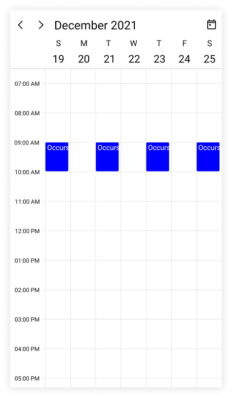

N> [View sample in GitHub](https://github.com/SyncfusionExamples/maui-scheduler-examples/tree/main/RecurringAppointment/SchedulerAppointment)

### Creating the business object recurrence appointment

A recurrence appointment can be created in the business object class `Meeting` by adding mandatory fields `from,` `to,` and `recurrenceRule.`




/// 
   
/// Represents the business object data properties.   
/// 
 
public class Meeting
{
    public DateTime From { get; set; }
    public DateTime To { get; set; }
    public bool IsAllDay { get; set; }
    public string EventName { get; set; }
    public string Notes { get; set; }
    public TimeZoneInfo StartTimeZone { get; set; }
    public TimeZoneInfo EndTimeZone { get; set; }
    public Brush Background { get; set; }
    public object RecurrenceId { get; set; }
    public object Id { get; set; }
    public string RecurrenceRule { get; set; }
    public Color TextColor { get; set; }
}




N> 
Inherit this class from the `INotifyPropertyChanged` for dynamic changes in custom data.

The [AppointmentMapping](https://help.syncfusion.com/cr/maui/Syncfusion.Maui.Scheduler.SchedulerAppointmentMapping.html) property of the `Meeting` class maps those properties to the  scheduler appointment of the `.NET MAUI Scheduler` control.




<scheduler:SfScheduler x:Name="Scheduler"
                       View="Week" >
    <scheduler:SfScheduler.AppointmentMapping>
        <scheduler:SchedulerAppointmentMapping
                Subject="EventName"
                StartTime="From"
                EndTime="To"
                Background="Background"
                IsAllDay="IsAllDay"
                StartTimeZone="StartTimeZone"
                EndTimeZone="EndTimeZone"
                Id="Id"      
                RecurrenceRule="RecurrenceRule"
                RecurrenceId="RecurrenceId"
                TextColorMapping="TextColor"/>
    </scheduler:SfScheduler.AppointmentMapping>
</scheduler:SfScheduler>




SfScheduler scheduler = new SfScheduler();
scheduler.View = SchedulerView.Week;

//Schedule data mapping for business objects.
SchedulerAppointmentMapping appointmentMapping = new SchedulerAppointmentMapping();
appointmentMapping.Subject = "EventName";
appointmentMapping.StartTime = "From";
appointmentMapping.EndTime = "To";
appointmentMapping.Background = "Background";
appointmentMapping.IsAllDay = "IsAllDay";
appointmentMapping.StartTimeZone = "StartTimeZone";
appointmentMapping.EndTimeZone = "EndTimeZone";
appointmentMapping.TextColorMapping = "TextColor";
scheduler.AppointmentMapping = appointmentMapping;
this.Content = scheduler;




The [RecurrenceRule](https://help.syncfusion.com/cr/maui/Syncfusion.Maui.Scheduler.SchedulerRegionBase.html#Syncfusion_Maui_Scheduler_SchedulerRegionBase_RecurrenceRule) class of the `Meeting` class can be used to schedule recurring meetings for daily, weekly, monthly, or yearly intervals. Then create appointments collection `Meetings` of type `ObservableCollection <Meeting>` and assign those appointments collection `Meetings` to the [AppointmentsSource](https://help.syncfusion.com/cr/maui/Syncfusion.Maui.Scheduler.SfScheduler.html#Syncfusion_Maui_Scheduler_SfScheduler_AppointmentsSource) property, which is of type object.




// Creating an instance for the business object class.
Meeting meeting = new Meeting();
// Setting the start time of an event.
meeting.From = DateTime.Today.Date.AddHours(9);
// Setting the end time of an event.
meeting.To = meeting.From.AddHours(1);
// Setting the subject for an event.
meeting.EventName = "Meeting";
// Setting the background color for an event.
meeting.Background = Brush.Orange;
// Setting the text color for an event.
meeting.TextColor = Colors.White;
//Creating a recurrence rule.
meeting.RecurrenceRule = "FREQ=DAILY;INTERVAL=2;COUNT=10";
// Setting the Id of an event.
meeting.Id = 1;
// Creating an instance for the collection of business objects.
var Meetings = new ObservableCollection<Meeting>();
// Adding a business object to the business object Collection.
Meetings.Add(meeting);
// Adding business object in the AppointmentsSource of .NET MAUI Scheduler.
this.Scheduler.AppointmentsSource = Meetings;




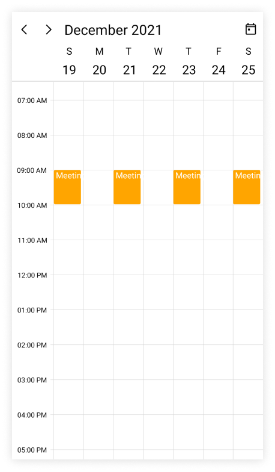

N> [View sample in GitHub](https://github.com/SyncfusionExamples/maui-scheduler-examples/tree/main/RecurringAppointment/BusinessObject)

#### How to get the recurrence editor field values from RRULE?

The [RRuleParser](https://help.syncfusion.com/cr/maui/Syncfusion.Maui.Scheduler.SchedulerRecurrenceManager.html#Syncfusion_Maui_Scheduler_SchedulerRecurrenceManager_ParseRRule_System_String_System_DateTime_) method of the `.NET MAUI Scheduler` retrieves the recurrence properties from the [RRULE](https://help.syncfusion.com/cr/maui/Syncfusion.Maui.Scheduler.SchedulerRecurrenceManager.html#Syncfusion_Maui_Scheduler_SchedulerRecurrenceManager_GenerateRRule_Syncfusion_Maui_Scheduler_SchedulerRecurrenceInfo_System_DateTime_System_DateTime_).




var dateTime = DateTime.Today.AddHours(10);
var recurrenceRule = "FREQ=DAILY;INTERVAL=1;COUNT=3";
var recurrenceProperties = SchedulerRecurrenceManager.ParseRRule(recurrenceRule, dateTime);




/// The recurrence properties retrieved from above method,
recurrenceProperties.RecurrenceType = SchedulerRecurrenceType.Daily;
recurrenceProperties.Interval = 1;
recurrenceProperties.RecurrenceCount = 3;
recurrenceProperties.RecurrenceRange = SchedulerRecurrenceRange.Count;

#### How to get the recurrence dates from RRULE?

The [GetDateTimeOccurrences](https://help.syncfusion.com/cr/maui/Syncfusion.Maui.Scheduler.SchedulerRecurrenceManager.html#Syncfusion_Maui_Scheduler_SchedulerRecurrenceManager_GetDateTimeOccurrences_System_String_System_DateTime_System_Nullable_System_DateTime__System_Nullable_System_DateTime__System_Nullable_System_DateTime__) method of `.NET MAUI Scheduler` retrieves the occurrences date-time list from the `RRULE.`




var dateTime = DateTime.Today.AddHours(10);
var recurrenceRule = "FREQ=DAILY;INTERVAL=1;COUNT=3";
var dateCollection = SchedulerRecurrenceManager.GetDateTimeOccurrences(recurrenceRule, dateTime);




/// The following occurrence dates can be retrieved from the given RRULE:
var date1 = 12/14/2021 10:00:00 AM;
var date2 = 12/15/2021 10:00:00 AM;
var date3 = 12/16/2021 10:00:00 AM;

#### How to get the occurrence appointment from the recurring appointment?

The [GetOccurenceAppointment](https://help.syncfusion.com/cr/maui/Syncfusion.Maui.Scheduler.SchedulerRecurrenceManager.html#Syncfusion_Maui_Scheduler_SchedulerRecurrenceManager_GetDateTimeOccurrences_System_String_System_DateTime_System_Nullable_System_DateTime__System_Nullable_System_DateTime__System_Nullable_System_DateTime__) method of the `.NET MAUI Scheduler` returns the occurrence appointment for the given pattern appointment at the specified date.




var dateTime = new DateTime(2022,07,22,9,0,0);
var occurrenceAppointment = SchedulerRecurrenceManager.GetOccurrenceAppointment(Scheduler, appointment, dateTime);




#### How to get the recurring pattern appointment of the occurrence appointment? 

The [GetOccurenceAppointment](https://help.syncfusion.com/cr/maui/Syncfusion.Maui.Scheduler.SchedulerRecurrenceManager.html#Syncfusion_Maui_Scheduler_SchedulerRecurrenceManager_GetDateTimeOccurrences_System_String_System_DateTime_System_Nullable_System_DateTime__System_Nullable_System_DateTime__System_Nullable_System_DateTime__) method of the `.NET MAUI Scheduler` returns the pattern appointment for the provided occurrence appointment.




var dateTime = new DateTime(2022,07,22,9,0,0);
var patternAppointment = SchedulerRecurrenceManager.GetPatternAppointment(Scheduler,appointment);




#### How to generate the RRule for the recurring appointments?

The [GenerateRRule](https://help.syncfusion.com/cr/maui/Syncfusion.Maui.Scheduler.SchedulerRecurrenceManager.html#Syncfusion_Maui_Scheduler_SchedulerRecurrenceManager_GetDateTimeOccurrences_System_String_System_DateTime_System_Nullable_System_DateTime__System_Nullable_System_DateTime__System_Nullable_System_DateTime__) method of the `.NET MAUI Scheduler` generates the recurrence rule based on the given recurrence properties, the start date and end date of the recurrence appointments.




var recurrenceProperties = new SchedulerRecurrenceInfo();
recurrenceProperties.RecurrenceType = SchedulerRecurrenceType.Daily;
recurrenceProperties.Interval = 2;
recurrenceProperties.RecurrenceCount = 3;
var startTime = DateTime.Today.AddHours(9);
var endTime = DateTime.Today.AddHours(10);
var recurrenceRule = SchedulerRecurrenceManager.GenerateRRule(recurrenceProperties, startTime, endTime);

	


## Recurrence pattern exceptions

The Recurrence pattern appointments can be deleted or changed by handling exception dates and exception appointments.

#### Recurrence exception dates

By adding exception dates to the recurring appointment, any occurrence appointment can be removed that is an exception from the recurrence pattern.

#### Recurrence exception appointment

Any appointment that differs from the recurrence pattern can be changed by adding this appointment in the [AppointmentsSource](https://help.syncfusion.com/cr/maui/Syncfusion.Maui.Scheduler.SfScheduler.html#Syncfusion_Maui_Scheduler_SfScheduler_AppointmentsSource) of the `.NET MAUI Scheduler.`

### Creating the recurrence exceptions for scheduler appointment

The Recurrence exception appointments and recurrence exception dates can be added to [SchedulerAppointment](https://help.syncfusion.com/cr/maui/Syncfusion.Maui.Scheduler.SchedulerAppointment.html) or removed by using its [RecurrenceExceptionDates](https://help.syncfusion.com/cr/maui/Syncfusion.Maui.Scheduler.SchedulerRegionBase.html#Syncfusion_Maui_Scheduler_SchedulerRegionBase_RecurrenceExceptionDates) property.

#### Delete occurrence from recurrence pattern appointment or adding exception dates to recurrence pattern for scheduler appointment

An occurrence of the recurrence pattern appointment which is an exception can be deleted by using the [RecurrenceExceptionDates](https://help.syncfusion.com/cr/maui/Syncfusion.Maui.Scheduler.SchedulerRegionBase.html#Syncfusion_Maui_Scheduler_SchedulerRegionBase_RecurrenceExceptionDates) property of [SchedulerAppointment](https://help.syncfusion.com/cr/maui/Syncfusion.Maui.Scheduler.SchedulerAppointment.html). The deleted occurrence date will be considered as recurrence exception date.









// Creating an instance for the scheduler appointment collection.
var appointment = new ObservableCollection<SchedulerAppointment>();

//Adding Recurrence and exception appointment in the scheduler appointment collection. 
var schedulerAppointment = new SchedulerAppointment()
{
    Id = 1,
    StartTime = DateTime.Today.AddHours(9),
    EndTime = DateTime.Today.AddHours(10),
    Subject = "Daily scrum meeting",
    RecurrenceRule = "FREQ=DAILY;INTERVAL=1;COUNT=10"
};

//Add the exceptionDates to avoid occurrence on specific dates.
DateTime exceptionDate = schedulerAppointment.StartTime.AddDays(3).Date;
schedulerAppointment.RecurrenceExceptionDates = new ObservableCollection<DateTime>()
{
    exceptionDate,
};

//Adding the scheduler appointment to the scheduler appointment collection.
appointment.Add(schedulerAppointment);

//Adding the scheduler appointment collection to the AppointmentsSource of .NET MAUI Scheduler.
this.Scheduler.AppointmentsSource = appointment;




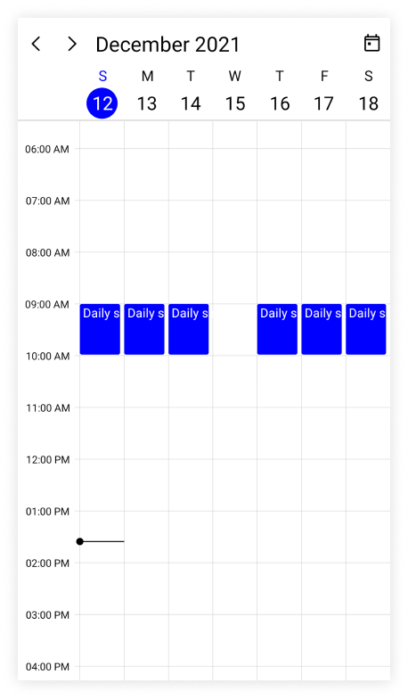

N> [View sample in GitHub](https://github.com/SyncfusionExamples/maui-scheduler-examples/tree/main/RecursiveExceptionAppointment/SchedulerAppointment)

#### Add exception appointment to the recurrence pattern for scheduler appointment

Also add an exception appointment which is changed or modified occurrence of the recurrence pattern appointment to the [AppointmentsSource](https://help.syncfusion.com/cr/maui/Syncfusion.Maui.Scheduler.SfScheduler.html#Syncfusion_Maui_Scheduler_SfScheduler_AppointmentsSource) of [SfScheduler](https://help.syncfusion.com/cr/maui/Syncfusion.Maui.Scheduler.SfScheduler.html). To add a changed occurrence, ensure to set the [RecurrenceId](https://help.syncfusion.com/cr/maui/Syncfusion.Maui.Scheduler.SchedulerAppointment.html#Syncfusion_Maui_Scheduler_SchedulerAppointment_RecurrenceId) of that occurrence and add the date of that occurrence to the [RecurrenceExceptionDates](https://help.syncfusion.com/cr/maui/Syncfusion.Maui.Scheduler.SchedulerRegionBase.html#Syncfusion_Maui_Scheduler_SchedulerRegionBase_RecurrenceExceptionDates) of recurrence pattern appointment. The [RecurrenceId](https://help.syncfusion.com/cr/maui/Syncfusion.Maui.Scheduler.SchedulerAppointment.html#Syncfusion_Maui_Scheduler_SchedulerAppointment_RecurrenceId) of changed occurrence should hold the exact recurrence pattern appointment [Id](https://help.syncfusion.com/cr/maui/Syncfusion.Maui.Scheduler.SchedulerAppointment.html#Syncfusion_Maui_Scheduler_SchedulerAppointment_Id).









// Creating an instance for the scheduler appointment collection.
var appointment = new ObservableCollection<SchedulerAppointment>();

//Adding Recurrence and exception appointment in the scheduler appointment collection. 
var schedulerAppointment = new SchedulerAppointment()
{
    Id = 1,
    StartTime = DateTime.Today.AddHours(9),
    EndTime = DateTime.Today.AddHours(10),
    Subject = "Daily scrum meeting",
    RecurrenceRule = "FREQ=DAILY;INTERVAL=1;COUNT=10"
};

//Add the exceptionDates to avoid occurrence on specific dates.
DateTime changedExceptionDate = schedulerAppointment.StartTime.AddDays(3).Date;
schedulerAppointment.RecurrenceExceptionDates = new ObservableCollection<DateTime>()
{
    changedExceptionDate,
};

//Adding the scheduler appointment to the scheduler appointment collection.
appointment.Add(schedulerAppointment);

// Creating an exception occurrence appointment by changing the start time or end time. 
// RecurrenceId is set to 1, so it will be the changed occurrence for the above-created pattern appointment. 
var exceptionAppointment = new SchedulerAppointment()
{
    Id = 2,
    Subject = "Scrum meeting - Changed Occurrence",
    StartTime = new DateTime(changedExceptionDate.Year, changedExceptionDate.Month, changedExceptionDate.Day, 11, 0, 0),
    EndTime = new DateTime(changedExceptionDate.Year, changedExceptionDate.Month, changedExceptionDate.Day, 12, 0, 0),
    Background = Brush.DeepPink,
    TextColor = Colors.White,
    RecurrenceId = 1
};

//Adding the exception occurrence appointment to the scheduler appointment collection.
appointment.Add(exceptionAppointment);

//Adding the scheduler appointment collection to the AppointmentsSource of .NET MAUI Scheduler.
this.Scheduler.AppointmentsSource = appointment;




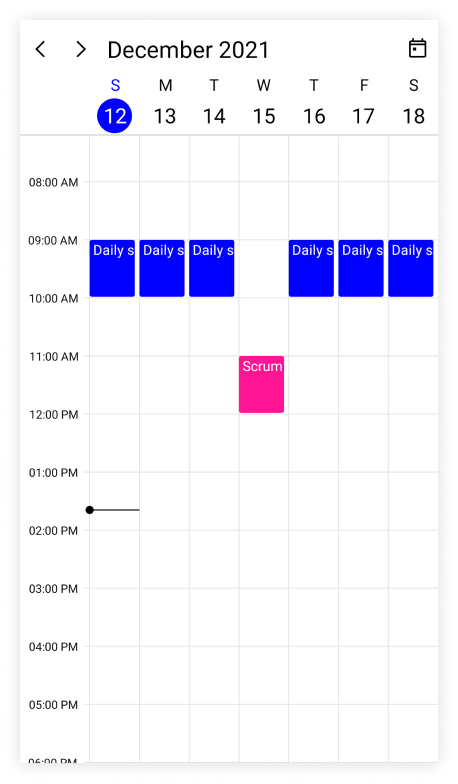

N>
* The `RecurrenceId` of an exception appointment and the `Id` of its pattern appointment should have the same value.
* The Exception recurrence appointment does not have the `RecurrenceRule,` so for an exception appointment, it will be reset to `empty.`
* The exception appointment should have a different `Id` with original pattern appointment `Id.`
* The exception appointment should be a normal appointment and should not be created as a recurring appointment, since its occurrence is from a recurrence pattern.
* The `RecurrenceExceptionDates` should be in a Universal Time Coordinates (UTC) time zone.

N> [View sample in GitHub](https://github.com/SyncfusionExamples/maui-scheduler-examples/tree/main/RecursiveExceptionAppointment/SchedulerAppointment)

### Create the recurrence exceptions for business object

The recurrence exception appointments and recurrence exception dates can be added to business object or removed them from business object, a business object class `Meeting` can be created with mandatory fields [RecurrenceExceptionDates](https://help.syncfusion.com/cr/maui/Syncfusion.Maui.Scheduler.SchedulerAppointmentMapping.html#Syncfusion_Maui_Scheduler_SchedulerAppointmentMapping_RecurrenceExceptionDates) and [RecurrenceId](https://help.syncfusion.com/cr/maui/Syncfusion.Maui.Scheduler.SchedulerAppointmentMapping.html#Syncfusion_Maui_Scheduler_SchedulerAppointmentMapping_RecurrenceId).

#### Delete occurrence from the recurrence pattern appointment or adding exception dates to recurrence pattern for business object

An occurrence of the recurrence pattern appointment which is an exception can be deleted by using the [RecurrenceExceptionDates](https://help.syncfusion.com/cr/maui/Syncfusion.Maui.Scheduler.SchedulerAppointmentMapping.html#Syncfusion_Maui_Scheduler_SchedulerAppointmentMapping_RecurrenceExceptionDates) property of [AppointmentMapping](https://help.syncfusion.com/cr/maui/Syncfusion.Maui.Scheduler.SchedulerAppointmentMapping.html) class which is used to map the exception dates to the scheduler recurrence appointment. The deleted occurrence date will be considered as a recurrence exception date.
To add the exception dates in the recurrence series of business object, add the `RecurrenceExceptionDates,` `EventName,` `From,` `To,` `Color,` `RecurrenceRule` properties to the business object class `Meeting.`




/// 
    
/// Represents the custom data properties.    
/// 
    
public class Meeting
{
    public ObservableCollection<DateTime> RecurrenceExceptions { get; set; }
    public DateTime From { get; set; }
    public DateTime To { get; set; }
    public bool IsAllDay { get; set; }
    public string EventName { get; set; }
    public string Notes { get; set; }
    public TimeZoneInfo StartTimeZone { get; set; }
    public TimeZoneInfo EndTimeZone { get; set; }
    public Brush Background { get; set; }
    public Color TextColor { get; set; }
    public object RecurrenceId { get; set; }
    public object Id { get; set; }
    public string RecurrenceRule { get; set; }
}




N> Inherit this class from the `INotifyPropertyChanged` for dynamic changes in custom data.

The property `RecurrenceExceptionDates` should map with the business object class of `AppointmentMapping` class to map the exception dates to the scheduled appointment.




<scheduler:SfScheduler x:Name="Scheduler" 
                       View="Week" >
    <scheduler:SfScheduler.AppointmentMapping>
        <scheduler:SchedulerAppointmentMapping
                Subject="EventName"
                StartTime="From"
                EndTime="To"
                Background="Background"
                IsAllDay="IsAllDay"
                StartTimeZone="StartTimeZone"
                EndTimeZone="EndTimeZone"
                Id="Id"        
                RecurrenceExceptionDates="RecurrenceExceptions"
                RecurrenceRule="RecurrenceRule"
                RecurrenceId="RecurrenceId"
                TextColorMapping="TextColor"/>
    </scheduler:SfScheduler.AppointmentMapping>
</scheduler:SfScheduler>




// Creating an instance for the business object class.
Meeting recurrenceAppointment = new Meeting();
// Setting the start time of an event.
recurrenceAppointment.From = DateTime.Today.Date.AddHours(9);
// Setting the end time of an event.
recurrenceAppointment.To = recurrenceAppointment.From.AddHours(1);
// Setting the subject for an event.
recurrenceAppointment.EventName = "Occurs Daily";
// Setting the background color for an event.
recurrenceAppointment.Background = Brush.Orange;
// Setting the text color for an event.
meeting.TextColor = Colors.White;
//Creating a recurrence rule.
recurrenceAppointment.RecurrenceRule = "FREQ=DAILY;COUNT=20";
// Setting the Id of an event.
recurrenceAppointment.Id = 1;
// Add the exceptionDates to avoid occurrence on specific dates.
DateTime exceptionDate = recurrenceAppointment.From.AddDays(3).Date;
// Add RecurrenceExceptionDates to appointment.
recurrenceAppointment.RecurrenceExceptions = new ObservableCollection<DateTime>()
{
    exceptionDate
};
// Creating an instance for the collection of business objects.
var Meetings = new ObservableCollection<Meeting>();
// Adding a business object to the business object Collection.
Meetings.Add(recurrenceAppointment);
// Adding business object in the AppointmentsSource of .NET MAUI Scheduler.
this.Scheduler.AppointmentsSource = Meetings;




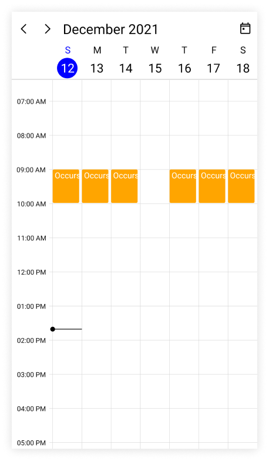

N> Exception dates should be Universal Time Coordinates (UTC) time zone.

N> [View sample in GitHub](https://github.com/SyncfusionExamples/maui-scheduler-examples/tree/main/RecursiveExceptionAppointment/BusinessObject)

#### Add an exception appointment to the recurrence pattern for business object

Also add an exception appointment which is changed or modified occurrence of the recurrence pattern appointment to the [AppointmentsSource](https://help.syncfusion.com/cr/maui/Syncfusion.Maui.Scheduler.SfScheduler.html#Syncfusion_Maui_Scheduler_SfScheduler_AppointmentsSource) of [SfScheduler](https://help.syncfusion.com/cr/maui/Syncfusion.Maui.Scheduler.SfScheduler.html). To add the changed occurrence, ensure to set the [RecurrenceId](https://help.syncfusion.com/cr/maui/Syncfusion.Maui.Scheduler.SchedulerAppointmentMapping.html#Syncfusion_Maui_Scheduler_SchedulerAppointmentMapping_RecurrenceId) of that occurrence and add the date of that occurrence to [RecurrenceExceptionDates](https://help.syncfusion.com/cr/maui/Syncfusion.Maui.Scheduler.SchedulerAppointmentMapping.html#Syncfusion_Maui_Scheduler_SchedulerAppointmentMapping_RecurrenceExceptionDates) of recurrence pattern appointment. The [RecurrenceId](https://help.syncfusion.com/cr/maui/Syncfusion.Maui.Scheduler.SchedulerAppointmentMapping.html#Syncfusion_Maui_Scheduler_SchedulerAppointmentMapping_RecurrenceId) of changed occurrence should hold the exact recurrence pattern appointment [Id](https://help.syncfusion.com/cr/maui/Syncfusion.Maui.Scheduler.SchedulerAppointmentMapping.html#Syncfusion_Maui_Scheduler_SchedulerAppointmentMapping_Id). Map the equivalent properties of `Id,` `RecurrenceId,` and `RecurrenceExceptionDates` properties from the business object to the [Id](https://help.syncfusion.com/cr/maui/Syncfusion.Maui.Scheduler.SchedulerAppointmentMapping.html#Syncfusion_Maui_Scheduler_SchedulerAppointmentMapping_Id) and [RecurrenceExceptionDates](https://help.syncfusion.com/cr/maui/Syncfusion.Maui.Scheduler.SchedulerAppointmentMapping.html#Syncfusion_Maui_Scheduler_SchedulerAppointmentMapping_RecurrenceExceptionDates) properties of [AppointmentMapping](https://help.syncfusion.com/cr/maui/Syncfusion.Maui.Scheduler.SchedulerAppointmentMapping.html).

Add the created exception recurrence appointment to the SfScheduler `AppointmentsSource.`




<scheduler:SfScheduler x:Name="Scheduler" 
                       View="Week" >
    <scheduler:SfScheduler.AppointmentMapping>
        <scheduler:SchedulerAppointmentMapping
                Subject="EventName"
                StartTime="From"
                EndTime="To"
                Background="Background"
                TextColorMapping="TextColor"
                IsAllDay="IsAllDay"
                StartTimeZone="StartTimeZone"
                EndTimeZone="EndTimeZone"
                Id="Id"        
                RecurrenceExceptionDates="RecurrenceExceptions"
                RecurrenceRule="RecurrenceRule"
                RecurrenceId="RecurrenceId"/>
    </scheduler:SfScheduler.AppointmentMapping>
</scheduler:SfScheduler>




var recursiveAppointmentCollection = new ObservableCollection<Meeting>();
//Adding business object in the business object collection. 
Meeting dailyEvent = new Meeting
{
    EventName = "Daily scrum meeting",
    From = DateTime.Today.Date.AddHours(9),
    To = DateTime.Today.Date.AddHours(10),
    Background = Brush.Orange,
    TextColor = Colors.White,
    RecurrenceRule = "FREQ=DAILY;INTERVAL=1;COUNT=10",
    Id = 1
};

//Adding business object in the business object collection.
recursiveAppointmentCollection.Add(dailyEvent);

//Add ExceptionDates to avoid occurrence on specific dates.
DateTime changedExceptionDate = dailyEvent.From.AddDays(3).Date;
dailyEvent.RecurrenceExceptions = new ObservableCollection<DateTime>()
{
    changedExceptionDate
};
//Change start time or end time of an occurrence.
Meeting changedEvent = new Meeting
{
    EventName = "Scrum meeting - Changed Occurrence",
    From = new DateTime(changedExceptionDate.Year, changedExceptionDate.Month, changedExceptionDate.Day, 13, 0, 0),
    To = new DateTime(changedExceptionDate.Year, changedExceptionDate.Month, changedExceptionDate.Day, 14, 0, 0),
    Background = Brush.DeepPink,
    TextColor = Colors.White,
    RecurrenceRule = "FREQ=DAILY;INTERVAL=1;COUNT=10",
    Id = 2,
    RecurrenceId = 1
};

recursiveAppointmentCollection.Add(changedEvent);
// Adding business object in the AppointmentsSource of .NET MAUI Scheduler.
this.Scheduler.AppointmentsSource = recursiveAppointmentCollection;




N>
* The `RecurrenceId` of exception appointment and the `Id` of its pattern appointment should have same value.
* The Exception recurrence appointment does not have the `RecurrenceRule`, so for an exception appointment, it will be reset to empty.
* The exception appointment should have different `Id` with original pattern appointment `Id.`
* The exception appointment should be a normal appointment and should not be created as recurring appointment, since its occurrence from the recurrence pattern.
* The recurrenceExceptions should be in a Universal Time Coordinates (UTC) time zone.

N> [View sample in GitHub](https://github.com/SyncfusionExamples/maui-scheduler-examples/tree/main/RecursiveExceptionAppointment/BusinessObject)

## Appointment appearance customization

The appointment appearance customization can be achieved by using the `TextStyle` and `AppointmentTemplate` properties in the `SfScheduler.`

#### Customize appointment appearance using text style

The appointment text style can be customized by using the [AppointmentTextStyle](https://help.syncfusion.com/cr/maui/Syncfusion.Maui.Scheduler.SfScheduler.html#Syncfusion_Maui_Scheduler_SfScheduler_AppointmentTextStyle) property of the [SfScheduler](https://help.syncfusion.com/cr/maui/Syncfusion.Maui.Scheduler.SfScheduler.html).









var appointments = new ObservableCollection<SchedulerAppointment>();
appointments.Add(new SchedulerAppointment()
{
    Subject = "meeting",
    StartTime = DateTime.Now,
    EndTime = DateTime.Now.AddHours(1),
});
this.Scheduler.AppointmentsSource = appointments;
var appointmentTextStyle = new SchedulerTextStyle()
{
    TextColor = Colors.Red,
    FontSize = 12,
};
this.Scheduler.AppointmentTextStyle = appointmentTextStyle;

  


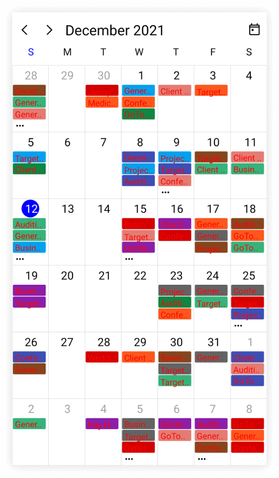

#### Customize appointment appearance using DataTemplate

You can customize the appointment appearance by using the [AppointmentTemplate](https://help.syncfusion.com/cr/maui/Syncfusion.Maui.Scheduler.SchedulerTimeSlotView.html#Syncfusion_Maui_Scheduler_SchedulerTimeSlotView_AppointmentTemplate) properties of [DaysView](https://help.syncfusion.com/cr/maui/Syncfusion.Maui.Scheduler.SchedulerDaysView.html), [TimelineView](https://help.syncfusion.com/cr/maui/Syncfusion.Maui.Scheduler.SchedulerTimelineView.html), and [MonthView](https://help.syncfusion.com/cr/maui/Syncfusion.Maui.Scheduler.SchedulerMonthView.html) in the [SfScheduler](https://help.syncfusion.com/cr/maui/Syncfusion.Maui.Scheduler.SfScheduler.html).




 <Grid>
    <Grid.Resources>
        <DataTemplate x:Key="appointmentTemplate">
            <Grid Background="MediumPurple">
                <Label Text="{Binding Subject}" TextColor="White" HorizontalOptions="Center" VerticalOptions="Center" FontFamily="Bold"/>
            </Grid>
        </DataTemplate>
    </Grid.Resources>
    <scheduler:SfScheduler  x:Name="Scheduler" 
                            View="Day"
                            AllowedViews="Day,Week,WorkWeek,Month,Agenda,TimelineDay,TimelineWeek,TimelineWorkWeek,TimelineMonth">
        <scheduler:SfScheduler.DaysView>
            <scheduler:SchedulerDaysView AppointmentTemplate="{StaticResource appointmentTemplate}"/>
        </scheduler:SfScheduler.DaysView>
        <scheduler:SfScheduler.TimelineView>
            <scheduler:SchedulerTimelineView AppointmentTemplate="{StaticResource appointmentTemplate}"/>
        </scheduler:SfScheduler.TimelineView>
        <scheduler:SfScheduler.MonthView>
            <scheduler:SchedulerMonthView AppointmentTemplate="{StaticResource appointmentTemplate}"/>
        </scheduler:SfScheduler.MonthView>
    </scheduler:SfScheduler>
 </Grid>




this.Scheduler.AllowedViews = SchedulerViews.Day | SchedulerViews.Week | SchedulerViews.WorkWeek | SchedulerViews.Month | SchedulerViews.Agenda | SchedulerViews.TimelineDay | SchedulerViews.TimelineWeek | SchedulerViews.TimelineWorkWeek | SchedulerViews.TimelineMonth;
var appointments = new ObservableCollection<SchedulerAppointment>();
appointments.Add(new SchedulerAppointment()
{
    Subject = "meeting",
    StartTime = DateTime.Now,
    EndTime = DateTime.Now.AddHours(1),
});
this.Scheduler.AppointmentsSource = appointments;

  


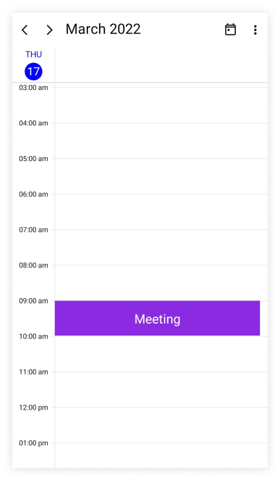

N>
* By default, the `SchedulerAppointment` is set as the `BindingContext` for `AppointmentTemplate` for both `SchedulerAppointment` and custom data object in `AppointmentsSource.`
* The Custom data object can be bound in `AppointmentTemplate` by using `SchedulerAppointment.DataItem.`

#### Customize appointment appearance using DataTemplateSelector

You can customize the appointment appearance by using the [AppointmentTemplate](https://help.syncfusion.com/cr/maui/Syncfusion.Maui.Scheduler.SchedulerTimeSlotView.html#Syncfusion_Maui_Scheduler_SchedulerTimeSlotView_AppointmentTemplate) property of [DaysView](https://help.syncfusion.com/cr/maui/Syncfusion.Maui.Scheduler.SchedulerDaysView.html), [TimelineView](https://help.syncfusion.com/cr/maui/Syncfusion.Maui.Scheduler.SchedulerTimelineView.html), and [MonthView](https://help.syncfusion.com/cr/maui/Syncfusion.Maui.Scheduler.SchedulerMonthView.html) in the [SfScheduler](https://help.syncfusion.com/cr/maui/Syncfusion.Maui.Scheduler.SfScheduler.html). The `DataTemplateSelector` can choose a `DataTemplate` at runtime based on the value of a data-bound to scheduler appointment appearance by using the `AppointmentTemplate.` It allows you to choose a different data template for each appointment, as well as to customize the appearance of a particular appointment based on certain conditions.




<Grid>
    <Grid.Resources>
        <DataTemplate x:Key="normalDateTemplate">
            <Grid Background="LightGreen">
                <Label x:Name="label" HorizontalOptions="Center"  VerticalOptions="Center" TextColor="Black" FontSize="12"  Text="{Binding Subject}" />
            </Grid>
        </DataTemplate>
        <DataTemplate x:Key="todayDateTemplate">
            <Grid Background="MediumPurple">
                <Label x:Name="label" HorizontalOptions="Center" VerticalOptions="Center" TextColor="White" FontSize="12"  Text="{Binding Subject}" />
            </Grid>
        </DataTemplate>
        <local:AppointmentTemplateSelector x:Key="appointmentTemplateSelector" TodayDateTemplate="{StaticResource todayDateTemplate}" NormalDateTemplate="{StaticResource normalDateTemplate}"/>
    </Grid.Resources>
    <scheduler:SfScheduler x:Name="Scheduler" 
                           View="Week" >
        <scheduler:SfScheduler.DaysView>
            <scheduler:SchedulerDaysView AppointmentTemplate="{StaticResource appointmentTemplateSelector}" />
        </scheduler:SfScheduler.DaysView>
        <scheduler:SfScheduler.TimelineView>
            <scheduler:SchedulerTimelineView AppointmentTemplate="{StaticResource appointmentTemplateSelector}" />
        </scheduler:SfScheduler.TimelineView>
        <scheduler:SfScheduler.MonthView>
            <scheduler:SchedulerMonthView AppointmentTemplate="{StaticResource appointmentTemplateSelector}" />
        </scheduler:SfScheduler.MonthView>
    </scheduler:SfScheduler>
 </Grid>




public class AppointmentTemplateSelector : DataTemplateSelector
{
    public AppointmentTemplateSelector()
    {
    }
    public DataTemplate NormalDateTemplate { get; set; }
    public DataTemplate TodayDateTemplate { get; set; }
    protected override DataTemplate OnSelectTemplate(object item, BindableObject container)
    {
        var schedulerAppointment = item as SchedulerAppointment;
        if (schedulerAppointment.ActualStartTime.Date == DateTime.Today.Date)
            return TodayDateTemplate;
        else
            return NormalDateTemplate;
    }
}

  


this.Scheduler.View = SchedulerView.Week;
var appointments = new ObservableCollection<SchedulerAppointment>();
appointments.Add(new SchedulerAppointment()
{
    Subject = "Meeting",
    StartTime = DateTime.Today.Date.AddHours(9),
    EndTime = DateTime.Today.Date.AddHours(10),
});
appointments.Add(new SchedulerAppointment()
{
    Subject = "Project plan",
    StartTime = DateTime.Today.Date.AddDays(1).AddHours(10),
    EndTime = DateTime.Today.Date.AddDays(1).AddHours(11),
});
this.Scheduler.AppointmentsSource = appointments;

 


N>
* The `BindingContext` for `AppointmentTemplate` for both `SchedulerAppointment` and `SchedulerAppointment.DataItem` in `AppointmentsSource.`
* When using data template selector, performance issues occur as the conversion template views take time within the framework.

## Appointment selection background

The selection view of appointment can be customized by using the [SelectedAppointmentBackground](https://help.syncfusion.com/cr/maui/Syncfusion.Maui.Scheduler.SfScheduler.html#Syncfusion_Maui_Scheduler_SfScheduler_SelectedAppointmentBackground) property in the [SfScheduler](https://help.syncfusion.com/cr/maui/Syncfusion.Maui.Scheduler.SfScheduler.html).

  


<scheduler:SfScheduler x:Name="Scheduler" 
                       SelectedAppointmentBackground="Orange">
</scheduler:SfScheduler>




this.Scheduler.SelectedAppointmentBackground = Brush.Orange;

  


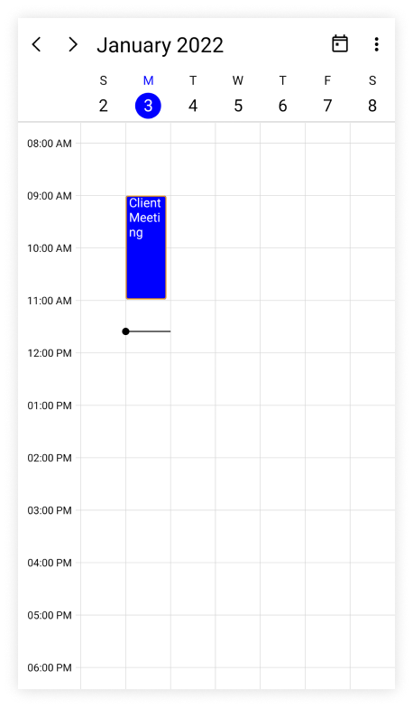

N>
* [View scheduler appointment sample in GitHub](https://github.com/SyncfusionExamples/maui-scheduler-examples/tree/main/GettingStarted)
* [View business object sample in GitHub](https://github.com/SyncfusionExamples/maui-scheduler-examples/tree/main/BusinessObject)
