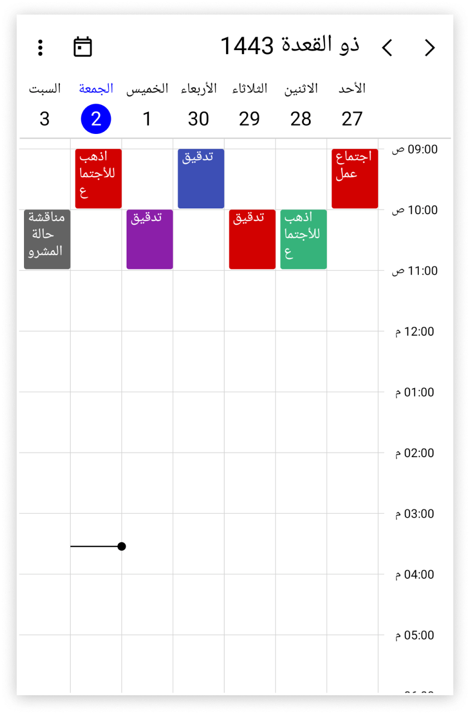

# Calendar types in .NET MAUI Scheduler (SfScheduler)
The Scheduler control supports [different types of calendars] (https://www.jocalendars.com/types-of-calendars/) such as Gregorian, Korean, Hebrew, and more. Change the calendar types by using the [CalendarType](https://help.syncfusion.com/cr/maui/Syncfusion.Maui.Scheduler.SfScheduler.html#Syncfusion_Maui_Scheduler_SfScheduler_CalendarType) property in the SfScheduler.  

<table>
<tr>
<th>Supported Calendars</th>
<th>UnSupported Calendars</th>
</tr>
<tr>

<td>
* GregorianCalendar 
* HebrewCalendar 
* HijriCalendar (Islamic calendar) 
* KoreanCalendar 
* TaiwanCalendar 
* ThaiCalendar 
* UmAlQuraCalendar 
* PersianCalendar 
* JulianCalendar 
* JapaneseCalendar 
</td>

<td>
* Gezer Calendar 
* Haida Calendar 
* Igbo calendar 
* Javanese calendar 
* Maramataka (Māori lunar calendar) 
* Nepal Sambat 
* Yoruba calendar 
</td>
</tr>
</table>

N>
* The FlowDirection will be updated based on the CalendarType. If you want to override this behavior, set the FlowDirection after CalendarTypeIf calendar is specified other than the Gregorian. All the DateTime values such as Appointment Start and End time, SpecialTimeRegion Start and End time, SelectableDayPredicate, SelectedDate, and DisplayDate can be given in two ways.
* The DateTime instance without specifying calendar type. The scheduler will handle the DateTime value for the specified calendar type.
* When a DateTime instance has a calendar type, the Scheduler handles it directly.
* All calendar types are supported except the Lunar type calendars.



<schedule:SfScheduler x:Name="Scheduler"  View="TimelineMonth" CalendarType="Hijri">
</scheduler:SfScheduler>



SfScheduler scheduler = new SfScheduler();
scheduler.View = SchedulerView.TimelineMonth;
scheduler.CalendarType = CalendarType.Hijri;
this.Content = scheduler;




### DateTime values in Calendar Types
All the DateTime values can be given such as [DisplayDate](), [SelectedDate](), [BlackoutDates](), Appointment [StartTime]() and [EndTime](), and SpecialTimeRegion [StartTime]() and [EndTime]() values in two ways when the calendar identifier is specified other than the [GregorianCalendar]().

* Create an appointment with a start and end time value by declaring the calendar type and respective calendar type date.




// Creating an instance for the schedule appointment collection.
var appointments = new ObservableCollection<SchedulerAppointment>(); 

// Adding schedule appointment in the schedule appointment collection.
appointments.Add(new SchedulerAppointment()
{
	Subject = "Meeting",
	// StartTime and EndTime value specified with calendar type and respective calendar date.
	StartTime = new DateTime(1443, 02, 22, 10, 0, 0, new HijriCalendar()),
	EndTime = new DateTime(1443, 02, 22, 11, 0, 0, new HijriCalendar()),
});

// Adding the schedule appointment collection to the ItemsSource.
this.Scheduler.AppointmentsSource = appointments;



{{ codesnippet1 | UnOrderList_Indent_Level_1 }}

* Create an appointment with a start and end time by declaring the local system date; in that case, the system date will be converted to the relevant calendar type date.




// Creating an instance for the schedule appointment collection.
var appointments = new ObservableCollection<SchedulerAppointment>();

// Adding schedule appointment in the schedule appointment collection.
appointments.Add(new SchedulerAppointment()
{
	Subject = "Meeting",
	//The StartTime and EndTime values specified with the local system date will be converted to the Hijiri calendar mentioned.
	StartTime = new DateTime(2021, 09, 29, 10, 0, 0, 0),
	EndTime = new DateTime(2021, 09, 29, 11, 0, 0, 0),
});

// Adding the schedule appointment collection to the ItemsSource.
this.Scheduler.AppointmentsSource = appointments;



{{ codesnippet2 | UnOrderList_Indent_Level_1 }}

