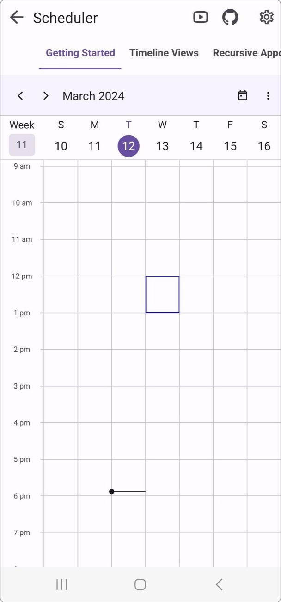
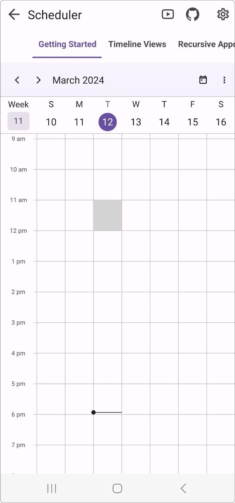
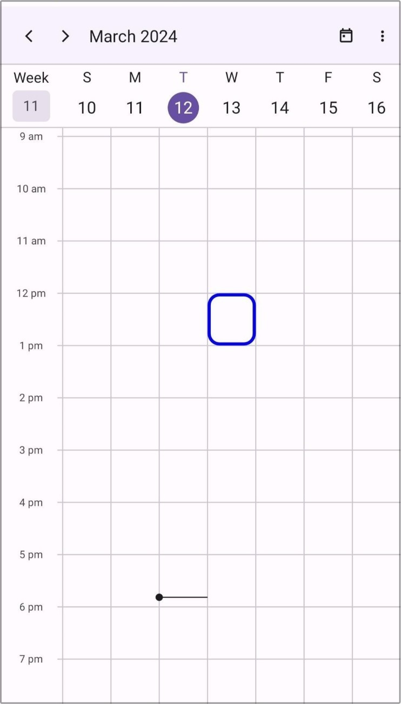
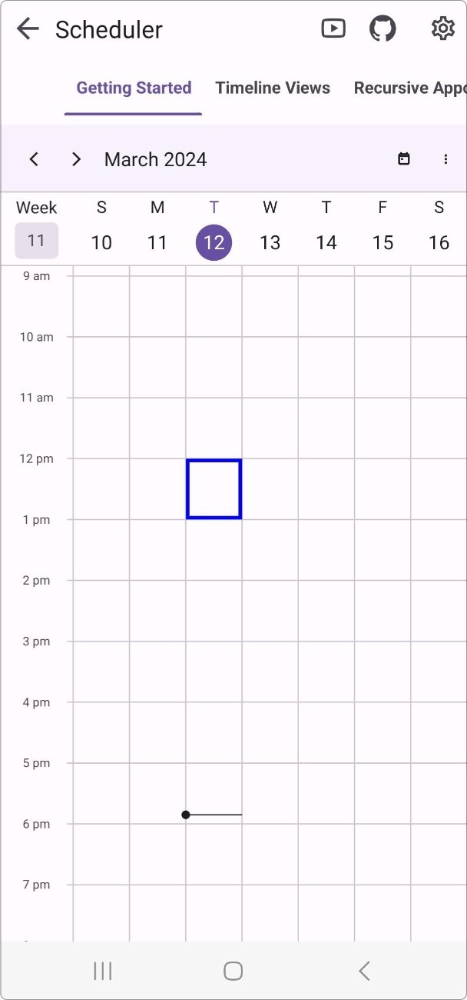
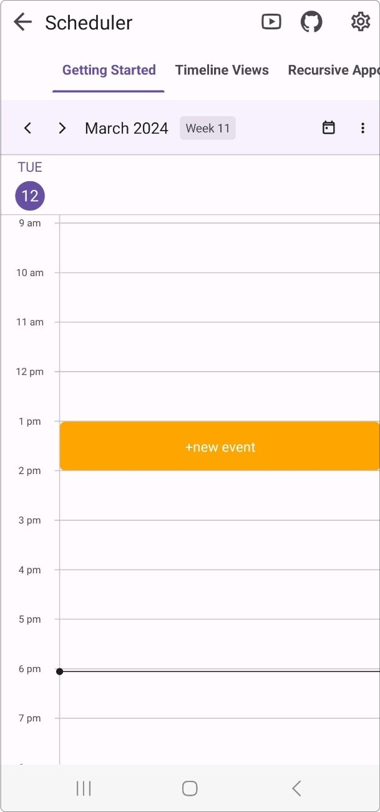

# Cell Selection View in .NET MAUI Event Scheduler (SfScheduler).

The Scheduler provides the capability to customize the selection of month and timeslot cells using the [Cellselectionview](https://help.syncfusion.com/cr/maui/Syncfusion.Maui.Scheduler.SfScheduler.html#Syncfusion_Maui_Scheduler_SfScheduler_CellSelectionView).

## Stroke

The cell selection border color can be customized by using the [Stroke](https://help.syncfusion.com/cr/maui/Syncfusion.Maui.Scheduler.SchedulerCellSelectionView.html#Syncfusion_Maui_Scheduler_SchedulerCellSelectionView_Stroke) property in the [Cellselectionview](https://help.syncfusion.com/cr/maui/Syncfusion.Maui.Scheduler.SchedulerCellSelectionView.html).




<scheduler:SfScheduler x:Name="Scheduler">
    <scheduler:SfScheduler.CellSelectionView>
            <scheduler:SchedulerCellSelectionView Stroke="Red"/>
    </scheduler:SfScheduler.CellSelectionView>
</scheduler:SfScheduler>



this.Scheduler.CellSelectionView.Stroke = Brush.Green;



## Background

The cell selection background color can be customized by using the [Background](https://help.syncfusion.com/cr/maui/Syncfusion.Maui.Scheduler.SchedulerCellSelectionView.html#Syncfusion_Maui_Scheduler_SchedulerCellSelectionView_Background) property in the [Cellselectionview](https://help.syncfusion.com/cr/maui/Syncfusion.Maui.Scheduler.SchedulerCellSelectionView.html).
The default value is `Brush.Transparent`.

N> As default, [Stroke](https://help.syncfusion.com/cr/maui/Syncfusion.Maui.Scheduler.SchedulerCellSelectionView.html#Syncfusion_Maui_Scheduler_SchedulerCellSelectionView_Stroke) will have value; if [Background](https://help.syncfusion.com/cr/maui/Syncfusion.Maui.Scheduler.SchedulerCellSelectionView.html#Syncfusion_Maui_Scheduler_SchedulerCellSelectionView_Background) alone is required, you can set the  [Stroke](https://help.syncfusion.com/cr/maui/Syncfusion.Maui.Scheduler.SchedulerCellSelectionView.html#Syncfusion_Maui_Scheduler_SchedulerCellSelectionView_Stroke) property to `Brush.Transparent`.




<scheduler:SfScheduler x:Name="Scheduler">
    <scheduler:SfScheduler.CellSelectionView>
            <scheduler:SchedulerCellSelectionView Background="Red" Stroke="Transparent"/>
    </scheduler:SfScheduler.CellSelectionView>
</scheduler:SfScheduler>



this.Scheduler.CellSelectionView.Background = Brush.Green;



## Corner Radius

The corner radius of cell selection view can be customized by using the [CornerRadius](https://help.syncfusion.com/cr/maui/Syncfusion.Maui.Scheduler.SchedulerCellSelectionView.html#Syncfusion_Maui_Scheduler_SchedulerCellSelectionView_CornerRadius) property in the [Cellselectionview](https://help.syncfusion.com/cr/maui/Syncfusion.Maui.Scheduler.SchedulerCellSelectionView.html). 




<scheduler:SfScheduler x:Name="Scheduler">
    <scheduler:SfScheduler.CellSelectionView>
            <scheduler:SchedulerCellSelectionView  Background="Red" CornerRadius="2"/>
    </scheduler:SfScheduler.CellSelectionView>
</scheduler:SfScheduler>



this.Scheduler.CellSelectionView.Stroke = Brush.Green;
this.Scheduler.CellSelectionView.CornerRadius = 2;



## Stroke Thickness

The thickness of the selection view [Stroke](https://help.syncfusion.com/cr/maui/Syncfusion.Maui.Scheduler.SchedulerCellSelectionView.html#Syncfusion_Maui_Scheduler_SchedulerCellSelectionView_Stroke) can be customized by using the [StrokeWidth](https://help.syncfusion.com/cr/maui/Syncfusion.Maui.Scheduler.SchedulerCellSelectionView.html#Syncfusion_Maui_Scheduler_SchedulerCellSelectionView_StrokeWidth) property in the [Cellselectionview](https://help.syncfusion.com/cr/maui/Syncfusion.Maui.Scheduler.SchedulerCellSelectionView.html).

N> The [StrokeWidth](https://help.syncfusion.com/cr/maui/Syncfusion.Maui.Scheduler.SchedulerCellSelectionView.html#Syncfusion_Maui_Scheduler_SchedulerCellSelectionView_StrokeWidth) is only applicable for the [Stroke](https://help.syncfusion.com/cr/maui/Syncfusion.Maui.Scheduler.SchedulerCellSelectionView.html#Syncfusion_Maui_Scheduler_SchedulerCellSelectionView_Stroke) property.




<scheduler:SfScheduler x:Name="Scheduler">
    <scheduler:SfScheduler.CellSelectionView>
            <scheduler:SchedulerCellSelectionView  Stroke="Red" StrokeWidth="2"/>
    </scheduler:SfScheduler.CellSelectionView>
</scheduler:SfScheduler>



this.Scheduler.CellSelectionView.Stroke = Brush.Green;
this.Scheduler.CellSelectionView.StrokeWidth = 2;



## Template

The scheduler allows you to use the custom view as a selection view by using the [Template](https://help.syncfusion.com/cr/maui/Syncfusion.Maui.Scheduler.SchedulerCellSelectionView.html#Syncfusion_Maui_Scheduler_SchedulerCellSelectionView_Template) property in the [Cellselectionview](https://help.syncfusion.com/cr/maui/Syncfusion.Maui.Scheduler.SchedulerCellSelectionView.html).




<scheduler:SfScheduler.CellSelectionView>
    <scheduler:SchedulerCellSelectionView>
        <scheduler:SchedulerCellSelectionView.Template>
            <DataTemplate>
                <Button BackgroundColor = "#FF9800"
                        Text="+ Add event"
                        TextColor="White"/>
            </DataTemplate>
        </scheduler:SchedulerCellSelectionView.Template>
    </scheduler:SchedulerCellSelectionView>
</scheduler:SfScheduler.CellSelectionView>




