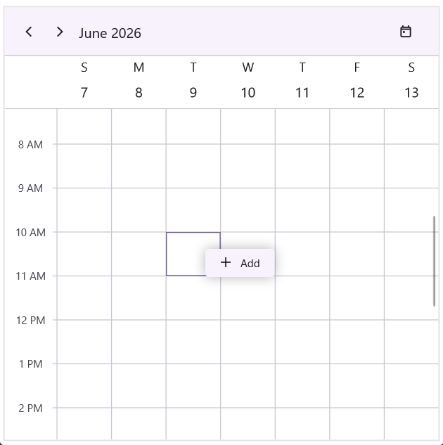
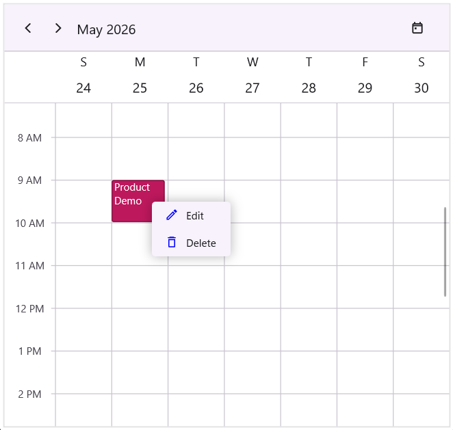
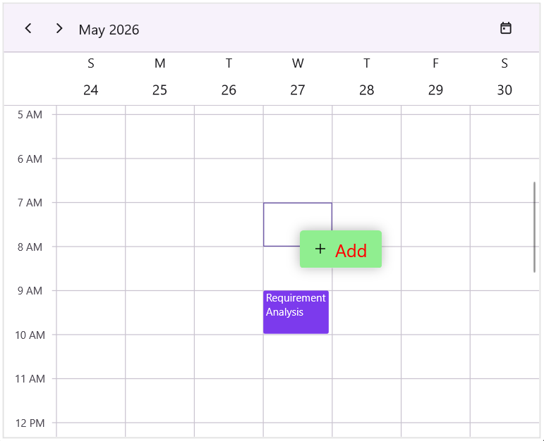
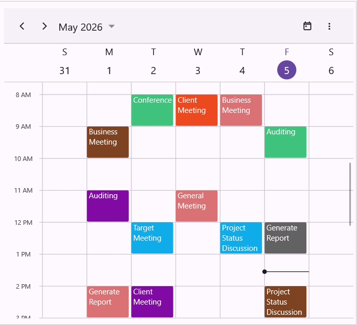

# Context Menu in .NET MAUI Scheduler (SfScheduler)

The .NET MAUI Scheduler supports context menus for timeslot cells, month cells, all-day panels, and appointments. Context menus provide quick access to common actions such as creating, editing, or deleting appointments. The Scheduler provides built-in commands that can be assigned to context menu items.

The Scheduler displays context menus through the following interactions:
 
* **Long press** on touch devices (Android and iOS)
* **Right-click** on desktop platforms (Windows and macOS)
 
When a context menu is configured, the Scheduler automatically displays the menu at the interaction location.

## Built-in Scheduler Commands to use in context menu
 
The Scheduler includes built-in commands that can be used directly in context menus.

* **Add** - Creates a new appointment for the selected cell.
* **Edit** - Opens the selected appointment for editing.
* **Delete** - Deletes the selected appointment.
 
N> Built-in `Add` and `Edit` commands work only when the [AppointmentEditorMode](https://help.syncfusion.com/cr/maui/Syncfusion.Maui.Scheduler.SfScheduler.html#Syncfusion_Maui_Scheduler_SfScheduler_AppointmentEditorMode) property includes the corresponding `Add` or `Edit` option.

## Context Menu for Timeslot Cells

The `CellContextMenu` property of the Scheduler allows users to define a set of context menu items that appear when the user performs a right tap or long press on a timeslot cell, month cell, or the all-day panel.



<schedule:SfScheduler x:Name="scheduler"
                      AppointmentEditorMode="Add,Edit"
                      View="Week">
    <schedule:SfScheduler.CellContextMenu>
        <schedule:MenuItemCollection>
            <schedule:MenuItem Text="Add"
                               Command="{x:Static schedule:SchedulerCommands.Add}"
                               CommandParameter="{Binding}">
                <schedule:MenuItem.Icon>
                    <FontImageSource Glyph="&#xE70D;"
                                     FontFamily="MauiMaterialAssets"/>
                </schedule:MenuItem.Icon>
            </schedule:MenuItem>
        </schedule:MenuItemCollection>
    </schedule:SfScheduler.CellContextMenu>
</schedule:SfScheduler>


SfScheduler scheduler = new SfScheduler();
scheduler.View = SchedulerView.Week;
scheduler.AppointmentEditorMode = AppointmentEditorMode.Add | AppointmentEditorMode.Edit;
scheduler.CellContextMenu = new MenuItemCollection()
{
    new Syncfusion.Maui.Scheduler.MenuItem
    {
        Text = "Add",
        Command = SchedulerCommands.Add,
        CommandParameter = new Binding("."),
        Icon = new FontImageSource
        {
            FontFamily = "MauiMaterialAssets",
            Glyph = "&#xE70D;",
        }
    },
};



## Context Menu for Appointments

The `AppointmentContextMenu` property of the Scheduler enables users to define a set of context menu items that appear when the user performs a right tap or long press on an appointment.



        <schedule:SfScheduler x:Name="scheduler"
                              AppointmentEditorMode="Edit"
                              View="Week">
            <schedule:SfScheduler.AppointmentContextMenu>
                <schedule:MenuItemCollection>
                    <schedule:MenuItem Text="Edit"
                                       Command="{x:Static schedule:SchedulerCommands.Edit}"
                                       CommandParameter="{Binding}">
                        <schedule:MenuItem.Icon>
                            <FontImageSource Glyph="&#xE710;"
                                             FontFamily="MauiMaterialAssets"
                                             Color="Blue" 
                                             Size="16"/>
                        </schedule:MenuItem.Icon>
                    </schedule:MenuItem>
                    <schedule:MenuItem Text="Delete"
                                       Command="{x:Static schedule:SchedulerCommands.Delete}"
                                       CommandParameter="{Binding}">
                        <schedule:MenuItem.Icon>
                            <FontImageSource Glyph="&#xE70F;"
                                             FontFamily="MauiMaterialAssets"
                                             Color="Blue" 
                                             Size="16"/>
                        </schedule:MenuItem.Icon>
                    </schedule:MenuItem>
                </schedule:MenuItemCollection>
            </schedule:SfScheduler.AppointmentContextMenu>
        </schedule:SfScheduler>


SfScheduler scheduler = new SfScheduler();
scheduler.View = SchedulerView.Week;
scheduler.AppointmentEditorMode = AppointmentEditorMode.Add | AppointmentEditorMode.Edit;
scheduler.AppointmentContextMenu = new MenuItemCollection()
{
    new Syncfusion.Maui.Scheduler.MenuItem
    {
        Text = "Edit",
        Command = SchedulerCommands.Edit,
        CommandParameter = new Binding("."),
        Icon = new FontImageSource
        {
            FontFamily = "MauiMaterialAssets",
            Glyph = "&#xE710;",
            Color = Colors.Blue,
            Size = 16
        }
    },

    new Syncfusion.Maui.Scheduler.MenuItem
    {
        Text = "Delete",
        Command = SchedulerCommands.Delete,
        CommandParameter = new Binding("."),
        Icon = new FontImageSource
        {
            FontFamily = "MauiMaterialAssets",
            Glyph = "&#xE70F;",
            Color = Colors.Blue,
            Size = 16
            
        }
    },
};



N> The BindingContext of each context menu item is set to a `SchedulerContextMenuInfo` object.

## Customize context menu appearance

You can modify the background and text appearance of the context menu displayed for scheduler cells and appointment using the `ContextMenuBackground` and `ContextMenuTextStyle` properties.



<schedule:SfScheduler x:Name="scheduler"
                      ContextMenuBackground="LightGreen"
                      View="Week">
    <schedule:SfScheduler.ContextMenuTextStyle>
        <schedule:SchedulerTextStyle TextColor="Red"
                                     FontSize="20"/>
    </schedule:SfScheduler.ContextMenuTextStyle>
</schedule:SfScheduler>


SfScheduler scheduler = new SfScheduler();
scheduler.View = SchedulerView.Week;
scheduler.ContextMenuBackground = new SolidColorBrush(Colors.LightGreen);
scheduler.ContextMenuTextStyle = new SchedulerTextStyle()
{
    TextColor = Colors.Black,
    FontSize = 14,
};



## Handle Context Menu Opening

The Scheduler raises the `ContextMenuOpening` event when a context menu is about to be displayed. This event provides access to the menu information and can be used to cancel the menu opening operation.

The `SchedulerContextMenuOpeningEventArgs` class provides information about the context menu being opened.

- **ContextMenu** – Gets the collection of menu items that will be displayed.
- **MenuInfo** – Gets information about the scheduler element that invoked the context menu. Provides the following details - selected appointment, cell date and time, associated resource and scheduler instance.
- **MenuType** – Gets the type of scheduler element (Appointment, SchedulerCell or AllDay) for which the context menu is opened.
- **Cancel** – Specifies whether the context menu opening operation should be canceled. 



<schedule:SfScheduler x:Name="scheduler"
                      View="Week"
                      ContextMenuOpening="scheduler_ContextMenuOpening">
</schedule:SfScheduler>


this.scheduler.ContextMenuOpening += scheduler_ContextMenuOpening

private void scheduler_ContextMenuOpening(object sender, SchedulerContextMenuOpeningEventArgs e)
{
    var contextMenu = e.ContextMenu;
    var menuType = e.MenuType;
    var menuInfo = e.MenuInfo;
    var appointment = menuInfo?.Appointment;
    var dateTime = menuInfo?.DateTime;
    var resource = menuInfo?.Resource;
    var scheduler = menuInfo?.Scheduler;
}



### Cancel context menu opening

The `ContextMenuOpening` event can be used to prevent a context menu from being displayed. To cancel the context menu opening operation, set the `Cancel` property of the `SchedulerContextMenuOpeningEventArgs` to `true`.



<schedule:SfScheduler x:Name="scheduler"
                      View="Week"
                      ContextMenuOpening="scheduler_ContextMenuOpening">
</schedule:SfScheduler>


this.scheduler.ContextMenuOpening += scheduler_ContextMenuOpening

private void scheduler_ContextMenuOpening(object sender, SchedulerContextMenuOpeningEventArgs e)
{
    e.Cancel = true; // Cancel the context menu from opening
}



## Implement clipboard operations using context menu

Clipboard-like functionality can be implemented using custom context menu commands for Copy, Cut, and Paste operations on appointments.

The clipboard functionality works as follows:
* **Copy** - The copy command creates a copy of the selected appointment and stores it temporarily.
* **Cut** - The cut command stores a copy of the selected appointment and marks the original appointment for removal.
* **Paste** - The paste command creates a new appointment at the selected scheduler cell while preserving the original appointment duration. When a cut operation is pasted the original appointment is removed and the appointment is moved to the new timeslot.

### Adding Context Menu Items

The `AppointmentContextMenu` can be used to display Copy and Cut actions for appointments, while the `CellContextMenu` can be used to display the paste action for scheduler cells.



<schedule:SfScheduler x:Name="Scheduler" 
                      x:DataType="local:SchedulerClipboardViewModel"
                      AppointmentsSource="{Binding Events}"
                      AppointmentEditorMode="Add,Edit"
                      DisplayDate="{Binding DisplayDate}"
                      ShowDatePickerButton="True"
                      AllowAppointmentDrag="False"
                      AllowedViews="Day,Week,WorkWeek,Month"
                      View="Month">
    <schedule:SfScheduler.AppointmentContextMenu>
        <schedule:MenuItemCollection>
            <schedule:MenuItem Text="Copy"
                               Command="{x:Static local:ClipboardCommands.Copy}"
                               CommandParameter="{Binding}">
                <schedule:MenuItem.Icon>
                    <FontImageSource Glyph="&#xE7A0;"
                                     FontFamily="MauiMaterialAssets"/>
                </schedule:MenuItem.Icon>
            </schedule:MenuItem>
            <schedule:MenuItem Text="Cut"
                               Command="{x:Static local:ClipboardCommands.Cut}"
                               CommandParameter="{Binding}">
                <schedule:MenuItem.Icon>
                    <FontImageSource Glyph="&#xE7F1;"
                                     FontFamily="MauiMaterialAssets"/>
                </schedule:MenuItem.Icon>
            </schedule:MenuItem>
        </schedule:MenuItemCollection>
    </schedule:SfScheduler.AppointmentContextMenu>
    <schedule:SfScheduler.CellContextMenu>
        <schedule:MenuItemCollection>
            <schedule:MenuItem Text="Paste"
                               Command="{x:Static local:ClipboardCommands.Paste}"
                               CommandParameter="{Binding}">
                <schedule:MenuItem.Icon>
                    <FontImageSource Glyph="&#xE7F2;"
                                     FontFamily="MauiMaterialAssets"/>
                </schedule:MenuItem.Icon>
            </schedule:MenuItem>
        </schedule:MenuItemCollection>
    </schedule:SfScheduler.CellContextMenu>
</schedule:SfScheduler>



### Custom Command Implementation

The clipboard operations are implemented using custom commands that implement the ICommand interface.



public static class ClipboardCommands
{
    private static SchedulerAppointment? copiedAppointment { get; set; }

    private static SchedulerAppointment? cutAppointment { get; set; }

    private static bool isCutOperation = false;

    public static ICommand Cut { get; } = new CutAppointmentCommand();

    public static ICommand Copy { get; } = new CopyAppointmentCommand();

    public static ICommand Paste { get; } = new PasteAppointmentCommand();

    private static SchedulerAppointment GetClonedAppointment(SchedulerAppointment appointment)
    {
        return new SchedulerAppointment
        {
            StartTime = appointment.StartTime,
            EndTime = appointment.EndTime,
            Subject = appointment.Subject,
            Notes = appointment.Notes,
            IsAllDay = appointment.IsAllDay,
            Location = appointment.Location,
            RecurrenceRule = appointment.RecurrenceRule,
            Background = appointment.Background,
            ResourceIds = appointment.ResourceIds,
        };
    }

    internal class CopyAppointmentCommand : ICommand
    {
        event EventHandler? ICommand.CanExecuteChanged
        {
            add { }
            remove { }
        }

        bool ICommand.CanExecute(object? parameter)
        {
            return parameter is SchedulerContextMenuInfo info && info.Scheduler != null && info.Appointment != null;
        }

        void ICommand.Execute(object? parameter)
        {
            if (parameter is SchedulerContextMenuInfo info && info.Appointment != null)
            {
                isCutOperation = false;
                cutAppointment = null;
                copiedAppointment = GetClonedAppointment(info.Appointment);
            }
        }
    }

    internal class CutAppointmentCommand : ICommand
    {
        event EventHandler? ICommand.CanExecuteChanged
        {
            add { }
            remove { }
        }

        bool ICommand.CanExecute(object? parameter)
        {
            return parameter is SchedulerContextMenuInfo info && info.Scheduler != null && info.Appointment != null;
        }

        void ICommand.Execute(object? parameter)
        {
            if (parameter is SchedulerContextMenuInfo info && info.Scheduler != null && info.Appointment != null)
            {
                isCutOperation = true;
                cutAppointment = info.Appointment;
                copiedAppointment = GetClonedAppointment(cutAppointment);
            }
        }
    }

    internal class PasteAppointmentCommand : ICommand
    {
        event EventHandler? ICommand.CanExecuteChanged
        {
            add { }
            remove { }
        }

        bool ICommand.CanExecute(object? parameter)
        {
            return parameter is SchedulerContextMenuInfo info && info.Scheduler != null && copiedAppointment != null;
        }

        void ICommand.Execute(object? parameter)
        {
            if (parameter is not SchedulerContextMenuInfo info || info.Scheduler == null || copiedAppointment == null || info.Scheduler.AppointmentsSource is not ObservableCollection<SchedulerAppointment> appointments)
            {
                return;
            }

            if (isCutOperation && cutAppointment != null)
            {
                appointments.Remove(cutAppointment);
                cutAppointment = null;
                isCutOperation = false;
            }

            var newAppointment = GetClonedAppointment(copiedAppointment);
            var duration = copiedAppointment.EndTime - copiedAppointment.StartTime;
            newAppointment.StartTime = info.DateTime;
            newAppointment.EndTime = info.DateTime.Add(duration);
            appointments.Add(newAppointment);
        }
    }
}



