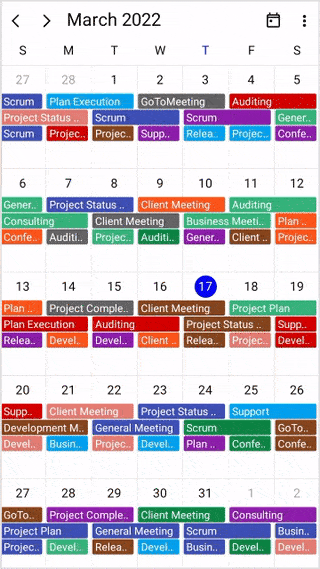
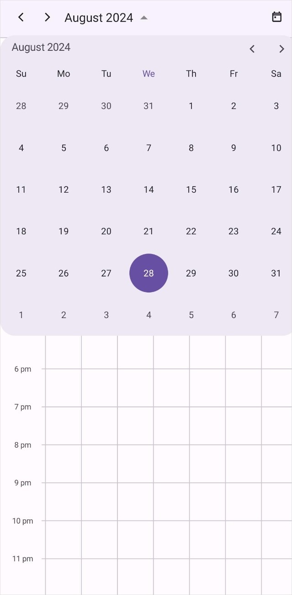

# Date Navigation and Restriction in .NET MAUI Scheduler

## Date navigation

The [.NET MAUI Scheduler](https://help.syncfusion.com/cr/maui/Syncfusion.Maui.Scheduler.SfScheduler.html) control allows to navigate through dates either programmatically or by using the [forward](https://help.syncfusion.com/cr/maui/Syncfusion.Maui.Scheduler.SfScheduler.html#Syncfusion_Maui_Scheduler_SfScheduler_Forward) and [backward](https://help.syncfusion.com/cr/maui/Syncfusion.Maui.Scheduler.SfScheduler.html#Syncfusion_Maui_Scheduler_SfScheduler_Backward) buttons, and it is applicable to all the Scheduler views.

N> 
Touch gesture is not working, as framework is facing an [issue](https://github.com/dotnet/maui/issues/3561) 

### Programmatic date navigation

The [DisplayDate](https://help.syncfusion.com/cr/maui/Syncfusion.Maui.Scheduler.SfScheduler.html#Syncfusion_Maui_Scheduler_SfScheduler_DisplayDate) property of [SfScheduler](https://help.syncfusion.com/cr/maui/Syncfusion.Maui.Scheduler.SfScheduler.html) programmatically navigates the dates in scheduler.









SfScheduler scheduler = new SfScheduler();
scheduler.View = SchedulerView.Week;
scheduler.DisplayDate = DateTime.Today.AddMonths(-1).AddHours(9);
this.Content = scheduler;




N> 
When navigating before a minimum date, the date will be reset to the scheduler minimum date, and when navigating beyond a maximum date, the date will be reset to the scheduler maximum date.

### Programmatic date selection

You can programmatically select the dates in scheduler by using the [SelectedDate](https://help.syncfusion.com/cr/maui/Syncfusion.Maui.Scheduler.SfScheduler.html#Syncfusion_Maui_Scheduler_SfScheduler_SelectedDate) property of [SfScheduler](https://help.syncfusion.com/cr/maui/Syncfusion.Maui.Scheduler.SfScheduler.html).









SfScheduler scheduler = new SfScheduler();
scheduler.View = SchedulerView.Week;
scheduler.SelectedDate = DateTime.Today.AddHours(9);
this.Content = scheduler;




N> It is not possible to use the `SelectedDate` to select before minimum display date time and beyond maximum display date time.

### Programmatically change to adjacent dates

The next and previous views can be accessed through swiping the control from right to left and left to right. With SfScheduler, the view can be changed programmatically as well.

#### Forward

The [SfScheduler](https://help.syncfusion.com/cr/maui/Syncfusion.Maui.Scheduler.SfScheduler.html) allows to view the next immediate date using the [Forward](https://help.syncfusion.com/cr/maui/Syncfusion.Maui.Scheduler.SfScheduler.html#Syncfusion_Maui_Scheduler_SfScheduler_Forward) method. If the scheduler view is month, it moves on to the next month, similarly for week and day views it moves on to the next day.




<Grid>
    <Grid.RowDefinitions>
        <RowDefinition />
        <RowDefinition Height="30" />
    </Grid.RowDefinitions>
    <scheduler:SfScheduler x:Name="Scheduler" 
                           View="Week" >
    </scheduler:SfScheduler>
    <Button x:Name="button" Text="Forward" Clicked="OnButtonClicked" GridLayout.Row="1" HorizontalOptions="FillAndExpand" VerticalOptions="FillAndExpand" />
</Grid>




this.button.Clicked += OnButtonClicked;

private void OnButtonClicked(object sender, EventArgs e)
{
    this.Scheduler.Forward();
}




#### Backward

The [SfScheduler](https://help.syncfusion.com/cr/maui/Syncfusion.Maui.Scheduler.SfScheduler.html) allows to view the previous immediate date using the [Backward](https://help.syncfusion.com/cr/maui/Syncfusion.Maui.Scheduler.SfScheduler.html#Syncfusion_Maui_Scheduler_SfScheduler_Backward) method. If the scheduler view is month, it moves on to the previous month, similarly for week and day views it moves on to the previous day.




<Grid>
    <Grid.RowDefinitions>
        <RowDefinition />
        <RowDefinition Height="30" />
    </Grid.RowDefinitions>
    <scheduler:SfScheduler x:Name="Scheduler" 
                           View="Week" >
    </scheduler:SfScheduler>
    <Button x:Name="button" Text="Backward" Clicked="OnButtonClicked" GridLayout.Row="1" HorizontalOptions="FillAndExpand" VerticalOptions="FillAndExpand" />
</Grid>




this.button.Clicked += OnButtonClicked;

private void OnButtonClicked(object sender, EventArgs e)
{
    this.Scheduler.Backward();
}




### Allow view navigation

By using the [AllowViewNavigation](https://help.syncfusion.com/cr/maui/Syncfusion.Maui.Scheduler.SfScheduler.html#Syncfusion_Maui_Scheduler_SfScheduler_AllowViewNavigation) property of the [SfScheduler](https://help.syncfusion.com/cr/maui/Syncfusion.Maui.Scheduler.SfScheduler.html), you can quickly navigate to the respective day or timeline day view by tapping on the month cell or view header of the following scheduler views: week, work week, month, agenda, timeline week, timeline work week, and timeline month views.




 <scheduler:SfScheduler x:Name="Scheduler" 
                        AllowViewNavigation="True">
 </scheduler:SfScheduler>




SfScheduler scheduler = new SfScheduler();
scheduler.AllowViewNavigation = true;
this.Content = scheduler;




N>
* The default value of `AllowViewNavigation` is `false.`
* The `AllowViewNavigation` is not applicable for the `day` and `timeline day` views.

### Show date picker

You can enable the date picker for the scheduler by using the `ShowDatePickerButton` property in the `SfScheduler`, which displays the date picker in the header view. It allows you to quickly switch between, months, years, decades or century where you can directly jump to a specific date by selecting it from a date picker.




 <scheduler:SfScheduler x:Name="Scheduler" 
                       ShowDatePickerButton="True">
</scheduler:SfScheduler>




SfScheduler scheduler = new SfScheduler();
scheduler.ShowDatePickerButton = true;
this.Content = scheduler;




{:width="325" height="600" loading="lazy" .lazy .shadow-effect .section-padding .img-padding}

### Allowed views

The [SfScheduler](https://help.syncfusion.com/cr/maui/Syncfusion.Maui.Scheduler.SfScheduler.html) allows to quickly switch between the different scheduler views using the [AllowedViews](https://help.syncfusion.com/cr/maui/Syncfusion.Maui.Scheduler.SfScheduler.html#Syncfusion_Maui_Scheduler_SfScheduler_AllowedViews) property. These views will display as a button in the scheduler header.
There will be more icons available for all platforms as this UI will be responsive.

The default value of [AllowedViews](https://help.syncfusion.com/cr/maui/Syncfusion.Maui.Scheduler.SfScheduler.html#Syncfusion_Maui_Scheduler_SfScheduler_AllowedViews) property is [SchedulerViews.Default](https://help.syncfusion.com/cr/maui/Syncfusion.Maui.Scheduler.SchedulerViews.html#Syncfusion_Maui_Scheduler_SchedulerViews_Default).




<scheduler:SfScheduler x:Name="Scheduler" 
                       AllowedViews="Day,Week,WorkWeek,Month,TimelineDay,TimelineWeek,TimelineWorkWeek,TimelineMonth" >
</scheduler:SfScheduler>




SfScheduler scheduler = new SfScheduler();
scheduler.AllowedViews = SchedulerViews.Day | SchedulerViews.Week | SchedulerViews.WorkWeek | SchedulerViews.Month | SchedulerViews.TimelineDay | SchedulerViews.TimelineWeek | SchedulerViews.TimelineWorkWeek | SchedulerViews.TimelineMonth;
this.Content = scheduler;




## Date restriction

In [.NET MAUI Scheduler](https://help.syncfusion.com/cr/maui/Syncfusion.Maui.Scheduler.SfScheduler.html), you can restrict the available dates to a range of dates using the properties [MinimumDateTime](https://help.syncfusion.com/cr/maui/Syncfusion.Maui.Scheduler.SfScheduler.html#Syncfusion_Maui_Scheduler_SfScheduler_MinimumDateTime), [MaximumDateTime](https://help.syncfusion.com/cr/maui/Syncfusion.Maui.Scheduler.SfScheduler.html#Syncfusion_Maui_Scheduler_SfScheduler_MaximumDateTime) and [SelectableDayPredicate](https://help.syncfusion.com/cr/maui/Syncfusion.Maui.Scheduler.SfScheduler.html#Syncfusion_Maui_Scheduler_SfScheduler_SelectableDayPredicate). It is applicable to all the Scheduler views.

### Change minimum display date and time

The minimum date time will restrict backward navigation of date selections as well as the ability to swipe the views beyond the minimum date range. Any dates that appear before the minimum date will be disabled. The default value of [MinimumDateTime](https://help.syncfusion.com/cr/maui/Syncfusion.Maui.Scheduler.SfScheduler.html#Syncfusion_Maui_Scheduler_SfScheduler_MinimumDateTime) is `DateTime.MinValue.`









SfScheduler scheduler = new SfScheduler();
scheduler.MinimumDateTime = DateTime.Today.AddMonths(-3).AddHours(9);
this.Content = scheduler;




### Change maximum display date and time

The maximum date time will restrict forward navigation of date selections as well as the ability to swipe the views beyond the maximum date range. Any dates that appear after the maximum date will be disabled. The default value of [MaximumDateTime](https://help.syncfusion.com/cr/maui/Syncfusion.Maui.Scheduler.SfScheduler.html#Syncfusion_Maui_Scheduler_SfScheduler_MaximumDateTime) is `DateTime.MaxValue .`









SfScheduler scheduler = new SfScheduler();
scheduler.MaximumDateTime = DateTime.Today.AddMonths(3).AddHours(12);
this.Content = scheduler;




### Selectable day predicate (Blackout dates)

The [SelectableDayPredicate](https://help.syncfusion.com/cr/maui/Syncfusion.Maui.Scheduler.SfScheduler.html#Syncfusion_Maui_Scheduler_SfScheduler_SelectableDayPredicate) functions allows certain days for selection. Only the days that `SelectableDayPredicate` returns true will be selectable in the Scheduler.









this.Scheduler.SelectableDayPredicate = (date) =>
{
    if (date.DayOfWeek == DayOfWeek.Sunday || date.DayOfWeek == DayOfWeek.Saturday)
    {
        return false;
    }

    return true;
};




#### Customizing the disabled date and time appearance

You can customize the background color and text style for the minimum date time, maximum date time, and selectable day predicate, by setting the [DisabledDateBackground](https://help.syncfusion.com/cr/maui/Syncfusion.Maui.Scheduler.SfScheduler.html#Syncfusion_Maui_Scheduler_SfScheduler_DisabledDateBackground), and [DisabledDateTextStyle](https://help.syncfusion.com/cr/maui/Syncfusion.Maui.Scheduler.SfScheduler.html#Syncfusion_Maui_Scheduler_SfScheduler_DisabledDateTextStyle) properties of [SfScheduler](https://help.syncfusion.com/cr/maui/Syncfusion.Maui.Scheduler.SfScheduler.html).









var disabledDateTextStyle = new SchedulerTextStyle()
{
    TextColor = Colors.Red,
    FontSize = 12,
};

this.Scheduler.DisabledDateTextStyle = disabledDateTextStyle;
this.Scheduler.DisabledDateBackground = Brush.LightSkyBlue;




N>
* The `DisabledDateTextStyle` and `DisabledDateBackground` properties will be applicable for the following properties such as `MinimumDateTime,` `MaximumDateTime,` and `SelectableDayPredicate` of the `SfScheduler.`
* The `DisabledDateBackground` property is not applicable for month cells and view header cells.