# Day and Week Views in .NET MAUI Event Scheduler (SfScheduler)

The [.NET MAUI Scheduler](https://help.syncfusion.com/cr/maui/Syncfusion.Maui.Scheduler.SfScheduler.html) provides the ability to display the day, week, workweek views, and the current day will be visible by default. The appointments on a specific day will be arranged in the respective timeslots based on their duration.

* **Day view**: It displays a single day of the Scheduler.

* **Week view**: It displays all the days of a week.

* **Work week view**: It displays only the working days of a week. By default, Saturday and Sunday are not working days. It can be customized with any day of the week.

## Number of days visible in the days view 

The [.NET MAUI Scheduler](https://help.syncfusion.com/cr/maui/Syncfusion.Maui.Scheduler.SfScheduler.html) number of visible days in the day, week, and workweek can be adjusted by changing the [NumberOfVisibleDays](https://help.syncfusion.com/cr/maui/Syncfusion.Maui.Scheduler.SchedulerTimeSlotView.html#Syncfusion_Maui_Scheduler_SchedulerTimeSlotView_NumberOfVisibleDaysProperty) property of the [DaysView](https://help.syncfusion.com/cr/maui/Syncfusion.Maui.Scheduler.SchedulerDaysView.html).




 <scheduler:SfScheduler x:Name="Scheduler" 
                        View="Week">
    <scheduler:SfScheduler.DaysView>
        <scheduler:SchedulerDaysView 
                        NumberOfVisibleDays="3"/>
    </scheduler:SfScheduler.DaysView>
 </scheduler:SfScheduler>




SfScheduler scheduler = new SfScheduler();
scheduler.View = SchedulerView.Week;
scheduler.DaysView.NumberOfVisibleDays = 3;
this.Content = scheduler;




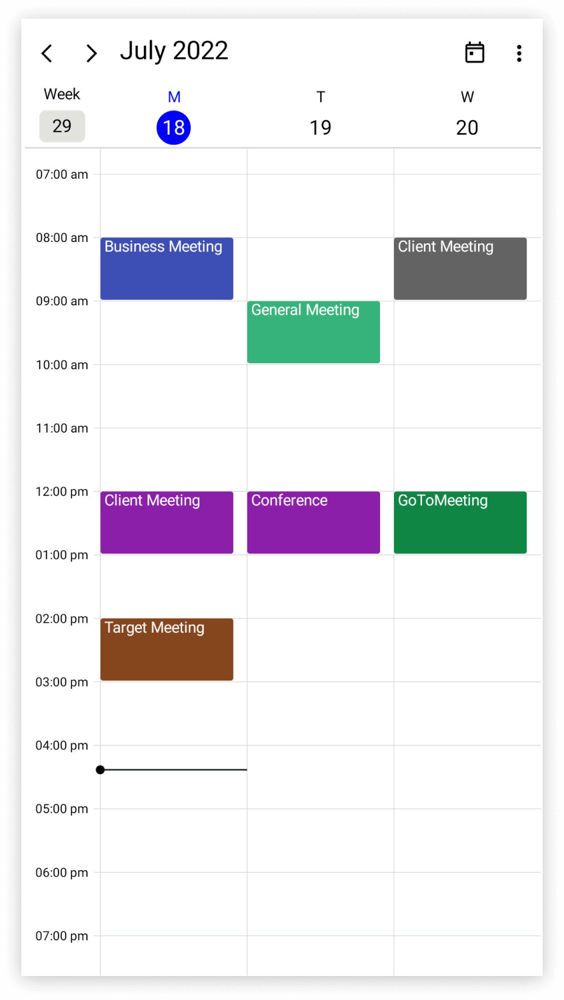

## Change time interval

The time interval between the time slots in the day, week, and workweek views can be customized by using the [TimeInterval](https://help.syncfusion.com/cr/maui/Syncfusion.Maui.Scheduler.SchedulerTimeSlotView.html#Syncfusion_Maui_Scheduler_SchedulerTimeSlotView_TimeInterval) property of the [DaysView](https://help.syncfusion.com/cr/maui/Syncfusion.Maui.Scheduler.SchedulerDaysView.html).




 <scheduler:SfScheduler x:Name="Scheduler" 
                        View="Week">
    <scheduler:SfScheduler.DaysView>
        <scheduler:SchedulerDaysView 
                        TimeInterval="2:0:0" />
    </scheduler:SfScheduler.DaysView>
 </scheduler:SfScheduler>




SfScheduler scheduler = new SfScheduler();
scheduler.View = SchedulerView.Week;
scheduler.DaysView.TimeInterval = new TimeSpan(2, 0, 0);
this.Content = scheduler;




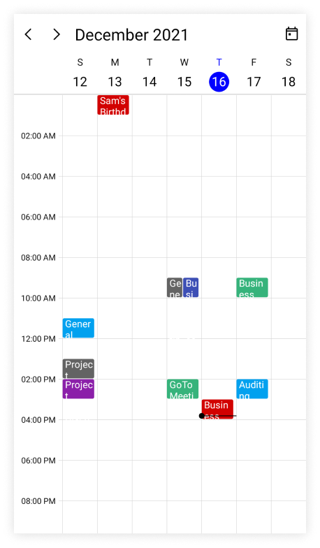

N> To modify the `TimeInterval` value (in minutes), change the time labels format by setting the `TimeRulerFormat` value to hh:mm.

## Change time interval height

The time interval height can be customized for each time slot cell of the day, week, and workweek view by using the [TimeIntervalHeight](https://help.syncfusion.com/cr/maui/Syncfusion.Maui.Scheduler.SchedulerDaysView.html#Syncfusion_Maui_Scheduler_SchedulerDaysView_TimeIntervalHeight) property of [DaysView](https://help.syncfusion.com/cr/maui/Syncfusion.Maui.Scheduler.SchedulerDaysView.html).




<scheduler:SfScheduler x:Name="Scheduler" 
                       View="Week">
    <scheduler:SfScheduler.DaysView>
        <scheduler:SchedulerDaysView       
                       TimeIntervalHeight="120"/>
    </scheduler:SfScheduler.DaysView>
</scheduler:SfScheduler>




SfScheduler scheduler = new SfScheduler();
scheduler.View = SchedulerView.Week;
scheduler.DaysView.TimeIntervalHeight = 120;
this.Content = scheduler;




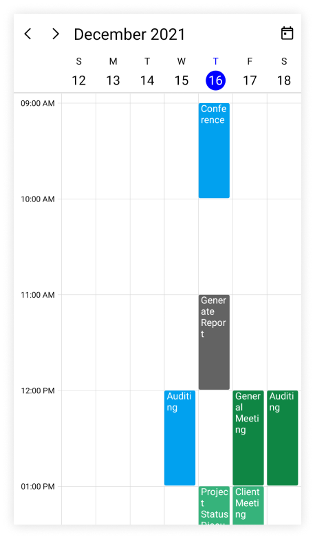

## Flexible working days

By default, the [.NET MAUI Scheduler](https://help.syncfusion.com/cr/maui/Syncfusion.Maui.Scheduler.SfScheduler.html) considers the weekdays from Monday to Friday as working days. The days which are defined in this non-working days collection are considered as `non-working days.` Therefore, the weekend days are set to hide from the Scheduler.

The [NonWorkingDays](https://help.syncfusion.com/cr/maui/Syncfusion.Maui.Scheduler.SchedulerTimeSlotView.html#Syncfusion_Maui_Scheduler_SchedulerTimeSlotView_NonWorkingDays) property of [DaysView](https://help.syncfusion.com/cr/maui/Syncfusion.Maui.Scheduler.SchedulerDaysView.html) can also be used to show only the nonworking days of the week.




 <scheduler:SfScheduler x:Name="Scheduler" 
                        View="WorkWeek">
    <scheduler:SfScheduler.DaysView>
        <scheduler:SchedulerDaysView       
                       NonWorkingDays="Monday,Wednesday" />
    </scheduler:SfScheduler.DaysView>
 </scheduler:SfScheduler>




SfScheduler scheduler = new SfScheduler();
scheduler.View = SchedulerView.WorkWeek;
scheduler.DaysView.NonWorkingDays = SchedulerWeekDays.Monday | SchedulerWeekDays.Wednesday;
this.Content = scheduler;




N> The `workweek` view displays exactly the defined working days on Scheduler control, whereas other views displays all the days.

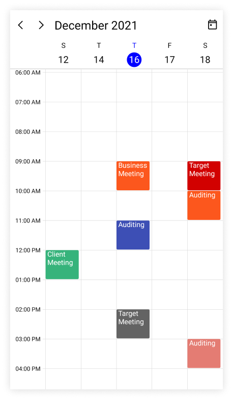

## Flexible working hours

The default values for [StartHour](https://help.syncfusion.com/cr/maui/Syncfusion.Maui.Scheduler.SchedulerTimeSlotView.html#Syncfusion_Maui_Scheduler_SchedulerTimeSlotView_StartHour) and [EndHour](https://help.syncfusion.com/cr/maui/Syncfusion.Maui.Scheduler.SchedulerTimeSlotView.html#Syncfusion_Maui_Scheduler_SchedulerTimeSlotView_EndHour) are `0` and `24` respectively, to show all the time slots for a day, week, or workweek view. These properties may be set to show only the required time periods in [DaysView](https://help.syncfusion.com/cr/maui/Syncfusion.Maui.Scheduler.SchedulerDaysView.html). The `StartHour` and `EndHour` in time duration can be set to show the required time duration in minutes.




<scheduler:SfScheduler x:Name="Scheduler" 
                       View="Week">
    <scheduler:SfScheduler.DaysView>
        <scheduler:SchedulerDaysView       
                       StartHour="9"
                       EndHour="16" />
    </scheduler:SfScheduler.DaysView>
</scheduler:SfScheduler>




SfScheduler scheduler = new SfScheduler();
scheduler.View = SchedulerView.Week;
scheduler.DaysView.StartHour = 9;
scheduler.DaysView.EndHour = 16;
this.Content = scheduler;




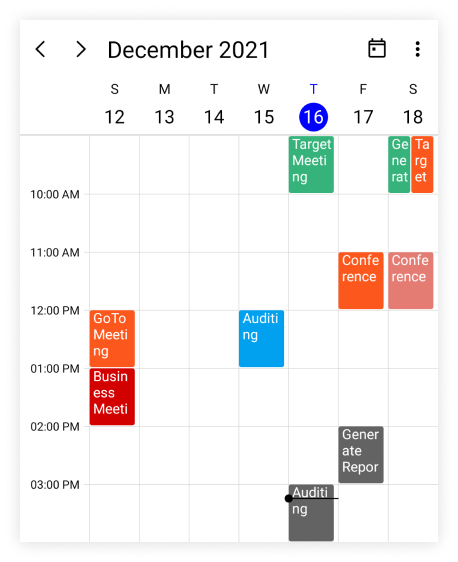

N>
* The `NonWorkingDays` property will be applicable only for `workweek` and `Timeline workweek` views only. It is not applicable for the remaining views.
* No need to specify the decimal point values for `StartHour` and `EndHour`, if you do not want to set the minutes.
* The number of time slots will be calculated based on the total minutes of a day and time interval (total minutes of a day ((start hour - end hour) * 60) / time interval).
* If a custom timeInterval is given, then the number of time slots calculated based on the given `TimeInterval` should result in an integer value (total minutes % timeInterval = 0), otherwise the next immediate time interval that results in integer value when dividing total minutes of a day will be considered. For example, if TimeInterval=2 Hours 15 minutes and total minutes = 1440 (24 Hours per day), then the `TimeInterval` will be changed to ‘144’ (1440%144=0) by considering (total minutes % TimeInterval = 0), it will return integer value for time slots rendering.
* If the custom `StartHour` and `EndHour` are given, then the number of time slots calculated based on the given `StartHour` and `EndHour` should result in integer value, otherwise the next immediate `TimeInterval` will be considered until the result is integer value. For example, if the `StartHour` is 9 (09:00AM), `EndHour` is 18.25 (06:15 PM), `TimeInterval` is 30 minutes, and total minutes = 555 ((18.25-9)*60), then the `TimeInterval` will be changed to ’37 minutes’ (555%37=0) by considering (total minutes % timeInterval = 0) it will return the integer value for time slots rendering.

N> [View sample in GitHub](https://github.com/SyncfusionExamples/maui-scheduler-examples/tree/main/HighlightWorkingHour)

## Special time regions

The user interaction such as selection and highlights specific regions of day, week, and workweek views can be restricted by adding the [TimeRegions](https://help.syncfusion.com/cr/maui/Syncfusion.Maui.Scheduler.SchedulerTimeSlotView.html#Syncfusion_Maui_Scheduler_SchedulerTimeSlotView_TimeRegions) property of the [DaysView](https://help.syncfusion.com/cr/maui/Syncfusion.Maui.Scheduler.SchedulerDaysView.html) in the [SfScheduler](https://help.syncfusion.com/cr/maui/Syncfusion.Maui.Scheduler.SfScheduler.html). Set the [StartTime](https://help.syncfusion.com/cr/maui/Syncfusion.Maui.Scheduler.SchedulerRegionBase.html#Syncfusion_Maui_Scheduler_SchedulerRegionBase_StartTime) and [EndTime](https://help.syncfusion.com/cr/maui/Syncfusion.Maui.Scheduler.SchedulerRegionBase.html#Syncfusion_Maui_Scheduler_SchedulerRegionBase_EndTime) properties of `TimeRegions` to create a specialTimeRegion. Use the [TimeZone](https://help.syncfusion.com/cr/maui/Syncfusion.Maui.Scheduler.SchedulerTimeRegion.html#Syncfusion_Maui_Scheduler_SchedulerTimeRegion_TimeZone) property to set the specific timezone for start and end time of `TimeRegions.`

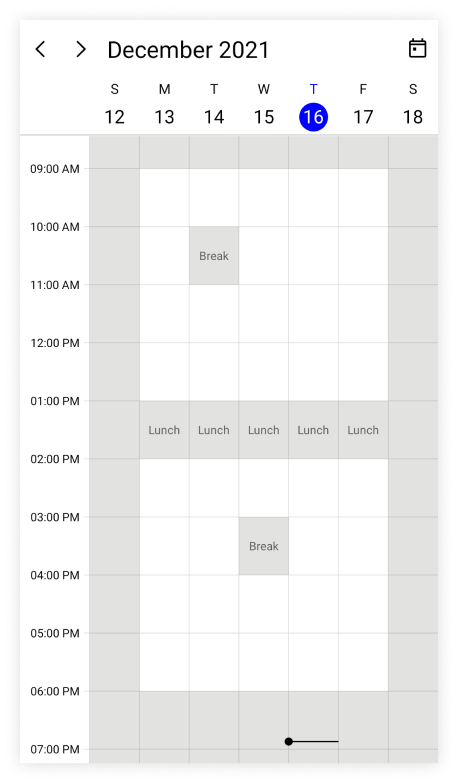

### Selection restriction in timeslots

Enable or disable the touch interaction of TimeRegion using the [EnablePointerInteraction](https://help.syncfusion.com/cr/maui/Syncfusion.Maui.Scheduler.SchedulerTimeRegion.html#Syncfusion_Maui_Scheduler_SchedulerTimeRegion_EnablePointerInteraction) property of [TimeRegion](https://help.syncfusion.com/cr/maui/Syncfusion.Maui.Scheduler.SchedulerTimeRegion.html). By default, its value is `true.`









this.Scheduler.View = SchedulerView.Week;
this.Scheduler.DaysView.TimeRegions = this.GetTimeRegion();

private ObservableCollection<SchedulerTimeRegion> GetTimeRegion()
{
    var timeRegions = new ObservableCollection<SchedulerTimeRegion>();
    var timeRegion = new SchedulerTimeRegion()
    {
        StartTime = DateTime.Today.Date.AddHours(13),
        EndTime = DateTime.Today.Date.AddHours(14),
        Text = "Lunch",
        EnablePointerInteraction = false,
    };

    timeRegions.Add(timeRegion);
    return timeRegions;
}




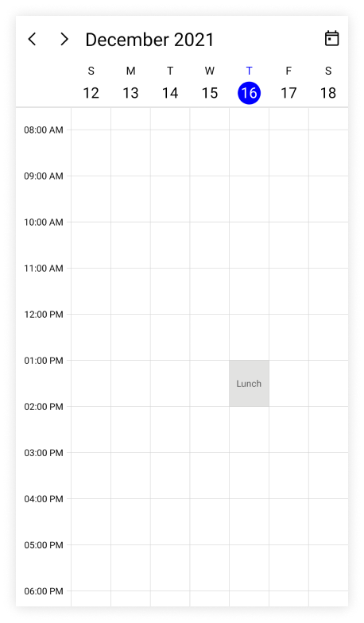

N> This property only restricts the interaction on region and it does not restrict the following:
* The Programmatic selection (if the user updates the selected date value dynamically).
* It does not clear the selection when the user selects the region and dynamically change the `EnablePointerInteraction` property to false.
* It does not restrict appointment interaction when the appointment placed in the region.
* It does not restrict the appointment interaction when the appointment is placed in the region.

### Recurring time region

The recurring time region on a daily, weekly, monthly, or yearly interval. The recurring special time regions can be created by setting the [RecurrenceRule](https://help.syncfusion.com/cr/maui/Syncfusion.Maui.Scheduler.SchedulerRegionBase.html#Syncfusion_Maui_Scheduler_SchedulerRegionBase_RecurrenceRule) property in [TimeRegion](https://help.syncfusion.com/cr/maui/Syncfusion.Maui.Scheduler.SchedulerTimeRegion.html)









this.Scheduler.View = SchedulerView.Week;
this.Scheduler.DaysView.TimeRegions = this.GetTimeRegion();

private ObservableCollection<SchedulerTimeRegion> GetTimeRegion()
{
    var timeRegions = new ObservableCollection<SchedulerTimeRegion>();
    var timeRegion = new SchedulerTimeRegion()
    {
        StartTime = DateTime.Today.Date.AddHours(13),
        EndTime = DateTime.Today.Date.AddHours(14),
        Text = "Lunch",
        EnablePointerInteraction = false,
        RecurrenceRule = "FREQ=DAILY;INTERVAL=1",
    };

    timeRegions.Add(timeRegion);
    return timeRegions;
}




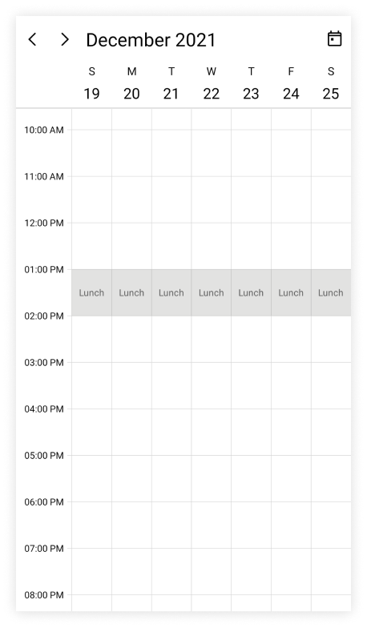

N> [View sample in GitHub](https://github.com/SyncfusionExamples/maui-scheduler-examples/tree/main/HighlightNonWorkingHour)

### Recurrence exception dates

Any of occurrence that is an exception from the recurrence pattern time region can be deleted by using the [RecurrenceExceptionDates](https://help.syncfusion.com/cr/maui/Syncfusion.Maui.Scheduler.SchedulerRegionBase.html#Syncfusion_Maui_Scheduler_SchedulerRegionBase_RecurrenceExceptionDates) property of [TimeRegion](https://help.syncfusion.com/cr/maui/Syncfusion.Maui.Scheduler.SchedulerTimeRegion.html) The deleted occurrence date will be considered as a recurrence exception date.









this.Scheduler.View = SchedulerView.Week;
this.Scheduler.DaysView.TimeRegions = this.GetTimeRegion();

private ObservableCollection<SchedulerTimeRegion> GetTimeRegion()
{
    var timeRegions = new ObservableCollection<SchedulerTimeRegion>();
    var recurrenceExceptionDates = DateTime.Now.Date.AddDays(3);
    var timeRegion = new SchedulerTimeRegion()
    {
        StartTime = DateTime.Today.Date.AddHours(13),
        EndTime = DateTime.Today.Date.AddHours(14),
        Text = "Lunch",
        EnablePointerInteraction = false,
        RecurrenceRule = "FREQ=DAILY;INTERVAL=1",
        RecurrenceExceptionDates = new ObservableCollection<DateTime>()
        {
            recurrenceExceptionDates,
        }
    };

    timeRegions.Add(timeRegion);
    return timeRegions;
}




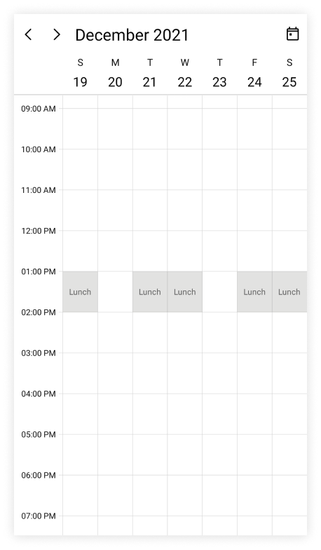

### Customize special time region appearance

The special time region appearance customization can be achieved by using the [TextStyle](https://help.syncfusion.com/cr/maui/Syncfusion.Maui.Scheduler.SchedulerTimeRegion.html#Syncfusion_Maui_Scheduler_SchedulerTimeRegion_TextStyle) and [TimeRegionTemplate](https://help.syncfusion.com/cr/maui/Syncfusion.Maui.Scheduler.SchedulerTimeSlotView.html#Syncfusion_Maui_Scheduler_SchedulerTimeSlotView_TimeRegionTemplate) properties of [DaysView](https://help.syncfusion.com/cr/maui/Syncfusion.Maui.Scheduler.SchedulerDaysView.html) in the [SfScheduler](https://help.syncfusion.com/cr/maui/Syncfusion.Maui.Scheduler.SfScheduler.html).

#### Customize special time region appearance using style

The specialTimeRegion background and text style can be customized by using the [Background](https://help.syncfusion.com/cr/maui/Syncfusion.Maui.Scheduler.SchedulerRegionBase.html#Syncfusion_Maui_Scheduler_SchedulerRegionBase_Background) and [TextStyle](https://help.syncfusion.com/cr/maui/Syncfusion.Maui.Scheduler.SchedulerTimeRegion.html#Syncfusion_Maui_Scheduler_SchedulerTimeRegion_TextStyle) properties of [TimeRegion](https://help.syncfusion.com/cr/maui/Syncfusion.Maui.Scheduler.SchedulerTimeRegion.html). It is used to customize the background color for time region background and text style for the text of the specialTimeRegion.









this.Scheduler.View = SchedulerView.Week;
this.Scheduler.DaysView.TimeRegions = this.GetTimeRegion();

private ObservableCollection<SchedulerTimeRegion> GetTimeRegion()
{
    var textStyle = new SchedulerTextStyle()
    {
        TextColor = Colors.DarkBlue,
        FontSize = 14,
    };

    var timeRegions = new ObservableCollection<SchedulerTimeRegion>();
    var timeRegion = new SchedulerTimeRegion()
    {
        StartTime = DateTime.Today.Date.AddHours(13),
        EndTime = DateTime.Today.Date.AddHours(14),
        Text = "Lunch",
        EnablePointerInteraction = false,
        Background = Brush.Orange,
        TextStyle = textStyle
    };

    timeRegions.Add(timeRegion);
    return timeRegions;
}




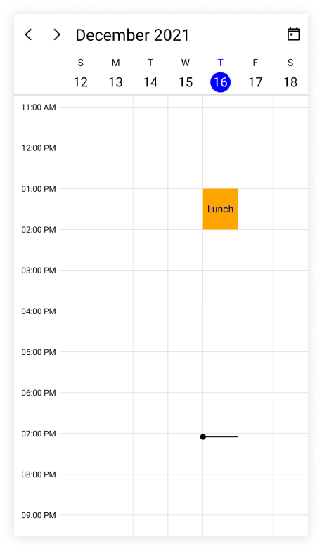

#### Customize special time region appearance using DataTemplate

You can customize the time region appearance by using the [TimeRegionTemplate](https://help.syncfusion.com/cr/maui/Syncfusion.Maui.Scheduler.SchedulerTimeSlotView.html#Syncfusion_Maui_Scheduler_SchedulerTimeSlotView_TimeRegionTemplate) property of [DaysView](https://help.syncfusion.com/cr/maui/Syncfusion.Maui.Scheduler.SchedulerDaysView.html) in the [SfScheduler](https://help.syncfusion.com/cr/maui/Syncfusion.Maui.Scheduler.SfScheduler.html).




 <scheduler:SfScheduler x:Name="Scheduler" 
                        View="Week">
    <scheduler:SfScheduler.DaysView>
        <scheduler:SchedulerDaysView>
            <scheduler:SchedulerDaysView.TimeRegionTemplate>
                <DataTemplate>
                    <Grid Background="MediumPurple" >
                        <Label x:Name="label" HorizontalOptions="Center" FontSize="10" TextColor="Yellow" VerticalOptions="Center" Text="{Binding Text}" />
                    </Grid>
                </DataTemplate>
            </scheduler:SchedulerDaysView.TimeRegionTemplate>
        </scheduler:SchedulerDaysView>
    </scheduler:SfScheduler.DaysView>
 </scheduler:SfScheduler>




this.Scheduler.View = SchedulerView.Week;
this.Scheduler.DaysView.TimeRegions = this.GetTimeRegion();

private ObservableCollection<SchedulerTimeRegion> GetTimeRegion()
{
    var timeRegions = new ObservableCollection<SchedulerTimeRegion>();
    var timeRegion = new SchedulerTimeRegion()
    {
        StartTime = DateTime.Today.Date.AddHours(13),
        EndTime = DateTime.Today.Date.AddHours(14),
        Text = "Lunch",
        EnablePointerInteraction = false,
        Background = Brush.Orange,
    };

    timeRegions.Add(timeRegion);
    return timeRegions;
}




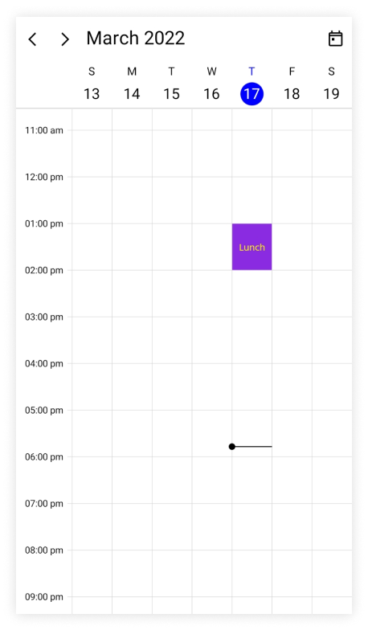

#### Customize special time region appearance using DataTemplateSelector

You can customize the time region appearance by using the [TimeRegionTemplate](https://help.syncfusion.com/cr/maui/Syncfusion.Maui.Scheduler.SchedulerTimeSlotView.html#Syncfusion_Maui_Scheduler_SchedulerTimeSlotView_TimeRegionTemplate) property of [DaysView](https://help.syncfusion.com/cr/maui/Syncfusion.Maui.Scheduler.SchedulerDaysView.html) in the [SfScheduler](https://help.syncfusion.com/cr/maui/Syncfusion.Maui.Scheduler.SfScheduler.html). The `DataTemplateSelector` can choose a `DataTemplate` at runtime based on the value of a data-bound to scheduler time region by using the `TimeRegionTemplate.` It allows you to choose a different data template for each time region, as well as customize the appearance of a particular time region based on certain conditions.




<Grid>
    <Grid.Resources>
        <DataTemplate x:Key="timeRegiontemplate">
            <Grid Background = "LightCyan" Opacity="0.5">
                <Label x:Name="label" HorizontalOptions="Center" TextColor="Red" Text="{Binding Text}" VerticalOptions="Center" />
            </Grid>
        </DataTemplate>
        <DataTemplate x:Key="timeRegiontemplate1">
            <Grid Background = "Lightgreen" Opacity="0.5">
                <Label x:Name="label" HorizontalOptions="Center" TextColor="Orange" Text="{Binding Text}" VerticalOptions="Center" />
            </Grid>
        </DataTemplate>
        <local:TimeRegionTemplateSelector x:Key="timeRegionTemplateSelector"  TimeRegionsTemplate="{StaticResource timeRegiontemplate}"  TimeRegionsTemplate1="{StaticResource timeRegiontemplate1}" />
    </Grid.Resources>
     <scheduler:SfScheduler x:Name="Scheduler" 
                            View="Week">
        <scheduler:SfScheduler.DaysView>
            <scheduler:SchedulerDaysView 
                            TimeRegionTemplate="{StaticResource timeRegionTemplateSelector}" />
        </scheduler:SfScheduler.DaysView>
    </scheduler:SfScheduler>
</Grid>




public class TimeRegionTemplateSelector : DataTemplateSelector
{
    public TimeRegionTemplateSelector()
    {
    }
    public DataTemplate TimeRegionsTemplate { get; set; }
    public DataTemplate TimeRegionsTemplate1 { get; set; }
    protected override DataTemplate OnSelectTemplate(object item, BindableObject container)
    {
        var timeRegionDetails = item as SchedulerTimeRegion;
        if (timeRegionDetails.EnablePointerInteraction)
            return TimeRegionsTemplate;
        return TimeRegionsTemplate1;
    }
}

  


this.Scheduler.View = SchedulerView.Week;
this.Scheduler.DaysView.TimeRegions = this.GetTimeRegion();

private ObservableCollection<SchedulerTimeRegion> GetTimeRegion()
{
    var timeRegions = new ObservableCollection<SchedulerTimeRegion>();
    var timeRegion = new SchedulerTimeRegion()
    {
        StartTime = DateTime.Today.Date.AddHours(13),
        EndTime = DateTime.Today.Date.AddHours(14),
        Text = "Lunch",
        RecurrenceRule = "FREQ=DAILY;INTERVAL=1",
        EnablePointerInteraction = true,
    };
    var timeRegion1 = new SchedulerTimeRegion()
    {
        StartTime = DateTime.Today.Date.AddHours(17),
        EndTime = DateTime.Today.Date.AddHours(18),
        Text = "Break",
        RecurrenceRule = "FREQ=DAILY;INTERVAL=1",
        Background = Brush.Red,
        EnablePointerInteraction = false,
    };
    timeRegions.Add(timeRegion);
    timeRegions.Add(timeRegion1);
    return timeRegions;
}

 


N>
* The BindingContext of the `TimeRegionTemplate` is the `SchedulerTimeRegion.`
* When using data template selector, performance issues occur as the conversion template views take time within the framework.

## Full screen scheduler

The [.NET MAUI Scheduler](https://help.syncfusion.com/cr/maui/Syncfusion.Maui.Scheduler.SfScheduler.html) time interval height can be adjusted based on screen height by changing the [TimeIntervalHeight](https://help.syncfusion.com/cr/maui/Syncfusion.Maui.Scheduler.SchedulerDaysView.html#Syncfusion_Maui_Scheduler_SchedulerDaysView_TimeIntervalHeight) property of [DaysView](https://help.syncfusion.com/cr/maui/Syncfusion.Maui.Scheduler.SchedulerDaysView.html) to `-1.` It will auto-fit the day, week and work week views to the screen height.




 <scheduler:SfScheduler x:Name="Scheduler" 
                        View="Week">
    <scheduler:SfScheduler.DaysView>
        <scheduler:SchedulerDaysView 
                        TimeIntervalHeight="-1"/>
    </scheduler:SfScheduler.DaysView>
 </scheduler:SfScheduler>




SfScheduler scheduler = new SfScheduler();
scheduler.View = SchedulerView.Week;
scheduler.DaysView.TimeIntervalHeight = -1;
this.Content = scheduler;




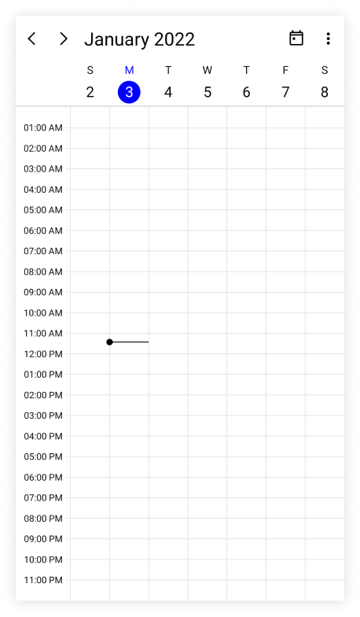

## Show current time indicator

You can show or hide the current time indicator in day, week, and workweek views of [SfScheduler](https://help.syncfusion.com/cr/maui/Syncfusion.Maui.Scheduler.SfScheduler.html) by using the [ShowCurrentTimeIndicator](https://help.syncfusion.com/cr/maui/Syncfusion.Maui.Scheduler.SchedulerTimeSlotView.html#Syncfusion_Maui_Scheduler_SchedulerTimeSlotView_ShowCurrentTimeIndicator) property of [DaysView](https://help.syncfusion.com/cr/maui/Syncfusion.Maui.Scheduler.SchedulerDaysView.html), and by default, its `true.`




<scheduler:SfScheduler x:Name="Scheduler" 
                       View="Week">
    <scheduler:SfScheduler.DaysView>
            <scheduler:SchedulerDaysView 
                       ShowCurrentTimeIndicator="False"/>
    </scheduler:SfScheduler.DaysView>
</scheduler:SfScheduler>




SfScheduler scheduler = new SfScheduler();
scheduler.View = SchedulerView.Week;
scheduler.DaysView.ShowCurrentTimeIndicator = false;
this.Content = scheduler;




#### Customize current time indicator appearance

The current time indicator can be customized by using the [CurrentTimeIndicatorBrush](https://help.syncfusion.com/cr/maui/Syncfusion.Maui.Scheduler.SchedulerTimeSlotView.html#Syncfusion_Maui_Scheduler_SchedulerTimeSlotView_CurrentTimeIndicatorBrush) property of [DaysView](https://help.syncfusion.com/cr/maui/Syncfusion.Maui.Scheduler.SchedulerDaysView.html) in the [SfScheduler](https://help.syncfusion.com/cr/maui/Syncfusion.Maui.Scheduler.SfScheduler.html).




<scheduler:SfScheduler x:Name="Scheduler" 
                       View="Week">
    <scheduler:SfScheduler.DaysView>
            <scheduler:SchedulerDaysView 
                       CurrentTimeIndicatorBrush="Blue"/>
    </scheduler:SfScheduler.DaysView>
</scheduler:SfScheduler>




SfScheduler scheduler = new SfScheduler();
scheduler.View = SchedulerView.Week;
scheduler.DaysView.CurrentTimeIndicatorBrush = Brush.Blue;
this.Content = scheduler;




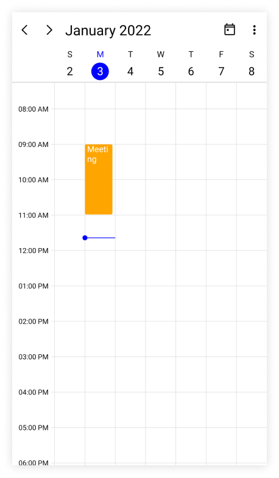

N>
The current time indicator color is applied only when the`ShowCurrentTimeIndicator` property is enabled.

## Change time ruler width

The [TimeRulerWidth](https://help.syncfusion.com/cr/maui/Syncfusion.Maui.Scheduler.SchedulerDaysView.html#Syncfusion_Maui_Scheduler_SchedulerDaysView_TimeRulerWidth) property of [DaysView](https://help.syncfusion.com/cr/maui/Syncfusion.Maui.Scheduler.SchedulerDaysView.html) can be used to customize the size of the time ruler view where the labels with the time are placed.




<scheduler:SfScheduler x:Name="Scheduler" 
                       View="Week">
    <scheduler:SfScheduler.DaysView>
        <scheduler:SchedulerDaysView 
                       TimeRulerWidth="120"/>
    </scheduler:SfScheduler.DaysView>
</scheduler:SfScheduler>




SfScheduler scheduler = new SfScheduler();
scheduler.View = SchedulerView.Week;
scheduler.DaysView.TimeRulerWidth = 120;
this.Content = scheduler;




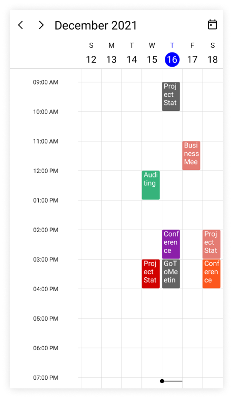

## Minimum appointment duration

The [MinimumAppointmentDuration](https://help.syncfusion.com/cr/maui/Syncfusion.Maui.Scheduler.SchedulerTimeSlotView.html#Syncfusion_Maui_Scheduler_SchedulerTimeSlotView_MinimumAppointmentDuration) property allows to set an arbitrary height to appointments which have a minimum duration in the day, week, and workweek views so that the subject can be readable.




 <scheduler:SfScheduler x:Name="Scheduler" 
                        View="Week">
    <scheduler:SfScheduler.DaysView>
        <scheduler:SchedulerDaysView 
                       MinimumAppointmentDuration="0:30:0" />
        </scheduler:SfScheduler.DaysView>
 </scheduler:SfScheduler>




SfScheduler scheduler = new SfScheduler();
scheduler.View = SchedulerView.Week;
scheduler.DaysView.MinimumAppointmentDuration = new TimeSpan(0, 30, 0);
this.Content = scheduler;




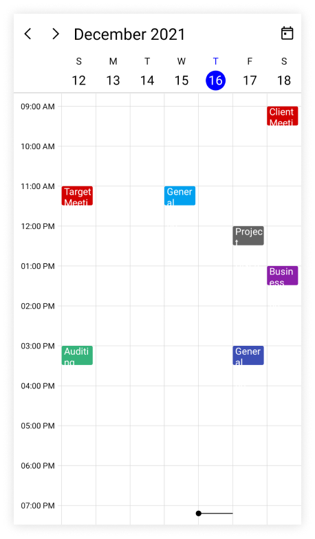

N>
*  The `MinimumAppointmentDuration` value will be set when an appointment duration value is lesser than `MinimumAppointmentDuration.`
* The appointment duration value will be set when the appointment duration value is greater than the `MinimumAppointmentDuration.`
*  The `TimeInterval` value will be set when the `MinimumAppointmentDuration` is greater than the `TimeInterval` with lesser appointment duration.
* The all-day appointment does not support `MinimumAppointmentDuration.`

N>
* [View scheduler appointment sample in GitHub](https://github.com/SyncfusionExamples/maui-scheduler-examples/tree/main/GettingStarted)
* [View business object sample in GitHub](https://github.com/SyncfusionExamples/maui-scheduler-examples/tree/main/BusinessObject)

## Customize the appearance of all-day appointments using DataTemplate in the all-day panel

You can customize the all-day appointment appearance by using the [AllDayAppointmentTemplate](https://help.syncfusion.com/cr/maui/Syncfusion.Maui.Scheduler.SchedulerDaysView.html#Syncfusion_Maui_Scheduler_SchedulerDaysView_AllDayAppointmentTemplate) property of [DaysView](https://help.syncfusion.com/cr/maui/Syncfusion.Maui.Scheduler.SchedulerDaysView.html) in the [SfScheduler](https://help.syncfusion.com/cr/maui/Syncfusion.Maui.Scheduler.SfScheduler.html).




 <scheduler:SfScheduler x:Name="Scheduler" View="Week">
    <scheduler:SfScheduler.DaysView>
        <scheduler:SchedulerDaysView>
            <scheduler:SchedulerDaysView.AllDayAppointmentTemplate>
                <DataTemplate>
                    <Grid Background="MediumPurple">
                        <Label Text="{Binding Subject}" TextColor="White" HorizontalOptions="Center" VerticalOptions="Center" FontSize="12" FontFamily="Bold"/>
                    </Grid>
                </DataTemplate>
            </scheduler:SchedulerDaysView.AllDayAppointmentTemplate>
        </scheduler:SchedulerDaysView>
    </scheduler:SfScheduler.DaysView>
 </scheduler:SfScheduler>




this.Scheduler.View = SchedulerView.Week;
// Creating an instance for the scheduler appointment collection.
var appointments = new ObservableCollection<SchedulerAppointment>();

for (int i = 1; i <= 5; i++)
{
    //Adding scheduler appointment in the scheduler appointment collection. 
    appointments.Add(new SchedulerAppointment()
    {
        StartTime = DateTime.Today.AddHours(9),
        EndTime = DateTime.Today.AddHours(11),
        Subject = "Client Meeting",
        Location = "Hutchison road",
        IsAllDay = true
    });
}

//Adding the scheduler appointment collection to the AppointmentsSource of .NET MAUI Scheduler.
this.Scheduler.AppointmentsSource = appointments;




## Customize the appearance of more appointments indicator using DataTemplate in the all-day panel

You can customize the default appearance of more appointments indicator in an all-day panel by using the [MoreAppointmentsTemplate](https://help.syncfusion.com/cr/maui/Syncfusion.Maui.Scheduler.SchedulerDaysView.html#Syncfusion_Maui_Scheduler_SchedulerDaysView_MoreAppointmentsTemplate) property of [DaysView](https://help.syncfusion.com/cr/maui/Syncfusion.Maui.Scheduler.SchedulerDaysView.html) in the [SfScheduler](https://help.syncfusion.com/cr/maui/Syncfusion.Maui.Scheduler.SfScheduler.html).




  <scheduler:SfScheduler x:Name="Scheduler" View="Week">
        <scheduler:SfScheduler.DaysView>
            <scheduler:SchedulerDaysView>
                <scheduler:SchedulerDaysView.MoreAppointmentsTemplate>
                    <DataTemplate>
                        <StackLayout Background="#EAEAEA" HorizontalOptions="FillAndExpand" VerticalOptions="FillAndExpand">
                            <Label Text="{Binding}" TextColor="Black" HorizontalTextAlignment="Center" VerticalTextAlignment="Center">
                            </Label>
                        </StackLayout>
                    </DataTemplate>
                </scheduler:SchedulerDaysView.MoreAppointmentsTemplate>
            </scheduler:SchedulerDaysView>
        </scheduler:SfScheduler.DaysView>
   </scheduler:SfScheduler>
   



this.Scheduler.View = SchedulerView.Week;
// Creating an instance for the scheduler appointment collection.
var appointments = new ObservableCollection<SchedulerAppointment>();
for (int i = 1; i <= 5; i++)
{
    //Adding scheduler appointment in the scheduler appointment collection. 
    appointments.Add(new SchedulerAppointment()
    {
        StartTime = DateTime.Today.AddHours(9),
        EndTime = DateTime.Today.AddHours(11),
        Subject = "Client Meeting",
        Location = "Hutchison road",
        Background = Brush.Orange,
        IsAllDay = true
    });
}

//Adding the scheduler appointment collection to the AppointmentsSource of .NET MAUI Scheduler.
this.Scheduler.AppointmentsSource = appointments;




## View header

You can customize the default appearance of view header in a day, week, and work week views by setting the [DateFormat](https://help.syncfusion.com/cr/maui/Syncfusion.Maui.Scheduler.SchedulerViewHeaderSettings.html#Syncfusion_Maui_Scheduler_SchedulerViewHeaderSettings_DateFormat), [DayFormat](https://help.syncfusion.com/cr/maui/Syncfusion.Maui.Scheduler.SchedulerViewHeaderSettings.html#Syncfusion_Maui_Scheduler_SchedulerViewHeaderSettings_DayFormat), [Background](https://help.syncfusion.com/cr/maui/Syncfusion.Maui.Scheduler.SchedulerHeaderSettingsBase.html#Syncfusion_Maui_Scheduler_SchedulerHeaderSettingsBase_Background), [DateTextStyle](https://help.syncfusion.com/cr/maui/Syncfusion.Maui.Scheduler.SchedulerViewHeaderSettings.html#Syncfusion_Maui_Scheduler_SchedulerViewHeaderSettings_DateTextStyle), [DayTextStyle](https://help.syncfusion.com/cr/maui/Syncfusion.Maui.Scheduler.SchedulerViewHeaderSettings.html#Syncfusion_Maui_Scheduler_SchedulerViewHeaderSettings_DayTextStyle), [Height](https://help.syncfusion.com/cr/maui/Syncfusion.Maui.Scheduler.SchedulerHeaderSettingsBase.html#Syncfusion_Maui_Scheduler_SchedulerHeaderSettingsBase_Height), and [ViewHeaderTemplate](https://help.syncfusion.com/cr/maui/Syncfusion.Maui.Scheduler.SchedulerTimeSlotView.html#Syncfusion_Maui_Scheduler_SchedulerTimeSlotView_ViewHeaderTemplate) properties of [DaysView](https://help.syncfusion.com/cr/maui/Syncfusion.Maui.Scheduler.SchedulerDaysView.html) in the [SfScheduler](https://help.syncfusion.com/cr/maui/Syncfusion.Maui.Scheduler.SfScheduler.html).

### View header text formatting

The date and day format of SfScheduler ViewHeader can be customized by using the [DateFormat](https://help.syncfusion.com/cr/maui/Syncfusion.Maui.Scheduler.SchedulerViewHeaderSettings.html#Syncfusion_Maui_Scheduler_SchedulerViewHeaderSettings_DateFormat) and [DayFormat](https://help.syncfusion.com/cr/maui/Syncfusion.Maui.Scheduler.SchedulerViewHeaderSettings.html#Syncfusion_Maui_Scheduler_SchedulerViewHeaderSettings_DayFormat) properties of [DaysView](https://help.syncfusion.com/cr/maui/Syncfusion.Maui.Scheduler.SchedulerDaysView.html).




 <scheduler:SfScheduler x:Name="Scheduler" 
                        View="Week">
    <scheduler:SfScheduler.DaysView>
        <scheduler:SchedulerDaysView>
            <scheduler:SchedulerDaysView.ViewHeaderSettings>
                <scheduler:SchedulerViewHeaderSettings DayFormat="dddd"
                                                       DateFormat="dd" />
                </scheduler:SchedulerDaysView.ViewHeaderSettings>
        </scheduler:SchedulerDaysView>
    </scheduler:SfScheduler.DaysView>
 </scheduler:SfScheduler>




SfScheduler scheduler = new SfScheduler();
scheduler.View = SchedulerView.Week;
scheduler.DaysView.ViewHeaderSettings.DayFormat = "dddd";
scheduler.DaysView.ViewHeaderSettings.DateFormat = "dd";
this.Content = scheduler;




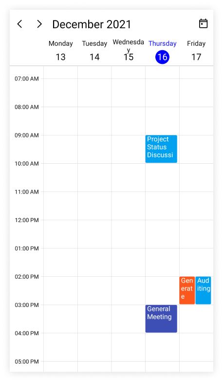

### View header height

The height of the ViewHeader in a day, week, and work week views can be customized by setting the [Height](https://help.syncfusion.com/cr/maui/Syncfusion.Maui.Scheduler.SchedulerHeaderSettingsBase.html#Syncfusion_Maui_Scheduler_SchedulerHeaderSettingsBase_Height) property of [ViewHeaderSettings](https://help.syncfusion.com/cr/maui/Syncfusion.Maui.Scheduler.SchedulerViewHeaderSettings.html) in [DaysView](https://help.syncfusion.com/cr/maui/Syncfusion.Maui.Scheduler.SchedulerDaysView.html).




 <scheduler:SfScheduler x:Name="Scheduler" 
                        View="Week">
    <scheduler:SfScheduler.DaysView>
        <scheduler:SchedulerDaysView>
            <scheduler:SchedulerDaysView.ViewHeaderSettings>
                    <scheduler:SchedulerViewHeaderSettings Height="100" />
            </scheduler:SchedulerDaysView.ViewHeaderSettings>
    </scheduler:SchedulerDaysView>
</scheduler:SfScheduler.DaysView>




SfScheduler scheduler = new SfScheduler();
scheduler.View = SchedulerView.Week;
scheduler.DaysView.ViewHeaderSettings.Height = 100;
this.Content = scheduler;




### Customize view header appearance

The view header appearance customization can be achieved by using the `TextStyle` and `ViewHeaderTemplate` properties of [DaysView](https://help.syncfusion.com/cr/maui/Syncfusion.Maui.Scheduler.SchedulerDaysView.html) in the [SfScheduler](https://help.syncfusion.com/cr/maui/Syncfusion.Maui.Scheduler.SfScheduler.html).

#### Customize view header appearance using text style

The background color and text style for the labels mentioning the time can be customized, by setting the [Background](https://help.syncfusion.com/cr/maui/Syncfusion.Maui.Scheduler.SchedulerHeaderSettingsBase.html#Syncfusion_Maui_Scheduler_SchedulerHeaderSettingsBase_Background), [DateTextStyle](https://help.syncfusion.com/cr/maui/Syncfusion.Maui.Scheduler.SchedulerViewHeaderSettings.html#Syncfusion_Maui_Scheduler_SchedulerViewHeaderSettings_DateTextStyle), and [DayTextStyle](https://help.syncfusion.com/cr/maui/Syncfusion.Maui.Scheduler.SchedulerViewHeaderSettings.html#Syncfusion_Maui_Scheduler_SchedulerViewHeaderSettings_DayTextStyle) properties of [DaysView](https://help.syncfusion.com/cr/maui/Syncfusion.Maui.Scheduler.SchedulerDaysView.html) in the Scheduler.




<scheduler:SfScheduler x:Name="Scheduler" 
                       View="Week">
    <scheduler:SfScheduler.DaysView>
        <scheduler:SchedulerDaysView>
            <scheduler:SchedulerDaysView.ViewHeaderSettings>
                <scheduler:SchedulerViewHeaderSettings Background="LightGreen" />
            </scheduler:SchedulerDaysView.ViewHeaderSettings>
        </scheduler:SchedulerDaysView>
    </scheduler:SfScheduler.DaysView>
</scheduler:SfScheduler>




this.Scheduler.View = SchedulerView.Week;
var dateTextStyle = new SchedulerTextStyle()
{
    TextColor = Colors.Red,
    FontSize = 12,
};

this.Scheduler.DaysView.ViewHeaderSettings.DateTextStyle = dateTextStyle;
var dayTextStyle = new SchedulerTextStyle()
{
    TextColor = Colors.Red,
    FontSize = 12,
};

this.Scheduler.DaysView.ViewHeaderSettings.DayTextStyle = dayTextStyle;
this.Scheduler.DaysView.ViewHeaderSettings.Background = Brush.LightGreen;




#### Customize view header appearance using DataTemplate

You can customize the view header appearance by using the [ViewHeaderTemplate](https://help.syncfusion.com/cr/maui/Syncfusion.Maui.Scheduler.SchedulerTimeSlotView.html#Syncfusion_Maui_Scheduler_SchedulerTimeSlotView_ViewHeaderTemplate) property of [DaysView](https://help.syncfusion.com/cr/maui/Syncfusion.Maui.Scheduler.SchedulerDaysView.html) in the [SfScheduler](https://help.syncfusion.com/cr/maui/Syncfusion.Maui.Scheduler.SfScheduler.html).

  


 <scheduler:SfScheduler x:Name="Scheduler" 
                        View="WorkWeek">
    <scheduler:SfScheduler.DaysView>
        <scheduler:SchedulerDaysView>
            <scheduler:SchedulerDaysView.ViewHeaderTemplate>
                <DataTemplate>
                    <StackLayout x:Name="stackLayout" Orientation="Vertical" Background="MediumPurple">
                        <Label x:Name="label" HorizontalOptions="Center"  VerticalOptions="Center" Text="{Binding StringFormat='{0:dd}'}" FontSize="Small" FontFamily="Bold" TextColor="White" >
                            <Label.Triggers>
                                <DataTrigger TargetType = "Label" Binding="{Binding}" Value="{x:Static system:DateTime.Today}">
                                    <Setter TargetName = "label" Property="TextColor" Value="Orange"/>
                                </DataTrigger>
                            </Label.Triggers>
                        </Label>
                        <Label x:Name="label1" HorizontalOptions="Center"  VerticalOptions="Center" Text="{Binding StringFormat='{0:ddd}'}"  FontSize="Small" FontFamily="Bold" TextColor="White">
                            <Label.Triggers>
                                <DataTrigger TargetType = "Label" Binding="{Binding}" Value="{x:Static system:DateTime.Today}">
                                    <Setter TargetName = "label1" Property="TextColor" Value="Orange"/>
                                </DataTrigger>
                            </Label.Triggers>
                        </Label>
                        <StackLayout.Triggers>
                            <DataTrigger TargetType = "StackLayout" Binding="{Binding}" Value="{x:Static system:DateTime.Today}">
                                <Setter TargetName = "stackLayout" Property="Background" Value="MediumPurple"/>
                            </DataTrigger>
                        </StackLayout.Triggers>
                    </StackLayout>
                </DataTemplate>
            </scheduler:SchedulerDaysView.ViewHeaderTemplate>
        </scheduler:SchedulerDaysView>
    </scheduler:SfScheduler.DaysView>
 </scheduler:SfScheduler>




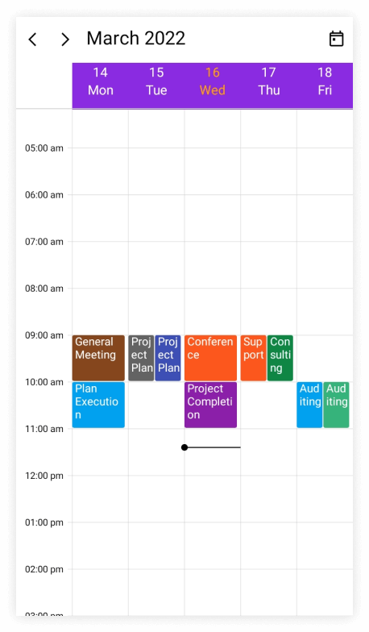

N>
* The BindingContext of the `ViewHeaderTemplate` is the`DateTime.` The `SelectableDayPredicate,` `MinimumDateTime,` and `MaximumDateTime` properties of date and time values can be used directly in the data template selector.

#### Customize view header appearance using DataTemplateSelector

You can customize the view header appearance by using the [ViewHeaderTemplate](https://help.syncfusion.com/cr/maui/Syncfusion.Maui.Scheduler.SchedulerTimeSlotView.html#Syncfusion_Maui_Scheduler_SchedulerTimeSlotView_ViewHeaderTemplate) property of [DaysView](https://help.syncfusion.com/cr/maui/Syncfusion.Maui.Scheduler.SchedulerDaysView.html) in the [SfScheduler](https://help.syncfusion.com/cr/maui/Syncfusion.Maui.Scheduler.SfScheduler.html). The `DataTemplateSelector` can choose a `DataTemplate` at runtime based on the value of a data-bound to scheduler view header by using the `ViewHeaderTemplate.` It allows you to choose a different data template for each view header, as well as customize the appearance of a particular view header based on certain conditions.




 <Grid>
    <Grid.Resources>
        <DataTemplate x:Key="normalDateTemplate">
            <StackLayout x:Name="stackLayout" Orientation="Vertical" Background="MediumPurple">
                <Label x:Name="label" HorizontalOptions="Center"  VerticalOptions="Center" Text="{Binding StringFormat='{0:dd}'}" FontSize="Small" FontFamily="Bold" TextColor="White" />
                <Label x:Name="label1" HorizontalOptions="Center"  VerticalOptions="Center" Text="{Binding StringFormat='{0:ddd}'}"  FontSize="Small" FontFamily="Bold" TextColor="White"/>
            </StackLayout>
        </DataTemplate>
        <DataTemplate x:Key="todayDateTemplate">
            <StackLayout x:Name="stackLayout" Orientation="Vertical" Background="MediumPurple">
                <Label x:Name="label" HorizontalOptions="Center"  VerticalOptions="Center" Text="{Binding StringFormat='{0:dd}'}" FontSize="Small" FontFamily="Bold" TextColor="Yellow" />
                <Label x:Name="label1" HorizontalOptions="Center"  VerticalOptions="Center" Text="{Binding StringFormat='{0:ddd}'}"  FontSize="Small" FontFamily="Bold" TextColor="Yellow"/>
            </StackLayout>
        </DataTemplate>
        <local:ViewHeaderTemplateSelector x:Key="viewHeaderTemplateSelector" TodayDateTemplate="{StaticResource todayDateTemplate}" NormalDateTemplate="{StaticResource normalDateTemplate}"/>
    </Grid.Resources>
    <scheduler:SfScheduler x:Name="Scheduler" 
                           View="Week" >
        <scheduler:SfScheduler.DaysView>
            <scheduler:SchedulerDaysView ViewHeaderTemplate="{StaticResource viewHeaderTemplateSelector}" />
        </scheduler:SfScheduler.DaysView>
    </scheduler:SfScheduler>
 </Grid>




public class ViewHeaderTemplateSelector : DataTemplateSelector
{
    public ViewHeaderTemplateSelector()
    {
    }
    public DataTemplate NormalDateTemplate { get; set; }
    public DataTemplate TodayDateTemplate { get; set; }
    protected override DataTemplate OnSelectTemplate(object item, BindableObject container)
    {
        var dateTime = (DateTime)item;
        if (dateTime.Date == DateTime.Today.Date)
            return TodayDateTemplate;
        else
            return NormalDateTemplate;
    }
}

  


this.Scheduler.View = SchedulerView.Week;

 


N>
* The BindingContext of the `ViewHeaderTemplate` is the`DateTime.` The `SelectableDayPredicate,` `MinimumDateTime,` and `MaximumDateTime` properties of date and time values can be used directly in the data template selector.
* When using data template selector, performance issues occur as the conversion template views take time within the framework.

## Time ruler text formatting

The format for the labels mentioning the time can be customized by setting the [TimeFormat](https://help.syncfusion.com/cr/maui/Syncfusion.Maui.Scheduler.SchedulerTimeSlotView.html#Syncfusion_Maui_Scheduler_SchedulerTimeSlotView_TimeFormat) property of [DaysView](https://help.syncfusion.com/cr/maui/Syncfusion.Maui.Scheduler.SchedulerDaysView.html) in the [SfScheduler](https://help.syncfusion.com/cr/maui/Syncfusion.Maui.Scheduler.SfScheduler.html).




<scheduler:SfScheduler x:Name="Scheduler" 
                       View="Week">
    <scheduler:SfScheduler.DaysView>
        <scheduler:SchedulerDaysView 
                       TimeFormat="hh:mm"/>
    </scheduler:SfScheduler.DaysView>
</scheduler:SfScheduler>




SfScheduler scheduler = new SfScheduler();
scheduler.View = SchedulerView.Week;
scheduler.DaysView.TimeFormat = "hh:mm";
this.Content = scheduler;




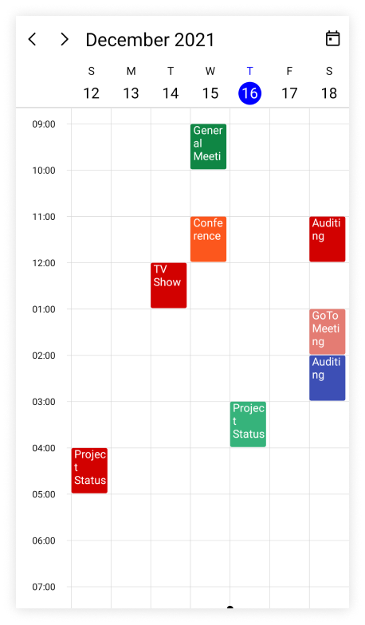

N>
* By default, the scheduler time text format is `hh:mm tt.`

#### Customize time ruler text style

The text style for the labels mentioning the time can be customized, by setting the [TimeRulerTextStyle](https://help.syncfusion.com/cr/maui/Syncfusion.Maui.Scheduler.SchedulerTimeSlotView.html#Syncfusion_Maui_Scheduler_SchedulerTimeSlotView_TimeRulerTextStyle) property of [DaysView](https://help.syncfusion.com/cr/maui/Syncfusion.Maui.Scheduler.SchedulerDaysView.html) in the [SfScheduler](https://help.syncfusion.com/cr/maui/Syncfusion.Maui.Scheduler.SfScheduler.html).









this.Scheduler.View = SchedulerView.Week;
var timeRulerTextStyle = new SchedulerTextStyle()
{
    TextColor = Colors.Red,
    FontSize = 12,
};

this.Scheduler.DaysView.TimeRulerTextStyle = timeRulerTextStyle;




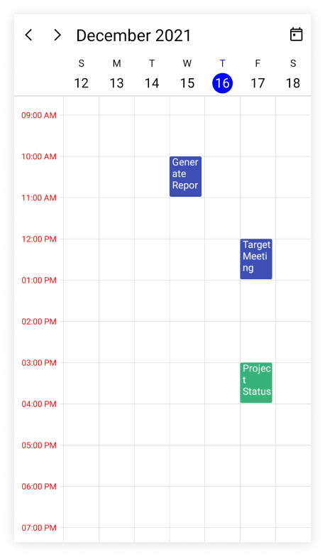
