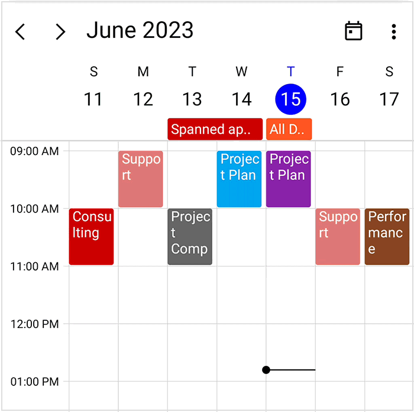

# Appointment Drag and Drop in .NET MAUI Scheduler
Appointments can be rescheduled using the drag-and-drop operation. To perform drag-and-drop operations within the scheduler, enable the [AllowAppointmentDrag](https://help.syncfusion.com/cr/maui/Syncfusion.Maui.Scheduler.SfScheduler.html#Syncfusion_Maui_Scheduler_SfScheduler_AllowAppointmentDrag) property of `SfScheduler`. You can disable appointment drag and drop by assigning `false` to the `AllowAppointmentDrag` property. The default value is `true`.



<scheduler:SfScheduler x:Name="scheduler"
                       View="Week" 
                       AllowAppointmentDrag="false">        
</scheduler:SfScheduler>


this.scheduler.AllowAppointmentDrag = false;



Refer [here](https://help.syncfusion.com/maui/scheduler/appointments#creating-business-objects) to create a business object class.

N> Inherit the business object class from the `INotifyPropertyChanged` for dynamic changes in custom data.

## Handle appointment drag starting
You can get the appointment details and handle whether the appointment can be draggable or not by using the [AppointmentDragStarting](https://help.syncfusion.com/cr/maui/Syncfusion.Maui.Scheduler.SfScheduler.html#Syncfusion_Maui_Scheduler_SfScheduler_AppointmentDragStarting) event. This event will be triggered when the appointment is started dragging. The [AppointmentDragStartingEventArgs](https://help.syncfusion.com/cr/maui/Syncfusion.Maui.Scheduler.AppointmentDragStartingEventArgs.html) argument contains the following properties.

[Appointment](https://help.syncfusion.com/cr/maui/Syncfusion.Maui.Scheduler.AppointmentDragStartingEventArgs.html#Syncfusion_Maui_Scheduler_AppointmentDragStartingEventArgs_Appointment) - Get the appointment that is going to be dragged.
[Resource](https://help.syncfusion.com/cr/maui/Syncfusion.Maui.Scheduler.AppointmentDragStartingEventArgs.html#Syncfusion_Maui_Scheduler_AppointmentDragStartingEventArgs_Resource) - Get the resource under which the appointment is currently located.



scheduler.AppointmentDragStarting += OnSchedulerAppointmentDragStarting;

...

private void OnSchedulerAppointmentDragStarting(object? sender, AppointmentDragStartingEventArgs e)
{
    var appointment = e.Appointment;
    e.Cancel = false;
}



Refer to the below code to cancel the all-day appointment dragging.


scheduler.AppointmentDragStarting += OnSchedulerAppointmentDragStarting;

...

private void OnSchedulerAppointmentDragStarting(object? sender, AppointmentDragStartingEventArgs e)
{
    var appointment = e.Appointment as SchedulerAppointment;
    if (appointment.IsAllDay)
    {
        e.Cancel = true;
    }
}



Here, appointment dragging is disabled when the appointment is `AllDay` appointment.

## Handle appointment dragging
You can handle the dragging appointment details, position, and time of the particular location by using the [AppointmentDragOver](https://help.syncfusion.com/cr/maui/Syncfusion.Maui.Scheduler.SfScheduler.html#Syncfusion_Maui_Scheduler_SfScheduler_AppointmentDragOver) event. This event will be continuously triggered when the appointment is being dragged. The [AppointmentDragOverEventArgs](https://help.syncfusion.com/cr/maui/Syncfusion.Maui.Scheduler.AppointmentDragOverEventArgs.html) argument contains the following properties.

[Appointment](https://help.syncfusion.com/cr/maui/Syncfusion.Maui.Scheduler.AppointmentDragOverEventArgs.html#Syncfusion_Maui_Scheduler_AppointmentDragOverEventArgs_Appointment) - Get the appointment that is being dragged.
[DragPoint](https://help.syncfusion.com/cr/maui/Syncfusion.Maui.Scheduler.AppointmentDragOverEventArgs.html#Syncfusion_Maui_Scheduler_AppointmentDragOverEventArgs_DragPoint) - Get the dragging point of the scheduler appointment user interface.
[DragTime](https://help.syncfusion.com/cr/maui/Syncfusion.Maui.Scheduler.AppointmentDragOverEventArgs.html#Syncfusion_Maui_Scheduler_AppointmentDragOverEventArgs_DragTime) - Get the dragging time of the appointment object being dragged.
[DragResource](https://help.syncfusion.com/cr/maui/Syncfusion.Maui.Scheduler.AppointmentDragOverEventArgs.html#Syncfusion_Maui_Scheduler_AppointmentDragOverEventArgs_DragResource) - Get the original resource of the appointment that is being dragged.



scheduler.AppointmentDragOver += OnSchedulerAppointmentDragOver;

...

private void OnSchedulerAppointmentDragOver(object? sender, AppointmentDragOverEventArgs e)
{
    var appointment = e.Appointment;
    var draggingPoint = e.DragPoint;
    var draggingTime = e.DragTime;
}



## Handle appointment drop
Using the [AppointmentDrop](https://help.syncfusion.com/cr/maui/Syncfusion.Maui.Scheduler.SfScheduler.html#Syncfusion_Maui_Scheduler_SfScheduler_AppointmentDrop) event you can get the dropping appointment details, position, time and you can handle whether the appointment can be dropped to the specific position or not. This event will trigger after dropping the appointment. The [AppointmentDropEventArgs](https://help.syncfusion.com/cr/maui/Syncfusion.Maui.Scheduler.AppointmentDropEventArgs.html) argument contains the following properties.

[Appointment](https://help.syncfusion.com/cr/maui/Syncfusion.Maui.Scheduler.AppointmentDropEventArgs.html#Syncfusion_Maui_Scheduler_AppointmentDropEventArgs_Appointment) - Get the appointment that is being dragged and dropped.
[DropTime](https://help.syncfusion.com/cr/maui/Syncfusion.Maui.Scheduler.AppointmentDropEventArgs.html#Syncfusion_Maui_Scheduler_AppointmentDropEventArgs_DropTime) - Get or set the date and time at which the appointment is being dropped.
[SourceResource](https://help.syncfusion.com/cr/maui/Syncfusion.Maui.Scheduler.AppointmentDropEventArgs.html#Syncfusion_Maui_Scheduler_AppointmentDropEventArgs_SourceResource) - Get the original resource of the appointment that is being dropped.
[TargetResource](https://help.syncfusion.com/cr/maui/Syncfusion.Maui.Scheduler.AppointmentDropEventArgs.html#Syncfusion_Maui_Scheduler_AppointmentDropEventArgs_TargetResource) - Get the resource into which the appointment is being dropped.
[IsDroppingToAllDay](https://help.syncfusion.com/cr/maui/Syncfusion.Maui.Scheduler.AppointmentDropEventArgs.html#Syncfusion_Maui_Scheduler_AppointmentDropEventArgs_IsDroppingToAllDay) - Gets a value indicating whether an appointment is being dropped into an all-day slot.



scheduler.AppointmentDrop += OnSchedulerAppointmentDrop;

...

private void OnSchedulerAppointmentDrop(object? sender, AppointmentDropEventArgs e)
{
    var appointment = e.Appointment;
    e.Cancel = false;
    var dropTime = e.DropTime;
}




### Prevent dropping appointments into the all-day panel

You can prevent appointments from being dropped into the all-day panel by checking the [IsDroppingToAllDay](https://help.syncfusion.com/cr/maui/Syncfusion.Maui.Scheduler.AppointmentDropEventArgs.html#Syncfusion_Maui_Scheduler_AppointmentDropEventArgs_IsDroppingToAllDay) property in the [AppointmentDrop](https://help.syncfusion.com/cr/maui/Syncfusion.Maui.Scheduler.SfScheduler.html#Syncfusion_Maui_Scheduler_SfScheduler_AppointmentDrop) event and canceling the operation.



scheduler.AppointmentDrop += OnSchedulerAppointmentDrop;
...

private void OnSchedulerAppointmentDrop(object? sender, AppointmentDropEventArgs e)
{
    if (e.IsDroppingToAllDay)
    {
        e.Cancel = true;
    }
}




## Change the drag and drop settings
You can change the appointment of drag and drop settings in Scheduler by using the [DragDropSettings](https://help.syncfusion.com/cr/maui/Syncfusion.Maui.Scheduler.SfScheduler.html#Syncfusion_Maui_Scheduler_SfScheduler_DragDropSettings) property.



<schedule:SfScheduler x:Name="scheduler" ShowBusyIndicator="True"
                      AppointmentsSource="{Binding DragEvents}"
                      View="Week"
                      DisplayDate="{Binding DisplayDate}"
                      AllowedViews="Day,Week,WorkWeek,Month">
        <schedule:SfScheduler.DragDropSettings>
            <schedule:DragDropSettings AllowNavigation="true" 
                                       AllowScroll="true" 
                                       ShowTimeIndicator="true"/>
        </schedule:SfScheduler.DragDropSettings>
</schedule:SfScheduler>


scheduler.DragDropSettings = new DragDropSettings 
{
    AllowNavigation = true,
    AllowScroll = true,
    ShowTimeIndicator = true,
};



#### Disable view navigation when dragging appointment
Using the [AllowNavigation](https://help.syncfusion.com/cr/maui/Syncfusion.Maui.Scheduler.DragDropSettings.html#Syncfusion_Maui_Scheduler_DragDropSettings_AllowNavigation) property of the [DragDropSettings](https://help.syncfusion.com/cr/maui/Syncfusion.Maui.Scheduler.DragDropSettings.html) you can handle whether you can navigate views while dragging the appointment or not. The default value of the `AllowNavigation` property is `true`.



<schedule:SfScheduler x:Name="Scheduler"
                      View="Week">
<schedule:SfScheduler.DragDropSettings>
    <schedule:DragDropSettings AllowNavigation="False">
    </schedule:DragDropSettings>
</schedule:SfScheduler.DragDropSettings>
</schedule:SfScheduler>


this.Scheduler.View = SchedulerView.Week;
this.Scheduler.DragDropSettings.AllowNavigation = false;



#### Handle dragging appointment navigation delay
Using the [AutoNavigationDelay](https://help.syncfusion.com/cr/maui/Syncfusion.Maui.Scheduler.DragDropSettings.html#Syncfusion_Maui_Scheduler_DragDropSettings_AutoNavigationDelay) property you can handle the navigation time when navigating through views while holding the dragged appointment.



this.Scheduler.View = SchedulerView.Week;
this.Scheduler.DragDropSettings.AutoNavigationDelay = new TimeSpan(0, 0, 0, 0, 2000);



#### Handle view scroll when dragging appointment
Using the [AllowScroll](https://help.syncfusion.com/cr/maui/Syncfusion.Maui.Scheduler.DragDropSettings.html#Syncfusion_Maui_Scheduler_DragDropSettings_AllowScroll) property you can handle scrolling the time slot while dragging the appointment or not, while dragging the appointment to the endpoint of the current view in Schedule. The default value of the `AllowScroll` property is `true`.



<schedule:SfScheduler x:Name="Scheduler"
                      View="Week">
<schedule:SfScheduler.DragDropSettings>
    <schedule:DragDropSettings AllowScroll="False">
    </schedule:DragDropSettings>
</schedule:SfScheduler.DragDropSettings>
</schedule:SfScheduler>


this.Scheduler.View = SchedulerView.Week;
this.Scheduler.DragDropSettings.AllowScroll = false;



N> This is not applicable for MonthView.

#### Show or hide drag time indicator
You can handle whether the drag and drop indicator should be displayed within the scheduler during appointment dragging by using the [ShowTimeIndicator](https://help.syncfusion.com/cr/maui/Syncfusion.Maui.Scheduler.DragDropSettings.html#Syncfusion_Maui_Scheduler_DragDropSettings_ShowTimeIndicator) property which shows the dragged appointment's current position time. The default value of the `ShowTimeIndicator` property is `true`.



<schedule:SfScheduler x:Name="Scheduler"
                      View="Week">
<schedule:SfScheduler.DragDropSettings>
    <schedule:DragDropSettings ShowTimeIndicator="False">
    </schedule:DragDropSettings>
</schedule:SfScheduler.DragDropSettings>
</schedule:SfScheduler>


this.Scheduler.View = SchedulerView.Week;
this.Scheduler.DragDropSettings.ShowTimeIndicator = false;



N>
* The drag time indicator is applicable only when the [TimeRulerWidth](https://help.syncfusion.com/cr/maui/Syncfusion.Maui.Scheduler.SchedulerDaysView.html#Syncfusion_Maui_Scheduler_SchedulerDaysView_TimeRulerWidth) property is greater than zero in Day, Week, and WorkWeek views and the [TimeRulerHeight](https://help.syncfusion.com/cr/maui/Syncfusion.Maui.Scheduler.SchedulerTimelineView.html#Syncfusion_Maui_Scheduler_SchedulerTimelineView_TimeRulerHeight) property is is greater than zero in TimeLineDay, TimeLineWeek, TimeLineWorkWeek views.
* The drag time indicator is not applicable for Month and Timeline Month views.
 
#### Change drag time indicator text style
You can change the drag time indicator style by using the [TimeIndicatorStyle](https://help.syncfusion.com/cr/maui/Syncfusion.Maui.Scheduler.DragDropSettings.html#Syncfusion_Maui_Scheduler_DragDropSettings_TimeIndicatorStyle) property of [DragDropSettings](https://help.syncfusion.com/cr/maui/Syncfusion.Maui.Scheduler.DragDropSettings.html).



<schedule:SfScheduler x:Name="scheduler" 
                      ShowBusyIndicator="True"
                      AppointmentsSource="{Binding DragEvents}"
                      View="Week">
        <schedule:SfScheduler.DragDropSettings>
            <schedule:DragDropSettings 
                TimeIndicatorStyle="{schedule:SchedulerTextStyle TextColor=Green}"/>
        </schedule:SfScheduler.DragDropSettings>
</schedule:SfScheduler>


this.Scheduler.View = SchedulerView.Week;
var timeIndicatorStyle = new SchedulerTextStyle()
{
   TextColor = Colors.Green,
};
this.Scheduler.DragDropSettings.TimeIndicatorStyle = timeIndicatorStyle;



#### Change drag time indicator format
You can change the drag time indicator format by using the [TimeIndicatorTextFormat](https://help.syncfusion.com/cr/maui/Syncfusion.Maui.Scheduler.DragDropSettings.html#Syncfusion_Maui_Scheduler_DragDropSettings_TimeIndicatorTextFormat) property of [DragDropSettings](https://help.syncfusion.com/cr/maui/Syncfusion.Maui.Scheduler.DragDropSettings.html).



this.Scheduler.View = SchedulerView.Week;
this.Scheduler.DragDropSettings.TimeIndicatorTextFormat = "hh:mm";



N> [View sample in GitHub](https://github.com/SyncfusionExamples/maui-scheduler-examples/tree/main/DragAndDropSample)