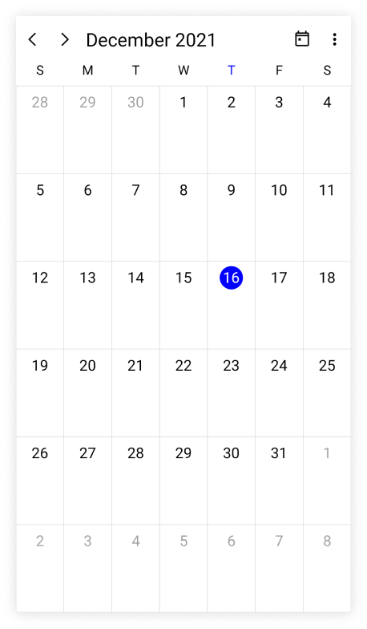
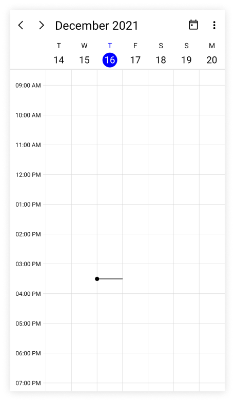
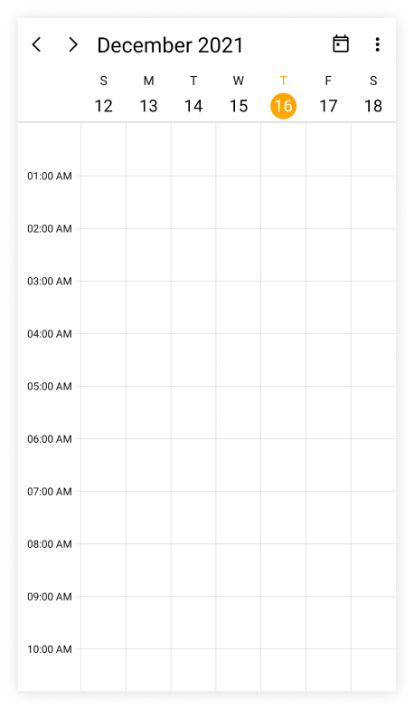
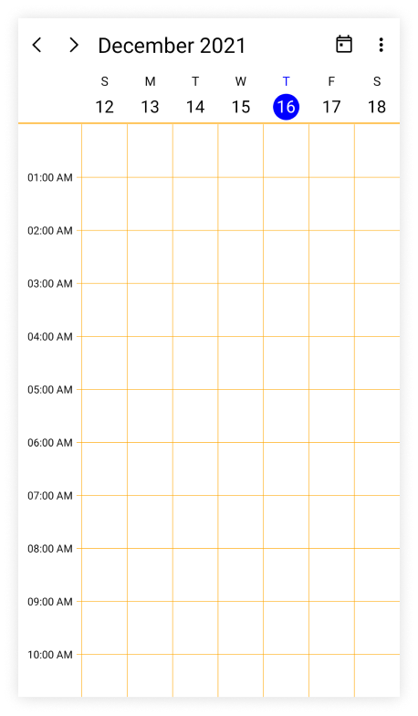
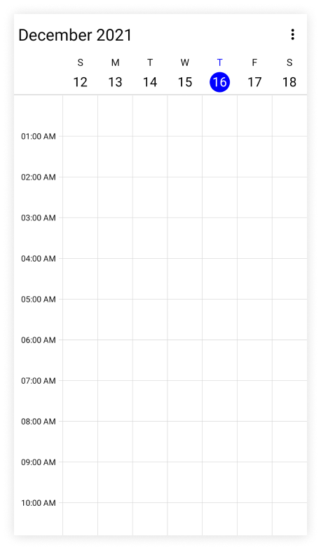
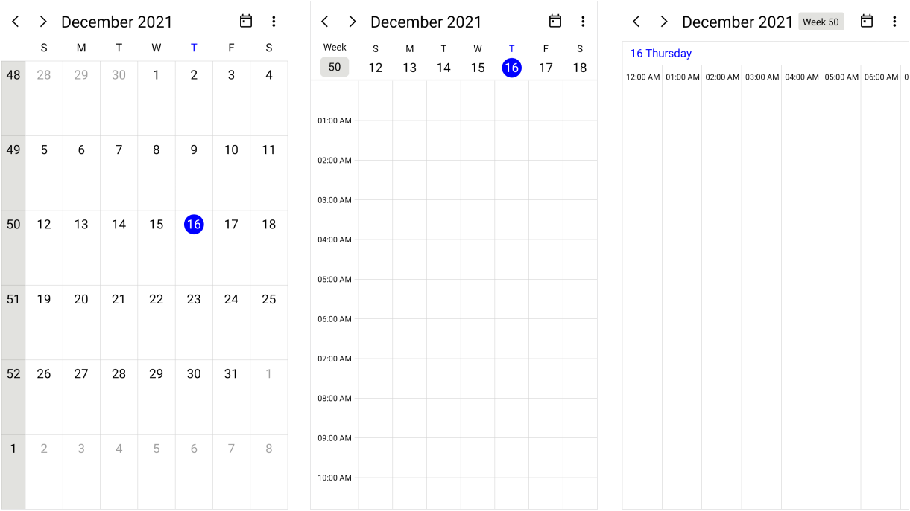
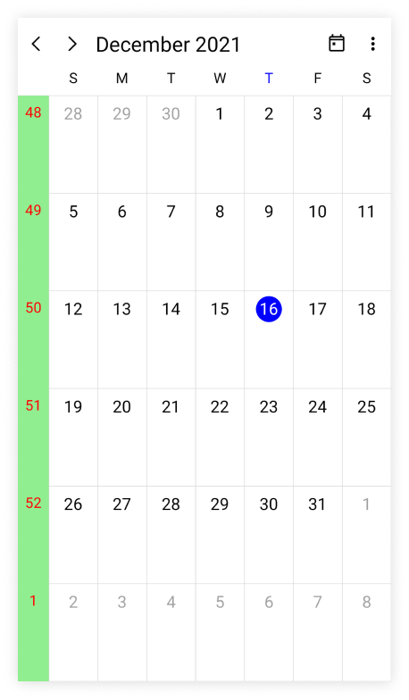

# Getting Started with the .NET MAUI Scheduler

This section explains how to populate the appointments to the Scheduler as well as the essential aspects for getting started with the Scheduler and also provides a walk-through to configure the [.NET MAUI Scheduler](https://help.syncfusion.com/cr/maui/Syncfusion.Maui.Scheduler.SfScheduler.html) control in a real-time scenario. Follow the steps below to add a .NET Scehduler control to your project.

To get start quickly with our .NET MAUI Scheduler, you can check the below video.



## Prerequisites

Before proceeding, ensure the following are set up:
1. Install [.NET 7 SDK](https://dotnet.microsoft.com/en-us/download/dotnet/7.0) or later is installed.
2. Set up a .NET MAUI environment with Visual Studio 2022 (v17.3 or later) or VS Code. For VS Code users, ensure that the .NET MAUI workload is installed and configured as described [here.](https://learn.microsoft.com/en-us/dotnet/maui/get-started/installation?view=net-maui-8.0&tabs=visual-studio-code)

## Step 1: Create a New .NET MAUI Project

### Visual Studio

1. Go to **File > New > Project** and choose the **.NET MAUI App** template.
2. Name the project and choose a location, then click **Next**.
3. Select the .NET framework version and click **Create**.

### Visual Studio Code

1. Open the command palette by pressing `Ctrl+Shift+P` and type **.NET:New Project** and enter.
2. Choose the **.NET MAUI App** template.
3. Select the project location, type the project name and press enter.
4. Then choose **Create project.**

## Step 2: Install the Syncfusion MAUI Scheduler NuGet Package

1. In **Solution Explorer,** right-click the project and choose **Manage NuGet Packages.**
2. Search for [Syncfusion.Maui.Scheduler](https://www.nuget.org/packages/Syncfusion.Maui.Scheduler/) and install the latest version.
3. Ensure the necessary dependencies are installed correctly, and the project is restored.

## Step 3: Register the handler

The [Syncfusion.Maui.Core](https://www.nuget.org/packages/Syncfusion.Maui.Core/) NuGet is a dependent package for all Syncfusion controls of .NET MAUI. In the **MauiProgram.cs** file, register the handler for Syncfusion core.




using Syncfusion.Maui.Core.Hosting;
namespace GettingStarted
{
    public static class MauiProgram
    {
        public static MauiApp CreateMauiApp()
        {
            var builder = MauiApp.CreateBuilder();

            builder.ConfigureSyncfusionCore();
            builder
            .UseMauiApp<App>()
            .ConfigureFonts(fonts =>
            {
                fonts.AddFont("OpenSans-Regular.ttf", "OpenSansRegular");
                fonts.AddFont("Segoe-mdl2.ttf", "SegoeMDL2");
            });

            return builder.Build();
        }
    }
}




## Step 4: Add a .NET MAUI Scheduler view

1. To initialize the control, import the `Syncfusion.Maui.Scheduler` namespace into your code.
2. Initialize [SfScheduler](https://help.syncfusion.com/cr/maui/Syncfusion.Maui.Scheduler.SfScheduler.html).




<ContentPage   
    . . .
    xmlns:scheduler="clr-namespace:Syncfusion.Maui.Scheduler;assembly=Syncfusion.Maui.Scheduler">

    <scheduler:SfScheduler />
</ContentPage>




using Syncfusion.Maui.Scheduler;
. . .

public partial class MainPage : ContentPage
{
    public MainPage()
    {
        InitializeComponent();
        SfScheduler scheduler = new SfScheduler();
        this.Content = scheduler;
    }
}




## Change different scheduler views

The [.NET MAUI Scheduler](https://help.syncfusion.com/cr/maui/Syncfusion.Maui.Scheduler.SfScheduler.html) control provides nine different types of views to display dates and it can be assigned to the control by using the [View](https://help.syncfusion.com/cr/maui/Syncfusion.Maui.Scheduler.SfScheduler.html#Syncfusion_Maui_Scheduler_SfScheduler_View) property. The control is assigned to the [Day](https://help.syncfusion.com/cr/maui/Syncfusion.Maui.Scheduler.SchedulerView.html#Syncfusion_Maui_Scheduler_SchedulerView_Day) view by default. The current date will be displayed initially for all the Scheduler views.




<scheduler:SfScheduler x:Name="scheduler" View="Month"/>




SfScheduler scheduler = new SfScheduler();
scheduler.View = SchedulerView.Month;
this.Content = scheduler;




## Appointments

The [.NET MAUI Scheduler](https://help.syncfusion.com/cr/maui/Syncfusion.Maui.Scheduler.SfScheduler.html) has a built-in capability to handle the appointment arrangement internally based on the [SchedulerAppointment](https://help.syncfusion.com/cr/maui/Syncfusion.Maui.Scheduler.SchedulerAppointment.html) collections. Allocate the collection generated to the Appointments property.

### Creating the scheduler appointments

The [SchedulerAppointment](https://help.syncfusion.com/cr/maui/Syncfusion.Maui.Scheduler.SchedulerAppointment.html) is a class that includes the specific scheduled appointment. It has some basic properties such as [StartTime](https://help.syncfusion.com/cr/maui/Syncfusion.Maui.Scheduler.SchedulerRegionBase.html#Syncfusion_Maui_Scheduler_SchedulerRegionBase_StartTime), [EndTime](https://help.syncfusion.com/cr/maui/Syncfusion.Maui.Scheduler.SchedulerRegionBase.html#Syncfusion_Maui_Scheduler_SchedulerRegionBase_EndTime), [Subject](https://help.syncfusion.com/cr/maui/Syncfusion.Maui.Scheduler.SchedulerAppointmentMapping.html#Syncfusion_Maui_Scheduler_SchedulerAppointmentMapping_Subject), and some additional information about the appointment can be added with [Notes](https://help.syncfusion.com/cr/maui/Syncfusion.Maui.Scheduler.SchedulerAppointmentMapping.html#Syncfusion_Maui_Scheduler_SchedulerAppointmentMapping_Notes), [Location](https://help.syncfusion.com/cr/maui/Syncfusion.Maui.Scheduler.SchedulerAppointmentMapping.html#Syncfusion_Maui_Scheduler_SchedulerAppointmentMapping_Location), and [IsAllDay](https://help.syncfusion.com/cr/maui/Syncfusion.Maui.Scheduler.SchedulerAppointmentMapping.html#Syncfusion_Maui_Scheduler_SchedulerAppointmentMapping_IsAllDay) properties.




<scheduler:SfScheduler x:Name="scheduler" />




// Creating an instance for the scheduler appointment collection.
var appointment = new ObservableCollection<SchedulerAppointment>();

//Adding scheduler appointment in the schedule appointment collection. 
appointment.Add(new SchedulerAppointment()
{
    StartTime = DateTime.Today.AddHours(9),
    EndTime = DateTime.Today.AddHours(11),
    Subject = "Client Meeting",
    Location = "Hutchison road",
});

//Adding the scheduler appointment collection to the AppointmentsSource of .NET MAUI Scheduler.
this.scheduler.AppointmentsSource = appointment;




N> [View sample in GitHub](https://github.com/SyncfusionExamples/maui-scheduler-examples/tree/main/GettingStarted)

### Creating the custom Events/Appointments with data mapping

Map the custom appointments data to our scheduler.

N> The CustomAppointment class should contain two DateTime fields and a string field as mandatory.

Here are the steps to render meetings using the [.NET MAUI Scheduler](https://help.syncfusion.com/cr/maui/Syncfusion.Maui.Scheduler.SfScheduler.html) control with respective custom data properties created in a class `Meeting.`

* [Creating custom class to map that objects with appointment](#creating-custom-class-to-map-that-object-with-appointment)
* [Create view model](#create-view-model)
* [Mapping the data object to SchedulerAppointment](#mapping-the-data-object-to-scheduler-appointment)
* [Bind appointment source for Scheduler](#bind-appointment-source-for-scheduler)

#### Creating custom class to map that object with appointment

Create a custom class `Meeting` with mandatory fields `From,` `To,` and `EventName`.




/// 
    
/// Represents the custom data properties.    
/// 
    
public class Meeting
{
    public DateTime From { get; set; }
    public DateTime To { get; set; }
    public bool IsAllDay { get; set; }
    public string EventName { get; set; }
    public string Notes { get; set; }
    public TimeZoneInfo StartTimeZone { get; set; }
    public TimeZoneInfo EndTimeZone { get; set; }
    public Brush Background { get; set; }
    public Color TextColor { get; set; }
    public object RecurrenceId { get; set; }
    public object Id { get; set; }
    public string RecurrenceRule { get; set; }
    public ObservableCollection<DateTime> RecurrenceExceptions { get; set; }
}




N> Inherit this class from the `INotifyPropertyChanged` for dynamic changes in custom data.

#### Create view model

By setting `From` and `To` of Meeting class, schedule meetings for a specific day. Change the `Subject` and `Background` of the appointment using the `EventName` and `Background` properties. Define the list of custom appointments in a separate class of `ViewModel.`




/// 

/// The data binding View Model.
/// 

public class SchedulerViewModel
{
    /// 

    /// The subject collections.
    /// 

    private List<string> subjectCollection;

    /// 

    /// The notes collection.
    /// 

    private List<string> noteCollection;

    /// 

    /// The color collection
    /// 

    private List<Brush> colorCollection;

    /// 

    /// The text color collection
    /// 

    private List<Color> textColorCollection;

    /// 

    /// Initializes a new instance of the <see cref="SchedulerViewModel" /> class.
    /// 

    public SchedulerViewModel()
    {
        this.CreateSubjectCollection();
        this.CreateColorCollection();
        this.CreateTextColorCollection();
        this.CreateNoteCollection();
        this.InitializeAppointments();
    }

    /// 

    /// Gets or sets appointments.
    /// 

    public ObservableCollection<Meeting> Events { get; set; }

    /// 

    /// Method to create the note collection.
    /// 

    private void CreateNoteCollection()
    {
        this.noteCollection = new List<string>();
        this.noteCollection.Add("Consulting firm laws with business advisers");
        this.noteCollection.Add("Execute Project Scope");
        this.noteCollection.Add("Project Scope & Deliverables");
        this.noteCollection.Add("Executive summary");
        this.noteCollection.Add("Try to reduce the risks");
        this.noteCollection.Add("Encourages the integration of mind, body, and spirit");
        this.noteCollection.Add("Execute Project Scope");
        this.noteCollection.Add("Project Scope & Deliverables");
        this.noteCollection.Add("Executive summary");
        this.noteCollection.Add("Try to reduce the risk");
    }

    /// 

    /// Method to initialize the appointments.
    /// 

    private void InitializeAppointments()
    {
        this.Events = new ObservableCollection<Meeting>();
        Random randomTime = new Random();
        List<Point> randomTimeCollection = this.GettingTimeRanges();

        DateTime date;
        DateTime dateFrom = DateTime.Now.AddDays(-50);
        DateTime dateTo = DateTime.Now.AddDays(50);

        for (date = dateFrom; date < dateTo; date = date.AddDays(1))
        {
            for (int additionalAppointmentIndex = 0; additionalAppointmentIndex < 1; additionalAppointmentIndex++)
            {
                var meeting = new Meeting();
                int hour = randomTime.Next((int)randomTimeCollection[additionalAppointmentIndex].X, (int)randomTimeCollection[additionalAppointmentIndex].Y);
                meeting.From = new DateTime(date.Year, date.Month, date.Day, hour, 0, 0);
                meeting.To = meeting.From.AddHours(1);
                meeting.EventName = this.subjectCollection[randomTime.Next(9)];
                meeting.Background = this.colorCollection[randomTime.Next(10)];
                meeting.TextColor = this.textColorCollection[randomTime.Next(5)];
                meeting.IsAllDay = false;
                meeting.Notes = this.noteCollection[randomTime.Next(10)];
                meeting.StartTimeZone = TimeZoneInfo.Local;
                meeting.EndTimeZone = TimeZoneInfo.Local;
                this.Events.Add(meeting);
            }
        }
    }

    /// 

    /// Method to create the subject collection.
    /// 

    private void CreateSubjectCollection()
    {
        this.subjectCollection = new List<string>();
        this.subjectCollection.Add("General Meeting");
        this.subjectCollection.Add("Plan Execution");
        this.subjectCollection.Add("Project Plan");
        this.subjectCollection.Add("Consulting");
        this.subjectCollection.Add("Performance Check");
        this.subjectCollection.Add("Support");
        this.subjectCollection.Add("Development Meeting");
        this.subjectCollection.Add("Scrum");
        this.subjectCollection.Add("Project Completion");
        this.subjectCollection.Add("Release updates");
        this.subjectCollection.Add("Performance Check");
    }

    /// 

    /// Method to get timing range.
    /// 

    /// <returns>return time collection</returns>
    private List<Point> GettingTimeRanges()
    {
        List<Point> randomTimeCollection = new List<Point>();
        randomTimeCollection.Add(new Point(9, 11));
        randomTimeCollection.Add(new Point(12, 14));
        randomTimeCollection.Add(new Point(15, 17));

        return randomTimeCollection;
    }

    /// 

    /// Method to create the color collection.
    /// 

    private void CreateColorCollection()
    {
        this.colorCollection = new List<Brush>();

        this.colorCollection.Add(new SolidColorBrush(Color.FromArgb("#FF8B1FA9")));
        this.colorCollection.Add(new SolidColorBrush(Color.FromArgb("#FFD20100")));
        this.colorCollection.Add(new SolidColorBrush(Color.FromArgb("#FFFC571D")));
        this.colorCollection.Add(new SolidColorBrush(Color.FromArgb("#FF36B37B")));
        this.colorCollection.Add(new SolidColorBrush(Color.FromArgb("#FF3D4FB5")));
        this.colorCollection.Add(new SolidColorBrush(Color.FromArgb("#FFE47C73")));
        this.colorCollection.Add(new SolidColorBrush(Color.FromArgb("#FF636363")));
        this.colorCollection.Add(new SolidColorBrush(Color.FromArgb("#FF85461E")));
        this.colorCollection.Add(new SolidColorBrush(Color.FromArgb("#FF0F8644")));
        this.colorCollection.Add(new SolidColorBrush(Color.FromArgb("#FF01A1EF")));
    }

    /// 

    /// Method to  create the text color collection.
    /// 

    private void CreateTextColorCollection()
    {
        this.textColorCollection = new List<Color>();
        textColorCollection.Add(Color.FromRgb(133, 81, 22));
        textColorCollection.Add(Color.FromRgb(140, 285, 219));
        textColorCollection.Add(Color.FromRgb(265, 222, 133));
        textColorCollection.Add(Color.FromRgb(198, 57, 113));
        textColorCollection.Add(Color.FromRgb(245, 62, 133));
        textColorCollection.Add(Color.FromRgb(23, 13, 165));
        textColorCollection.Add(Color.FromRgb(293, 13, 15));
    }
    
}




#### Mapping the data object to scheduler appointment

Map those properties of the `Meeting` class with our [.NET MAUI Scheduler](https://help.syncfusion.com/cr/maui/Syncfusion.Maui.Scheduler.SfScheduler.html) control by using the [AppointmentMapping](https://help.syncfusion.com/cr/maui/Syncfusion.Maui.Scheduler.SchedulerAppointmentMapping.html) property.




<scheduler:SfScheduler x:Name="scheduler" 
                       AppointmentsSource="{Binding Events}"
                       View="Week" >
    <scheduler:SfScheduler.AppointmentMapping>
        <scheduler:SchedulerAppointmentMapping
                Subject="EventName"
                StartTime="From"
                EndTime="To"
                Background="Background"
                TextColorMapping="TextColor"
                IsAllDay="IsAllDay"
                StartTimeZone="StartTimeZone"
                EndTimeZone="EndTimeZone"
                Id="Id"        
                RecurrenceExceptionDates="RecurrenceExceptions"
                RecurrenceRule="RecurrenceRule"
                RecurrenceId="RecurrenceId"/>
    </scheduler:SfScheduler.AppointmentMapping>
</scheduler:SfScheduler>


 

using Syncfusion.Maui.Scheduler;

SfScheduler scheduler = new SfScheduler();
scheduler.View = SchedulerView.Week;
SchedulerAppointmentMapping appointmentMapping = new SchedulerAppointmentMapping();
appointmentMapping.Subject = "EventName";
appointmentMapping.StartTime = "From";
appointmentMapping.EndTime = "To";
appointmentMapping.Background = "Background";
appointmentMapping.TextColorMapping = "TextColor";
appointmentMapping.IsAllDay = "IsAllDay";
appointmentMapping.StartTimeZone = "StartTimeZone";
appointmentMapping.EndTimeZone = "EndTimeZone";
appointmentMapping.Id = "Id";
appointmentMapping.RecurrenceExceptionDates = "RecurrenceExceptions";
appointmentMapping.RecurrenceRule = "RecurrenceRule";
appointmentMapping.RecurrenceId = "RecurrenceId";
scheduler.AppointmentMapping = appointmentMapping;
this.Content = scheduler;




#### Bind appointment source for scheduler

Create meetings of type `ObservableCollection<Meeting>` and assign those appointments collection to the [AppointmentsSource](https://help.syncfusion.com/cr/maui/Syncfusion.Maui.Scheduler.SfScheduler.html#Syncfusion_Maui_Scheduler_SfScheduler_AppointmentsSource) property of [SfScheduler](https://help.syncfusion.com/cr/maui/Syncfusion.Maui.Scheduler.SfScheduler.html).




<schedule:SfScheduler x:Name="scheduler"
                      AppointmentsSource="{Binding Events}">
    <schedule:SfScheduler.BindingContext>
        <local:SchedulerViewModel/>
    </schedule:SfScheduler.BindingContext>
</schedule:SfScheduler>




SfScheduler scheduler = new SfScheduler();
var viewModel = new SchedulerDataBindingViewModel();
scheduler.AppointmentsSource = viewModel.Events;
this.Content = scheduler;




N> [View sample in GitHub](https://github.com/SyncfusionExamples/maui-scheduler-examples/tree/main/BusinessObject)

## Change first day of week

The scheduler allows customization on the first day of the week with the [FirstDayOfWeek](https://help.syncfusion.com/cr/maui/Syncfusion.Maui.Scheduler.SfScheduler.html#Syncfusion_Maui_Scheduler_SfScheduler_FirstDayOfWeek) property. The Scheduler will default to `Sunday` as the first day of the week.

The following code shows the Scheduler with `Tuesday` as the first day of the week.

  


<scheduler:SfScheduler x:Name="scheduler" FirstDayOfWeek="Tuesday"/>




SfScheduler scheduler = new SfScheduler();
scheduler.FirstDayOfWeek = DayOfWeek.Tuesday;
this.Content = scheduler;

  
  

## Today highlight brush

The today highlight brush of Scheduler can be customized by using the [TodayHighlightBrush](https://help.syncfusion.com/cr/maui/Syncfusion.Maui.Scheduler.SfScheduler.html#Syncfusion_Maui_Scheduler_SfScheduler_TodayHighlightBrush) property in the [SfScheduler](https://help.syncfusion.com/cr/maui/Syncfusion.Maui.Scheduler.SfScheduler.html), which will highlight the today's circle and text in Scheduler view header and month cell.

  


<scheduler:SfScheduler x:Name="scheduler" TodayHighlightBrush="Orange"/>




SfScheduler scheduler = new SfScheduler();
scheduler.TodayHighlightBrush = Brush.Orange;
this.Content = scheduler;

  
 

## Cell border brush

The vertical and horizontal line color of the Scheduler can be customized by using the [CellBorderBrush](https://help.syncfusion.com/cr/maui/Syncfusion.Maui.Scheduler.SfScheduler.html#Syncfusion_Maui_Scheduler_SfScheduler_CellBorderBrush) property in the [SfScheduler](https://help.syncfusion.com/cr/maui/Syncfusion.Maui.Scheduler.SfScheduler.html).

  


<scheduler:SfScheduler x:Name="scheduler" CellBorderBrush="Orange"/>




SfScheduler scheduler = new SfScheduler();
scheduler.CellBorderBrush = Brush.Orange;
this.Content = scheduler;

  
 

## Background color

The Scheduler background color can be customized by using the `BackgroundColor` property in the [SfScheduler](https://help.syncfusion.com/cr/maui/Syncfusion.Maui.Scheduler.SfScheduler.html).

  


<scheduler:SfScheduler x:Name="scheduler" BackgroundColor="LightBlue"/>




SfScheduler scheduler = new SfScheduler();
scheduler.BackgroundColor = Colors.LightBlue;
this.Content = scheduler;

  


## Show navigation arrow

By Using the [ShowNavigationArrows](https://help.syncfusion.com/cr/maui/Syncfusion.Maui.Scheduler.SfScheduler.html#Syncfusion_Maui_Scheduler_SfScheduler_ShowNavigationArrows) property of the [SfScheduler](https://help.syncfusion.com/cr/maui/Syncfusion.Maui.Scheduler.SfScheduler.html), you can navigate to the previous or next views of the Scheduler. By default, the value `ShowNavigationArrows` is `true,` which displays the navigation icons and `Today` button in the header view. It allows to quickly navigate to today and previous or next views.

  


<scheduler:SfScheduler x:Name="scheduler" ShowNavigationArrows="False"/>




SfScheduler scheduler = new SfScheduler();
scheduler.ShowNavigationArrows = false;
this.Content = scheduler;

  


## Show week number

Display the week number of the year in all Scheduler views of the [SfScheduler](https://help.syncfusion.com/cr/maui/Syncfusion.Maui.Scheduler.SfScheduler.html) by setting the [ShowWeekNumber](https://help.syncfusion.com/cr/maui/Syncfusion.Maui.Scheduler.SfScheduler.html#Syncfusion_Maui_Scheduler_SfScheduler_ShowWeekNumber) property as `true` and by default it is `false.` The Week numbers will be displayed based on the ISO standard.

  


<scheduler:SfScheduler x:Name="scheduler" ShowWeekNumber="True"/>




SfScheduler scheduler = new SfScheduler();
scheduler.ShowWeekNumber = true;
this.Content = scheduler;

  


N> This property will not be applicable for the `SchedulerView` is `Timeline Month.`

#### Customize the week number text style

The Week number text style of the Scheduler can be customized by using the [WeekNumberStyle](https://help.syncfusion.com/cr/maui/Syncfusion.Maui.Scheduler.SfScheduler.html#Syncfusion_Maui_Scheduler_SfScheduler_WeekNumberStyle) property and it allows to customize the [TextStyle](https://help.syncfusion.com/cr/maui/Syncfusion.Maui.Scheduler.SchedulerWeekNumberStyle.html#Syncfusion_Maui_Scheduler_SchedulerWeekNumberStyle_TextStyle) and the [Background](https://help.syncfusion.com/cr/maui/Syncfusion.Maui.Scheduler.SchedulerWeekNumberStyle.html#Syncfusion_Maui_Scheduler_SchedulerWeekNumberStyle_Background) color in the Week number of the [SfScheduler](https://help.syncfusion.com/cr/maui/Syncfusion.Maui.Scheduler.SfScheduler.html).

  


<scheduler:SfScheduler x:Name="scheduler" ShowWeekNumber="True"/>


  

SfScheduler scheduler = new SfScheduler();
scheduler.ShowWeekNumber = true;

var schedulerTextStyle = new SchedulerTextStyle()
{
    TextColor = Colors.Red,
    FontSize = 14
};

var schedulerWeekNumberStyle = new SchedulerWeekNumberStyle()
{
    Background = Brush.LightGreen,
    TextStyle = schedulerTextStyle
};

scheduler.WeekNumberStyle = schedulerWeekNumberStyle;
this.Content = scheduler;




N> It is not applicable if the `View` is `Timeline Month` and it is applied only when the `ShowWeekNumber` property is `enabled.`

N> You can refer to our [.NET MAUI Scheduler](https://www.syncfusion.com/maui-controls/maui-scheduler) feature tour page for its groundbreaking feature representations. You can also explore our [.NET MAUI Scheduler Example](https://github.com/syncfusion/maui-demos/tree/master/MAUI/Scheduler) that shows you how to render the Scheduler in .NET MAUI.
