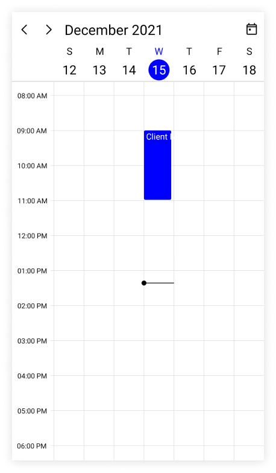

# Getting Started with the .NET MAUI Scheduler

This section explains how to populate the appointments to the Scheduler as well as the essential aspects for getting started with the Scheduler and also provides a walk-through to configure the [.NET MAUI Scheduler](https://help.syncfusion.com/cr/maui/Syncfusion.Maui.Scheduler.SfScheduler.html) control in a real-time scenario. Follow the steps below to add a .NET Scheduler control to your project.

To quickly get started with the [.NET MAUI Scheduler](https://www.syncfusion.com/maui-controls/maui-scheduler), watch this video.






## Prerequisites

Before proceeding, ensure the following are set up:
1. Install [.NET 9 SDK](https://dotnet.microsoft.com/en-us/download/dotnet/9.0) or later is installed.
2. Set up a .NET MAUI environment with Visual Studio 2022 (v17.3 or later) or Visual Studio 2026 (18.0.0) or Visual Studio Code. For Visual Studio Code users, ensure that the .NET MAUI workload is installed and configured as described [here.](https://learn.microsoft.com/en-us/dotnet/maui/get-started/installation?view=net-maui-8.0&tabs=visual-studio-code)

## Step 1: Create a new .NET MAUI project

1. Go to **File > New > Project** and choose the **.NET MAUI App** template.
2. Name the project and choose a location. Then click **Next**.
3. Select the .NET framework version and click **Create**.

## Step 2: Install the Syncfusion® MAUI Scheduler NuGet package

1. In **Solution Explorer,** right-click the project and choose **Manage NuGet Packages.**
2. Search for [Syncfusion.Maui.Scheduler](https://www.nuget.org/packages/Syncfusion.Maui.Scheduler/) and install the latest version.
3. Ensure the necessary dependencies are installed correctly, and the project is restored.




## Prerequisites

Before proceeding, ensure the following are set up:
1. Install [.NET 7 SDK](https://dotnet.microsoft.com/en-us/download/dotnet/7.0) or later is installed.
2. Set up a .NET MAUI environment with Visual Studio Code. 
3. Ensure that the .NET MAUI extension is installed and configured as described [here.](https://learn.microsoft.com/en-us/dotnet/maui/get-started/installation?view=net-maui-8.0&tabs=visual-studio-code)

## Step 1: Create a new .NET MAUI project

1. Open the command palette by pressing `Ctrl+Shift+P` and type **.NET:New Project** and enter.
2. Choose the **.NET MAUI App** template.
3. Select the project location, type the project name and press **Enter**.
4. Then choose **Create project.**

## Step 2: Install the Syncfusion® MAUI Scheduler NuGet package

1. In **Solution Explorer,** right-click the project and choose **Manage NuGet Packages.**
2. Search for [Syncfusion.Maui.Scheduler](https://www.nuget.org/packages/Syncfusion.Maui.Scheduler/) and install the latest version.
3. Ensure the necessary dependencies are installed correctly, and the project is restored. If not, Open the Terminal in Rider and manually run: `dotnet restore`




## Prerequisites

Before proceeding, ensure the following are set up:

1. Ensure you have the latest version of JetBrains Rider.
2. Install [.NET 8 SDK](https://dotnet.microsoft.com/en-us/download/dotnet/8.0) or later is installed.
3. Make sure the MAUI workloads are installed and configured as described [here.](https://www.jetbrains.com/help/rider/MAUI.html#before-you-start)

## Step 1: Create a new .NET MAUI project

1. Go to **File > New Solution,** Select .NET (C#) and choose the .NET MAUI App template.
2. Enter the Project Name, Solution Name, and Location.
3. Select the .NET framework version and click Create.

## Step 2: Install the Syncfusion® MAUI Scheduler NuGet package

1. In **Solution Explorer,** right-click the project and choose **Manage NuGet Packages.**
2. Search for [Syncfusion.Maui.Scheduler](https://www.nuget.org/packages/Syncfusion.Maui.Scheduler/) and install the latest version.
3. Ensure the necessary dependencies are installed correctly, and the project is restored. If not, Open the Terminal in Rider and manually run: `dotnet restore`




## Step 3: Register Syncfusion handler

Make sure to add the namespace.



using Syncfusion.Maui.Core.Hosting;



Register the Syncfusion core handler in your `CreateMauiApp` method of `MauiProgram.cs` file to use Syncfusion controls.



builder.ConfigureSyncfusionCore();
 


## Step 4: Import Scheduler namespace

Add the following namespace in your XAML or C#.




xmlns:scheduler="clr-namespace:Syncfusion.Maui.Scheduler;assembly=Syncfusion.Maui.Scheduler"




using Syncfusion.Maui.Scheduler;




## Step 5: Add the Scheduler component

The [.NET MAUI Scheduler](https://help.syncfusion.com/cr/maui/Syncfusion.Maui.Scheduler.SfScheduler.html) has a built-in capability to handle the appointment arrangement internally based on the [SchedulerAppointment](https://help.syncfusion.com/cr/maui/Syncfusion.Maui.Scheduler.SchedulerAppointment.html) collections. Allocate the collection generated to the Appointments property.

The [SchedulerAppointment](https://help.syncfusion.com/cr/maui/Syncfusion.Maui.Scheduler.SchedulerAppointment.html) is a class that includes the specific scheduled appointment. It has some basic properties such as [StartTime](https://help.syncfusion.com/cr/maui/Syncfusion.Maui.Scheduler.SchedulerRegionBase.html#Syncfusion_Maui_Scheduler_SchedulerRegionBase_StartTime), [EndTime](https://help.syncfusion.com/cr/maui/Syncfusion.Maui.Scheduler.SchedulerRegionBase.html#Syncfusion_Maui_Scheduler_SchedulerRegionBase_EndTime), [Subject](https://help.syncfusion.com/cr/maui/Syncfusion.Maui.Scheduler.SchedulerAppointmentMapping.html#Syncfusion_Maui_Scheduler_SchedulerAppointmentMapping_Subject), and some additional information about the appointment can be added with [Notes](https://help.syncfusion.com/cr/maui/Syncfusion.Maui.Scheduler.SchedulerAppointmentMapping.html#Syncfusion_Maui_Scheduler_SchedulerAppointmentMapping_Notes), [Location](https://help.syncfusion.com/cr/maui/Syncfusion.Maui.Scheduler.SchedulerAppointmentMapping.html#Syncfusion_Maui_Scheduler_SchedulerAppointmentMapping_Location), and [IsAllDay](https://help.syncfusion.com/cr/maui/Syncfusion.Maui.Scheduler.SchedulerAppointmentMapping.html#Syncfusion_Maui_Scheduler_SchedulerAppointmentMapping_IsAllDay) properties.




<scheduler:SfScheduler x:Name="Scheduler"
                       View="Week"
                       DisplayDate="{Binding DisplayDate}"
                       AppointmentsSource="{Binding Events}"
                       AllowedViews="Day,Week,WorkWeek,Month,TimelineDay,TimelineWeek,TimelineWorkWeek,TimelineMonth">
        <scheduler:SfScheduler.BindingContext>
            <local:SchedulerViewModel />
        </scheduler:SfScheduler.BindingContext>
    </scheduler:SfScheduler>



var appointment = new ObservableCollection<SchedulerAppointment>();
appointment.Add(new SchedulerAppointment()
{
    StartTime = DateTime.Today.AddHours(9),
    EndTime = DateTime.Today.AddHours(11),
    Subject = "Client Meeting",
    Location = "Hutchison road",
});

this.scheduler.AppointmentsSource = appointment;




You can download the Scheduler Getting Started sample from [GitHub](https://github.com/SyncfusionExamples/maui-scheduler-examples/tree/main/GettingStarted). Looking for the full .NET MAUI Scheduler component overview, features, pricing, and documentation? Visit the [.NET MAUI Scheduler](https://www.syncfusion.com/maui-controls/maui-scheduler) page.