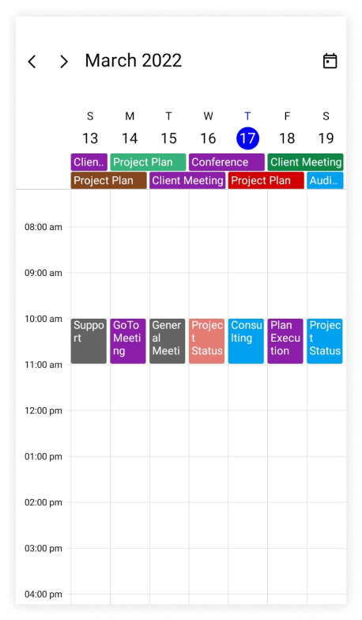
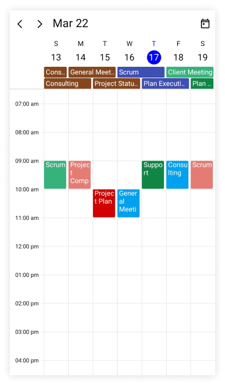
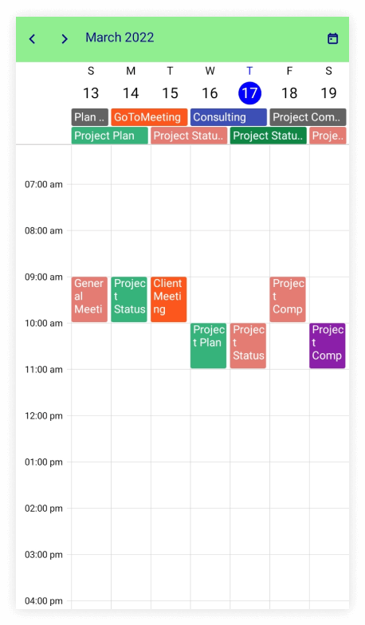
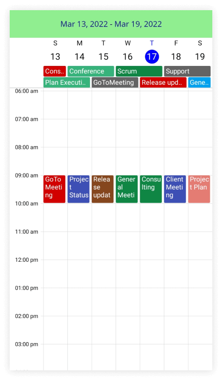

# Header in .NET MAUI Scheduler (SfScheduler)

You can learn about `SfScheduler's` header height, date format, and appearance support.

## Customize header height in scheduler

You can customize the default [Height](https://help.syncfusion.com/cr/maui/Syncfusion.Maui.Scheduler.SchedulerHeaderSettingsBase.html#Syncfusion_Maui_Scheduler_SchedulerHeaderSettingsBase_Height) property of the [HeaderView](https://help.syncfusion.com/cr/maui/Syncfusion.Maui.Scheduler.SchedulerHeaderView.html) in the [SfScheduler](https://help.syncfusion.com/cr/maui/Syncfusion.Maui.Scheduler.SfScheduler.html). By default, the header height is `50.`

  


<scheduler:SfScheduler x:Name="Scheduler" 
                       View="Week">
    <scheduler:SfScheduler.HeaderView>
        <scheduler:SchedulerHeaderView 
                       Height="100">
        </scheduler:SchedulerHeaderView>
    </scheduler:SfScheduler.HeaderView>
</scheduler:SfScheduler>




SfScheduler scheduler = new SfScheduler();
scheduler.View = SchedulerView.Week;
scheduler.HeaderView.Height = 100;
this.Content = scheduler;

  


## Header date format

The header date format can be customized by using the [TextFormat](https://help.syncfusion.com/cr/maui/Syncfusion.Maui.Scheduler.SchedulerHeaderView.html#Syncfusion_Maui_Scheduler_SchedulerHeaderView_TextFormat) property of the [SfScheduler](https://help.syncfusion.com/cr/maui/Syncfusion.Maui.Scheduler.SfScheduler.html). By default, the header text format is `MMMM yyyy.`

  


<scheduler:SfScheduler x:Name="Scheduler" 
                       View="Week">
    <scheduler:SfScheduler.HeaderView>
        <scheduler:SchedulerHeaderView 
                       TextFormat="MMM yy">
        </scheduler:SchedulerHeaderView>
    </scheduler:SfScheduler.HeaderView>
</scheduler:SfScheduler>




SfScheduler scheduler = new SfScheduler();
scheduler.View = SchedulerView.Week;
scheduler.HeaderView.TextFormat = "MMM yy";
this.Content = scheduler;




## Header appearance customization

The header can be customized by using the [HeaderView](https://help.syncfusion.com/cr/maui/Syncfusion.Maui.Scheduler.SchedulerHeaderView.html) property of the [SfScheduler](https://help.syncfusion.com/cr/maui/Syncfusion.Maui.Scheduler.SfScheduler.html).

#### Customize header appearance using text style

You can style the background color and textStyle by using the properties such as [Background](https://help.syncfusion.com/cr/maui/Syncfusion.Maui.Scheduler.SchedulerHeaderSettingsBase.html#Syncfusion_Maui_Scheduler_SchedulerHeaderSettingsBase_Background) and [TextStyle](https://help.syncfusion.com/cr/maui/Syncfusion.Maui.Scheduler.SchedulerHeaderView.html#Syncfusion_Maui_Scheduler_SchedulerHeaderView_TextStyle) properties of [HeaderView](https://help.syncfusion.com/cr/maui/Syncfusion.Maui.Scheduler.SchedulerHeaderView.html).




 <scheduler:SfScheduler x:Name="Scheduler" 
                        View="Week">
    <scheduler:SfScheduler.HeaderView>
        <scheduler:SchedulerHeaderView 
                        Background="LightGreen">
        </scheduler:SchedulerHeaderView>
    </scheduler:SfScheduler.HeaderView>
 </scheduler:SfScheduler>




var textStyle = new SchedulerTextStyle()
{
    TextColor = Colors.DarkBlue,
    FontSize = 14,
};

this.Scheduler.View = SchedulerView.Week;
this.Scheduler.HeaderView.TextStyle = textStyle;
this.Scheduler.HeaderView.Background = Brush.LightGreen;

  


#### Customize header appearance using DataTemplate

You can customize the header appearance by using the [HeaderTemplate](https://help.syncfusion.com/cr/maui/Syncfusion.Maui.Scheduler.SchedulerHeaderView.html#Syncfusion_Maui_Scheduler_SchedulerHeaderView_HeaderTemplate) property of [HeaderView](https://help.syncfusion.com/cr/maui/Syncfusion.Maui.Scheduler.SchedulerHeaderView.html) in the [SfScheduler](https://help.syncfusion.com/cr/maui/Syncfusion.Maui.Scheduler.SfScheduler.html). 




  <scheduler:SfScheduler x:Name="Scheduler" 
                         View="Week">
    <scheduler:SfScheduler.HeaderView>
        <scheduler:SchedulerHeaderView>
            <scheduler:SchedulerHeaderView.HeaderTemplate>
                <DataTemplate>
                    <Grid Background = "LightGreen">
                        <Label x:Name="label" TextColor="DarkBlue" HorizontalOptions="Center" VerticalOptions="Center">
                            <Label.Text>
                                <MultiBinding StringFormat = "{}{0:MMM dd, yyyy} - {1:MMM dd, yyyy}">
                                    <Binding Path="StartDate" />
                                    <Binding Path = "EndDate" />
                                </MultiBinding>
                            </Label.Text>
                        </Label>
                        <Label  HorizontalOptions="Center" VerticalOptions="End" Text="{Binding Text}" TextColor="Red" />
                    </Grid>
                </DataTemplate>
            </scheduler:SchedulerHeaderView.HeaderTemplate>
        </scheduler:SchedulerHeaderView>
    </scheduler:SfScheduler.HeaderView>
 </scheduler:SfScheduler>




#### Customize header appearance using DataTemplateSelector

You can customize the header appearance by using the [HeaderTemplate](https://help.syncfusion.com/cr/maui/Syncfusion.Maui.Scheduler.SchedulerHeaderView.html#Syncfusion_Maui_Scheduler_SchedulerHeaderView_HeaderTemplate) property of [HeaderView](https://help.syncfusion.com/cr/maui/Syncfusion.Maui.Scheduler.SchedulerHeaderView.html) in the [SfScheduler](https://help.syncfusion.com/cr/maui/Syncfusion.Maui.Scheduler.SfScheduler.html). The `DataTemplateSelector` can choose a `DataTemplate` at runtime based on the value of a data-bound to scheduler header by using the `HeaderTemplate.` It allows you to choose a different data template for each header, as well as to customize the appearance of a particular header based on certain conditions.




 <Grid>
    <Grid.Resources>
        <DataTemplate x:Key="todayDatesTemplate">
            <Grid Background = "LightBlue" >
                <Label x:Name="label" HorizontalOptions="Center" VerticalOptions="Center">
                    <Label.Text>
                        <MultiBinding StringFormat = "{}{0:MMM dd, yyyy} - {1:MMM dd, yyyy}" >
                            <Binding Path="StartDate" />
                            <Binding Path = "EndDate" />
                        </MultiBinding >
                    </Label.Text >
                </Label>
                <Label  HorizontalOptions="Center" VerticalOptions="End" Text="{Binding Text}" TextColor="Red" />
            </Grid>
        </DataTemplate>
        <DataTemplate x:Key="normaldatesTemplate">
            <Grid Background = "LightGreen" >
                <Label x:Name="label" HorizontalOptions="Center" VerticalOptions="Center">
                    <Label.Text>
                        <MultiBinding StringFormat = "{}{0:MMM dd, yyyy} - {1:MMM dd, yyyy}" >
                            <Binding Path="StartDate" />
                            <Binding Path = "EndDate" />
                        </MultiBinding >
                    </Label.Text >
                </Label>
                <Label  HorizontalOptions="Center" VerticalOptions="End" Text="{Binding Text}" TextColor="Orange" />
            </Grid>
        </DataTemplate>
        <local:HeaderTemplateSelector x:Key="headerTemplateSelector" TodayDatesTemplate="{StaticResource todayDatesTemplate}"  NormaldatesTemplate="{StaticResource normaldatesTemplate}" />
    </Grid.Resources>
    <scheduler:SfScheduler x:Name="Scheduler" 
                           View="Week">
        <scheduler:SfScheduler.HeaderView>
            <scheduler:SchedulerHeaderView HeaderTemplate = "{StaticResource headerTemplateSelector}" />
        </scheduler:SfScheduler.HeaderView>
    </scheduler:SfScheduler>
 </Grid>




public class HeaderTemplateSelector : DataTemplateSelector
{
    public HeaderTemplateSelector()
    {
    }
    public DataTemplate TodayDatesTemplate { get; set; }
    public DataTemplate NormaldatesTemplate { get; set; }
    protected override DataTemplate OnSelectTemplate(object item, BindableObject container)
    {
        var headerDetails = item as SchedulerHeaderDetails;
        if (headerDetails != null)
        {
            if (headerDetails.StartDate.Date <= DateTime.Now.Date && headerDetails.EndDate >= DateTime.Now.Date)
                return TodayDatesTemplate;
        }
        return NormaldatesTemplate;
    }
}

  


>Note:
* When using data template selector, performance issues occur as the conversion template views take time within the framework.