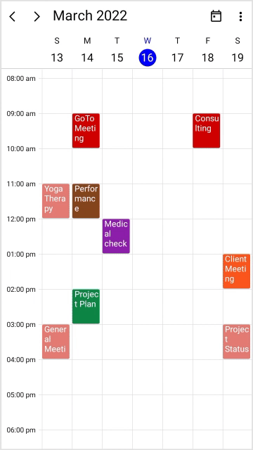

# Load on demand in .NET MAUI Event Scheduler (SfScheduler)

The [.NET MAUI Scheduler](https://www.syncfusion.com/maui-controls/maui-scheduler) provides the capability to display an interactive view when the view is changed, or swipe between the views, and also to load appointments on-demand with a loading indicator, thereby improving loading performance when there are appointments range for multiple years.

## Load appointments on demand

It allows you to load appointments on-demand for the visible dates. The [ShowBusyIndicator](https://help.syncfusion.com/cr/maui/Syncfusion.Maui.Scheduler.SfScheduler.html#Syncfusion_Maui_Scheduler_SfScheduler_ShowBusyIndicator) property can be used to start and stop the loading indicator animation before and after appointments are loaded.

These can be achieved in two ways:

* QueryAppointments event
* QueryAppointments command

### QueryAppointments event

This [QueryAppointments](https://help.syncfusion.com/cr/maui/Syncfusion.Maui.Scheduler.SfScheduler.html#Syncfusion_Maui_Scheduler_SfScheduler_QueryAppointments) event occurs when the view of the scheduler or the visible dates are changed, and it also allows the [AppointmentsSource](https://help.syncfusion.com/cr/maui/Syncfusion.Maui.Scheduler.SfScheduler.html#Syncfusion_Maui_Scheduler_SfScheduler_AppointmentsSource) for the visible dates to be loaded in on-demand. The following is a list of the arguments:

* `Sender`: This contains the `SfScheduler` object.

* [SchedulerQueryAppointmentsEventArgs](https://help.syncfusion.com/cr/maui/Syncfusion.Maui.Scheduler.SchedulerQueryAppointmentsEventArgs.html): This event will be performed on the view of the scheduler or when the visible dates are changed, and you can see the details about the VisibleDates.

    * [VisibleDates](https://help.syncfusion.com/cr/maui/Syncfusion.Maui.Scheduler.SchedulerQueryAppointmentsEventArgs.html#Syncfusion_Maui_Scheduler_SchedulerQueryAppointmentsEventArgs_VisibleDates): Gets the current visible dates of scheduler that is used to load the appointments to the `AppointmentsSource` on demand which is used to reduce the appointment fetching performance to render in current visible dates from a large data source.




 <scheduler:SfScheduler x:Name="Scheduler" 
                        View="Week"
                        QueryAppointments="OnSchedulerQueryAppointments">
 </scheduler:SfScheduler>




this.Scheduler.View = SchedulerView.Week;
this.Scheduler.QueryAppointments += OnSchedulerQueryAppointments;

private async void OnSchedulerQueryAppointments(object sender, SchedulerQueryAppointmentsEventArgs e)
{
    this.Scheduler.ShowBusyIndicator = true;
    await Task.Delay(1500);
    var appCollection = this.GenerateSchedulerAppointments(e.VisibleDates);
    if (this.Scheduler.View != SchedulerView.Agenda)
    {
        this.Scheduler.AppointmentsSource = appCollection;
    }
    else
    {
        foreach (var app in appCollection)
        {
            ((ObservableCollection<SchedulerAppointment>)this.Scheduler.AppointmentsSource).Add(app);
        }
    }
    this.Scheduler.ShowBusyIndicator = false;
}

private ObservableCollection<SchedulerAppointment> GenerateSchedulerAppointments(List<DateTime> visibleDates)
{
    var brush = new ObservableCollection<Brush>
    {
        new SolidColorBrush(Color.FromArgb("#FF8B1FA9")),
        new SolidColorBrush(Color.FromArgb("#FFD20100")),
        new SolidColorBrush(Color.FromArgb("#FFFC571D")),
        new SolidColorBrush(Color.FromArgb("#FF36B37B")),
        new SolidColorBrush(Color.FromArgb("#FF3D4FB5")),
        new SolidColorBrush(Color.FromArgb("#FFE47C73")),
        new SolidColorBrush(Color.FromArgb("#FF636363")),
        new SolidColorBrush(Color.FromArgb("#FF85461E")),
        new SolidColorBrush(Color.FromArgb("#FF0F8644")),
        new SolidColorBrush(Color.FromArgb("#FF01A1EF"))
    };

    var subjectCollection = new ObservableCollection<string>
    {
        "Business Meeting",
        "Conference",
        "Medical check up",
        "Performance Check",
        "Consulting",
        "Project Status Discussion",
        "Client Meeting",
        "General Meeting",
        "Yoga Therapy",
        "GoToMeeting",
        "Plan Execution",
        "Project Plan"
    };

    Random ran = new();
    int daysCount = visibleDates.Count;
    DateTime visibleStartDate = visibleDates.FirstOrDefault();
    var appointments = new ObservableCollection<SchedulerAppointment>();
    for (int i = 0; i < 25; i++)
    {
        var startTime = visibleStartDate.AddDays(ran.Next(0, daysCount + 1)).AddHours(ran.Next(9, 16));
        appointments.Add(new SchedulerAppointment()
        {
            StartTime = startTime,
            EndTime = startTime.AddHours(1),
            Subject = subjectCollection[ran.Next(0, subjectCollection.Count)],
            Background = brush[ran.Next(0, brush.Count)]
        });
    }

    return appointments;
}




N> The QueryAppointments event will be triggered, if any one of the following actions is performed.,
* Once the `ViewChanged` event is triggered, the `QueryAppointments` will be triggered.
* If an appointment has been added or removed in the current visible dates, then the `QueryAppointments` event will not be triggered. Because the appointments for that visible date are already loaded.
* In the scheduler agenda view, the `QueryAppointments` event is used to load more appointments when the new month is loaded on view, whereas the new month appointments are added in scheduler `AppointmentsSource.`
* Other than agenda view, the scheduler `AppointmentsSource` can be reset for a new visible date range to improve appointment loading performance.

### QueryAppointments command

The Scheduler notifies the [QueryAppointmentsCommand](https://help.syncfusion.com/cr/maui/Syncfusion.Maui.Scheduler.SfScheduler.html#Syncfusion_Maui_Scheduler_SfScheduler_QueryAppointmentsCommand), when the view of the scheduler or the visible dates are changed. Get a list of visible dates from the [SchedulerQueryAppointmentsEventArgs](https://help.syncfusion.com/cr/maui/Syncfusion.Maui.Scheduler.SchedulerQueryAppointmentsEventArgs.html). The default value for this `ICommand` is `null.` The `SchedulerQueryAppointmentsEventArgs` was passed as a command parameter.

A ViewModel class should implement a command and handle it by the `CanExecute` and `Execute` methods to handle on-demand loading. In execute method, perform the following operations.

The [ShowBusyIndicator](https://help.syncfusion.com/cr/maui/Syncfusion.Maui.Scheduler.SfScheduler.html#Syncfusion_Maui_Scheduler_SfScheduler_ShowBusyIndicator) property can be used to start and stop the loading indicator animation, before and after appointments are loaded into the [AppointmentsSource](https://help.syncfusion.com/cr/maui/Syncfusion.Maui.Scheduler.SfScheduler.html#Syncfusion_Maui_Scheduler_SfScheduler_AppointmentsSource) of the [SfScheduler](https://help.syncfusion.com/cr/maui/Syncfusion.Maui.Scheduler.SfScheduler.html).




 <scheduler:SfScheduler x:Name="Scheduler" 
                        View="Week"
                        AppointmentsSource="{Binding Events}"
                        ShowBusyIndicator="{Binding ShowBusyIndicator}"
                        QueryAppointmentsCommand="{Binding QueryAppointmentsCommand}">
    <scheduler:SfScheduler.BindingContext>
        <local:LoadOnDemandViewModel/>
    </scheduler:SfScheduler.BindingContext>
 </scheduler:SfScheduler>




public class LoadOnDemandViewModel : INotifyPropertyChanged
{
    private bool showBusyIndicator;
    private ObservableCollection<SchedulerAppointment>? events;

    public ICommand QueryAppointmentsCommand { get; set; }
    public ObservableCollection<SchedulerAppointment>? Events
    {
        get { return events; }
        set
        {
            events = value;
            this.RaiseOnPropertyChanged(nameof(Events));
        }
    }

    public bool ShowBusyIndicator
    {
        get { return showBusyIndicator; }
        set
        {
            showBusyIndicator = value;
            this.RaiseOnPropertyChanged(nameof(ShowBusyIndicator));
        }
    }

    public event PropertyChangedEventHandler? PropertyChanged;

    public LoadOnDemandViewModel()
    {
        this.QueryAppointmentsCommand = new Command<object>(LoadMoreAppointments, CanLoadMoreAppointments);
    }

    private void RaiseOnPropertyChanged(string propertyName)
    {
        this.PropertyChanged?.Invoke(this, new PropertyChangedEventArgs(propertyName));
    }

    private bool CanLoadMoreAppointments(object obj)
    {
        return true;
    }

    private async void LoadMoreAppointments(object obj)
    {
        this.ShowBusyIndicator = true;
        await Task.Delay(1500);
        this.Events = this.GenerateSchedulerAppointments(((SchedulerQueryAppointmentsEventArgs)obj).VisibleDates);
        this.ShowBusyIndicator = false;
    }

    private ObservableCollection<SchedulerAppointment> GenerateSchedulerAppointments(List<DateTime> visibleDates)
    {
        var brush = new ObservableCollection<Brush>
        {
            new SolidColorBrush(Color.FromArgb("#FF8B1FA9")),
            new SolidColorBrush(Color.FromArgb("#FFD20100")),
            new SolidColorBrush(Color.FromArgb("#FFFC571D")),
            new SolidColorBrush(Color.FromArgb("#FF36B37B")),
            new SolidColorBrush(Color.FromArgb("#FF3D4FB5")),
            new SolidColorBrush(Color.FromArgb("#FFE47C73")),
            new SolidColorBrush(Color.FromArgb("#FF636363")),
            new SolidColorBrush(Color.FromArgb("#FF85461E")),
            new SolidColorBrush(Color.FromArgb("#FF0F8644")),
            new SolidColorBrush(Color.FromArgb("#FF01A1EF"))
        };

        var subjectCollection = new ObservableCollection<string>
        {
            "Business Meeting",
            "Conference",
            "Medical check up",
            "Performance Check",
            "Consulting",
            "Project Status Discussion",
            "Client Meeting",
            "General Meeting",
            "Yoga Therapy",
            "GoToMeeting",
            "Plan Execution",
            "Project Plan"
        };

        Random ran = new();
        int daysCount = visibleDates.Count;
        DateTime visibleStartDate = visibleDates.FirstOrDefault();
        var appointments = new ObservableCollection<SchedulerAppointment>();
        for (int i = 0; i < 10; i++)
        {
            var startTime = visibleStartDate.AddDays(ran.Next(0, daysCount + 1)).AddHours(ran.Next(9, 16));
            appointments.Add(new SchedulerAppointment()
            {
                StartTime = startTime,
                EndTime = startTime.AddHours(1),
                Subject = subjectCollection[ran.Next(0, subjectCollection.Count)],
                Background = brush[ran.Next(0, brush.Count)]
            });
        }

        return appointments;
    }
}




N> The `QueryAppointmentsCommand` will be raised if any one of the following action is performed,
* Once the `ViewChanged` event is raised, the `QueryAppointmentsCommand` will be raised.
* If an appointment has been added or removed in the current time visible date, then the `QueryAppointments` command will not be triggered. Because the appointments for that visible date are already loaded.
* In the scheduler agenda view, the `QueryAppointments` event is used to load more appointments when the new month is loaded on view, whereas the new month appointments are added in scheduler `AppointmentsSource.`
* Other than agenda view, the scheduler `AppointmentsSource` can be reset for a new visible date range to improve appointment loading performance.

## Show busy indicator

The `Scheduler` supports to show the busy indicator view by using the [ShowBusyIndicator](https://help.syncfusion.com/cr/maui/Syncfusion.Maui.Scheduler.SfScheduler.html#Syncfusion_Maui_Scheduler_SfScheduler_ShowBusyIndicator) property of the [SfScheduler](https://help.syncfusion.com/cr/maui/Syncfusion.Maui.Scheduler.SfScheduler.html). The default value is set to `false.` If the value is set to `true` and visible dates are changed, then the busy indicator will be loaded on view.




 <scheduler:SfScheduler x:Name="Scheduler" 
                        View="Week"
                        ShowBusyIndicator="True">
 </scheduler:SfScheduler>




SfScheduler scheduler = new SfScheduler();
scheduler.View = SchedulerView.Week;
scheduler.ShowBusyIndicator = true;
this.Content = scheduler;




N>  
* When using the `QueryAppointments` or `QueryAppointmentsCommand,` you can start and stop the animation before and after the appointments load.
* When `QueryAppointments` or `QueryAppointmentsCommand` are not used, and show busy indicator is enabled, the busy indicator will be stopped once the appointment is rendered.

## Busy indicator appearance

You can customize the busy indicator appearance by using the [BusyIndicatorTemplate](https://help.syncfusion.com/cr/maui/Syncfusion.Maui.Scheduler.SfScheduler.html#Syncfusion_Maui_Scheduler_SfScheduler_BusyIndicatorTemplate) property of [SfScheduler](https://help.syncfusion.com/cr/maui/Syncfusion.Maui.Scheduler.SfScheduler.html).




 <scheduler:SfScheduler x:Name="Scheduler" 
                        View="Week"
                        ShowBusyIndicator="True">
    <scheduler:SfScheduler.BusyIndicatorTemplate>
        <DataTemplate>
            <Grid Background="LightGray" Opacity="0.2">
                <Label Text="Loading..." HorizontalOptions="Center" VerticalOptions="Center" TextColor="Blue"/>
            </Grid>
        </DataTemplate>
    </scheduler:SfScheduler.BusyIndicatorTemplate>
 </scheduler:SfScheduler>




N>
* The `BusyIndicatorTemplate` is applicable to only, when `ShowBusyIndicator` property is enabled.
* The `BusyIndicatorTemplate` is also applicable for `QueryAppointments` and `QueryAppointmentsCommand` properties of the `SfScheduler.`
