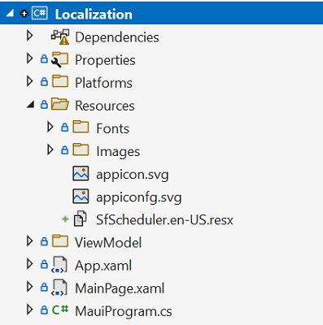
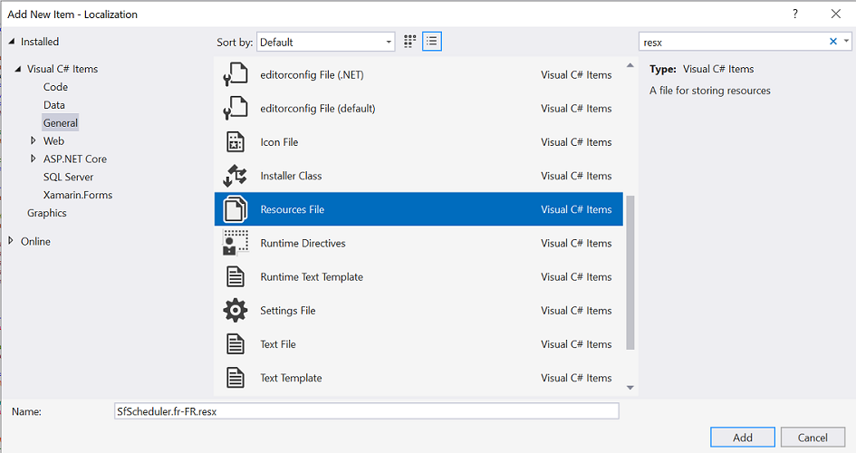
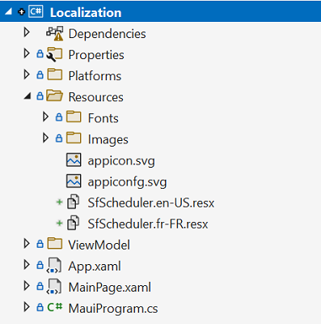
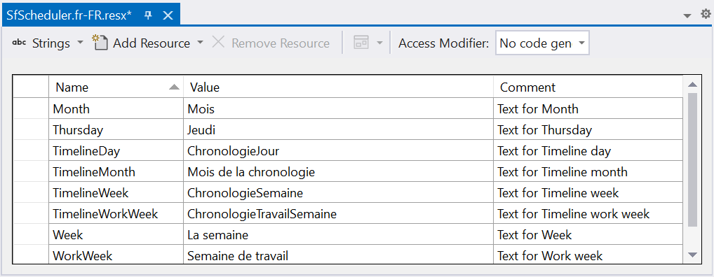

# Localization in .NET MAUI Scheduler (SfScheduler)

Localization is the process of translating the application resources into different language for the specific cultures. The `SfScheduler` can be localized by adding `resource` file. The SfScheduler allows you to localize the following built-in strings to suit your application’s language and culture:
<<<<<<< HEAD
=======

* Day
* Week
* WorkWeek
* Month
* TimelineDay
* TimelineWeek
* TimelineWorkWeek
* TimelineMonth
* Agenda
* Today
* NoEvents
* AllDay
>>>>>>> master

* Day
* Week
* WorkWeek
* Month
* TimelineDay
* TimelineWeek
* TimelineWorkWeek
* TimelineMonth
* Agenda
* Today
* NoEvents
* AllDay
 
## Setting CurrentUICulture to the application

Application culture can be changed by setting `CurrentUICulture.` in `App.xaml.cs` file.




using Syncfusion.Maui.Scheduler;
using System.Resources;

public partial class App : Application
{
	public App()
	{
		InitializeComponent();
		CultureInfo.CurrentUICulture = new CultureInfo("fr-FR");
      //// ResXPath => Full path of the resx file; For example : //SfScheduleResources.ResourceManager = new ResourceManager
      // ("MauiSchedulerDemo.Resources.SfScheduler", Application.Current.GetType().Assembly);

		SfScheduleResources.ResourceManager = new ResourceManager(ResXPath, Application.Current.GetType().Assembly);
	   MainPage = new MainPage();
	}
}




N>
The required `resx` files with `Build Action` as `EmbeddedResource` (File name should contain culture code) into the `Resources` folder.

## Localize application level

To localize the `Scheduler` based on `CurrentUICulture` using `resource` files, follow the below steps.

   1. Add the default resource file of `Scheduler` into `Resources` folder of the application.

   

   2. Right-click on the `Resources` folder, select `Add` and then `NewItem.`

   3. In Add New Item wizard, select the Resource File option and name the filename as `SfScheduler.<culture name>.resx.` For example, give the name as `SfScheduler.fr-FR.resx` for French culture.

   4. The culture name indicates the name of the language and country.

   

   5. Now, select `Add` option to add the resource file in **Resources** folder.

   

   6. Add the Name/Value pair in Resource Designer of `SfScheduler.fr-FR.resx` file and change its corresponding value to corresponding culture.

   

   The complete sample can be downloaded from [GitHub](https://github.com/SyncfusionExamples/maui-scheduler-examples/tree/main/Localization).
   