# Month View in .NET MAUI Scheduler (SfScheduler)

By default, the Month view displays the entire days of a particular month and current month initially. The current date color is differentiated from other dates of the current month, and also the color differentiation for dates will be applicable for the previous and next month dates.

By default, when an appointment is tried to create through Month view, it is considered to be created for an entire day.

N> The appointment views for each month cells will be updated depends on the month cells height. While resizing the layout, the following actions would be performed,
* If the appointment views overlaps with month cell dates or do not fit into the month cell height then the appointment view is changed from [AppointmentDisplayMode.Text](https://help.syncfusion.com/cr/maui/Syncfusion.Maui.Scheduler.SchedulerMonthAppointmentDisplayMode.html#Syncfusion_Maui_Scheduler_SchedulerMonthAppointmentDisplayMode_Text) to [AppointmentDisplayMode.Indicator](https://help.syncfusion.com/cr/maui/Syncfusion.Maui.Scheduler.SchedulerMonthAppointmentDisplayMode.html#Syncfusion_Maui_Scheduler_SchedulerMonthAppointmentDisplayMode_Indicator) view.
* If the indicator views overlaps with month cell dates, then the indicator view is changed from [(AppointmentDisplayMode.Indicator](https://help.syncfusion.com/cr/maui/Syncfusion.Maui.Scheduler.SchedulerMonthAppointmentDisplayMode.html#Syncfusion_Maui_Scheduler_SchedulerMonthAppointmentDisplayMode_Indicator) to [AppointmentDisplayMode.None](https://help.syncfusion.com/cr/maui/Syncfusion.Maui.Scheduler.SchedulerMonthAppointmentDisplayMode.html#Syncfusion_Maui_Scheduler_SchedulerMonthAppointmentDisplayMode_None).

## Appointment display mode

The scheduler month view appointment display can be handled by using the [AppointmentDisplayMode](https://help.syncfusion.com/cr/maui/Syncfusion.Maui.Scheduler.SchedulerMonthView.html#Syncfusion_Maui_Scheduler_SchedulerMonthView_AppointmentDisplayMode) property of [MonthView](https://help.syncfusion.com/cr/maui/Syncfusion.Maui.Scheduler.SchedulerMonthView.html). By default, `AppointmentDisplayMode` is set to `Text,` using the `AppointmentDisplayMode.` 

You can set the month view appointments display as follows.

* [None](https://help.syncfusion.com/cr/maui/Syncfusion.Maui.Scheduler.SchedulerMonthAppointmentDisplayMode.html#Syncfusion_Maui_Scheduler_SchedulerMonthAppointmentDisplayMode_None):  Appointment will not be displayed.
* [Indicator](https://help.syncfusion.com/cr/maui/Syncfusion.Maui.Scheduler.SchedulerMonthAppointmentDisplayMode.html#Syncfusion_Maui_Scheduler_SchedulerMonthAppointmentDisplayMode_Indicator):  Appointment will be denoted as the circle.
* [Text](https://help.syncfusion.com/cr/maui/Syncfusion.Maui.Scheduler.SchedulerMonthAppointmentDisplayMode.html#Syncfusion_Maui_Scheduler_SchedulerMonthAppointmentDisplayMode_Text):  Appointment subject will be displayed in the month cell.

  


<scheduler:SfScheduler x:Name="Scheduler" 
                       View="Month">
    <scheduler:SfScheduler.MonthView>
        <scheduler:SchedulerMonthView 
                       AppointmentDisplayMode="Indicator"/>
    </scheduler:SfScheduler.MonthView>
</scheduler:SfScheduler>




SfScheduler scheduler = new SfScheduler();
scheduler.View = SchedulerView.Month;
scheduler.MonthView.AppointmentDisplayMode = SchedulerMonthAppointmentDisplayMode.Indicator;
this.Content = scheduler;

  


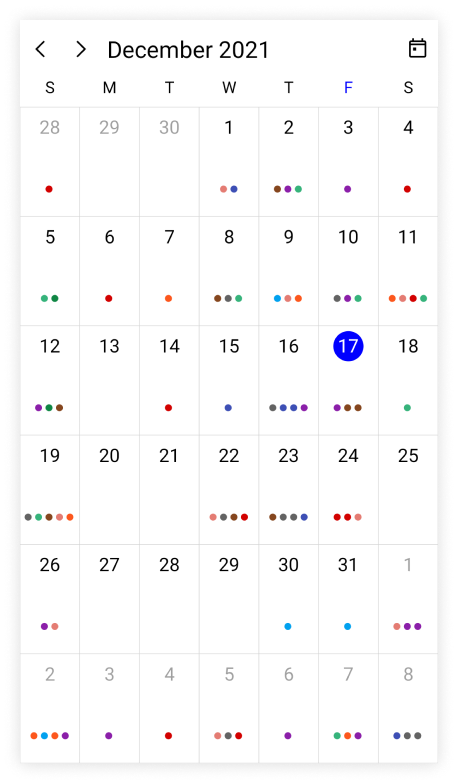

N>
* [View scheduler appointment sample in GitHub](https://github.com/SyncfusionExamples/maui-scheduler-examples/tree/main/GettingStarted)
* [View business object sample in GitHub](https://github.com/SyncfusionExamples/maui-scheduler-examples/tree/main/BusinessObject)

## Appointment indicator count

The scheduler month view appointment indicator count allows you to customize the count of the appointment indicator by using the [AppointmentIndicatorCount](https://help.syncfusion.com/cr/maui/Syncfusion.Maui.Scheduler.SchedulerMonthView.html#Syncfusion_Maui_Scheduler_SchedulerMonthView_AppointmentIndicatorCount) property of the [MonthView](https://help.syncfusion.com/cr/maui/Syncfusion.Maui.Scheduler.SchedulerMonthView.html). By default, the [AppointmentIndicatorCount](https://help.syncfusion.com/cr/maui/Syncfusion.Maui.Scheduler.SchedulerMonthView.html#Syncfusion_Maui_Scheduler_SchedulerMonthView_AppointmentIndicatorCount) is set to 5.

  


<schedule:SfScheduler x:Name="Scheduler"
                        View="Month" >
    <schedule:SfScheduler.MonthView>
        <schedule:SchedulerMonthView AppointmentDisplayMode="Indicator" 
                                     AppointmentIndicatorCount="2"/>
    </schedule:SfScheduler.MonthView>
</schedule:SfScheduler>




this.Scheduler.View = SchedulerView.Month;
this.Scheduler.MonthView.AppointmentDisplayMode = SchedulerMonthAppointmentDisplayMode.Indicator;
this.Scheduler.MonthView.AppointmentIndicatorCount = 1;

  


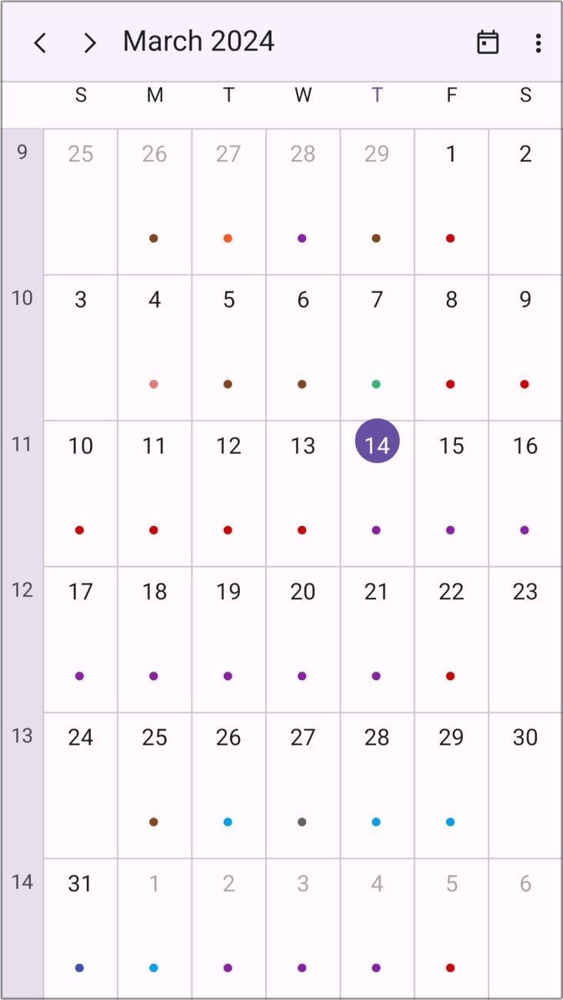

## Appointment indicator size

The scheduler month view allows you to customize the size of the appointment indicator by using the [AppointmentIndicatorSize](https://help.syncfusion.com/cr/maui/Syncfusion.Maui.Scheduler.SchedulerMonthView.html#Syncfusion_Maui_Scheduler_SchedulerMonthView_AppointmentIndicatorSize) property of the [MonthView](https://help.syncfusion.com/cr/maui/Syncfusion.Maui.Scheduler.SchedulerMonthView.html). By default, the [AppointmentIndicatorSize](https://help.syncfusion.com/cr/maui/Syncfusion.Maui.Scheduler.SchedulerMonthView.html#Syncfusion_Maui_Scheduler_SchedulerMonthView_AppointmentIndicatorSize) is set to 6d.

  


<schedule:SfScheduler x:Name="Scheduler"
                        View="Month" >
        <schedule:SfScheduler.MonthView>
            <schedule:SchedulerMonthView AppointmentDisplayMode="Indicator" AppointmentIndicatorSize="10"/>
        </schedule:SfScheduler.MonthView>
</schedule:SfScheduler>




this.Scheduler.View = SchedulerView.Month;
this.Scheduler.MonthView.AppointmentDisplayMode = SchedulerMonthAppointmentDisplayMode.Indicator;
this.Scheduler.MonthView.AppointmentIndicatorSize = 10;

  


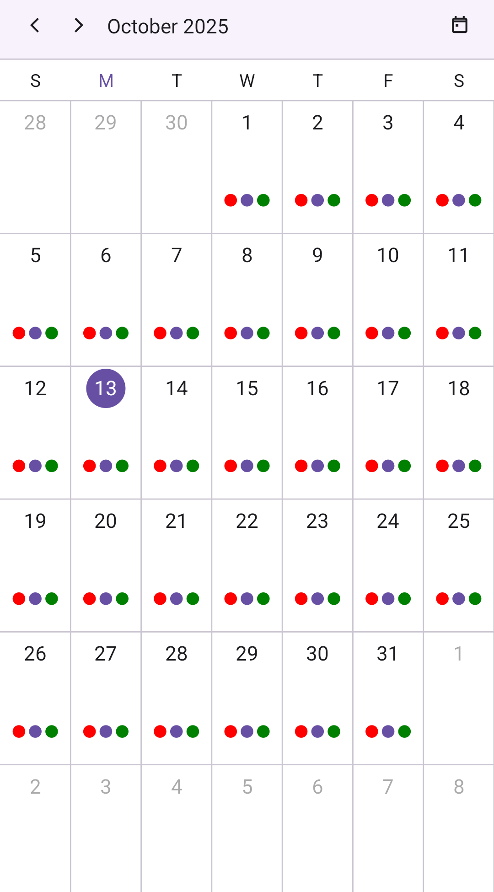{:width="325" height="600" loading="lazy" .lazy .shadow-effect .section-padding .img-padding}

## Appointment indicator renderer mode

The scheduler month view allows you to customize the appointment indicator rendering mode by using the `AppointmentIndicatorRenderMode` property of the [MonthView](https://help.syncfusion.com/cr/maui/Syncfusion.Maui.Scheduler.SchedulerMonthView.html). By default, the `AppointmentIndicatorRenderMode` is set to Fill.

  


<schedule:SfScheduler x:Name="Scheduler"
                        View="Month" >
        <schedule:SfScheduler.MonthView>
            <schedule:SchedulerMonthView AppointmentDisplayMode="Indicator" AppointmentIndicatorRenderMode="FillAndStroke"/>
        </schedule:SfScheduler.MonthView>
</schedule:SfScheduler>




this.Scheduler.View = SchedulerView.Month;
this.Scheduler.MonthView.AppointmentDisplayMode = SchedulerMonthAppointmentDisplayMode.Indicator;
this.Scheduler.MonthView.AppointmentIndicatorRenderMode = AppointmentIndicatorRenderMode.FillAndStroke;

  


## Appointment indicator stroke thickness

The scheduler month view allows you to customize the appointment indicator stroke thickness by using the `AppointmentIndicatorStrokeThickness` property of the [MonthView](https://help.syncfusion.com/cr/maui/Syncfusion.Maui.Scheduler.SchedulerMonthView.html). By default, the `AppointmentIndicatorStrokeThickness` is set to 1d.

  


<schedule:SfScheduler x:Name="Scheduler"
                        View="Month" >
        <schedule:SfScheduler.MonthView>
            <schedule:SchedulerMonthView AppointmentDisplayMode="Indicator" AppointmentIndicatorSize="20" AppointmentIndicatorRenderMode="FillAndStroke" AppointmentIndicatorStrokeThickness="4"/>
        </schedule:SfScheduler.MonthView>
</schedule:SfScheduler>




this.Scheduler.View = SchedulerView.Month;
this.Scheduler.MonthView.AppointmentDisplayMode = SchedulerMonthAppointmentDisplayMode.Indicator;
this.Scheduler.MonthView.AppointmentIndicatorRenderMode = AppointmentIndicatorRenderMode.FillAndStroke;
this.Scheduler.MonthView.AppointmentIndicatorSize = 20;
this.Scheduler.MonthView.AppointmentIndicatorStrokeThickness = 4;

  


## Hide leading and trailing dates

The previous and next month dates from a Scheduler month view can be hidden by using the [ShowLeadingAndTrailingDates](https://help.syncfusion.com/cr/maui/Syncfusion.Maui.Scheduler.SchedulerMonthView.html#Syncfusion_Maui_Scheduler_SchedulerMonthView_ShowLeadingAndTrailingDates) property in the [MonthView](https://help.syncfusion.com/cr/maui/Syncfusion.Maui.Scheduler.SchedulerMonthView.html). The `ShowLeadingAndTrailingDates` property defaults to `true.`

  


 <scheduler:SfScheduler x:Name="Scheduler" 
                        View="Month">
    <scheduler:SfScheduler.MonthView>
        <scheduler:SchedulerMonthView  
                       ShowLeadingAndTrailingDates="False"/>
    </scheduler:SfScheduler.MonthView>
 </scheduler:SfScheduler>




SfScheduler scheduler = new SfScheduler();
scheduler.View = SchedulerView.Month;
scheduler.MonthView.ShowLeadingAndTrailingDates = false;
this.Content = scheduler;

  


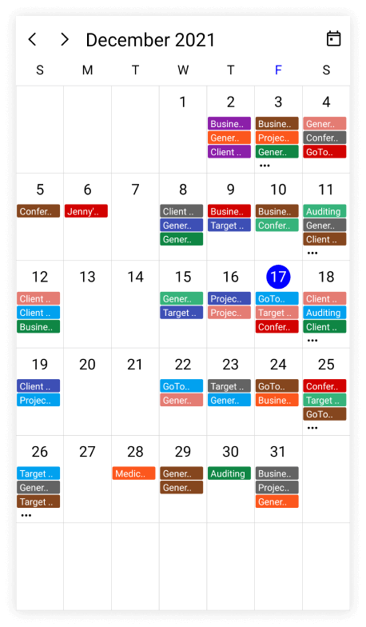

## Number of weeks visible in the month view 

The number of week visible in the month view can be changed by setting the [NumberOfVisibleWeeks](https://help.syncfusion.com/cr/maui/Syncfusion.Maui.Scheduler.SchedulerMonthView.html#Syncfusion_Maui_Scheduler_SchedulerMonthView_NumberOfVisibleWeeks) property in the [MonthView](https://help.syncfusion.com/cr/maui/Syncfusion.Maui.Scheduler.SchedulerMonthView.html). 

  


 <scheduler:SfScheduler x:Name="Scheduler" 
                        View="Month">
    <scheduler:SfScheduler.MonthView>
        <scheduler:SchedulerMonthView  
                       NumberOfVisibleWeeks="2"/>
    </scheduler:SfScheduler.MonthView>
 </scheduler:SfScheduler>




SfScheduler scheduler = new SfScheduler();
scheduler.View = SchedulerView.Month;
scheduler.MonthView.NumberOfVisibleWeeks = 2;
this.Content = scheduler;

  


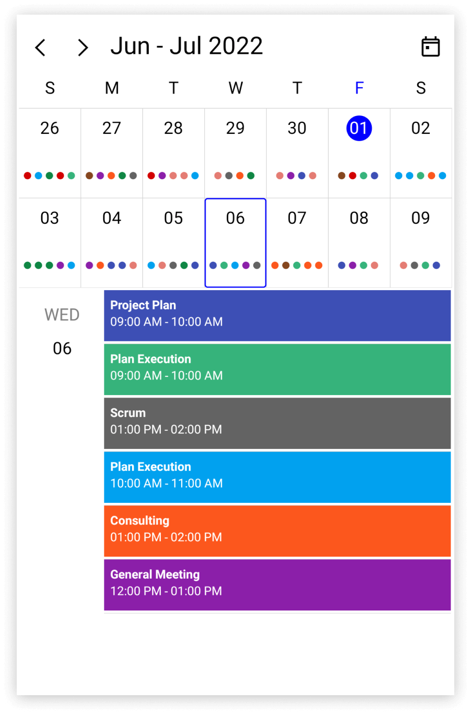

## View header

You can customize the default appearance of view header in a month view by setting the [DayFormat](https://help.syncfusion.com/cr/maui/Syncfusion.Maui.Scheduler.SchedulerViewHeaderSettings.html#Syncfusion_Maui_Scheduler_SchedulerViewHeaderSettings_DayFormat), [DayTextStyle](https://help.syncfusion.com/cr/maui/Syncfusion.Maui.Scheduler.SchedulerViewHeaderSettings.html#Syncfusion_Maui_Scheduler_SchedulerViewHeaderSettings_DayTextStyle), [Background](https://help.syncfusion.com/cr/maui/Syncfusion.Maui.Scheduler.SchedulerHeaderSettingsBase.html#Syncfusion_Maui_Scheduler_SchedulerHeaderSettingsBase_Background), [Height](https://help.syncfusion.com/cr/maui/Syncfusion.Maui.Scheduler.SchedulerHeaderSettingsBase.html#Syncfusion_Maui_Scheduler_SchedulerHeaderSettingsBase_Height), and [ViewHeaderTemplate](https://help.syncfusion.com/cr/maui/Syncfusion.Maui.Scheduler.SchedulerMonthView.html#Syncfusion_Maui_Scheduler_SchedulerMonthView_ViewHeaderTemplate) properties of [MonthView](https://help.syncfusion.com/cr/maui/Syncfusion.Maui.Scheduler.SchedulerMonthView.html) in the [SfScheduler](https://help.syncfusion.com/cr/maui/Syncfusion.Maui.Scheduler.SfScheduler.html).

### Change day format of view header

Customize the day format of Scheduler view header by using the [DayFormat](https://help.syncfusion.com/cr/maui/Syncfusion.Maui.Scheduler.SchedulerViewHeaderSettings.html#Syncfusion_Maui_Scheduler_SchedulerViewHeaderSettings_DayFormat) property of [ViewHeaderSettings](https://help.syncfusion.com/cr/maui/Syncfusion.Maui.Scheduler.SchedulerMonthView.html#Syncfusion_Maui_Scheduler_SchedulerMonthView_ViewHeaderSettings) in [MonthView](https://help.syncfusion.com/cr/maui/Syncfusion.Maui.Scheduler.SchedulerMonthView.html).

  


<scheduler:SfScheduler x:Name="Scheduler" 
                       View="Month">
    <scheduler:SfScheduler.MonthView>
        <scheduler:SchedulerMonthView>
            <scheduler:SchedulerMonthView.ViewHeaderSettings>
                <scheduler:SchedulerViewHeaderSettings DayFormat="dddd" />
            </scheduler:SchedulerMonthView.ViewHeaderSettings>
        </scheduler:SchedulerMonthView>
    </scheduler:SfScheduler.MonthView>
</scheduler:SfScheduler>




SfScheduler scheduler = new SfScheduler();
scheduler.View = SchedulerView.Month;
scheduler.MonthView.ViewHeaderSettings.DayFormat = "dddd";
this.Content = scheduler;

  


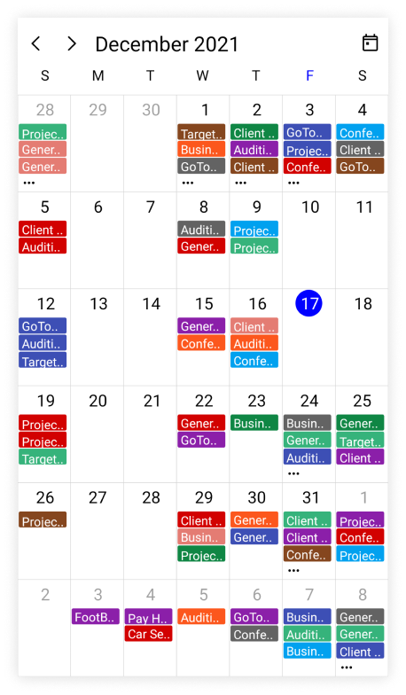

### View header height

The height of the ViewHeader can be customized by setting the [Height](https://help.syncfusion.com/cr/maui/Syncfusion.Maui.Scheduler.SchedulerHeaderSettingsBase.html#Syncfusion_Maui_Scheduler_SchedulerHeaderSettingsBase_Height) property of [ViewHeaderSettings](https://help.syncfusion.com/cr/maui/Syncfusion.Maui.Scheduler.SchedulerMonthView.html#Syncfusion_Maui_Scheduler_SchedulerMonthView_ViewHeaderSettings) in [MonthView](https://help.syncfusion.com/cr/maui/Syncfusion.Maui.Scheduler.SchedulerMonthView.html).




 <scheduler:SfScheduler x:Name="Scheduler" 
                        View="Month">
    <scheduler:SfScheduler.MonthView>
        <scheduler:SchedulerMonthView>
            <scheduler:SchedulerMonthView.ViewHeaderSettings>
                <scheduler:SchedulerViewHeaderSettings Height="100" />
            </scheduler:SchedulerMonthView.ViewHeaderSettings>
        </scheduler:SchedulerMonthView>
    </scheduler:SfScheduler.MonthView>
 </scheduler:SfScheduler>




SfScheduler scheduler = new SfScheduler();
scheduler.View = SchedulerView.Month;
scheduler.MonthView.ViewHeaderSettings.Height = 100;
this.Content = scheduler;




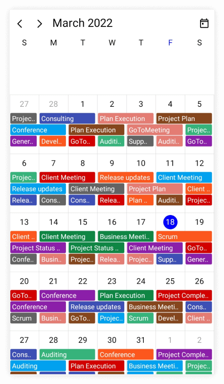

### Customize view header appearance

The view header appearance customization can be achieved by using the `TextStyle` and `ViewHeaderTemplate` properties of [MonthView](https://help.syncfusion.com/cr/maui/Syncfusion.Maui.Scheduler.SchedulerMonthView.html) in the [SfScheduler](https://help.syncfusion.com/cr/maui/Syncfusion.Maui.Scheduler.SfScheduler.html).

#### Customize view header appearance using text style

Customize the month view header day text style, day format and background color by using the [DayTextStyle](https://help.syncfusion.com/cr/maui/Syncfusion.Maui.Scheduler.SchedulerViewHeaderSettings.html#Syncfusion_Maui_Scheduler_SchedulerViewHeaderSettings_DayTextStyle), [DayFormat](https://help.syncfusion.com/cr/maui/Syncfusion.Maui.Scheduler.SchedulerViewHeaderSettings.html#Syncfusion_Maui_Scheduler_SchedulerViewHeaderSettings_DayFormat) and [Background](https://help.syncfusion.com/cr/maui/Syncfusion.Maui.Scheduler.SchedulerHeaderSettingsBase.html#Syncfusion_Maui_Scheduler_SchedulerHeaderSettingsBase_Background) of [ViewHeaderSettings](https://help.syncfusion.com/cr/maui/Syncfusion.Maui.Scheduler.SchedulerMonthView.html#Syncfusion_Maui_Scheduler_SchedulerMonthView_ViewHeaderSettings) properties of [MonthView](https://help.syncfusion.com/cr/maui/Syncfusion.Maui.Scheduler.SchedulerMonthView.html) respectively.

  


 <scheduler:SfScheduler x:Name="Scheduler" 
                        View="Month">
    <scheduler:SfScheduler.MonthView>
        <scheduler:SchedulerMonthView>
            <scheduler:SchedulerMonthView.ViewHeaderSettings>
                <scheduler:SchedulerViewHeaderSettings DayFormat="dddd"
                                                       Background="LightSkyBlue"/>
            </scheduler:SchedulerMonthView.ViewHeaderSettings>
        </scheduler:SchedulerMonthView>
    </scheduler:SfScheduler.MonthView>
</scheduler:SfScheduler>




SfScheduler scheduler = new SfScheduler();
scheduler.View = SchedulerView.Month;
scheduler.MonthView.ViewHeaderSettings.Background = Brush.LightSkyBlue;
scheduler.MonthView.ViewHeaderSettings.DayFormat = "dddd";
this.Content = scheduler;

  


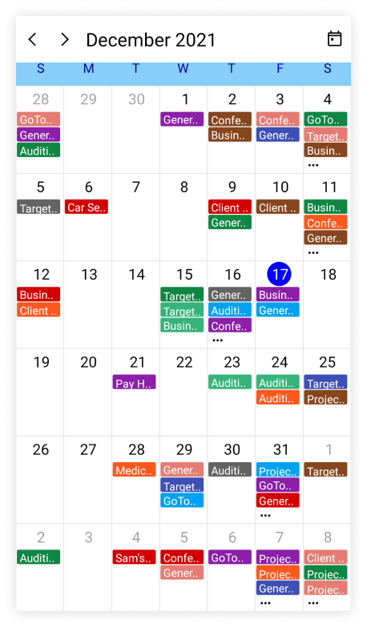

#### Customize view header appearance using DataTemplate

You can customize the view header appearance by using the [ViewHeaderTemplate](https://help.syncfusion.com/cr/maui/Syncfusion.Maui.Scheduler.SchedulerMonthView.html#Syncfusion_Maui_Scheduler_SchedulerMonthView_ViewHeaderTemplate) property of [MonthView](https://help.syncfusion.com/cr/maui/Syncfusion.Maui.Scheduler.SchedulerMonthView.html) in the [SfScheduler](https://help.syncfusion.com/cr/maui/Syncfusion.Maui.Scheduler.SfScheduler.html).

  
    

 <scheduler:SfScheduler x:Name="Scheduler" 
                        View="Month">
    <scheduler:SfScheduler.MonthView>
        <scheduler:SchedulerMonthView>
            <scheduler:SchedulerMonthView.ViewHeaderTemplate>
                <DataTemplate>
                    <Grid Background = "MediumPurple" >
                        <Label x:Name="label" HorizontalOptions="Center" VerticalOptions="Center" Text="{Binding StringFormat='{0:ddd}'}" TextColor="White" FontSize="Subtitle" FontFamily="Bold" />
                    </Grid>
                </DataTemplate>
            </scheduler:SchedulerMonthView.ViewHeaderTemplate>
        </scheduler:SchedulerMonthView>
    </scheduler:SfScheduler.MonthView>
 </scheduler:SfScheduler>




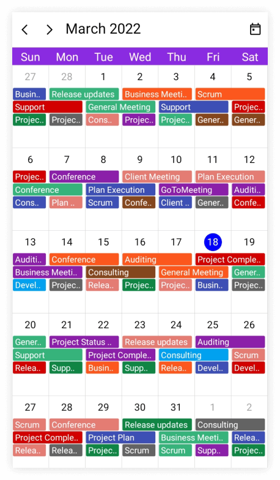

#### Customize view header appearance using DataTemplateSelector

You can customize the view header appearance by using the [ViewHeaderTemplate](https://help.syncfusion.com/cr/maui/Syncfusion.Maui.Scheduler.SchedulerMonthView.html#Syncfusion_Maui_Scheduler_SchedulerMonthView_ViewHeaderTemplate) property of [MonthView](https://help.syncfusion.com/cr/maui/Syncfusion.Maui.Scheduler.SchedulerMonthView.html) in the [SfScheduler](https://help.syncfusion.com/cr/maui/Syncfusion.Maui.Scheduler.SfScheduler.html). The `DataTemplateSelector` can choose a `DataTemplate` at runtime based on the value of a data-bound to scheduler view header by using the `ViewHeaderTemplate.` It allows you to choose a different data template for each view header, as well as customize the appearance of a particular view header based on certain conditions.




 <Grid>
    <Grid.Resources>
        <DataTemplate x:Key="normaldatesTemplate">
            <Grid Background = "lightBlue">
                <Label x:Name="label" HorizontalOptions="Center" VerticalOptions="Center" Text="{Binding StringFormat='{0:ddd}'}"  TextColor="Red" />
            </Grid>
        </DataTemplate>
        <DataTemplate x:Key="todayDatesTemplate">
            <Grid Background = "LightGreen" >
                <Label x:Name="label" HorizontalOptions="Center" VerticalOptions="Center" Text="{Binding StringFormat='{0:ddd}'}"  TextColor="Orange" />
            </Grid>
        </DataTemplate>
        <local:MonthViewHeaderTemplateSelector x:Key="monthViewHeaderTemplateSelector"  TodayDatesTemplate="{StaticResource todayDatesTemplate}"  NormaldatesTemplate="{StaticResource normaldatesTemplate}" />
    </Grid.Resources>
    <scheduler:SfScheduler x:Name="Scheduler" 
                           View="Month">
        <scheduler:SfScheduler.MonthView>
            <scheduler:SchedulerMonthView ViewHeaderTemplate = "{StaticResource monthViewHeaderTemplateSelector}"/>
        </scheduler:SfScheduler.MonthView>
    </scheduler:SfScheduler>
 </Grid>




public class MonthViewHeaderTemplateSelector : DataTemplateSelector
{
    public MonthViewHeaderTemplateSelector()
    {
    }
    public DataTemplate TodayDatesTemplate { get; set; }
    public DataTemplate NormaldatesTemplate { get; set; }
    protected override DataTemplate OnSelectTemplate(object item, BindableObject container)
    {
        var viewHeaderDetails = (DateTime)item;
        if (viewHeaderDetails.Date.Month == DateTime.Today.Month)
            return TodayDatesTemplate;
        return NormaldatesTemplate;
    }
}

  


N>
* When using data template selector, performance issues occur as the conversion template views take time within the framework.

## Month Navigation direction

The [MonthView](https://help.syncfusion.com/cr/maui/Syncfusion.Maui.Scheduler.SchedulerMonthView.html) of [SfScheduler](https://help.syncfusion.com/cr/maui/Syncfusion.Maui.Scheduler.SfScheduler.html) can be navigated in both horizontal and vertical directions. You can change the direction of navigation through the [NavigationDirection](https://help.syncfusion.com/cr/maui/Syncfusion.Maui.Scheduler.SchedulerMonthView.html#Syncfusion_Maui_Scheduler_SchedulerMonthView_NavigationDirection) property of [MonthViewSettings](https://help.syncfusion.com/cr/maui/Syncfusion.Maui.Scheduler.SchedulerMonthView.html) in `SfScheduler` . By default, the navigation direction is `Horizontal`.




<scheduler:SfScheduler x:Name="schedule" View="Month">
    <scheduler:SfScheduler.MonthView >
        <scheduler:SchedulerMonthView NavigationDirection="Vertical"/>
    </scheduler:SfScheduler.MonthView> 
</scheduler:SfScheduler>




schedule.MonthView.NavigationDirection = SchedulerMonthNavigationDirection.Vertical;

  


{:width="325" height="600" loading="lazy" .lazy .shadow-effect .section-padding .img-padding}

## Month cell appearance

The month cell appearance can be customized by using the  [CellStyle](https://help.syncfusion.com/cr/maui/Syncfusion.Maui.Scheduler.SchedulerMonthView.html#Syncfusion_Maui_Scheduler_SchedulerMonthView_CellStyle), and [CellTemplate](https://help.syncfusion.com/cr/maui/Syncfusion.Maui.Scheduler.SchedulerMonthView.html#Syncfusion_Maui_Scheduler_SchedulerMonthView_CellTemplate) properties of [MonthView](https://help.syncfusion.com/cr/maui/Syncfusion.Maui.Scheduler.SchedulerMonthView.html) in the [SfScheduler](https://help.syncfusion.com/cr/maui/Syncfusion.Maui.Scheduler.SfScheduler.html).

#### Customize month cell appearance using text style

By using the [CellStyle](https://help.syncfusion.com/cr/maui/Syncfusion.Maui.Scheduler.SchedulerMonthView.html#Syncfusion_Maui_Scheduler_SchedulerMonthView_CellStyle) property of [MonthView](https://help.syncfusion.com/cr/maui/Syncfusion.Maui.Scheduler.SchedulerMonthView.html), the month properties such as [Background](https://help.syncfusion.com/cr/maui/Syncfusion.Maui.Scheduler.SchedulerMonthCellStyle.html#Syncfusion_Maui_Scheduler_SchedulerMonthCellStyle_Background), [TodayBackground](https://help.syncfusion.com/cr/maui/Syncfusion.Maui.Scheduler.SchedulerMonthCellStyle.html#Syncfusion_Maui_Scheduler_SchedulerMonthCellStyle_TodayBackground), [TrailingMonthBackground](https://help.syncfusion.com/cr/maui/Syncfusion.Maui.Scheduler.SchedulerMonthCellStyle.html#Syncfusion_Maui_Scheduler_SchedulerMonthCellStyle_TrailingMonthBackground), [LeadingMonthBackground](https://help.syncfusion.com/cr/maui/Syncfusion.Maui.Scheduler.SchedulerMonthCellStyle.html#Syncfusion_Maui_Scheduler_SchedulerMonthCellStyle_LeadingMonthBackground), [TextStyle](https://help.syncfusion.com/cr/maui/Syncfusion.Maui.Scheduler.SchedulerMonthCellStyle.html#Syncfusion_Maui_Scheduler_SchedulerMonthCellStyle_TextStyle), [TrailingMonthTextStyle](https://help.syncfusion.com/cr/maui/Syncfusion.Maui.Scheduler.SchedulerMonthCellStyle.html#Syncfusion_Maui_Scheduler_SchedulerMonthCellStyle_TrailingMonthTextStyle), and [LeadingMonthTextStyle](https://help.syncfusion.com/cr/maui/Syncfusion.Maui.Scheduler.SchedulerMonthCellStyle.html#Syncfusion_Maui_Scheduler_SchedulerMonthCellStyle_LeadingMonthTextStyle) can be customized.

  


<scheduler:SfScheduler x:Name="Scheduler" 
                       View="Month">
</scheduler:SfScheduler>




this.Scheduler.View = SchedulerView.Month;
var textStyle = new SchedulerTextStyle()
{
    TextColor = Colors.DarkBlue,
    FontSize = 14,
};

var leadingMonthTextStyle = new SchedulerTextStyle()
{
    TextColor = Colors.Red,
    FontSize = 14,
};

var trailingMonthTextStyle = new SchedulerTextStyle()
{
    TextColor = Colors.Red,
    FontSize = 14,
};

var monthCellStyle = new SchedulerMonthCellStyle()
{
    Background = Brush.LightSkyBlue,
    TodayBackground = Brush.LightBlue,
    LeadingMonthBackground = Brush.LightGreen,
    TrailingMonthBackground = Brush.LightYellow,
    TextStyle = textStyle,
    LeadingMonthTextStyle = leadingMonthTextStyle,
    TrailingMonthTextStyle = trailingMonthTextStyle
};

this.Scheduler.MonthView.CellStyle = monthCellStyle;

  


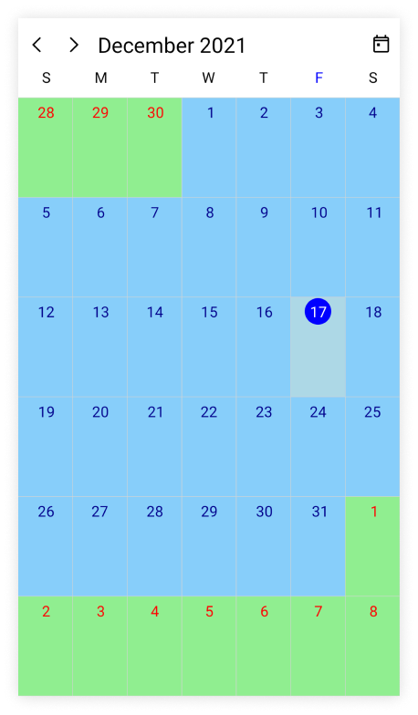

#### Customize month cell appearance using DataTemplate

You can customize the month cell appearance by using the [CellTemplate](https://help.syncfusion.com/cr/maui/Syncfusion.Maui.Scheduler.SchedulerMonthView.html#Syncfusion_Maui_Scheduler_SchedulerMonthView_CellTemplate) property of [MonthView](https://help.syncfusion.com/cr/maui/Syncfusion.Maui.Scheduler.SchedulerMonthView.html) in the [SfScheduler](https://help.syncfusion.com/cr/maui/Syncfusion.Maui.Scheduler.SfScheduler.html).




 <scheduler:SfScheduler x:Name="Scheduler" 
                        View="Month">
    <scheduler:SfScheduler.MonthView>
        <scheduler:SchedulerMonthView>
            <scheduler:SchedulerMonthView.CellTemplate>
                <DataTemplate>
                    <Grid Background = "MediumPurple">
                        <Label HorizontalTextAlignment="Center" TextColor="White" Text="{Binding DateTime.Day}"/>
                    </Grid>
                </DataTemplate>
            </scheduler:SchedulerMonthView.CellTemplate>
        </scheduler:SchedulerMonthView>
    </scheduler:SfScheduler.MonthView>
 </scheduler:SfScheduler>




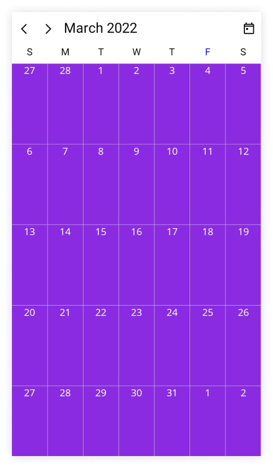

N>
* The BindingContext of the `CellTemplate` is the `SchedulerMonthCellDetails.`

#### Customize month cell appearance using DataTemplateSelector

You can customize the month cell appearance by using the [CellTemplate](https://help.syncfusion.com/cr/maui/Syncfusion.Maui.Scheduler.SchedulerMonthView.html#Syncfusion_Maui_Scheduler_SchedulerMonthView_CellTemplate) property of [MonthView](https://help.syncfusion.com/cr/maui/Syncfusion.Maui.Scheduler.SchedulerMonthView.html) in the [SfScheduler](https://help.syncfusion.com/cr/maui/Syncfusion.Maui.Scheduler.SfScheduler.html). The `DataTemplateSelector` can choose a `DataTemplate` at runtime based on the value of a data-bound to scheduler month cells by using the `CellTemplate.` It allows you to choose a different data template for each month cell, as well as customize the appearance of a particular month cell based on certain conditions.




<Grid>
    <Grid.Resources>
        <DataTemplate x:Key="normalDateTemplate">
            <Grid Background = "MediumPurple">
                <Label HorizontalTextAlignment="Center" TextColor="White" Text="{Binding DateTime.Day}"/>
            </Grid>
        </DataTemplate>
        <DataTemplate x:Key="todayDateTemplate">
            <Grid Background = "MediumPurple">
                <Label HorizontalTextAlignment="Center" TextColor="Yellow" Text="{Binding DateTime.Day}"/>
            </Grid>
        </DataTemplate>
        <local:MonthCellTemplateSelector x:Key="monthCellTemplateSelector" TodayDateTemplate="{StaticResource todayDateTemplate}" NormalDateTemplate="{StaticResource normalDateTemplate}"/>
    </Grid.Resources>
    <scheduler:SfScheduler x:Name="Scheduler" 
                           View="Month" >
        <scheduler:SfScheduler.MonthView>
            <scheduler:SchedulerMonthView CellTemplate="{StaticResource monthCellTemplateSelector}" />
        </scheduler:SfScheduler.MonthView>
    </scheduler:SfScheduler>
 </Grid>




public class MonthCellTemplateSelector : DataTemplateSelector
{
    public MonthCellTemplateSelector()
    {
    }
    public DataTemplate NormalDateTemplate { get; set; }
    public DataTemplate TodayDateTemplate { get; set; }
    protected override DataTemplate OnSelectTemplate(object item, BindableObject container)
    {
        var monthCellDetails = item as SchedulerMonthCellDetails;
        if (monthCellDetails.DateTime.Date == DateTime.Today.Date)
            return TodayDateTemplate;
        else
            return NormalDateTemplate;
    }
}

  


this.Scheduler.View = SchedulerView.Month;

 


N>
* The BindingContext of the `CellTemplate` is the `SchedulerMonthCellDetails.`
* When using data template selector, performance issues occur as the conversion template views take time within the framework.
