# Overview of .NET MAUI Scheduler (SfScheduler)

The Syncfusion&reg; .NET MAUI Scheduler (SfScheduler) has nine different types of built-in configurable view modes that provides all the common scheduling functionalities to display appointments in different views, and allows users to create and manage appointments efficiently. It exposes user interface for custom working days and hours, and basic operations such as viewing daily/all day/spanned appointments, date navigation, selection, and Data binding to different sources.

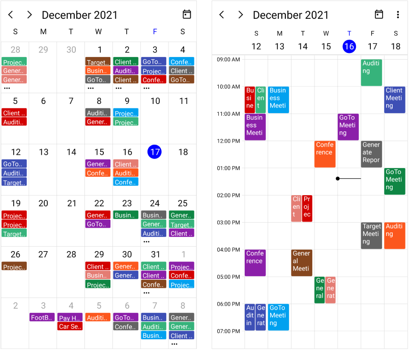

## Business use cases

- Calendar and booking applications that require **managing appointments, meetings, and schedules efficiently**.  
- Enterprise systems that track **employee schedules, tasks, and resource planning**.  
- Health care and service applications that manage **appointments with recurrence and time-based availability**.  
- Productivity and collaboration apps that display **events across multiple calendar views for better planning**. 

## Key features

- **Built‑in Views** : switch between Day, Week, WorkWeek, Month, Agenda, and Timeline views for flexible scheduling

 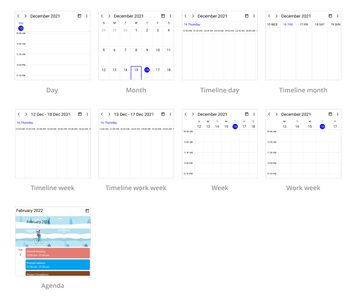

- **Appointments** : create and manage events with start/end time, subject, and notes

 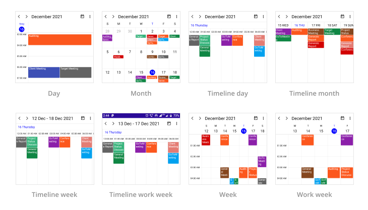

- **Recurrence Events** : schedule repeating events daily, weekly, monthly, or yearly with exceptions

 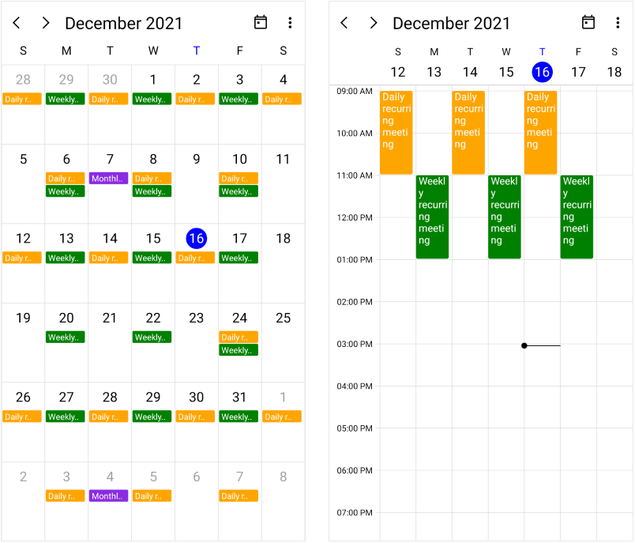

- **Appointment Mapping** : bind custom data objects to appointments for seamless integration

- **Time Zone Support** : schedule across regions with automatic daylight saving adjustments

- **Agenda View** : view appointments in a simple list format grouped by week

 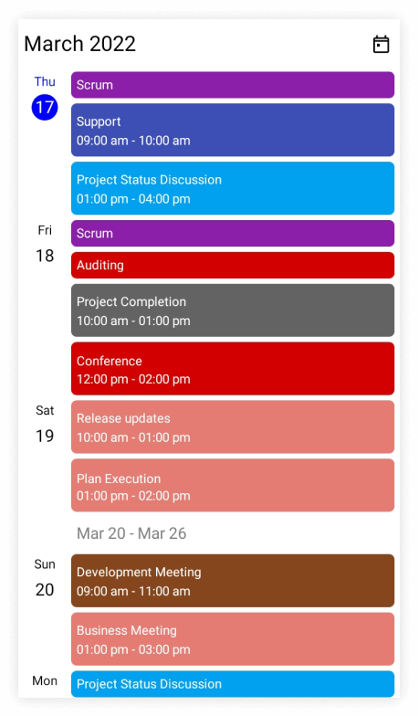

- **Timeline Month View** : display appointments horizontally across days for long‑term planning

 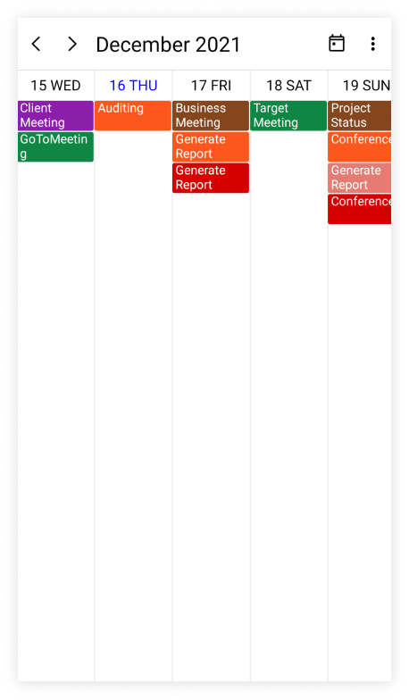

- **First Day of the Week** : customize the start day (e.g., Monday or Sunday) to match regional preferences

 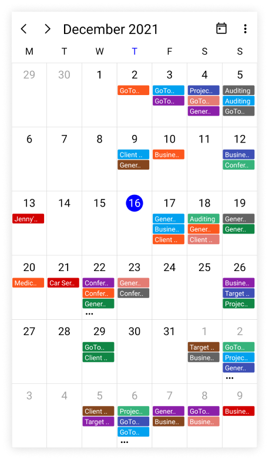

- **Flexible Working Days** : define working and non‑working days for realistic business schedules

- **Date Range Limits** : restrict navigation to minimum and maximum dates for controlled scenarios

- **Special Time Regions** : block or highlight unavailable slots such as holidays or breaks

 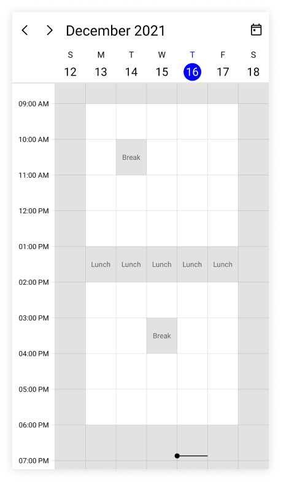

- **Blackout Dates** : disable specific dates to prevent scheduling on restricted days

 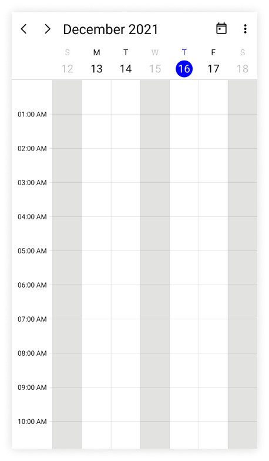

- **Hide Leading & Trailing Dates** : remove extra month dates for a cleaner calendar view

 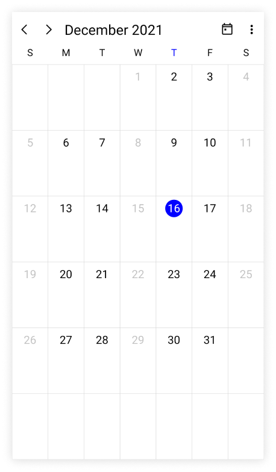

- **Custom Start & End Hours** : show only relevant time ranges by hiding unnecessary hours

 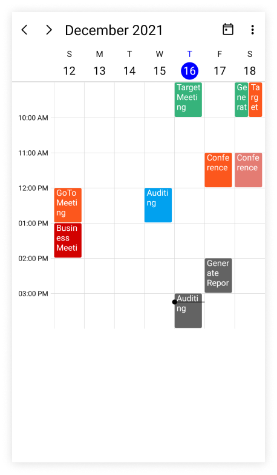 

## Globalization

The following table summarizes the globalization support available in the [SfScheduler](https://www.syncfusion.com/maui-controls/maui-scheduler) control.

 Full Support  

<table>
<tr>
<th align="center">Control</th>
<th align="center">Localization</th>
<th align="center">RTL</th>
<th align="center">Time zone</th>
<th align="center">Screen reader</th>
<th align="center">Keyboard navigation</th>
</tr>
<tr>
<td><a href="/maui/scheduler/overview">Scheduler</a></td>
<td align="center"></td>
<td align="center"></td>
<td align="center"></td>
<td align="center"></td>
<td align="center"></td>
</tr> 
</table>

## Related controls

- **[Calendar](https://help.syncfusion.com/maui/calendar/overview)** for date navigation and selection using calendar UI.  
- **[DataGrid](https://help.syncfusion.com/maui/datagrid/overview)** for managing and displaying appointment data in tables.  
- **[Kanban](https://help.syncfusion.com/maui/kanban-board/overview)** for workflow-based task management views.  

## Next steps

Explore further resources:

- [Getting Started](https://help.syncfusion.com/maui/scheduler/getting-started) - step-by-step guide to begin using the Scheduler control.  
- [Day Week Views](https://help.syncfusion.com/maui/scheduler/day-week-views) - switch between day and week layouts for flexible scheduling.
- [Appointments](https://help.syncfusion.com/maui/scheduler/appointments) - manage appointments and data binding. 
- [UI Kit](https://www.syncfusion.com/demos/maui#maui-ui-control) - explore interactive demos and ready‑made UI examples.

## Learnings

<!-- Card 1 -->
<a href="https://www.syncfusion.com/blogs/category/net-maui" class="form-card" target="_blank">
  

    <h3 class="form-title">Explore Blogs</h3>
    

      Read insights, tutorials, and developer journeys.
    

  

</a>
<!-- Card 2 -->
<a href="https://support.syncfusion.com/kb/cross-platforms/category/76" class="form-card" target="_blank">
  

    <h3 class="form-title">Explore KB's</h3>
    

      Find quick solutions and step‑by‑step guidance.
    

  

</a>
<!-- Card 3 -->
<a href="https://www.syncfusion.com/maui-controls/maui-scheduler" class="form-card" target="_blank">
  

    <h3 class="form-title">Feature Tour</h3>
    

      Walk through highlights and core capabilities.
    

  

</a>
<!-- Card 4 -->
<a href="https://github.com/syncfusion/maui-demos/tree/master/MAUI/Scheduler" class="form-card" target="_blank">
  

    <h3 class="form-title">Showcase Samples</h3>
    

      Explore sample scenarios for real apps.
    

  

</a>
<!-- Card 5 -->
<a href="https://www.syncfusion.com/tutorial-videos/maui/scheduler" class="form-card" target="_blank">
  

    <h3 class="form-title">Tutorial Videos</h3>
    

      Step‑by‑step guidance through video tutorials.
    

  

</a>
