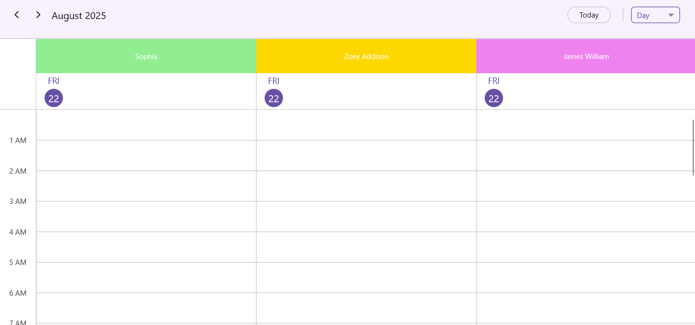
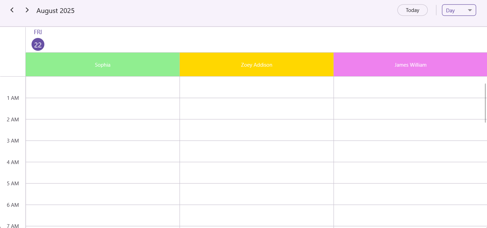

# Resource View in .NET MAUI Scheduler (SfScheduler)

The [.NET MAUI Scheduler](https://www.syncfusion.com/maui-controls/maui-scheduler) control allows you to group appointments based on the resources associated with them in the day, week, workweek, timeline day, timeline week, timeline workweek, and timeline month views, with complete business object binding, multi resource appointment sharing and UI customization features.

## Create resources to Scheduler by using SchedulerResource
You can create a resource view by setting the [Name](https://help.syncfusion.com/cr/maui/Syncfusion.Maui.Scheduler.SchedulerResource.html#Syncfusion_Maui_Scheduler_SchedulerResource_Name), [Id](https://help.syncfusion.com/cr/maui/Syncfusion.Maui.Scheduler.SchedulerResource.html#Syncfusion_Maui_Scheduler_SchedulerResource_Id), [Background](https://help.syncfusion.com/cr/maui/Syncfusion.Maui.Scheduler.SchedulerResource.html#Syncfusion_Maui_Scheduler_SchedulerResource_Background), and [Foreground](https://help.syncfusion.com/cr/maui/Syncfusion.Maui.Scheduler.SchedulerResource.html#Syncfusion_Maui_Scheduler_SchedulerResource_Foreground) and [DataItem](https://help.syncfusion.com/cr/maui/Syncfusion.Maui.Scheduler.SchedulerResource.html#Syncfusion_Maui_Scheduler_SchedulerResource_Foreground) properties of the built-in [SchedulerResource](https://help.syncfusion.com/cr/maui/Syncfusion.Maui.Scheduler.SchedulerResource.html) class and assign `SchedulerResource` collection to the scheduler by using the [Resources](https://help.syncfusion.com/cr/maui/Syncfusion.Maui.Scheduler.SchedulerResourceView.html#Syncfusion_Maui_Scheduler_SchedulerResourceView_Resources) property of the [SchedulerResourceView](https://help.syncfusion.com/cr/maui/Syncfusion.Maui.Scheduler.SchedulerResourceView.html?tabs=tabid-13%2Ctabid-6) class.

In the **Day**, **Week** and **Work Week** views, resources are displayed **horizontally**, whereas in the **Timeline views** (Timeline Day, Timeline Week, Timeline Work Week and Timeline Month), resources are displayed **vertically**.



<schedule:SfScheduler x:Name="Scheduler" View="TimelineWeek">
    <schedule:SfScheduler.ResourceView>
        <schedule:SchedulerResourceView Resources="{Binding Resources}" />
    </schedule:SfScheduler.ResourceView>
</schedule:SfScheduler>


// Adding schedule resource in the scheduler resource collection.
var Resources = new ObservableCollection<SchedulerResource>()
{
   new SchedulerResource() { Name = "Sophia", Foreground = Colors.Blue, Background = Colors.Green, Id = "1000" },
   new SchedulerResource() { Name = "Zoey Addison",  Foreground = Colors.Blue, Background = Colors.Green, Id = "1001" },
   new SchedulerResource() { Name = "James William",  Foreground = Colors.Blue, Background = Colors.Green, Id = "1002" },
};

// Adding the scheduler resource collection to the schedule resources of SfSchedule.
this.Scheduler.ResourceView.Resources = Resources;



N> The horizontal display of resources in the **Day**, **Week**, and **Work Week** views is supported only on .NET MAUI desktop platforms (**Windows** and **macOS**).

### Assigning Scheduler resources to appointments

Appointments associated with the `ResourceView` [Resources](https://help.syncfusion.com/cr/maui/Syncfusion.Maui.Scheduler.SchedulerResourceView.html#Syncfusion_Maui_Scheduler_SchedulerResourceView_Resources), will be displayed by setting the `SchedulerResourceView` resource Id in the [SchedulerAppointment](https://help.syncfusion.com/cr/maui/Syncfusion.Maui.Scheduler.SchedulerAppointment.html) by using the [ResourceIds](https://help.syncfusion.com/cr/maui/Syncfusion.Maui.Scheduler.SchedulerRegionBase.html#Syncfusion_Maui_Scheduler_SchedulerRegionBase_ResourceIds).



<schedule:SfScheduler x:Name="Scheduler" View="TimelineWeek" AppointmentsSource="{Binding Appointments}">
    <schedule:SfScheduler.ResourceView>
        <schedule:SchedulerResourceView Resources="{Binding Resources}" />
    </schedule:SfScheduler.ResourceView>
</schedule:SfScheduler>



// Adding schedule resource in the scheduler resource collection.
var Resources = new ObservableCollection<SchedulerResource>()
{
   new SchedulerResource() { Name = "Sophia", Foreground = Colors.Blue, Background = Colors.Green, Id = "1000" },
   new SchedulerResource() { Name = "Zoey Addison",  Foreground = Colors.Blue, Background = Colors.Green, Id = "1001" },
   new SchedulerResource() { Name = "James William",  Foreground = Colors.Blue, Background = Colors.Green, Id = "1002" },
};

// Adding the scheduler resource collection to the schedule resources of SfSchedule.
this.Scheduler.ResourceView.Resources = Resources;

var appointment = new ObservableCollection<SchedulerAppointment>();

//Adding scheduler appointment in the scheduler appointment collection. 
appointment.Add(new SchedulerAppointment()
{
	StartTime = DateTime.Today.AddHours(9),
	EndTime = DateTime.Today.AddHours(11),
	Subject = "Client Meeting",
	Location = "Hutchison road",
	ResourceIds = new ObservableCollection<object>() { "1000" }
});

//Adding the scheduler appointment collection to the AppointmentsSource of .NET MAUI Scheduler.
this.Scheduler.AppointmentsSource = appointment;



### Multiple resource sharing using Scheduler resources

Multiple resources can share the same events or appointments by declaring resources ids in [ResourceIds](https://help.syncfusion.com/cr/maui/Syncfusion.Maui.Scheduler.SchedulerRegionBase.html#Syncfusion_Maui_Scheduler_SchedulerRegionBase_ResourceIds) in [ScheduleAppointment](https://help.syncfusion.com/cr/maui/Syncfusion.Maui.Scheduler.SchedulerAppointment.html) class. If the appointment details are edited or updated, then the changes will be reflected on all other shared instances simultaneously.



<schedule:SfScheduler x:Name="Scheduler"  View="TimelineWeek">
</schedule:SfScheduler>


var appointment = new ObservableCollection<SchedulerAppointment>();

//Adding scheduler appointment in the scheduler appointment collection. 
appointment.Add(new SchedulerAppointment()
{
	StartTime = DateTime.Today.AddHours(9),
	EndTime = DateTime.Today.AddHours(11),
	Subject = "Client Meeting",
	Location = "Hutchison road",
	//Multi resource share same event
	ResourceIds = new ObservableCollection<object>() { "1000", "1001","1002" }
});

//Adding the scheduler appointment collection to the AppointmentsSource of .NET MAUI Scheduler.
this.Scheduler.AppointmentsSource = appointment;



## Resource Grouping in Days View - Desktop
 
In the day, week, and work week views, you can control whether dates are grouped under resources or resources are grouped under dates by using the [`ResourceGroupType`](https://help.syncfusion.com/cr/maui/Syncfusion.Maui.Scheduler.SchedulerResourceView.html#Syncfusion_Maui_Scheduler_SchedulerResourceView_ResourceGroupType) property of the [`SchedulerResourceView`](https://help.syncfusion.com/cr/maui/Syncfusion.Maui.Scheduler.SchedulerResourceView.html#Syncfusion_Maui_Scheduler_SchedulerResourceView_Resources) class.
 
### Grouping by Resource
 
The [`ResourceGroupType`](https://help.syncfusion.com/cr/maui/Syncfusion.Maui.Scheduler.SchedulerResourceView.html#Syncfusion_Maui_Scheduler_SchedulerResourceView_ResourceGroupType) is set to [`Resource`](https://help.syncfusion.com/cr/maui/Syncfusion.Maui.Scheduler.SchedulerResourceGroupType.html#Syncfusion_Maui_Scheduler_SchedulerResourceGroupType_Resource) by default. In this mode, the scheduler arranges the dates under each resource.



<schedule:SfScheduler x:Name="Scheduler" View="Day">
    <scheduler:SfScheduler.ResourceView>
        <scheduler:SchedulerResourceView ResourceGroupType="Resource"/>
    </scheduler:SfScheduler.ResourceView>
</schedule:SfScheduler>


var Resources = new ObservableCollection<SchedulerResource>()
{
   new SchedulerResource() { Name = "Sophia", Foreground = Colors.White, Background = Colors.LightGreen, Id = "1000" },
   new SchedulerResource() { Name = "Zoey Addison",  Foreground = Colors.White, Background = Colors.Gold, Id = "1001" },
   new SchedulerResource() { Name = "James William",  Foreground = Colors.White, Background = Colors.Violet, Id = "1002" },
};

this.Scheduler.ResourceView.Resources = Resources;
this.Scheduler.ResourceView.ResourceGroupType = SchedulerResourceGroupType.Resource;



 
### Grouping by Date
 
When the [`ResourceGroupType`](https://help.syncfusion.com/cr/maui/Syncfusion.Maui.Scheduler.SchedulerResourceView.html#Syncfusion_Maui_Scheduler_SchedulerResourceView_ResourceGroupType) is set to [`Date`](https://help.syncfusion.com/cr/maui/Syncfusion.Maui.Scheduler.SchedulerResourceGroupType.html#Syncfusion_Maui_Scheduler_SchedulerResourceGroupType_Date), the scheduler arranges the resources under each date.



<schedule:SfScheduler x:Name="Scheduler" View="Day">
    <scheduler:SfScheduler.ResourceView>
        <scheduler:SchedulerResourceView ResourceGroupType="Date"/>
    </scheduler:SfScheduler.ResourceView>
</schedule:SfScheduler>


var Resources = new ObservableCollection<SchedulerResource>()
{
   new SchedulerResource() { Name = "Sophia", Foreground = Colors.White, Background = Colors.LightGreen, Id = "1000" },
   new SchedulerResource() { Name = "Zoey Addison",  Foreground = Colors.White, Background = Colors.Gold, Id = "1001" },
   new SchedulerResource() { Name = "James William",  Foreground = Colors.White, Background = Colors.Violet, Id = "1002" },
};

this.Scheduler.ResourceView.Resources = Resources;
this.Scheduler.ResourceView.ResourceGroupType = SchedulerResourceGroupType.Date;



## Resource Grouping in Days View - Mobile

In Mobile platforms, the resource view for the day, week, and work week view where grouped under an adaptive header.

### Customize hamburger icon color

The hamburger icon color can be customized by using the `HamburgerIconColor` property of the [SchedulerResourceView](https://help.syncfusion.com/cr/maui/Syncfusion.Maui.Scheduler.SchedulerResourceView.html?tabs=tabid-13%2Ctabid-6).




 <syncfusion:SfScheduler x:Name="Scheduler">
     <syncfusion:SfScheduler.ResourceView>
         <syncfusion:SchedulerResourceView HamburgerIconColor="Black" />
     </syncfusion:SfScheduler.ResourceView>
 </syncfusion:SfScheduler>




this.Scheduler.ResourceView.HamburgerIconColor = Colors.Black;




### Customize drawer resource selection color

The drawer resource selection color can be customized by using the `DrawerResourceSelectionColor` property of the [SchedulerResourceView](https://help.syncfusion.com/cr/maui/Syncfusion.Maui.Scheduler.SchedulerResourceView.html?tabs=tabid-13%2Ctabid-6).




 <syncfusion:SfScheduler x:Name="Scheduler">
     <syncfusion:SfScheduler.ResourceView>
         <syncfusion:SchedulerResourceView DrawerResourceSelectionColor="DodgerBlue" />
     </syncfusion:SfScheduler.ResourceView>
 </syncfusion:SfScheduler>




this.Scheduler.ResourceView.DrawerResourceSelectionColor = Brush.DodgerBlue;




### Customize drawer background

The drawer background can be customized by using the `DrawerBackground` property of the [SchedulerResourceView](https://help.syncfusion.com/cr/maui/Syncfusion.Maui.Scheduler.SchedulerResourceView.html?tabs=tabid-13%2Ctabid-6).




 <syncfusion:SfScheduler x:Name="Scheduler">
     <syncfusion:SfScheduler.ResourceView>
         <syncfusion:SchedulerResourceView DrawerBackground="Red" />
     </syncfusion:SfScheduler.ResourceView>
 </syncfusion:SfScheduler>




this.Scheduler.ResourceView.DrawerBackground = Brush.Red;




### Customize adaptive header appearance using DataTemplate

The adaptive header appearance customization can be achieved by using the `AdaptiveHeaderTemplate` property of [SchedulerResourceView](https://help.syncfusion.com/cr/maui/Syncfusion.Maui.Scheduler.SchedulerResourceView.html?tabs=tabid-13%2Ctabid-6) in the [SfScheduler](https://help.syncfusion.com/cr/maui/Syncfusion.Maui.Scheduler.SfScheduler.html).




<schedule:SfScheduler x:Name="Scheduler">
    <schedule:SfScheduler.ResourceView>
        <schedule:SchedulerResourceView>
            <schedule:SchedulerResourceView.AdaptiveHeaderTemplate>
                <DataTemplate>
                    <Grid Padding="8">
                        <HorizontalStackLayout Spacing="8" VerticalOptions="Center">
                            <Label Text="{Binding Name}"
                                        FontAttributes="Bold"
                                        FontSize="14" />
                        </HorizontalStackLayout>
                    </Grid>
                </DataTemplate>
            </schedule:SchedulerResourceView.AdaptiveHeaderTemplate>
        </schedule:SchedulerResourceView>
    </schedule:SfScheduler.ResourceView>
</schedule:SfScheduler>




 this.Scheduler.ResourceView.AdaptiveHeaderTemplate = new DataTemplate(() =>
 {
    var nameLabel = new Label
    {
        FontAttributes = FontAttributes.Bold,
        FontSize = 14,
        VerticalOptions = LayoutOptions.Center
    };
    nameLabel.SetBinding(Label.TextProperty, "Name");

    var row = new HorizontalStackLayout { Spacing = 8, VerticalOptions = LayoutOptions.Center };
    row.Children.Add(nameLabel);

    return new Grid { Padding = 8, Children = { row } };
});




## Visible Resource Count
 
The number of resources shown in the day, week, work week, timelineday, timelineweek, timelineworkweek views can be controlled using the [`VisibleResourceCount`](https://help.syncfusion.com/cr/maui/Syncfusion.Maui.Scheduler.SchedulerResourceView.html#Syncfusion_Maui_Scheduler_SchedulerResourceView_VisibleResourceCount) property of the [`SchedulerResourceView`](https://help.syncfusion.com/cr/maui/Syncfusion.Maui.Scheduler.SchedulerResourceView.html#Syncfusion_Maui_Scheduler_SchedulerResourceView_Resources) class. This lets you define how many resources are visible at a time.

### Days View 



<schedule:SfScheduler x:Name="Scheduler" View="Day" >
<schedule:SfScheduler.ResourceView>
    <schedule:SchedulerResourceView VisibleResourceCount="6"/>
</schedule:SfScheduler.ResourceView>
</schedule:SfScheduler>


var Resources = new ObservableCollection<SchedulerResource>()
{
    new SchedulerResource { Name = "Sophia",         Foreground = Colors.White, Background = Colors.LightGreen,  Id = "1000" },
    new SchedulerResource { Name = "Zoey Addison",   Foreground = Colors.White, Background = Colors.Gold,        Id = "1001" },
    new SchedulerResource { Name = "Aiden Clark",    Foreground = Colors.White, Background = Colors.LightSkyBlue,Id = "1002" },
    new SchedulerResource { Name = "Mia Johnson",    Foreground = Colors.White, Background = Colors.Tomato,      Id = "1003" },
    new SchedulerResource { Name = "Liam Parker",    Foreground = Colors.White, Background = Colors.Orchid,      Id = "1004" },
    new SchedulerResource { Name = "Olivia Bennett", Foreground = Colors.White, Background = Colors.SlateBlue,   Id = "1005" },
    new SchedulerResource { Name = "Noah Ramirez",   Foreground = Colors.White, Background = Colors.SeaGreen,    Id = "1006" },
    new SchedulerResource { Name = "Ava Thompson",   Foreground = Colors.White, Background = Colors.Coral,       Id = "1007" },
    new SchedulerResource { Name = "Ethan Davis",    Foreground = Colors.White, Background = Colors.DodgerBlue,  Id = "1008" },
    new SchedulerResource { Name = "Isabella Moore", Foreground = Colors.White, Background = Colors.MediumOrchid,Id = "1009" },
};

this.Scheduler.ResourceView.Resources = Resources;
this.Scheduler.ResourceView.VisibleResourceCount = 6;



### Timeline View 



<schedule:SfScheduler x:Name="Scheduler" View="TimelineDay" >
<schedule:SfScheduler.ResourceView>
    <schedule:SchedulerResourceView VisibleResourceCount="4"/>
</schedule:SfScheduler.ResourceView>
</schedule:SfScheduler>


var Resources = new ObservableCollection<SchedulerResource>()
{
    new SchedulerResource() { Name = "Sophia", Foreground = Colors.White, Background = Colors.LightGreen, Id = "1000" },
    new SchedulerResource() { Name = "Zoey Addison",  Foreground = Colors.White, Background = Colors.Gold, Id = "1001" },
    new SchedulerResource() { Name = "James William",  Foreground = Colors.White, Background = Colors.Violet, Id = "1002" },
    new SchedulerResource() { Name = "Brooklyn",  Foreground = Colors.White, Background = Colors.LightSkyBlue, Id = "1003" },
    new SchedulerResource() { Name = "Stephen",  Foreground = Colors.White, Background = Colors.PeachPuff, Id = "1004" },
    new SchedulerResource() { Name = "Elena",  Foreground = Colors.White, Background = Colors.Pink, Id = "1005" },
};

this.Scheduler.ResourceView.Resources = Resources;
this.Scheduler.ResourceView.VisibleResourceCount = 4;



N> 
* When [`VisibleResourceCount`](https://help.syncfusion.com/cr/maui/Syncfusion.Maui.Scheduler.SchedulerResourceView.html#Syncfusion_Maui_Scheduler_SchedulerResourceView_VisibleResourceCount) is set to 0, the resource view layout is removed, and only the plain Scheduler view is shown.
* [`VisibleResourceCount`](https://help.syncfusion.com/cr/maui/Syncfusion.Maui.Scheduler.SchedulerResourceView.html#Syncfusion_Maui_Scheduler_SchedulerResourceView_VisibleResourceCount) applies to the horizontal resource view on Windows and macOS, and to the timeline resource view on all platforms. When the value is -1 (default), the horizontal resource view displays three resources. In timeline resource views, the number of visible resource rows is determined by the minimum row height, and the auto row height.

## Resource Header Height in Days View
 
In the day, week, and work week views, resources are arranged horizontally. The height of the resource headers can be customized using the [`ResourceHeaderHeight`](https://help.syncfusion.com/cr/maui/Syncfusion.Maui.Scheduler.SchedulerResourceView.html#Syncfusion_Maui_Scheduler_SchedulerResourceView_ResourceHeaderHeight) property of the [`SchedulerResourceView`](https://help.syncfusion.com/cr/maui/Syncfusion.Maui.Scheduler.SchedulerResourceView.html#Syncfusion_Maui_Scheduler_SchedulerResourceView_Resources) class.



<schedule:SfScheduler x:Name="Scheduler" View="Day" >
<schedule:SfScheduler.ResourceView>
    <schedule:SchedulerResourceView ResourceHeaderHeight="100"/>
</schedule:SfScheduler.ResourceView>
</schedule:SfScheduler>


var Resources = new ObservableCollection<SchedulerResource>()
{
    new SchedulerResource() { Name = "Sophia", Foreground = Colors.White, Background = Colors.LightGreen, Id = "1000" },
    new SchedulerResource() { Name = "Zoey Addison",  Foreground = Colors.White, Background = Colors.Gold, Id = "1001" },
    new SchedulerResource() { Name = "James William",  Foreground = Colors.White, Background = Colors.Violet, Id = "1002" },
};

this.Scheduler.ResourceView.Resources = Resources;
this.Scheduler.ResourceView.ResourceHeaderHeight = 100;



## Resource Header Width in Timeline View
 
In the timelineday, timelineweek, and timeline work week views, resources are arranged vertically. The width of the resource headers can be customized using the [ResourceHeaderWidth](https://help.syncfusion.com/cr/maui/Syncfusion.Maui.Scheduler.SchedulerResourceView.html#Syncfusion_Maui_Scheduler_SchedulerResourceView_ResourceHeaderWidth) property of the [`SchedulerResourceView`](https://help.syncfusion.com/cr/maui/Syncfusion.Maui.Scheduler.SchedulerResourceView.html#Syncfusion_Maui_Scheduler_SchedulerResourceView_Resources) class.



<schedule:SfScheduler x:Name="Scheduler" View="TimelineDay" >
<schedule:SfScheduler.ResourceView>
    <schedule:SchedulerResourceView ResourceHeaderWidth="250"/>
</schedule:SfScheduler.ResourceView>
</schedule:SfScheduler>


var Resources = new ObservableCollection<SchedulerResource>()
{
    new SchedulerResource() { Name = "Sophia", Foreground = Colors.White, Background = Colors.LightGreen, Id = "1000" },
    new SchedulerResource() { Name = "Zoey Addison",  Foreground = Colors.White, Background = Colors.Gold, Id = "1001" },
    new SchedulerResource() { Name = "James William",  Foreground = Colors.White, Background = Colors.Violet, Id = "1002" },
};

this.Scheduler.ResourceView.Resources = Resources;
this.Scheduler.ResourceView.ResourceHeaderWidth = 250;



## Resource minimum row height

You can customize resource minimum row height of visible resources in timeline day, timeline week, timeline workweek and timeline month views by using the [MinimumRowHeight](https://help.syncfusion.com/cr/maui/Syncfusion.Maui.Scheduler.SchedulerResourceView.html#Syncfusion_Maui_Scheduler_SchedulerResourceView_MinimumRowHeight) property of [SchedulerResourceView](https://help.syncfusion.com/cr/maui/Syncfusion.Maui.Scheduler.SchedulerResourceView.html) in [SfScheduler.](https://help.syncfusion.com/cr/maui/Syncfusion.Maui.Scheduler.SfScheduler.html) By default, resource row height will be auto-expanded from minimum height based on the appointment counts.



<schedule:SfScheduler x:Name="Scheduler"  View="TimelineWeek"
                            AllowedViews="TimelineDay,TimelineMonth,TimelineWeek,TimelineWorkWeek" >
<schedule:SfScheduler.ResourceView>
    <schedule:SchedulerResourceView MinimumRowHeight="90"/>
</schedule:SfScheduler.ResourceView>
</schedule:SfScheduler>



SfScheduler scheduler = new SfScheduler();
scheduler.View = SchedulerView.TimelineWeek;
scheduler.AllowedViews = SchedulerViews.TimelineDay | SchedulerViews.TimelineMonth | SchedulerViews.TimelineWeek | SchedulerViews.TimelineWorkWeek;
scheduler.ResourceView.MinimumRowHeight = 100;
this.Content = scheduler;


 

N>
* By default, if the viewport height is greater than 400 then each resource height will be calculated by viewport size divided by the minimum value of scheduler resources count and 4 (default resource count). 
* If the viewport height is lesser than 400 then each resource height will be calculated by default viewport size(4 (default resource*100)) divided by the minimum value of scheduler resources count and 4 (default resource count).
* If the MinimumRowHeight is less than the default row height then the default row height will be used.

## Assign special time regions to scheduler resources

You can highlight the resources availability by creating special [time regions](https://help.syncfusion.com/cr/maui/Syncfusion.Maui.Scheduler.SchedulerTimeSlotView.html#Syncfusion_Maui_Scheduler_SchedulerTimeSlotView_TimeRegions) in the day, week, workweek, timeline day, timeline week, and timeline workweek views. Special time regions can represent unavailable or reserved slots such as lunch breaks, team meetings, or non-working hours.

### Special time regions for timeline views.

In the timeline views (timeline day, timeline week, and timeline work week), special time regions can be applied to visually highlight unavailable periods for different resources.



<schedule:SfScheduler x:Name="Scheduler"  View="TimelineWeek"
                      AllowedViews="TimelineDay,TimelineMonth,TimelineWeek,TimelineWorkWeek" >
</schedule:SfScheduler>


var Resources = new ObservableCollection<SchedulerResource>()
{
    new SchedulerResource() { Name = "Sophia", Foreground = Colors.White, Background = Colors.LightGreen, Id = "1000" },
    new SchedulerResource() { Name = "Zoey Addison",  Foreground = Colors.White, Background = Colors.Gold, Id = "1001" },
    new SchedulerResource() { Name = "James William",  Foreground = Colors.White, Background = Colors.Violet, Id = "1002" },
};

this.Scheduler.ResourceView.Resources = Resources;
this.Scheduler.TimelineView.TimeRegions = this.GetTimeRegion();

private ObservableCollection<SchedulerTimeRegion> GetTimeRegion()
{
    var timeRegions = new ObservableCollection<SchedulerTimeRegion>();
    var timeRegion = new SchedulerTimeRegion()
    {
        StartTime = DateTime.Today.Date.AddHours(13),
        EndTime = DateTime.Today.Date.AddHours(14),
        Text = "Lunch",
        EnablePointerInteraction = false,
        ResourceIds= new ObservableCollection<object>() { "1000", "1001", "1002" }
    };
    timeRegions.Add(timeRegion);
    return timeRegions;
}



### Special time regions for days view.

In Days View (day, week, and work week) special time regions can be applied to visually highlight unavailable periods for different resources.



<schedule:SfScheduler x:Name="Scheduler"  View="Day"
                      AllowedViews="Day,Week,WorkWeek" >
</schedule:SfScheduler>


var Resources = new ObservableCollection<SchedulerResource>()
{
    new SchedulerResource() { Name = "Sophia", Foreground = Colors.White, Background = Colors.LightGreen, Id = "1000" },
    new SchedulerResource() { Name = "Zoey Addison",  Foreground = Colors.White, Background = Colors.Gold, Id = "1001" },
    new SchedulerResource() { Name = "James William",  Foreground = Colors.White, Background = Colors.Violet, Id = "1002" },
};

this.Scheduler.ResourceView.Resources = Resources;
this.Scheduler.DaysView.TimeRegions = this.GetTimeRegion();

private ObservableCollection<SchedulerTimeRegion> GetTimeRegion()
{
    var timeRegions = new ObservableCollection<SchedulerTimeRegion>();
    var timeRegion = new SchedulerTimeRegion()
    {
        StartTime = DateTime.Today.Date.AddHours(13),
        EndTime = DateTime.Today.Date.AddHours(14),
        Text = "Lunch",
        EnablePointerInteraction = false,
        ResourceIds= new ObservableCollection<object>() { "1000", "1001", "1002" }
    };
    timeRegions.Add(timeRegion);
    return timeRegions;
}



## Business object binding for resources

The Schedule supports full data binding to [Resources](https://help.syncfusion.com/cr/maui/Syncfusion.Maui.Scheduler.SchedulerResourceView.html#Syncfusion_Maui_Scheduler_SchedulerResourceView_Resources) in the `SchedulerResourceView` class. Specify the [SchedulerResourceMapping](https://help.syncfusion.com/cr/maui/Syncfusion.Maui.Scheduler.SchedulerResourceMapping.html#properties) property of the `SchedulerResourceView` class to map the custom properties to the schedule resource.

| Property Name | Description |
|-------------------------------------------------------------------------------------------------------------------------------------------------------------------------------------------------------|--------------------------------------------------------------------------------------------------------------------------|
| Name | Maps the property name of custom class, which is equivalent to Name in SchedulerResource. |
| Id | Maps the property name of custom class, which is equivalent to Id in SchedulerResource. |
| Background | Maps the property name of custom class, which is equivalent to Background in SchedulerResource. |
| Foreground | Maps the property name of custom class, which is equivalent to Foreground in SchedulerResource. |

N> Custom resource class should contain a mandatory field for resource `Id`.

## Mapping resource business object or custom field

Create a custom class `Employee` with mandatory fields `Name,` `Id,` `ForegroundColor,` and `BackgroundColor`.



public class Employee
{
   public string Name {get; set;}

   public string Id {get; set;}

   public Brush BackgroundColor {get; set; }

   public Brush ForegroundColor {get; set; }
}




Map the properties of the `Employee` class by using the [SchedulerResourceMapping](https://help.syncfusion.com/cr/maui/Syncfusion.Maui.Scheduler.SchedulerResourceMapping.html) property of the `SchedulerResourceView`.

N> When publishing in AOT mode on iOS and macOS, ensure that `[Preserve(AllMembers = true)]` is added to the model class to maintain resources binding.



<scheduler:SfScheduler Name="Schedule" ViewType="TimelineWeek">
<schedule:SfScheduler.ResourceView>
    <schedule:SchedulerResourceView>
        <schedule:SchedulerResourceView.Mapping>
            <schedule:SchedulerResourceMapping Name="Name"
                                            Id="Id"
                                            Background="Background"
                                            Foreground="Foreground"/>
        </schedule:SchedulerResourceView.Mapping>
    </schedule:SchedulerResourceView>
</schedule:SfScheduler.ResourceView>
</scheduler:SfScheduler>



SfScheduler scheduler = new SfScheduler();
scheduler.View = SchedulerView.TimelineWeek;

 // Schedule data mapping for custom resource.
SchedulerResourceMapping resourceMapping = new SchedulerResourceMapping();
resourceMapping.Name = "Name";
resourceMapping.Id = "Id";
resourceMapping.Background = "BackgroundColor";
resourceMapping.Foreground = "ForegroundColor";
scheduler.ResourceView.Mapping = resourceMapping;
this.Content = scheduler;




### Assign resource business objects to scheduler

Add the resources of `Employee` collection that can be assigned  to the [Resources](https://help.syncfusion.com/cr/maui/Syncfusion.Maui.Scheduler.SchedulerResourceView.html#Syncfusion_Maui_Scheduler_SchedulerResourceView_Resources) in the `SchedulerResourceView` class which is of `IEnumerable` type. Also add or remove scheduler resources dynamically.



<scheduler:SfScheduler Name="Schedule" ViewType="TimelineWeek">
    <scheduler:SfScheduler.ResourceMapping>
       <scheduler:ResourceMapping Id="Id" Name="Name" Background="BackgroundColor" Foreground="ForegroundColor"/>
    </scheduler:SfScheduler.ResourceMapping>
</scheduler:SfScheduler>


// Creating and Adding custom resource in scheduler resource collection.
var Resources = new ObservableCollection<Employee>()
{
   new Employee () {Name = "Sophia", Background=Colors.Blue, Id = "1000", Foreground = Colors.Green},
   new Employee () {Name = "Zoey Addison", Background=Colors.Blue, Id = "1001", Foreground = Colors.Green},
   new Employee () {Name = "James William", Background=Colors.Blue, Id = "1002", Foreground = Colors.Green},
};

// Adding the scheduler resource collection to the schedule resources of SfSchedule.
this.Scheduler.ResourceView.Resources = Resources;



### Assign the resource objects to appointment business object

Associate the `ResourceView` [SchedulerResourceMapping](https://help.syncfusion.com/cr/maui/Syncfusion.Maui.Scheduler.SchedulerResourceMapping.html#properties) to the custom appointment by mapping resource [Id](https://help.syncfusion.com/cr/maui/Syncfusion.Maui.Scheduler.SchedulerResourceMapping.html#Syncfusion_Maui_Scheduler_SchedulerResourceMapping_Id) in the [ResourceIds](https://help.syncfusion.com/cr/maui/Syncfusion.Maui.Scheduler.SchedulerRegionBase.html#Syncfusion_Maui_Scheduler_SchedulerRegionBase_ResourceIds) property of [SchedulerAppointmentMapping](https://help.syncfusion.com/cr/maui/Syncfusion.Maui.Scheduler.SchedulerAppointmentMapping.html). 



/// 
   
/// Represents the custom data properties.   
/// 
 
public class Meeting
{
	public string EventName {get; set;}
	public DateTime From {get; set;}
	public DateTime To {get; set;}
    public ObservableCollection<object> Resources
}



Map those properties of the `Meeting` class to schedule appointments by using the `SchedulerAppointmentMapping` properties.



<schedule:SfScheduler x:Name="Scheduler"  View="TimelineWeek"
                            AppointmentsSource="{Binding Events}"
                            AllowedViews="TimelineDay,TimelineMonth,TimelineWeek,TimelineWorkWeek" >
        <schedule:SfScheduler.AppointmentMapping>
            <schedule:SchedulerAppointmentMapping
                Subject="EventName"
                StartTime="From"
                EndTime="To"
                Background="Background"
                IsAllDay="IsAllDay"
                StartTimeZone="StartTimeZone"
                EndTimeZone="EndTimeZone"
                ResourceIds="Resources"/>
        </schedule:SfScheduler.AppointmentMapping>
</schedule:SfScheduler>


//Schedule data mapping for custom appointments
SchedulerAppointmentMapping dataMapping = new SchedulerAppointmentMapping();
dataMapping.Subject = "EventName";
dataMapping.StartTime = "From";
dataMapping.EndTime = "To";
dataMapping.Background = "Color";
dataMapping.ResourceIds = "Resources";
this.Scheduler.AppointmentMapping = dataMapping;



Schedule meetings for a resource by setting `From,` `To,` and `Resources` of the `Meeting` class.



Meeting meeting = new Meeting ();
meeting.From = new DateTime(2020, 07, 01, 10, 0, 0);
meeting.To = meeting.From.AddHours(1);
meeting.EventName = "Meeting";
meeting.Resources = new ObservableCollection<object> { (Resources[0] as Employee).Id, (Resources[1] as Employee).Id };
var Meetings = new ObservableCollection<Meeting> ();
Meetings.Add(meeting);
this.Schedule.ItemsSource = Meetings;



## Programmatic resource selection
You can programmatically select the resource by using the [SelectedResourceId]() and [SelectedDate]() of the SfScheduler. Please [click]() here to see more details about programmatic date selection.

## Appearance customization

The resource appearance customization can be achieved by using the [HeaderTemplate](https://help.syncfusion.com/cr/maui/Syncfusion.Maui.Scheduler.SchedulerResourceView.html#Syncfusion_Maui_Scheduler_SchedulerResourceView_HeaderTemplate) and [TextStyle](https://help.syncfusion.com/cr/maui/Syncfusion.Maui.Scheduler.SchedulerResourceView.html#Syncfusion_Maui_Scheduler_SchedulerResourceView_TextStyle) properties of the [SchedulerResourceView](https://help.syncfusion.com/cr/maui/Syncfusion.Maui.Scheduler.SchedulerResourceView.html?tabs=tabid-13%2Ctabid-6).

#### Customize resource appearance using text style
The resource header text style can be customized by using the [TextStyle](https://help.syncfusion.com/cr/maui/Syncfusion.Maui.Scheduler.SchedulerResourceView.html#Syncfusion_Maui_Scheduler_SchedulerResourceView_TextStyle) property of the [SchedulerResourceView](https://help.syncfusion.com/cr/maui/Syncfusion.Maui.Scheduler.SchedulerResourceView.html).
	
#### Customize resource appearance using HeaderTemplate
The resource appearance customization can be achieved by using the [HeaderTemplate](https://help.syncfusion.com/cr/maui/Syncfusion.Maui.Scheduler.SchedulerResourceView.html#Syncfusion_Maui_Scheduler_SchedulerResourceView_HeaderTemplate) property of the [SchedulerResourceView](https://help.syncfusion.com/cr/maui/Syncfusion.Maui.Scheduler.SchedulerResourceView.html).




<ContentPage.Behaviors>
    <local:ResourceViewBehavior/>
</ContentPage.Behaviors>
    
<Grid>
    <schedule:SfScheduler x:Name="Scheduler"  View="TimelineMonth"
                                AppointmentsSource="{Binding Events}"
                                AllowedViews="TimelineDay,TimelineMonth,TimelineWeek,TimelineWorkWeek" >

        <schedule:SfScheduler.Resources>
            <local:SfImageSourceConverter x:Key="imageConverter"/>
        </schedule:SfScheduler.Resources>
        <schedule:SfScheduler.ResourceView>
            <schedule:SchedulerResourceView Resources="{Binding Resources}">
                <schedule:SchedulerResourceView.HeaderTemplate>
                    <DataTemplate>
                        <StackLayout Padding="5" Orientation="Vertical" VerticalOptions="Center" HorizontalOptions="Fill">
                            <Border StrokeThickness="5"
                                        Stroke="{Binding Background}"
                                        HorizontalOptions="Center"
                                        HeightRequest="{OnIdiom Desktop = 70, Phone = 65}"
                                        WidthRequest="{OnIdiom Desktop= 70, Phone=65}">
                                <Border.StrokeShape>
                                    <RoundRectangle CornerRadius="150"/>
                                </Border.StrokeShape>
                                <Image WidthRequest="{OnIdiom Desktop = 55, Phone = 50}"
                                            HeightRequest="{OnIdiom Desktop = 55, Phone = 50}"
                                            HorizontalOptions="Center"
                                            Source="{Binding DataItem.ImageName,Converter={StaticResource imageConverter}}" 
                                            VerticalOptions="Center"
                                    Aspect="Fill"/>
                            </Border>
                            <Label Text="{Binding Name}" TextColor="Black" FontSize="{OnIdiom Desktop= 12, Phone=10}" VerticalTextAlignment="Center" HorizontalTextAlignment="Center"/>
                        </StackLayout>
                    </DataTemplate>
                </schedule:SchedulerResourceView.HeaderTemplate>

                <schedule:SchedulerResourceView.Mapping>
                    <schedule:SchedulerResourceMapping Name="Name"
                                                    Id="Id"
                                                    Background="Background"
                                                    Foreground="Foreground"/>
                </schedule:SchedulerResourceView.Mapping>
            </schedule:SchedulerResourceView>
        </schedule:SfScheduler.ResourceView>

        <schedule:SfScheduler.AppointmentMapping>
            <schedule:SchedulerAppointmentMapping
                Subject="EventName"
                StartTime="From"
                EndTime="To"
                Background="Background"
                IsAllDay="IsAllDay"
                StartTimeZone="StartTimeZone"
                EndTimeZone="EndTimeZone"
                ResourceIds="Resources"/>
        </schedule:SfScheduler.AppointmentMapping>

        <schedule:SfScheduler.TimelineView>
            <schedule:SchedulerTimelineView
                    StartHour="8"
                    EndHour="20"/>
        </schedule:SfScheduler.TimelineView>

        <schedule:SfScheduler.BindingContext>
            <local:ResourceViewViewModel/>
        </schedule:SfScheduler.BindingContext>

    </schedule:SfScheduler>

</Grid>




public class SfImageSourceConverter : IValueConverter
{
    /// 

    /// 
    /// 

    /// <param name="value"></param>
    /// <param name="targetType"></param>
    /// <param name="parameter"></param>
    /// <param name="culture"></param>
    /// <returns></returns>

    public object Convert(object value, Type targetType, object parameter, CultureInfo culture)
    {
        string? source = value as string;
        string? assemblyName = typeof(SfImageSourceConverter).GetTypeInfo().Assembly.GetName().Name; //GetType().GetTypeInfo().Assembly.GetName().Name;
        return ImageSource.FromResource(assemblyName + ".Resources.Images." + source, typeof(SfImageSourceConverter).GetTypeInfo().Assembly);

    }

    /// 

    /// 
    /// 

    /// <param name="value"></param>
    /// <param name="targetType"></param>
    /// <param name="parameter"></param>
    /// <param name="culture"></param>
    /// <returns></returns>
    /// <exception cref="NotImplementedException"></exception>
    public object ConvertBack(object value, Type targetType, object parameter, CultureInfo culture)
    {
        throw new NotImplementedException();
    }
}




public class ResourceViewViewModel : INotifyPropertyChanged
{
    /// 

    /// current day meetings 
    /// 

    private List<string> currentDayMeetings;

    /// 

    /// color collection
    /// 

    private List<Brush> colors;

    /// 

    /// Appointment start hours.
    /// 

    private List<int> startHours;

    /// 

    /// list of meeting
    /// 

    private ObservableCollection<Meeting>? events;

    /// 

    /// name collection
    /// 

    private List<string> employeeNames;

    /// 

    /// resources
    /// 

    private ObservableCollection<object>? resources;

    /// 

    /// Initializes a new instance of the <see cref="ResourceViewViewModel" /> class.
    /// 

    public ResourceViewViewModel()
    {
        this.employeeNames = new List<string>();
        this.colors = new List<Brush>();
        this.startHours = new List<int>();
        this.Events = new ObservableCollection<Meeting>();
        this.currentDayMeetings = new List<string>();
        this.Resources = new ObservableCollection<object>();
        this.DisplayDate = DateTime.Now.Date.AddHours(8).AddMinutes(50);
        this.InitializeDataForBookings();
        this.InitializeResources();
        this.BookingAppointments();
    }

    private void InitializeResources()
    {
        Random random = new Random();
        for (int i = 0; i < 9; i++)
        {
            Employee employees = new Employee();
            employees.Name = employeeNames[i];
            employees.Background = this.colors[random.Next(0, 9)];
            employees.Foreground = (employees.Background as SolidColorBrush)?.Color.GetLuminosity() > 0.7 ? Colors.Black : Colors.White;
            employees.Id = i.ToString();

            if (employees.Name == "Brooklyn")
            {
                employees.ImageName = "people_circle8.png";
            }
            else if (employees.Name == "Sophia")
            {
                employees.ImageName = "people_circle1.png";
            }
            else if (employees.Name == "Stephen")
            {
                employees.ImageName = "people_circle12.png";
            }
            else if (employees.Name == "Zoey Addison")
            {
                employees.ImageName = "people_circle2.png";
            }
            else if (employees.Name == "Daniel")
            {
                employees.ImageName = "people_circle14.png";
            }
            else if (employees.Name == "Emilia")
            {
                employees.ImageName = "people_circle3.png";
            }
            else if (employees.Name == "Adeline Ruby")
            {
                employees.ImageName = "people_circle4.png";
            }
            else if (employees.Name == "James William")
            {
                employees.ImageName = "people_circle5.png";
            }
            else if (employees.Name == "Kinsley Elena")
            {
                employees.ImageName = "people_circle6.png";
            }

            Resources?.Add(employees);
        }
    }

    /// 

    /// Property changed event handler
    /// 

    public event PropertyChangedEventHandler? PropertyChanged;

    #region ListOfMeeting

    /// 

    /// Gets or sets appointments.
    /// 

    public ObservableCollection<Meeting>? Events
    {
        get
        {
            return this.events;
        }

        set
        {
            this.events = value;
            this.RaiseOnPropertyChanged("Events");
        }
    }
    #endregion

    public ObservableCollection<object>? Resources
    {
        get
        {
            return resources;
        }

        set
        {
            resources = value;
            this.RaiseOnPropertyChanged("Resources");
        }
    }

    /// 

    /// Gets or sets the schedule display date.
    /// 

    public DateTime DisplayDate { get; set; }

    #region BookingAppointments

    /// 

    /// Method for booking appointments.
    /// 

    internal void BookingAppointments()
    {
        Random randomTime = new Random();
        List<Point> randomTimeCollection = this.GettingTimeRanges();
        DateTime date;
        DateTime dateFrom = DateTime.Now.AddDays(-80);
        DateTime dateTo = DateTime.Now.AddDays(80);
        DateTime dateRangeStart = DateTime.Now.AddDays(-70);
        DateTime dateRangeEnd = DateTime.Now.AddDays(70);

        if (resources == null)
        {
            return;
        }

        for (date = dateFrom; date < dateTo; date = date.AddDays(1))
        {
            for (int res = 0; res < 2; res++)
            {
                var resource = resources[randomTime.Next(resources.Count)] as Employee;
                if ((DateTime.Compare(date, dateRangeStart) > 0) && (DateTime.Compare(date, dateRangeEnd) < 0))
                {
                    for (int additionalAppointmentIndex = 0; additionalAppointmentIndex < 3; additionalAppointmentIndex++)
                    {
                        Meeting meeting = new Meeting();
                        int hour = randomTime.Next((int)randomTimeCollection[additionalAppointmentIndex].X, (int)randomTimeCollection[additionalAppointmentIndex].Y);
                        meeting.From = new DateTime(date.Year, date.Month, date.Day, this.startHours[randomTime.Next(0, 2)], 0, 0);
                        meeting.To = meeting.From.AddHours(12);
                        meeting.EventName = this.currentDayMeetings[randomTime.Next(9)];
                        meeting.Background = this.colors[randomTime.Next(9)];
                        meeting.IsAllDay = false;
                        meeting.StartTimeZone = TimeZoneInfo.Local;
                        meeting.EndTimeZone = TimeZoneInfo.Local;
                        var coll = new ObservableCollection<object>();
                        if (resource != null && resource.Id != null)
                        {
                            coll.Add(resource.Id);
                        }
                        meeting.Resources = coll;
                        this.Events?.Add(meeting);
                    }
                }
                else
                {
                    Meeting meeting = new Meeting();
                    meeting.From = new DateTime(date.Year, date.Month, date.Day, randomTime.Next(9, 11), 0, 0);
                    meeting.To = meeting.From.AddDays(2).AddHours(4);
                    meeting.EventName = this.currentDayMeetings[randomTime.Next(9)];
                    meeting.Background = this.colors[randomTime.Next(9)];
                    meeting.IsAllDay = true;
                    meeting.StartTimeZone = TimeZoneInfo.Local;
                    meeting.EndTimeZone = TimeZoneInfo.Local;
                    var coll = new ObservableCollection<object>();
                    if (resource != null && resource.Id != null)
                    {
                        coll.Add(resource.Id);
                    }
                    meeting.Resources = coll;
                    this.Events?.Add(meeting);
                }
            }
        }
    }

    #endregion BookingAppointments

    #region GettingTimeRanges

    /// 

    /// Method for get timing range.
    /// 

    /// <returns>return time collection</returns>
    private List<Point> GettingTimeRanges()
    {
        List<Point> randomTimeCollection = new List<Point>();
        randomTimeCollection.Add(new Point(9, 11));
        randomTimeCollection.Add(new Point(12, 14));
        randomTimeCollection.Add(new Point(15, 17));

        return randomTimeCollection;
    }

    #endregion GettingTimeRanges

    #region InitializeDataForBookings

    /// 

    /// Method for initialize data bookings.
    /// 

    private void InitializeDataForBookings()
    {
		...
    }

    #endregion InitializeDataForBookings

    #region Property Changed Event

    /// 

    /// Invoke method when property changed
    /// 

    /// <param name="propertyName">property name</param>
    private void RaiseOnPropertyChanged(string propertyName)
    {
        this.PropertyChanged?.Invoke(this, new PropertyChangedEventArgs(propertyName));
    }

    #endregion
}


