 
# Appearance Customization of .NET MAUI SfSegmentedControl
The .NET MAUI Segmented control allows you to customize the background, text color, selection style, and more.

## Customize the border color
You can use the [Stroke](https://help.syncfusion.com/cr/maui/Syncfusion.Maui.Buttons.SfSegmentedControl.html#Syncfusion_Maui_Buttons_SfSegmentedControl_Stroke) property of [SfSegmentedControl](https://help.syncfusion.com/cr/maui/Syncfusion.Maui.Buttons.SfSegmentedControl.html) to customize the border color of the segmented control.




<ContentPage
    xmlns:buttons="clr-namespace:Syncfusion.Maui.Buttons;assembly=Syncfusion.Maui.Buttons">
    <buttons:SfSegmentedControl x:Name="segmentedControl"
                                Stroke="Red">
        <buttons:SfSegmentedControl.ItemsSource>
            <x:Array Type="{x:Type x:String}">
                <x:String>Day</x:String>
                <x:String>Week</x:String>
                <x:String>Month</x:String>
                <x:String>Year</x:String>
            </x:Array>
        </buttons:SfSegmentedControl.ItemsSource>
    </buttons:SfSegmentedControl>
</ContentPage>




using Syncfusion.Maui.Buttons;
. . .

public partial class MainPage : ContentPage
{
    public MainPage()
    {
        InitializeComponent();
        SfSegmentedControl segmentedControl = new SfSegmentedControl();
        segmentedControl.Stroke = Colors.Red;
        this.Content = segmentedControl;
    }
}




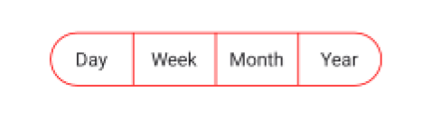

## Customize the border thickness

You can use the [StrokeThickness](https://help.syncfusion.com/cr/maui/Syncfusion.Maui.Buttons.SfSegmentedControl.html#Syncfusion_Maui_Buttons_SfSegmentedControl_StrokeThickness) property of [SfSegmentedControl](https://help.syncfusion.com/cr/maui/Syncfusion.Maui.Buttons.SfSegmentedControl.html) to customize the border thickness of the segmented control.




<ContentPage
    xmlns:buttons="clr-namespace:Syncfusion.Maui.Buttons;assembly=Syncfusion.Maui.Buttons">
    <buttons:SfSegmentedControl x:Name="segmentedControl"
                                StrokeThickness="2">
        <buttons:SfSegmentedControl.ItemsSource>
            <x:Array Type="{x:Type x:String}">
                <x:String>Day</x:String>
                <x:String>Week</x:String>
                <x:String>Month</x:String>
                <x:String>Year</x:String>
            </x:Array>
        </buttons:SfSegmentedControl.ItemsSource>
    </buttons:SfSegmentedControl>
</ContentPage>




using Syncfusion.Maui.Buttons;
. . .

public partial class MainPage : ContentPage
{
    public MainPage()
    {
        InitializeComponent();
        SfSegmentedControl segmentedControl = new SfSegmentedControl();
        segmentedControl.StrokeThickness = 2;
        this.Content = segmentedControl;
    }
}




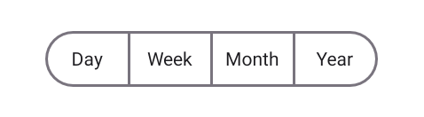

## Customize the border corner radius

Use the [CornerRadius](https://help.syncfusion.com/cr/maui/Syncfusion.Maui.Buttons.SfSegmentedControl.html#Syncfusion_Maui_Buttons_SfSegmentedControl_CornerRadius) property of [SfSegmentedControl](https://help.syncfusion.com/cr/maui/Syncfusion.Maui.Buttons.SfSegmentedControl.html) to customize the corner radius of the segmented control.




<ContentPage
    xmlns:buttons="clr-namespace:Syncfusion.Maui.Buttons;assembly=Syncfusion.Maui.Buttons">
    <buttons:SfSegmentedControl x:Name="segmentedControl"
                                CornerRadius="5">
        <buttons:SfSegmentedControl.ItemsSource>
            <x:Array Type="{x:Type x:String}">
                <x:String>Day</x:String>
                <x:String>Week</x:String>
                <x:String>Month</x:String>
                <x:String>Year</x:String>
            </x:Array>
        </buttons:SfSegmentedControl.ItemsSource>                
    </buttons:SfSegmentedControl>
</ContentPage>




using Syncfusion.Maui.Buttons;
. . .

public partial class MainPage : ContentPage
{
    public MainPage()
    {
        InitializeComponent();
        SfSegmentedControl segmentedControl = new SfSegmentedControl();
        segmentedControl.CornerRadius = 5;
        this.Content = segmentedControl;
    }
}




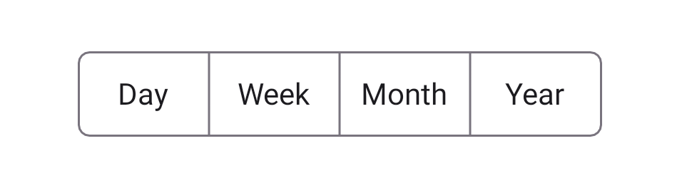

N> The `CornerRadius` property will be applicable only for the first and last segment items. To set corner radius for all segments, use `SegmentCornerRadius`.

## Customize the segment corner radius

Use the [SegmentCornerRadius](https://help.syncfusion.com/cr/maui/Syncfusion.Maui.Buttons.SfSegmentedControl.html#Syncfusion_Maui_Buttons_SfSegmentedControl_SegmentCornerRadius) property of [SfSegmentedControl](https://help.syncfusion.com/cr/maui/Syncfusion.Maui.Buttons.SfSegmentedControl.html) to customize the segment corner radius of the segmented control.




<ContentPage
    xmlns:buttons="clr-namespace:Syncfusion.Maui.Buttons;assembly=Syncfusion.Maui.Buttons">
    <buttons:SfSegmentedControl x:Name="segmentedControl"
                                SegmentCornerRadius="5">
        <buttons:SfSegmentedControl.ItemsSource>
            <x:Array Type="{x:Type x:String}">
                <x:String>Day</x:String>
                <x:String>Week</x:String>
                <x:String>Month</x:String>
                <x:String>Year</x:String>
            </x:Array>
        </buttons:SfSegmentedControl.ItemsSource>
    </buttons:SfSegmentedControl>
</ContentPage>




using Syncfusion.Maui.Buttons;
. . .

public partial class MainPage : ContentPage
{
    public MainPage()
    {
        InitializeComponent();
        SfSegmentedControl segmentedControl = new SfSegmentedControl();
        segmentedControl.SegmentCornerRadius = 5;
        this.Content = segmentedControl;
    }
}




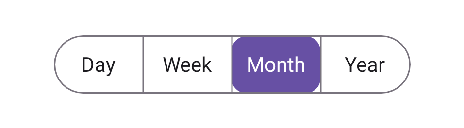

## Customize the text style
You can customize the text style of the segmented control and each segment item.

### Customize the text style of segmented Control
Use the [TextStyle](https://help.syncfusion.com/cr/maui/Syncfusion.Maui.Buttons.SfSegmentedControl.html#Syncfusion_Maui_Buttons_SfSegmentedControl_TextStyle) property of [SfSegmentedControl](https://help.syncfusion.com/cr/maui/Syncfusion.Maui.Buttons.SfSegmentedControl.html) to customize the text style of the segmented control.




<ContentPage
    xmlns:buttons="clr-namespace:Syncfusion.Maui.Buttons;assembly=Syncfusion.Maui.Buttons">
    <buttons:SfSegmentedControl x:Name="segmentedControl">
        <buttons:SfSegmentedControl.TextStyle>
            <buttons:SegmentTextStyle TextColor="Red" FontAttributes="Italic" FontSize="20"/>
        </buttons:SfSegmentedControl.TextStyle>
        <buttons:SfSegmentedControl.ItemsSource>
            <x:Array Type="{x:Type x:String}">
                <x:String>Day</x:String>
                <x:String>Week</x:String>
                <x:String>Month</x:String>
                <x:String>Year</x:String>
            </x:Array>
        </buttons:SfSegmentedControl.ItemsSource>
    </buttons:SfSegmentedControl>
</ContentPage>




using Syncfusion.Maui.Buttons;
. . .

public partial class MainPage : ContentPage
{
    public MainPage()
    {
        InitializeComponent();
        SfSegmentedControl segmentedControl = new SfSegmentedControl();
        segmentedControl.TextStyle = new SegmentTextStyle()
        {
            TextColor = Colors.Red,
            FontAttributes = FontAttributes.Italic,
            FontSize = 20,
        };
        this.Content = segmentedControl;
    }
}




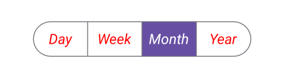

### Customize the text style of each segment item

Customize the text style of each segment item using the [TextStyle](https://help.syncfusion.com/cr/maui/Syncfusion.Maui.Buttons.SfSegmentItem.html#Syncfusion_Maui_Buttons_SfSegmentItem_TextStyle) property of [SfSegmentItem](https://help.syncfusion.com/cr/maui/Syncfusion.Maui.Buttons.SfSegmentItem.html).




using Syncfusion.Maui.Buttons;
. . .

public partial class MainPage : ContentPage
{
    public MainPage()
    {
        InitializeComponent();
        SfSegmentedControl segmentedControl = new SfSegmentedControl();
        List<SfSegmentItem> segmentItems = new List<SfSegmentItem>
            {
                new SfSegmentItem() {Text="Day", TextStyle = new SegmentTextStyle(){TextColor = Colors.Green}},
                new SfSegmentItem() {Text="Week", TextStyle = new SegmentTextStyle(){TextColor = Colors.Red}},
                new SfSegmentItem() {Text="Month", TextStyle = new SegmentTextStyle(){TextColor = Colors.Yellow}},
                new SfSegmentItem() {Text="Year", TextStyle = new SegmentTextStyle(){TextColor = Colors.Blue}},
            };
        segmentedControl.ItemsSource = segmentItems;
        this.Content = segmentedControl;
    }
}




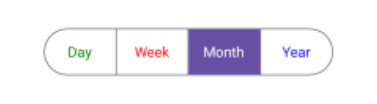

## Customize the segment background
You can customize the segmented background of the segmented control and each segment item.

### Customize the segment background of segmented control
Use the [SegmentBackground](https://help.syncfusion.com/cr/maui/Syncfusion.Maui.Buttons.SfSegmentedControl.html#Syncfusion_Maui_Buttons_SfSegmentedControl_SegmentBackground) property of [SfSegmentedControl](https://help.syncfusion.com/cr/maui/Syncfusion.Maui.Buttons.SfSegmentedControl.html) to customize the segmented background of the segmented control.




<ContentPage
    xmlns:buttons="clr-namespace:Syncfusion.Maui.Buttons;assembly=Syncfusion.Maui.Buttons">
    <buttons:SfSegmentedControl x:Name="segmentedControl"
                                SegmentBackground="LightGray">
        <buttons:SfSegmentedControl.ItemsSource>
            <x:Array Type="{x:Type x:String}">
                <x:String>Day</x:String>
                <x:String>Week</x:String>
                <x:String>Month</x:String>
                <x:String>Year</x:String>
            </x:Array>
        </buttons:SfSegmentedControl.ItemsSource>
    </buttons:SfSegmentedControl>
</ContentPage>




using Syncfusion.Maui.Buttons;
. . .

public partial class MainPage : ContentPage
{
    public MainPage()
    {
        InitializeComponent();
        SfSegmentedControl segmentedControl = new SfSegmentedControl();
        segmentedControl.SegmentBackground = Colors.LightGray;
        this.Content = segmentedControl;
    }
}




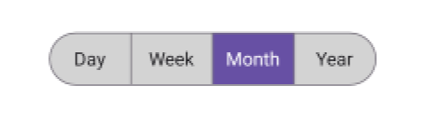

### Customize the segment background of each segment item

Customize the background of each segment item using the [Background](https://help.syncfusion.com/cr/maui/Syncfusion.Maui.Buttons.SfSegmentItem.html#Syncfusion_Maui_Buttons_SfSegmentItem_Background) property of [SfSegmentItem](https://help.syncfusion.com/cr/maui/Syncfusion.Maui.Buttons.SfSegmentItem.html).




using Syncfusion.Maui.Buttons;
. . .

public partial class MainPage : ContentPage
{
    public MainPage()
    {
        InitializeComponent();
        SfSegmentedControl segmentedControl = new SfSegmentedControl();
        List<SfSegmentItem> segmentItems = new List<SfSegmentItem>
            {
                new SfSegmentItem() {Text="Day", Background = Colors.LightBlue},
                new SfSegmentItem() {Text="Week", Background = Colors.LightBlue},
                new SfSegmentItem() {Text="Month", Background = Colors.LightBlue},
                new SfSegmentItem() {Text="Year", Background = Colors.LightBlue},
            };
        segmentedControl.ItemsSource = segmentItems;
        this.Content = segmentedControl;
    }
}




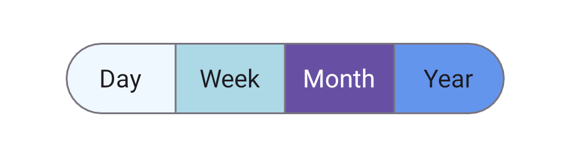

## Separator Visibility Change to Show or Hide Separator

The [ShowSeparator](https://help.syncfusion.com/cr/maui/Syncfusion.Maui.Buttons.SfSegmentedControl.html#Syncfusion_Maui_Buttons_SfSegmentedControl_ShowSeparator) property is used to control the visibility of the separator line that appears between the segments in the [SfSegmentedControl](https://help.syncfusion.com/cr/maui/Syncfusion.Maui.Buttons.SfSegmentedControl.html?tabs=tabid-34%2Ctabid-30%2Ctabid-19%2Ctabid-16%2Ctabid-37%2Ctabid-3%2Ctabid-24%2Ctabid-32%2Ctabid-8%2Ctabid-36%2Ctabid-10%2Ctabid-6%2Ctabid-14%2Ctabid-26%2Ctabid-28%2Ctabid-22%2Ctabid-12%2Ctabid-1). By default, the separator is visible, and setting this property to false hides the separator line.




<ContentPage xmlns:buttons="clr-namespace:Syncfusion.Maui.Buttons;assembly=Syncfusion.Maui.Buttons">
    <buttons:SfSegmentedControl x:Name="segmentedControl" ShowSeparator="False">
        <buttons:SfSegmentedControl.ItemsSource>
            <x:Array Type="{x:Type x:String}">
                <x:String>Day</x:String>
                <x:String>Week</x:String>
                <x:String>Month</x:String>
                <x:String>Year</x:String>
            </x:Array>
        </buttons:SfSegmentedControl.ItemsSource>
    </buttons:SfSegmentedControl>
</ContentPage>




using Syncfusion.Maui.Buttons;
. . .

public partial class MainPage : ContentPage
{
    public MainPage()
    {
        InitializeComponent();
        SfSegmentedControl segmentedControl = new SfSegmentedControl();
        List<SfSegmentItem> itemList = new List<SfSegmentItem>
        {
            new SfSegmentItem() {Text = "Day"},
            new SfSegmentItem() {Text = "Week"},
            new SfSegmentItem() {Text = "Month"},
            new SfSegmentItem() {Text = "Year"},
        };
        segmentedControl.ItemsSource = itemList;
        segmentedControl.ShowSeparator = false;
        this.Content = segmentedControl;
    }
}




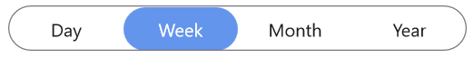

## Customize segment items appearance using DataTemplate

Use the [SegmentTemplate](https://help.syncfusion.com/cr/maui/Syncfusion.Maui.Buttons.SfSegmentedControl.html#Syncfusion_Maui_Buttons_SfSegmentedControl_SegmentTemplate) property of [SfSegmentedControl](https://help.syncfusion.com/cr/maui/Syncfusion.Maui.Buttons.SfSegmentedControl.html) to create custom segmented control. The following example code shows how to create a custom segmented control using a data template.




<ContentPage   
    xmlns:buttons="clr-namespace:Syncfusion.Maui.Buttons;assembly=Syncfusion.Maui.Buttons">
    <buttons:SfSegmentedControl x:Name="segmentedControl">
        <buttons:SfSegmentedControl.ItemsSource>
            <x:Array Type="{x:Type x:String}">                
                <x:String>Day</x:String>                
                <x:String>Week</x:String>
                <x:String>Month</x:String>
                <x:String>Year</x:String>
            </x:Array>
        </buttons:SfSegmentedControl.ItemsSource>
        <buttons:SfSegmentedControl.SegmentTemplate>
            <DataTemplate>
                <Grid Background="LightGray">
                    <Label Text="{Binding Text}"
                           TextColor="Red"
                           Margin="6"/>
                </Grid>
            </DataTemplate>
        </buttons:SfSegmentedControl.SegmentTemplate>
    </buttons:SfSegmentedControl>
</ContentPage>




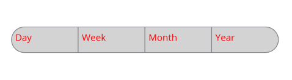

## Customize selected segment item appearance using DataTemplate

Use the [IsSelected](https://help.syncfusion.com/cr/maui/Syncfusion.Maui.Buttons.SfSegmentItem.html#Syncfusion_Maui_Buttons_SfSegmentItem_IsSelected) property of [SfSegmentItem](https://help.syncfusion.com/cr/maui/Syncfusion.Maui.Buttons.SegmentTappedEventArgs.html#Syncfusion_Maui_Buttons_SegmentTappedEventArgs_SegmentItem) to customize the selected segment item appearance. The following example code shows how to create a custom segmented control using a data template.




<ContentPage 
    xmlns:buttons="clr-namespace:Syncfusion.Maui.Buttons;assembly=Syncfusion.Maui.Buttons">
    <ContentPage.Resources>
        <ResourceDictionary>
            <local:TextColorConverter x:Key="TextColorConverter" />
        </ResourceDictionary>
    </ContentPage.Resources>
    <StackLayout Spacing="20" VerticalOptions="Center">
        <buttons:SfSegmentedControl x:Name="segmentedControl">
            <buttons:SfSegmentedControl.ItemsSource>
                <x:Array Type="{x:Type x:String}">
                    <x:String>Day</x:String>
                    <x:String>Week</x:String>
                    <x:String>Month</x:String>
                    <x:String>Year</x:String>
                </x:Array>
            </buttons:SfSegmentedControl.ItemsSource>
            <buttons:SfSegmentedControl.SegmentTemplate>
                <DataTemplate>
                    <Grid BackgroundColor="LightCyan">
                        <Label Text="{Binding Text}"
                               TextColor="{Binding IsSelected, Converter={StaticResource TextColorConverter}}"
                               FontAttributes="Bold"
                               Margin="6"/>
                    </Grid>
                </DataTemplate>
            </buttons:SfSegmentedControl.SegmentTemplate>
        </buttons:SfSegmentedControl>
    </StackLayout>
</ContentPage>




using Syncfusion.Maui.Buttons;
. . .

public partial class MainPage : ContentPage
{
    public MainPage()
    {
        InitializeComponent();
        SfSegmentedControl segmentedControl = new SfSegmentedControl();
        List<SfSegmentItem> segmentItems = new List<SfSegmentItem>
            {
                new SfSegmentItem() {Text="Day", Background = Colors.LightBlue},
                new SfSegmentItem() {Text="Week", Background = Colors.LightBlue},
                new SfSegmentItem() {Text="Month", Background = Colors.LightBlue},
                new SfSegmentItem() {Text="Year", Background = Colors.LightBlue},
            };
        segmentedControl.ItemsSource = segmentItems;
        this.Content = segmentedControl;
    }
}




public class TextColorConverter : IValueConverter
{
    public object Convert(object value, Type targetType, object parameter, CultureInfo culture)
    {
        if (value is bool isSelected)
        {
            return isSelected ? Colors.Green : Colors.Red;
        }

        return Colors.Black;
    }

    public object ConvertBack(object value, Type targetType, object parameter, CultureInfo culture)
    {
    }
}




N>
* The BindingContext of the [SegmentTemplate](https://help.syncfusion.com/cr/maui/Syncfusion.Maui.Buttons.SfSegmentedControl.html#Syncfusion_Maui_Buttons_SfSegmentedControl_SegmentTemplate) is the [SfSegmentItem](https://help.syncfusion.com/cr/maui/Syncfusion.Maui.Buttons.SegmentTappedEventArgs.html#Syncfusion_Maui_Buttons_SegmentTappedEventArgs_SegmentItem).

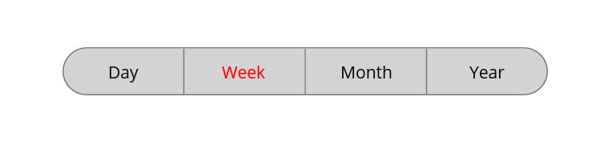