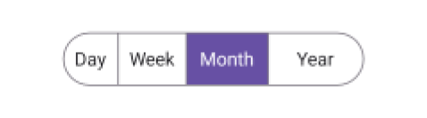
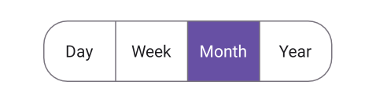

 
# Layout in .NET MAUI Segmented control (SfSegmentedControl)
The [SfSegmentedControl](https://www.syncfusion.com/maui-controls/maui-segmented-control) supports changing the layout width, height and the number of visible segments displayed.

## Change the segment width
Change the width of the segmented control and each segment item.

### Change the segment width for segmented control
Use the [SegmentWidth](https://help.syncfusion.com/cr/maui/Syncfusion.Maui.Buttons.SfSegmentedControl.html#Syncfusion_Maui_Buttons_SfSegmentedControl_SegmentWidth) property of [SfSegmentedControl](https://help.syncfusion.com/cr/maui/Syncfusion.Maui.Buttons.SfSegmentedControl.html) to customize the segment width of the segmented control.




<ContentPage
    xmlns:buttons="clr-namespace:Syncfusion.Maui.Buttons;assembly=Syncfusion.Maui.Buttons">
    <buttons:SfSegmentedControl x:Name="segmentedControl"
                                SegmentWidth="50">
        <buttons:SfSegmentedControl.ItemsSource>
            <x:Array Type="{x:Type x:String}">
                <x:String>Day</x:String>
                <x:String>Week</x:String>
                <x:String>Month</x:String>
                <x:String>Year</x:String>
            </x:Array>
        </buttons:SfSegmentedControl.ItemsSource>
    </buttons:SfSegmentedControl>
</ContentPage>




using Syncfusion.Maui.Buttons;
. . .

public partial class MainPage : ContentPage
{
    public MainPage()
    {
        InitializeComponent();
        SfSegmentedControl segmentedControl = new SfSegmentedControl();
        segmentedControl.SegmentWidth = 50;
        this.Content = segmentedControl;
    }
}




### Change the each segment item width
You can change the width of each segment item using the [Width](https://help.syncfusion.com/cr/maui/Syncfusion.Maui.Buttons.SfSegmentItem.html#Syncfusion_Maui_Buttons_SfSegmentItem_Width) property of [SfSegmentItem](https://help.syncfusion.com/cr/maui/Syncfusion.Maui.Buttons.SfSegmentItem.html).




using Syncfusion.Maui.Buttons;
. . .

public partial class MainPage : ContentPage
{
    public MainPage()
    {
        InitializeComponent();
        SfSegmentedControl segmentedControl = new SfSegmentedControl();
        List<SfSegmentItem> segmentItems = new List<SfSegmentItem>
            {
                new SfSegmentItem() {Text="Day", Width = 40},
                new SfSegmentItem() {Text="Week", Width = 50},
                new SfSegmentItem() {Text="Month", Width = 60},
                new SfSegmentItem() {Text="Year", Width = 70},
            };
        segmentedControl.ItemsSource = segmentItems;
        this.Content = segmentedControl;
    }
}




## Change the segment height
You can use the [SegmentHeight](https://help.syncfusion.com/cr/maui/Syncfusion.Maui.Buttons.SfSegmentedControl.html#Syncfusion_Maui_Buttons_SfSegmentedControl_SegmentHeight) property of [SfSegmentedControl](https://help.syncfusion.com/cr/maui/Syncfusion.Maui.Buttons.SfSegmentedControl.html) to customize the segment height of the segmented control.




<ContentPage
    xmlns:buttons="clr-namespace:Syncfusion.Maui.Buttons;assembly=Syncfusion.Maui.Buttons">
    <buttons:SfSegmentedControl x:Name="segmentedControl"
                                SegmentHeight="60">
        <buttons:SfSegmentedControl.ItemsSource>
            <x:Array Type="{x:Type x:String}">
                <x:String>Day</x:String>
                <x:String>Week</x:String>
                <x:String>Month</x:String>
                <x:String>Year</x:String>
            </x:Array>
        </buttons:SfSegmentedControl.ItemsSource>
    </buttons:SfSegmentedControl>
</ContentPage>




using Syncfusion.Maui.Buttons;
. . .

public partial class MainPage : ContentPage
{
    public MainPage()
    {
        InitializeComponent();
        SfSegmentedControl segmentedControl = new SfSegmentedControl();
        segmentedControl.SegmentHeight = 60;
        this.Content = segmentedControl;
    }
}




## Visible segment count
Set the number of visible segments displayed in the [SfSegmentedControl](https://help.syncfusion.com/cr/maui/Syncfusion.Maui.Buttons.SfSegmentedControl.html) using [VisibleSegmentsCount](https://help.syncfusion.com/cr/maui/Syncfusion.Maui.Buttons.SfSegmentedControl.html#Syncfusion_Maui_Buttons_SfSegmentedControl_VisibleSegmentsCount) property.




<ContentPage
    xmlns:buttons="clr-namespace:Syncfusion.Maui.Buttons;assembly=Syncfusion.Maui.Buttons">
    <buttons:SfSegmentedControl x:Name="segmentedControl"
                                VisibleSegmentsCount="3">
        <buttons:SfSegmentedControl.ItemsSource>
            <x:Array Type="{x:Type x:String}">
                <x:String>Day</x:String>
                <x:String>Week</x:String>
                <x:String>Month</x:String>
                <x:String>Year</x:String>
            </x:Array>
        </buttons:SfSegmentedControl.ItemsSource>
    </buttons:SfSegmentedControl>
</ContentPage>




using Syncfusion.Maui.Buttons;
. . .

public partial class MainPage : ContentPage
{
    public MainPage()
    {
        InitializeComponent();
        SfSegmentedControl segmentedControl = new SfSegmentedControl();
        segmentedControl.VisibleSegmentsCount = 3;
        this.Content = segmentedControl;
    }
}




N> The layout of segments adjusts automatically once [VisibleSegmentsCount](https://help.syncfusion.com/cr/maui/Syncfusion.Maui.Buttons.SfSegmentedControl.html#Syncfusion_Maui_Buttons_SfSegmentedControl_VisibleSegmentsCount) is set. This means that the [SegmentWidth](https://help.syncfusion.com/cr/maui/Syncfusion.Maui.Buttons.SfSegmentedControl.html#Syncfusion_Maui_Buttons_SfSegmentedControl_SegmentWidth) and [SfSegmentItem.Width](https://help.syncfusion.com/cr/maui/Syncfusion.Maui.Buttons.SfSegmentItem.html#Syncfusion_Maui_Buttons_SfSegmentItem_Width) properties will not be applied, and the `WidthRequest` value should be divided by the `VisibleSegmentsCount` to determine the width of each segment.