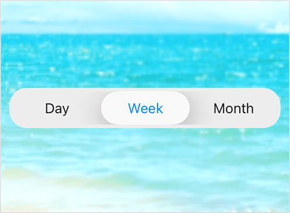

# Liquid Glass Effect in .NET MAUI Segmented control

The Liquid Glass Effect introduces a modern, translucent design with adaptive color tinting and light refraction, creating a sleek, glass like user experience that remains clear and accessible. This section explains how to enable and customize the effect in the Syncfusion® [.NET MAUI Segmented control (SfSegmentedControl)](https://www.syncfusion.com/maui-controls/maui-segmented-control) control.

## Apply liquid glass effect

Follow these steps to enable and configure the Liquid Glass Effect in the Segmented control control:

### Step 1: Wrap the control inside glass effect view

To apply the Liquid Glass Effect to Syncfusion® [SfSegmentedControl](https://help.syncfusion.com/cr/maui/Syncfusion.Maui.Buttons.SfSegmentedControl.html) control, wrap the control inside the [SfGlassEffectView](https://help.syncfusion.com/cr/maui/Syncfusion.Maui.Core.SfGlassEffectView.html) class.

For more details, refer to the [Liquid Glass Getting Started documentation](https://help.syncfusion.com/maui/liquid-glass-ui/getting-started).

### Step 2: Enable the liquid glass effect on Segmented control

Set the [EnableLiquidGlassEffect](https://help.syncfusion.com/cr/maui/Syncfusion.Maui.Buttons.SfSegmentedControl.html#Syncfusion_Maui_Buttons_SfSegmentedControl_EnableLiquidGlassEffect) property to `true` in the [SfSegmentedControl](https://help.syncfusion.com/cr/maui/Syncfusion.Maui.Buttons.SfSegmentedControl.html) control to apply the Liquid Glass Effect. When enabled, the effect is also applied to its dependent controls and provides responsive interaction for a smooth and engaging user experience.

### Step 3: Customize the background

To achieve a glass like background in the Segmented Control, set the `Background` property to `Transparent`. The background will then be treated as a tinted color, ensuring a consistent glass effect across the controls.

The following code snippet demonstrates how to apply the Liquid Glass Effect to the [SfSegmentedControl](https://help.syncfusion.com/cr/maui/Syncfusion.Maui.Buttons.SfSegmentedControl.html) control:



<ContentPage
    xmlns="http://schemas.microsoft.com/dotnet/2021/maui"
    xmlns:x="http://schemas.microsoft.com/winfx/2009/xaml"
    xmlns:buttons="clr-namespace:Syncfusion.Maui.Buttons;assembly=Syncfusion.Maui.Buttons"
    xmlns:core="clr-namespace:Syncfusion.Maui.Core;assembly=Syncfusion.Maui.Core"
    x:Class="SegmentPage">
    <Grid>
        <Image Source="wallpaper.jpg" Aspect="AspectFill" />
        <core:SfGlassEffectView EffectType="Clear">
            <buttons:SfSegmentedControl x:Name="segmentedControl" 
                                EnableLiquidGlassEffect="True" 
                                Stroke="#1F000000" 
                                Background="#EDEDED" 
                                StrokeThickness="1">
                <buttons:SfSegmentedControl.SelectionIndicatorSettings>
                    <buttons:SelectionIndicatorSettings TextColor="#0088FF" Background="#19F2F2F7"/>
                </buttons:SfSegmentedControl.SelectionIndicatorSettings>
                <buttons:SfSegmentedControl.ItemsSource>
                    <x:Array Type="{x:Type x:String}">
                        <x:String>Day</x:String>
                        <x:String>Week</x:String>
                        <x:String>Month</x:String>
                    </x:Array>
                </buttons:SfSegmentedControl.ItemsSource>
            </buttons:SfSegmentedControl>
        </core:SfGlassEffectView>
    </Grid>
</ContentPage>




using Syncfusion.Maui.Core;
using Syncfusion.Maui.Buttons;

var backgroundImage = new Image
{
    Source = "wallpaper.jpg",
    Aspect = Aspect.AspectFill
};

var glassView = new SfGlassEffectView
{
    EffectType = LiquidGlassEffectType.Clear
};

var segmentedControl = new SfSegmentedControl
{
    EnableLiquidGlassEffect = true,
    Stroke = Color.FromArgb("#1F000000"),
    Background = Color.FromArgb("#EDEDED"),
    StrokeThickness = 1,
    ItemsSource = new List<SfSegmentItem>
    {
        new SfSegmentItem() {Text = "Day"},
        new SfSegmentItem() {Text = "Week"},
        new SfSegmentItem() {Text = "Month"},
    }
};

segmentedControl.SelectionIndicatorSettings = new SelectionIndicatorSettings
{
    TextColor = Color.FromArgb("#0088FF"),
    Background = Color.FromArgb("#19F2F2F7")
};

glassView.Content = segmentedControl;
var grid = new Grid();
grid.Children.Add(backgroundImage);
grid.Children.Add(glassView);
this.Content = grid;




N>
* Supported on `macOS 26 or higher` and `iOS 26 or higher`.
* This feature is available only in `.NET 10.`
