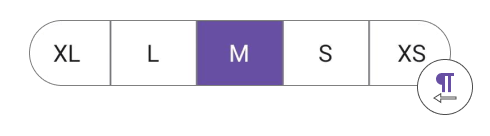

 
# Right To Left Flow Direction in .NET MAUI Segmented control (SfSegmentedControl)

The [SfSegmentedControl](https://www.syncfusion.com/maui-controls/maui-segmented-control) supports changing the flow direction of items rendering in the right-to-left order by setting the `FlowDirection` to `RightToLeft`.



<ContentPage 
...
xmlns:buttons="clr-namespace:Syncfusion.Maui.Buttons;assembly=Syncfusion.Maui.Buttons">
    <buttons:SfSegmentedControl x:Name="segmentedControl"
                                FlowDirection="RightToLeft">
    </buttons:SfSegmentedControl>
</ContentPage>




SfSegmentedControl segmentedControl = new SfSegmentedControl();
segmentedControl.FlowDirection = FlowDirection.RightToLeft;
this.Content = segmentedControl;




