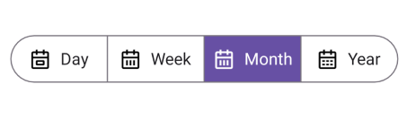
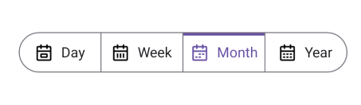
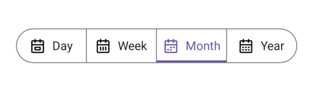
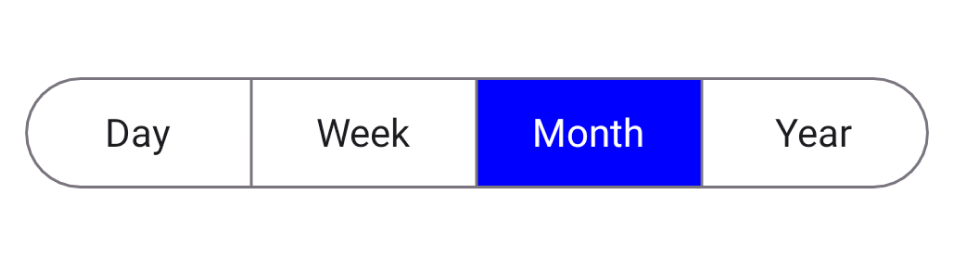
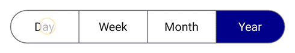
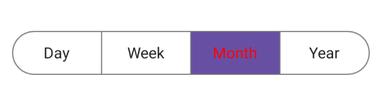
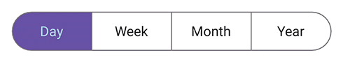
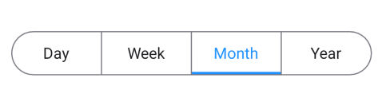
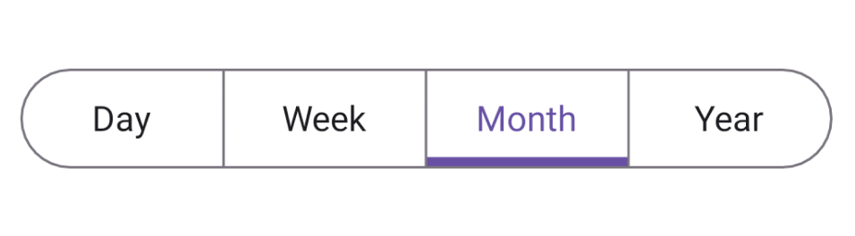
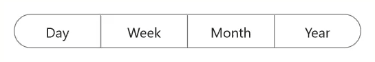

 
# Selection in .NET MAUI Segmented Control (SfSegmentedControl)

This section describes the features of the Segmented Control that help with item selection, customization of the selected item, and associated operations.

## Programmatically set selected index

Programmatically set the default value for the selection to be placed. The selection is updated based on the given index value for the [SelectedIndex](https://help.syncfusion.com/cr/maui/Syncfusion.Maui.Buttons.SfSegmentedControl.html#Syncfusion_Maui_Buttons_SfSegmentedControl_SelectedIndex).




<ContentPage   
    xmlns:buttons="clr-namespace:Syncfusion.Maui.Buttons;assembly=Syncfusion.Maui.Buttons">
    <buttons:SfSegmentedControl x:Name="segmentedControl"
                                SelectedIndex="1">
    </buttons:SfSegmentedControl>
</ContentPage>




using Syncfusion.Maui.Buttons;
. . .

public partial class MainPage : ContentPage
{
    public MainPage()
    {
        InitializeComponent();
        SfSegmentedControl segmentedControl = new SfSegmentedControl();
        segmentedControl.SelectedIndex = 1;
        this.Content = segmentedControl;
    }
}




## Selection indicator placements

The Segmented control provides four types of selection indicator placement: Fill, border, top, and bottom border.

### Fill
The selection indicator will fill the selected segment, if the [SelectionIndicatorPlacement](https://help.syncfusion.com/cr/maui/Syncfusion.Maui.Buttons.SelectionIndicatorSettings.html#Syncfusion_Maui_Buttons_SelectionIndicatorSettings_SelectionIndicatorPlacement) property of [SelectionIndicatorSettings](https://help.syncfusion.com/cr/maui/Syncfusion.Maui.Buttons.SfSegmentedControl.html#Syncfusion_Maui_Buttons_SfSegmentedControl_SelectionIndicatorSettings) is set to [Fill](https://help.syncfusion.com/cr/maui/Syncfusion.Maui.Buttons.SelectionIndicatorPlacement.html#Syncfusion_Maui_Buttons_SelectionIndicatorPlacement_Fill).




<ContentPage   
    xmlns:buttons="clr-namespace:Syncfusion.Maui.Buttons;assembly=Syncfusion.Maui.Buttons">
    <buttons:SfSegmentedControl x:Name="segmentedControl">
        <buttons:SfSegmentedControl.SelectionIndicatorSettings>
            <buttons:SelectionIndicatorSettings 
                SelectionIndicatorPlacement="Fill"/>
        </buttons:SfSegmentedControl.SelectionIndicatorSettings>
    </buttons:SfSegmentedControl>
</ContentPage>




using Syncfusion.Maui.Buttons;
. . .

public partial class MainPage : ContentPage
{
    public MainPage()
    {
        InitializeComponent();
        SfSegmentedControl segmentedControl = new SfSegmentedControl();
        segmentedControl.SelectionIndicatorSettings = new SelectionIndicatorSettings()
        {
            SelectionIndicatorPlacement = SelectionIndicatorPlacement.Fill,
        };
        this.Content = segmentedControl;
    }
}




### Border
The selection indicator will be highlighted with the border of the selected segment, if the [SelectionIndicatorPlacement](https://help.syncfusion.com/cr/maui/Syncfusion.Maui.Buttons.SelectionIndicatorSettings.html#Syncfusion_Maui_Buttons_SelectionIndicatorSettings_SelectionIndicatorPlacement) property of [SelectionIndicatorSettings](https://help.syncfusion.com/cr/maui/Syncfusion.Maui.Buttons.SfSegmentedControl.html#Syncfusion_Maui_Buttons_SfSegmentedControl_SelectionIndicatorSettings) is set to [Border](https://help.syncfusion.com/cr/maui/Syncfusion.Maui.Buttons.SelectionIndicatorPlacement.html#Syncfusion_Maui_Buttons_SelectionIndicatorPlacement_Border).




<ContentPage   
    xmlns:buttons="clr-namespace:Syncfusion.Maui.Buttons;assembly=Syncfusion.Maui.Buttons">
    <buttons:SfSegmentedControl x:Name="segmentedControl">
        <buttons:SfSegmentedControl.SelectionIndicatorSettings>
            <buttons:SelectionIndicatorSettings 
                SelectionIndicatorPlacement="Border"/>
        </buttons:SfSegmentedControl.SelectionIndicatorSettings>
    </buttons:SfSegmentedControl>
</ContentPage>




using Syncfusion.Maui.Buttons;
. . .

public partial class MainPage : ContentPage
{
    public MainPage()
    {
        InitializeComponent();
        SfSegmentedControl segmentedControl = new SfSegmentedControl();
        segmentedControl.SelectionIndicatorSettings = new SelectionIndicatorSettings()
        {
            SelectionIndicatorPlacement = SelectionIndicatorPlacement.Border,
        };
        this.Content = segmentedControl;
    }
}




### Top border
The selection indicator will be placed at the top of the selected segment, if the [SelectionIndicatorPlacement](https://help.syncfusion.com/cr/maui/Syncfusion.Maui.Buttons.SelectionIndicatorSettings.html#Syncfusion_Maui_Buttons_SelectionIndicatorSettings_SelectionIndicatorPlacement) property of [SelectionIndicatorSettings](https://help.syncfusion.com/cr/maui/Syncfusion.Maui.Buttons.SfSegmentedControl.html#Syncfusion_Maui_Buttons_SfSegmentedControl_SelectionIndicatorSettings) is set to [TopBorder](https://help.syncfusion.com/cr/maui/Syncfusion.Maui.Buttons.SelectionIndicatorPlacement.html#Syncfusion_Maui_Buttons_SelectionIndicatorPlacement_TopBorder).




<ContentPage   
    xmlns:buttons="clr-namespace:Syncfusion.Maui.Buttons;assembly=Syncfusion.Maui.Buttons">
    <buttons:SfSegmentedControl x:Name="segmentedControl">
        <buttons:SfSegmentedControl.SelectionIndicatorSettings>
            <buttons:SelectionIndicatorSettings 
                SelectionIndicatorPlacement="TopBorder"/>
        </buttons:SfSegmentedControl.SelectionIndicatorSettings>
    </buttons:SfSegmentedControl>
</ContentPage>




using Syncfusion.Maui.Buttons;
. . .

public partial class MainPage : ContentPage
{
    public MainPage()
    {
        InitializeComponent();
        SfSegmentedControl segmentedControl = new SfSegmentedControl();
        segmentedControl.SelectionIndicatorSettings = new SelectionIndicatorSettings()
        {
            SelectionIndicatorPlacement = SelectionIndicatorPlacement.TopBorder,
        };
        this.Content = segmentedControl;
    }
}




### Bottom border
The selection indicator will be placed at the bottom of the selected segment, if the [SelectionIndicatorPlacement](https://help.syncfusion.com/cr/maui/Syncfusion.Maui.Buttons.SelectionIndicatorSettings.html#Syncfusion_Maui_Buttons_SelectionIndicatorSettings_SelectionIndicatorPlacement) property of [SelectionIndicatorSettings](https://help.syncfusion.com/cr/maui/Syncfusion.Maui.Buttons.SfSegmentedControl.html#Syncfusion_Maui_Buttons_SfSegmentedControl_SelectionIndicatorSettings) is set to [BottomBorder](https://help.syncfusion.com/cr/maui/Syncfusion.Maui.Buttons.SelectionIndicatorPlacement.html#Syncfusion_Maui_Buttons_SelectionIndicatorPlacement_BottomBorder).




<ContentPage   
    xmlns:buttons="clr-namespace:Syncfusion.Maui.Buttons;assembly=Syncfusion.Maui.Buttons">
    <buttons:SfSegmentedControl x:Name="segmentedControl">
        <buttons:SfSegmentedControl.SelectionIndicatorSettings>
            <buttons:SelectionIndicatorSettings 
                SelectionIndicatorPlacement="BottomBorder"/>
        </buttons:SfSegmentedControl.SelectionIndicatorSettings>
    </buttons:SfSegmentedControl>
</ContentPage>




using Syncfusion.Maui.Buttons;
. . .

public partial class MainPage : ContentPage
{
    public MainPage()
    {
        InitializeComponent();
        SfSegmentedControl segmentedControl = new SfSegmentedControl();
        segmentedControl.SelectionIndicatorSettings = new SelectionIndicatorSettings()
        {
            SelectionIndicatorPlacement = SelectionIndicatorPlacement.BottomBorder,
        };
        this.Content = segmentedControl;
    }
}




## Selection Mode

You can select the segment item by tapping the item in the Segmented Control. SfSegmentedControl provides two types of modes such as [Single](https://help.syncfusion.com/cr/maui/Syncfusion.Maui.Buttons.SegmentSelectionMode.html) and [SingleDeselect](https://help.syncfusion.com/cr/maui/Syncfusion.Maui.Buttons.SegmentSelectionMode.html). The default [SelectionMode](https://help.syncfusion.com/cr/maui/Syncfusion.Maui.Buttons.SegmentSelectionMode.html) is `Single`.

### Single Selection

The Single selection can be performed in the [Segmented Control](https://help.syncfusion.com/cr/maui/Syncfusion.Maui.Buttons.SfSegmentedControl.html) by setting the [SelectionMode](https://help.syncfusion.com/cr/maui/Syncfusion.Maui.Buttons.SegmentSelectionMode.html) property to [Single](https://help.syncfusion.com/cr/maui/Syncfusion.Maui.Buttons.SegmentSelectionMode.html). In this selection, you can select a single item at a time in the segmented control.




<ContentPage   
        xmlns:segmentedControl="clr-namespace:Syncfusion.Maui.Buttons;assembly=Syncfusion.Maui.Buttons">
    <segmentedControl:SfSegmentedControl>
        <segmentedControl:SfSegmentedControl.SelectionIndicatorSettings>
            <segmentedControl:SelectionIndicatorSettings 
                SelectionMode="Single"
                Background="Blue"/>
        </segmentedControl:SfSegmentedControl.SelectionIndicatorSettings>
    </segmentedControl:SfSegmentedControl>
</ContentPage>




using Syncfusion.Maui.Buttons;
. . .

public partial class MainPage : ContentPage
{
    public MainPage()
    {
        InitializeComponent();
        SfSegmentedControl segmentedControl = new SfSegmentedControl();
        segmentedControl.SelectionMode = SegmentSelectionMode.Single;
        this.Content = segmentedControl;
    }
}




### Single Deselection

The Single Deselection can be performed in the `Segmented Control` by setting the `SelectionMode` property to `SingleDeselect`. In this mode, only one item can be selected at a time, and you can deselect the currently selected item by simply clicking on it again. This provides a quick way to clear the selection without needing additional actions.




<ContentPage   
        xmlns:segmentedControl="clr-namespace:Syncfusion.Maui.Buttons;assembly=Syncfusion.Maui.Buttons">
    <segmentedControl:SfSegmentedControl>
        <segmentedControl:SfSegmentedControl.SelectionIndicatorSettings>
            <segmentedControl:SelectionIndicatorSettings 
                SelectionMode="SingleDeselect"
                Background="Blue"/>
        </segmentedControl:SfSegmentedControl.SelectionIndicatorSettings>
    </segmentedControl:SfSegmentedControl>
</ContentPage>




using Syncfusion.Maui.Buttons;
. . .

public partial class MainPage : ContentPage
{
    public MainPage()
    {
        InitializeComponent();
        SfSegmentedControl segmentedControl = new SfSegmentedControl();
        segmentedControl.SelectionMode = SegmentSelectionMode.SingleDeselect;
        this.Content = segmentedControl;
    }
}




## Customize selected segment
The selected segment of the Segmented control is customized using the [SelectionIndicatorSettings](https://help.syncfusion.com/cr/maui/Syncfusion.Maui.Buttons.SfSegmentedControl.html#Syncfusion_Maui_Buttons_SfSegmentedControl_SelectionIndicatorSettings) property of [SfSegmentedControl](https://help.syncfusion.com/cr/maui/Syncfusion.Maui.Buttons.SfSegmentedControl.html).

### Customize selected segment background
You can customize the selected segment background of the segmented control and each segment item.

#### Customize selected segment background of segmented control
Customize the selected segment background using the [Background](https://help.syncfusion.com/cr/maui/Syncfusion.Maui.Buttons.SelectionIndicatorSettings.html#Syncfusion_Maui_Buttons_SelectionIndicatorSettings_Background) property of [SelectionIndicatorSettings](https://help.syncfusion.com/cr/maui/Syncfusion.Maui.Buttons.SfSegmentedControl.html#Syncfusion_Maui_Buttons_SfSegmentedControl_SelectionIndicatorSettings).




<ContentPage   
    xmlns:buttons="clr-namespace:Syncfusion.Maui.Buttons;assembly=Syncfusion.Maui.Buttons">
    <buttons:SfSegmentedControl x:Name="segmentedControl">
        <buttons:SfSegmentedControl.SelectionIndicatorSettings>
            <buttons:SelectionIndicatorSettings 
                SelectionIndicatorPlacement="Fill"
                Background="Blue"/>
        </buttons:SfSegmentedControl.SelectionIndicatorSettings>
    </buttons:SfSegmentedControl>
</ContentPage>




using Syncfusion.Maui.Buttons;
. . .

public partial class MainPage : ContentPage
{
    public MainPage()
    {
        InitializeComponent();
        SfSegmentedControl segmentedControl = new SfSegmentedControl();
        segmentedControl.SelectionIndicatorSettings = new SelectionIndicatorSettings()
        {
            SelectionIndicatorPlacement = SelectionIndicatorPlacement.Fill,
            Background = Colors.Blue,
        };
        this.Content = segmentedControl;
    }
}




N> The `Background` property of `SelectionIndicatorSettings` is applicable only for [SelectionIndicatorPlacement.Fill](https://help.syncfusion.com/cr/maui/Syncfusion.Maui.Buttons.SelectionIndicatorPlacement.html#Syncfusion_Maui_Buttons_SelectionIndicatorPlacement_Fill).

#### Customize selected segment background of each segment item
Customize the selected segment background of each segment item using the [SelectedSegmentBackground](https://help.syncfusion.com/cr/maui/Syncfusion.Maui.Buttons.SfSegmentItem.html#Syncfusion_Maui_Buttons_SfSegmentItem_SelectedSegmentBackground) property of [SfSegmentItem](https://help.syncfusion.com/cr/maui/Syncfusion.Maui.Buttons.SfSegmentItem.html).




using Syncfusion.Maui.Buttons;
. . .

public partial class MainPage : ContentPage
{
    public MainPage()
    {
        InitializeComponent();
        SfSegmentedControl segmentedControl = new SfSegmentedControl();
        List<SfSegmentItem> segmentItems = new List<SfSegmentItem>
            {
                new SfSegmentItem() {Text="Day", SelectedSegmentBackground = Colors.LightBlue},
                new SfSegmentItem() {Text="Week", SelectedSegmentBackground = Colors.Blue},
                new SfSegmentItem() {Text="Month", SelectedSegmentBackground = Colors.SkyBlue},
                new SfSegmentItem() {Text="Year", SelectedSegmentBackground = Colors.DarkBlue},
            };
        segmentedControl.ItemsSource = segmentItems;
        this.Content = segmentedControl;
    }
}




### Customize selected segment text color
You can customize the selected segment text color of the segmented control and each segment item.

#### Customize selected segment text color of segmented control
Customize the selected segment text color using the [TextColor](https://help.syncfusion.com/cr/maui/Syncfusion.Maui.Buttons.SelectionIndicatorSettings.html#Syncfusion_Maui_Buttons_SelectionIndicatorSettings_TextColor) property of [SelectionIndicatorSettings](https://help.syncfusion.com/cr/maui/Syncfusion.Maui.Buttons.SfSegmentedControl.html#Syncfusion_Maui_Buttons_SfSegmentedControl_SelectionIndicatorSettings).




<ContentPage   
    xmlns:buttons="clr-namespace:Syncfusion.Maui.Buttons;assembly=Syncfusion.Maui.Buttons">
    <buttons:SfSegmentedControl x:Name="segmentedControl">
        <buttons:SfSegmentedControl.SelectionIndicatorSettings>
            <buttons:SelectionIndicatorSettings 
                TextColor="Red"/>
        </buttons:SfSegmentedControl.SelectionIndicatorSettings>
    </buttons:SfSegmentedControl>
</ContentPage>




using Syncfusion.Maui.Buttons;
. . .

public partial class MainPage : ContentPage
{
    public MainPage()
    {
        InitializeComponent();
        SfSegmentedControl segmentedControl = new SfSegmentedControl();
        segmentedControl.SelectionIndicatorSettings = new SelectionIndicatorSettings()
        {
            TextColor = Colors.Red,
        };
        this.Content = segmentedControl;
    }
}




#### Customize selected segment text color of each segment item
Customize the selected segment text color of each segment item using the [SelectedSegmentTextColor](https://help.syncfusion.com/cr/maui/Syncfusion.Maui.Buttons.SfSegmentItem.html#Syncfusion_Maui_Buttons_SfSegmentItem_SelectedSegmentTextColor) property of [SfSegmentItem](https://help.syncfusion.com/cr/maui/Syncfusion.Maui.Buttons.SfSegmentItem.html).




using Syncfusion.Maui.Buttons;
. . .

public partial class MainPage : ContentPage
{
    public MainPage()
    {
        InitializeComponent();
        SfSegmentedControl segmentedControl = new SfSegmentedControl();
        List<SfSegmentItem> segmentItems = new List<SfSegmentItem>
            {
                new SfSegmentItem() {Text="Day", SelectedSegmentTextColor = Colors.LightBlue},
                new SfSegmentItem() {Text="Week", SelectedSegmentTextColor = Colors.Blue},
                new SfSegmentItem() {Text="Month", SelectedSegmentTextColor = Colors.SkyBlue},
                new SfSegmentItem() {Text="Year", SelectedSegmentTextColor = Colors.DarkBlue},
            };
        segmentedControl.ItemsSource = segmentItems;
        this.Content = segmentedControl;
    }
}




### Customize selected segment border color
Customize the selected segment border color using the [Stroke](https://help.syncfusion.com/cr/maui/Syncfusion.Maui.Buttons.SelectionIndicatorSettings.html#Syncfusion_Maui_Buttons_SelectionIndicatorSettings_Stroke) property of [SelectionIndicatorSettings](https://help.syncfusion.com/cr/maui/Syncfusion.Maui.Buttons.SfSegmentedControl.html#Syncfusion_Maui_Buttons_SfSegmentedControl_SelectionIndicatorSettings).




<ContentPage   
    xmlns:buttons="clr-namespace:Syncfusion.Maui.Buttons;assembly=Syncfusion.Maui.Buttons">
    <buttons:SfSegmentedControl x:Name="segmentedControl">
        <buttons:SfSegmentedControl.SelectionIndicatorSettings>
            <buttons:SelectionIndicatorSettings 
                SelectionIndicatorPlacement="BottomBorder"
                Stroke="DodgerBlue"/>
        </buttons:SfSegmentedControl.SelectionIndicatorSettings>
    </buttons:SfSegmentedControl>
</ContentPage>




using Syncfusion.Maui.Buttons;
. . .

public partial class MainPage : ContentPage
{
    public MainPage()
    {
        InitializeComponent();
        SfSegmentedControl segmentedControl = new SfSegmentedControl();
        segmentedControl.SelectionIndicatorSettings = new SelectionIndicatorSettings()
        {
            SelectionIndicatorPlacement = SelectionIndicatorPlacement.BottomBorder,
            Stroke = Colors.DodgerBlue,
        };
        this.Content = segmentedControl;
    }
}




N> The `Stroke` property of `SelectionIndicatorSettings` is applicable only when the selection mode is set to [SelectionIndicatorPlacement.Border](https://help.syncfusion.com/cr/maui/Syncfusion.Maui.Buttons.SelectionIndicatorPlacement.html#Syncfusion_Maui_Buttons_SelectionIndicatorPlacement_Border), [SelectionIndicatorPlacement.TopBorder](https://help.syncfusion.com/cr/maui/Syncfusion.Maui.Buttons.SelectionIndicatorPlacement.html#Syncfusion_Maui_Buttons_SelectionIndicatorPlacement_TopBorder), or [SelectionIndicatorPlacement.BottomBorder](https://help.syncfusion.com/cr/maui/Syncfusion.Maui.Buttons.SelectionIndicatorPlacement.html#Syncfusion_Maui_Buttons_SelectionIndicatorPlacement_BottomBorder).

### Customize selected segment border thickness
Customize the selected segment border thickness using the [StrokeThickness](https://help.syncfusion.com/cr/maui/Syncfusion.Maui.Buttons.SelectionIndicatorSettings.html#Syncfusion_Maui_Buttons_SelectionIndicatorSettings_StrokeThickness) property of [SelectionIndicatorSettings](https://help.syncfusion.com/cr/maui/Syncfusion.Maui.Buttons.SfSegmentedControl.html#Syncfusion_Maui_Buttons_SfSegmentedControl_SelectionIndicatorSettings).




<ContentPage   
    xmlns:buttons="clr-namespace:Syncfusion.Maui.Buttons;assembly=Syncfusion.Maui.Buttons">
    <buttons:SfSegmentedControl x:Name="segmentedControl">
        <buttons:SfSegmentedControl.SelectionIndicatorSettings>
            <buttons:SelectionIndicatorSettings
                SelectionIndicatorPlacement="BottomBorder"
                StrokeThickness="5"/>
        </buttons:SfSegmentedControl.SelectionIndicatorSettings>
    </buttons:SfSegmentedControl>
</ContentPage>




using Syncfusion.Maui.Buttons;
. . .

public partial class MainPage : ContentPage
{
    public MainPage()
    {
        InitializeComponent();
        SfSegmentedControl segmentedControl = new SfSegmentedControl();
        segmentedControl.SelectionIndicatorSettings = new SelectionIndicatorSettings()
        {
            SelectionIndicatorPlacement = SelectionIndicatorPlacement.BottomBorder,
            StrokeThickness = 5,
        };
        this.Content = segmentedControl;
    }
}




## Enable or Disable Ripple Animation

The [SfSegmentedControl](https://help.syncfusion.com/cr/maui/Syncfusion.Maui.Buttons.SfSegmentedControl.html) provides a ripple animation that visually highlights a segment when it is tapped. This effect applies to both default segment items and items defined using custom data templates. You can enable or disable this animation using the [`EnableRippleEffect`](https://help.syncfusion.com/cr/maui/Syncfusion.Maui.Buttons.SfSegmentedControl.html#Syncfusion_Maui_Buttons_SfSegmentedControl_EnableRippleEffect) property. Set [`EnableRippleEffect`](https://help.syncfusion.com/cr/maui/Syncfusion.Maui.Buttons.SfSegmentedControl.html#Syncfusion_Maui_Buttons_SfSegmentedControl_EnableRippleEffect) to true to display the ripple effect when a segment is selected. Set it to false to disable the ripple animation.




<ContentPage xmlns:buttons="clr-namespace:Syncfusion.Maui.Buttons;assembly=Syncfusion.Maui.Buttons">

<buttons:SfSegmentedControl x:Name="segmentedControl"
                           EnableRippleEffect="False">
    <buttons:SfSegmentedControl.ItemsSource>
        <x:Array Type="{x:Type x:String}">
                <x:String>Day</x:String>
                <x:String>Week</x:String>
                <x:String>Month</x:String>
                <x:String>Year</x:String>
        </x:Array>
    </buttons:SfSegmentedControl.ItemsSource>
</buttons:SfSegmentedControl>

</ContentPage>




using Syncfusion.Maui.Buttons;
. . .

public partial class MainPage : ContentPage
{
    public MainPage()
    {
        InitializeComponent();
        SfSegmentedControl segmentedControl = new SfSegmentedControl();
        List<SfSegmentItem> itemList = new List<SfSegmentItem>
        {
            new SfSegmentItem() {Text = "Day"},
            new SfSegmentItem() {Text = "Week"},
            new SfSegmentItem() {Text = "Month"},
            new SfSegmentItem() {Text = "Year"},
        };
        segmentedControl.ItemsSource = itemList;
        segmentedControl.EnableRippleEffect = false;
        this.Content = segmentedControl;
    }
}




