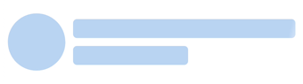
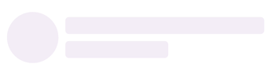
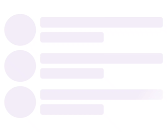

# Customization of .NET MAUI Shimmer (SfShimmer)

The [SfShimmer](https://help.syncfusion.com/cr/maui/Syncfusion.Maui.Shimmer.SfShimmer.html) control provides the following properties to customize the shimmer,

* `Fill` - To customize the background color of Shimmer view. 
* `WaveColor` - To customize the Shimmer wave color.
* `WaveWidth` - To customize the Shimmer wave width.
* `WaveDirection` - To customize the Shimmer wave direction.
* `RepeatCount` - To customize the repeat count for the Shimmer.
* `AnimationDuration` - To customize the animation duration of the wave.

This section explains how to customize the Shimmer control.

## Fill

The background of the [SfShimmer](https://help.syncfusion.com/cr/maui/Syncfusion.Maui.Shimmer.SfShimmer.html) view can be customized by using the [Fill](https://help.syncfusion.com/cr/maui/Syncfusion.Maui.Shimmer.SfShimmer.html#Syncfusion_Maui_Shimmer_SfShimmer_Fill) property. The default value of the `Fill` property is `#F3EDF7`.




<shimmer:SfShimmer x:Name="shimmer" VerticalOptions="FillAndExpand" Type="CirclePersona"
                   Fill="#89CFF0">
   <StackLayout>
      <Label 
         Text="Content is loaded!!">
      </Label>
   </StackLayout>
</shimmer:SfShimmer>




SfShimmer Shimmer = new SfShimmer()
{
      Type = ShimmerType.CirclePersona,
      Fill = Color.FromRgba("#89CFF0"),
      Content = new Label
      {
         Text = "Content is loaded!"              
      }
};

this.Content = Shimmer;




   

## WaveColor

The wave color in the [SfShimmer](https://help.syncfusion.com/cr/maui/Syncfusion.Maui.Shimmer.SfShimmer.html) view can be customized using the [WaveColor](https://help.syncfusion.com/cr/maui/Syncfusion.Maui.Shimmer.SfShimmer.html#Syncfusion_Maui_Shimmer_SfShimmer_WaveColor) property. The default value of `WaveColor` is the `#FFFBFE` Color.




<shimmer:SfShimmer x:Name="shimmer" VerticalOptions="FillAndExpand" Type="CirclePersona"
                   WaveColor="#89CFF0">
   <StackLayout>
      <Label 
         Text="Content is loaded!!">
      </Label>
   </StackLayout>
</shimmer:SfShimmer>




SfShimmer Shimmer = new SfShimmer()
{
      Type = ShimmerType.CirclePersona,
      WaveColor = Color.FromRgba("#89CFF0"),
      Content = new Label
      {
         Text = "Content is loaded!"              
      }
};

this.Content = Shimmer;




   

## WaveWidth

The width of the wave in the [SfShimmer](https://help.syncfusion.com/cr/maui/Syncfusion.Maui.Shimmer.SfShimmer.html) view can be customized using the [WaveWidth](https://help.syncfusion.com/cr/maui/Syncfusion.Maui.Shimmer.SfShimmer.html#Syncfusion_Maui_Shimmer_SfShimmer_WaveWidth) property. The default value of `WaveWidth` is `200`.




<shimmer:SfShimmer x:Name="shimmer" VerticalOptions="FillAndExpand" Type="CirclePersona"
                   WaveColor="#89CFF0"  
                   WaveWidth="50">
   <StackLayout>
      <Label 
         Text="Content is loaded!!">
      </Label>
   </StackLayout>
</shimmer:SfShimmer>




SfShimmer Shimmer = new SfShimmer()
{
      Type = ShimmerType.CirclePersona,
      WaveColor = Color.FromRgba("#89CFF0"),
      WaveWidth = 50,
      Content = new Label
      {
         Text = "Content is loaded!"              
      }
};

this.Content = Shimmer;




   

## WaveDirection

The direction of the wave in the [SfShimmer](https://help.syncfusion.com/cr/maui/Syncfusion.Maui.Shimmer.SfShimmer.html) view can be customized by using the [WaveDirection](https://help.syncfusion.com/cr/maui/Syncfusion.Maui.Shimmer.SfShimmer.html#Syncfusion_Maui_Shimmer_SfShimmer_WaveDirection) property. By default, wave direction is rendered by the [Default](https://help.syncfusion.com/cr/maui/Syncfusion.Maui.Shimmer.ShimmerWaveDirection.html#Syncfusion_Maui_Shimmer_ShimmerWaveDirection_Default) wave. The following wave directions are available in SfShimmer:

* `Default` - Default enum of the animation direction allows the animation from left top to right bottom.
* `LeftToRight` - LeftToRight enum of the animation direction allows the animation from left to right.
* `RightToLeft` - RightToLeft enum of the animation direction allows the animation from right to left.
* `TopToBottom` - TopToBottom enum of the animation direction allows the animation from top to bottom.
* `BottomToTop` - BottomToTop enum of the animation direction allows the animation from bottom to top.




<shimmer:SfShimmer x:Name="shimmer" VerticalOptions="FillAndExpand" Type="CirclePersona" 
                   WaveDirection="RightToLeft">
   <StackLayout>
      <Label 
         Text="Content is loaded!!">
      </Label>
   </StackLayout>
</shimmer:SfShimmer>




SfShimmer Shimmer = new SfShimmer()
{
      Type = ShimmerType.CirclePersona,
      WaveDirection = ShimmerWaveDirection.RightToLeft,
      Content = new Label
      {
         Text = "Content is loaded!"              
      }
};

this.Content = Shimmer;




   

## RepeatCount

The `RepeatCount` of the shimmer defines the number of the times the shimmer shape needed to render in the [SfShimmer](https://help.syncfusion.com/cr/maui/Syncfusion.Maui.Shimmer.SfShimmer.html) view. The default value of [RepeatCount](https://help.syncfusion.com/cr/maui/Syncfusion.Maui.Shimmer.SfShimmer.html#Syncfusion_Maui_Shimmer_SfShimmer_RepeatCount) is `1`.




<shimmer:SfShimmer x:Name="shimmer" VerticalOptions="FillAndExpand" Type="CirclePersona" 
                   RepeatCount="3">
   <StackLayout>
      <Label 
         Text="Content is loaded!!">
      </Label>
   </StackLayout>
</shimmer:SfShimmer>




SfShimmer Shimmer = new SfShimmer()
{
      Type = ShimmerType.CirclePersona,
      RepeatCount = 3,
      Content = new Label
      {
         Text = "Content is loaded!"              
      }
};

this.Content = Shimmer;




   

## AnimationDuration

The duration of the animation in the [SfShimmer](https://help.syncfusion.com/cr/maui/Syncfusion.Maui.Shimmer.SfShimmer.html) view can be customized using the [AnimationDuration](https://help.syncfusion.com/cr/maui/Syncfusion.Maui.Shimmer.SfShimmer.html#Syncfusion_Maui_Shimmer_SfShimmer_AnimationDuration) property. The default value of `AnimationDuration` is `1000 ms`.




<shimmer:SfShimmer x:Name="shimmer" VerticalOptions="FillAndExpand" Type="CirclePersona" 
                   AnimationDuration="3000">
   <StackLayout>
      <Label 
         Text="Content is loaded!!">
      </Label>
   </StackLayout>
</shimmer:SfShimmer>




SfShimmer Shimmer = new SfShimmer()
{
      Type = ShimmerType.CirclePersona,
      AnimationDuration = 3000,
      Content = new Label
      {
         Text = "Content is loaded!"              
      }
};

this.Content = Shimmer;




   