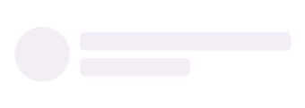

# Getting started of .NET MAUI Shimmer

This section explains how to add the [.NET MAUI Shimmer](https://www.syncfusion.com/maui-controls/maui-shimmer) control. Follow the steps below to add a .NET MAUI Shimmer control to your project.

To get start quickly with our .NET MAUI Shimmer, you can check the below video.






## Prerequisites
Before proceeding, ensure the following are set up:

1. Install [.NET 9 SDK](https://dotnet.microsoft.com/en-us/download/dotnet/9.0) or later.
2. Set up a .NET MAUI environment with Visual Studio 2022 v17.12 or later.

## Step 1: Create a new .NET MAUI project

1. Go to **File > New > Project** and choose the **.NET MAUI App** template.
2. Name the project and choose a location. Then click **Next**.
3. Select the .NET framework version and click **Create**.

## Step 2: Install the Syncfusion® .NET MAUI Core NuGet package

1. In **Solution Explorer,** right-click the project and choose **Manage NuGet Packages.**
2. Search for [Syncfusion.Maui.Core](https://www.nuget.org/packages/Syncfusion.Maui.Core/) and install the latest version.
3. Ensure the necessary dependencies are installed correctly, and the project is restored.




## Prerequisites

Before proceeding, ensure the following are set up:

1. Install [.NET 9 SDK](https://dotnet.microsoft.com/en-us/download/dotnet/9.0) or later.
2. Set up a .NET MAUI environment with Visual Studio Code.
3. Ensure that the .NET MAUI workloads are installed and configured as described [here](https://learn.microsoft.com/en-us/dotnet/maui/get-started/installation?view=net-maui-9.0&tabs=visual-studio-code).

## Step 1: Create a new .NET MAUI project

1. Open the command palette by pressing `Ctrl+Shift+P` and type **.NET:New Project** and enter.
2. Choose the **.NET MAUI App** template.
3. Select the project location, type the project name and press **Enter**.
4. Then choose **Create project.**

## Step 2: Install the Syncfusion® MAUI Core NuGet package

1. Press <kbd>Ctrl</kbd> + <kbd>`</kbd> (backtick) to open the integrated terminal in Visual Studio Code.
2. Ensure you're in the project root directory where your .csproj file is located.
3. Run the command `dotnet add package Syncfusion.Maui.Core` to install the Syncfusion® .NET MAUI Core NuGet package.
4. To ensure all dependencies are installed, run `dotnet restore`.




## Prerequisites

Before proceeding, ensure the following are set up:

1. Install [.NET 9 SDK](https://dotnet.microsoft.com/en-us/download/dotnet/9.0) or later.
2. Set up a .NET MAUI environment with JetBrains Rider 2024.3 or later.
3. Make sure the MAUI workloads are installed and configured as described [here.](https://www.jetbrains.com/help/rider/MAUI.html#before-you-start)

## Step 1: Create a new .NET MAUI project

1. Go to **File > New Solution,** Select .NET (C#) and choose the .NET MAUI App template.
2. Enter the Project Name, Solution Name, and Location.
3. Select the .NET framework version and click Create.

## Step 2: Install the Syncfusion® MAUI Core NuGet package

1. In **Solution Explorer,** right-click the project and choose **Manage NuGet Packages.**
2. Search for [Syncfusion.Maui.Core](https://www.nuget.org/packages/Syncfusion.Maui.Core/) and install the latest version.
3. Ensure the necessary dependencies are installed correctly, and the project is restored. If not, Open the Terminal in Rider and manually run: `dotnet restore`




## Step 3: Register Syncfusion handler

Make sure to add the namespace.



using Syncfusion.Maui.Core.Hosting;



Register the Syncfusion core handler in your `CreateMauiApp` method of `MauiProgram.cs` file to use Syncfusion controls.



builder.ConfigureSyncfusionCore();
 


## Step 4: Import Shimmer namespace

Add the following namespace in your XAML or C#.




xmlns:shimmer="clr-namespace:Syncfusion.Maui.Shimmer;assembly=Syncfusion.Maui.Core"




using Syncfusion.Maui.Shimmer;




## Step 5: Add the Shimmer Component

The [.NET MAUI Shimmer](https://help.syncfusion.com/cr/maui/Syncfusion.Maui.Shimmer.SfShimmer.html) control provides seven different shimmer types of views. It can be assigned to the control using the [Type](https://help.syncfusion.com/cr/maui/Syncfusion.Maui.Shimmer.SfShimmer.html#Syncfusion_Maui_Shimmer_SfShimmer_Type) property. By default, the control is assigned to the [CirclePersona](https://help.syncfusion.com/cr/maui/Syncfusion.Maui.Shimmer.ShimmerType.html#Syncfusion_Maui_Shimmer_ShimmerType_CirclePersona) view.Shimmer content is loaded when the [`IsActive`](https://help.syncfusion.com/cr/maui/Syncfusion.Maui.Shimmer.SfShimmer.html#Syncfusion_Maui_Shimmer_SfShimmer_IsActive) property of the [`SfShimmer`](https://help.syncfusion.com/cr/maui/Syncfusion.Maui.Shimmer.SfShimmer.html) is disabled.




<shimmer:SfShimmer x:Name="shimmer" VerticalOptions="Fill"
                   Type="CirclePersona">
    <shimmer:SfShimmer.Content>
                <StackLayout>
                    <Label Text="Content is loaded!"/>
                </StackLayout>
    </shimmer:SfShimmer.Content>
</shimmer:SfShimmer>




shimmer = new SfShimmer()
{
    Type = ShimmerType.CirclePersona,
    VerticalOptions = LayoutOptions.FillAndExpand,
    Content = new Label
    {
        Text = "Content is loaded!"
    }
};
this.Content = shimmer;




You can download the Shimmer Getting Started sample from [GitHub](https://github.com/SyncfusionExamples/Getting-started-with-the-.NET-MAUI-Shimmer-control)

N> You can refer to our [.NET MAUI Shimmer](https://www.syncfusion.com/maui-controls/maui-shimmer) feature tour page for its groundbreaking feature representations. You can also explore our [.NET MAUI Shimmer Example](https://github.com/syncfusion/maui-demos/tree/master/MAUI/Shimmer) that shows you how to render the Shimmer in .NET MAUI.
