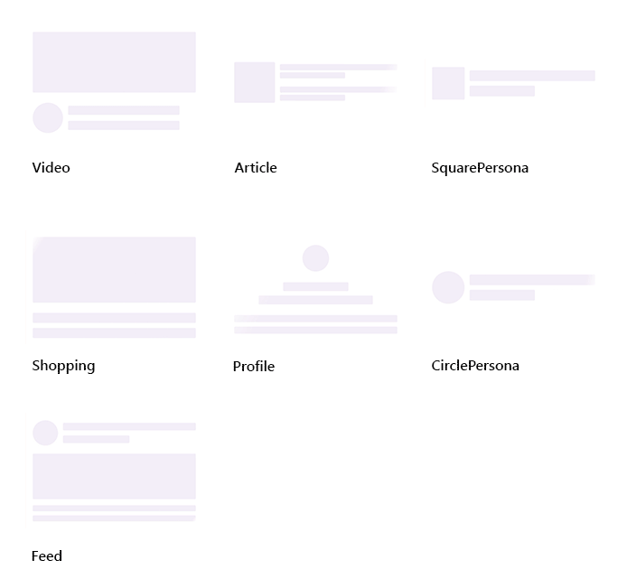
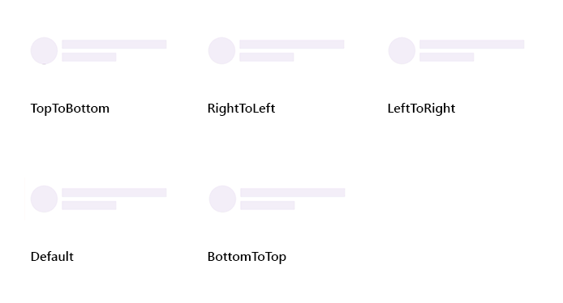

>**Notice**: After **Volume 1 2025 (Mid of March 2025)**, feature enhancements for this control will no longer be available in the Syncfusion package. Please switch to the **Syncfusion Toolkit for .NET MAUI** for continued support. For a smooth transition refer this [migration document](https://help.syncfusion.com/maui-toolkit/migration).

# Overview of .NET MAUI Shimmer (SfShimmer)

Syncfusion .NET MAUI Shimmer (SfShimmer) control can increase an application's responsiveness by displaying a shimmer effect while the content is loading or processing in the background.

## Key features

* **Multiple shimmer view types**: There are seven different Shimmer view types available in the .NET MAUI `SfShimmer`. The `CirclePersona` view is initially rendered by default.

    

* **Multiple shimmer wave directions**: It defines the Animation wave direction for the Shimmer. There are five wave directions available in the `SfShimmer`. By default, the wave direction is rendered by the `Default` wave, allowing the animation from the left top to the right bottom.

    

* **Shimmer view**: `ShimmerView` can be used to customize the custom view with different shape by using `ShapeType`. The `ShimmerView` is available in three different shape types. By default, the shape type is `Rectangle`.

    