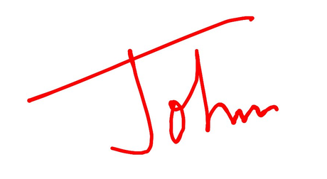
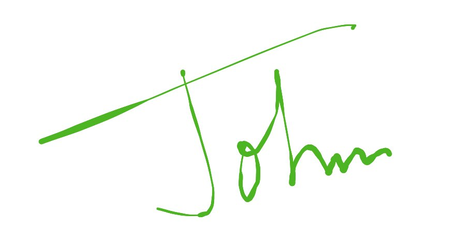

# Customization of Signature Pad

## Customize signature stroke color

Customize the stroke color of the SignaturePad control by using the [StrokeColor](https://help.syncfusion.com/cr/maui/Syncfusion.Maui.SignaturePad.SfSignaturePad.html#Syncfusion_Maui_SignaturePad_SfSignaturePad_StrokeColor) property. The default stroke color is **Colors.Black**.





<signaturePad:SfSignaturePad StrokeColor="Red" />





SfSignaturePad signaturePad = new SfSignaturePad();
signaturePad.StrokeColor = Colors.Red;





## Customize signature stroke thickness

The thickness of the stroke drawn can be customized by setting the [MinimumStrokeThickness](https://help.syncfusion.com/cr/maui/Syncfusion.Maui.SignaturePad.SfSignaturePad.html#Syncfusion_Maui_SignaturePad_SfSignaturePad_MinimumStrokeThickness) and [MaximumStrokeThickness](https://help.syncfusion.com/cr/maui/Syncfusion.Maui.SignaturePad.SfSignaturePad.html#Syncfusion_Maui_SignaturePad_SfSignaturePad_MaximumStrokeThickness) properties. The [MinimumStrokeThickness](https://help.syncfusion.com/cr/maui/Syncfusion.Maui.SignaturePad.SfSignaturePad.html#Syncfusion_Maui_SignaturePad_SfSignaturePad_MinimumStrokeThickness) defines the minimum thickness of the stroke and the [MaximumStrokeThickness](https://help.syncfusion.com/cr/maui/Syncfusion.Maui.SignaturePad.SfSignaturePad.html#Syncfusion_Maui_SignaturePad_SfSignaturePad_MaximumStrokeThickness) defines the maximum thickness of the stroke that can be drawn based on the speed and impression we provide through gesture within its minimum and maximum stroke thickness ranges. So that the signature will be more realistic.





<signaturePad:SfSignaturePad MinimumStrokeThickness="1"
                             MaximumStrokeThickness="6" />





SfSignaturePad signaturePad = new SfSignaturePad()
{
    MinimumStrokeThickness = 1,
    MaximumStrokeThickness = 6,
};





N> You can refer to our [.NET MAUI SignaturePad](https://www.syncfusion.com/maui-controls/maui-signaturepad) feature tour page for its groundbreaking feature representations. You can also explore our [.NET MAUI SignaturePad Example](https://github.com/syncfusion/maui-demos/tree/master/MAUI/SignaturePad) that shows you how to render the SignaturePad in .NET MAUI.