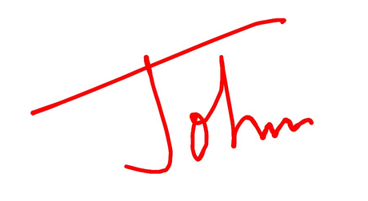
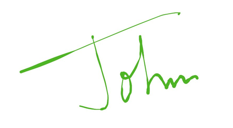

# Customization in .NET MAUI Signature Pad

This section explains how to customize the appearance of the [.NET MAUI Signature Pad](https://help.syncfusion.com/cr/maui/Syncfusion.Maui.SignaturePad.SfSignaturePad.html) control. The following aspects of the SignaturePad can be customized:

* Stroke color
* Stroke thickness

## Prerequisites

Before using the [SfSignaturePad](https://help.syncfusion.com/cr/maui/Syncfusion.Maui.SignaturePad.SfSignaturePad.html), ensure the following NuGet package is installed in your .NET MAUI project:

- `Syncfusion.Maui.SignaturePad`

For a step-by-step setup, refer to the [Getting Started](https://help.syncfusion.com/maui/signaturepad/getting-started) documentation.

## Stroke Color

Customize the stroke color of the SignaturePad control by setting the [StrokeColor](https://help.syncfusion.com/cr/maui/Syncfusion.Maui.SignaturePad.SfSignaturePad.html#Syncfusion_Maui_SignaturePad_SfSignaturePad_StrokeColor) property. The default stroke color is **Colors.Black**.





<signaturePad:SfSignaturePad StrokeColor="Red" />





SfSignaturePad signaturePad = new SfSignaturePad()
{
    StrokeColor = Colors.Red,
};
this.Content = signaturePad;





## Stroke Thickness

The thickness of the stroke can be customized by setting the [MinimumStrokeThickness](https://help.syncfusion.com/cr/maui/Syncfusion.Maui.SignaturePad.SfSignaturePad.html#Syncfusion_Maui_SignaturePad_SfSignaturePad_MinimumStrokeThickness) and [MaximumStrokeThickness](https://help.syncfusion.com/cr/maui/Syncfusion.Maui.SignaturePad.SfSignaturePad.html#Syncfusion_Maui_SignaturePad_SfSignaturePad_MaximumStrokeThickness) properties. Both properties accept `double` values.

N> Ensure that the value of `MaximumStrokeThickness` is greater than or equal to `MinimumStrokeThickness`; otherwise, the rendered stroke thickness is undefined.

The [MinimumStrokeThickness](https://help.syncfusion.com/cr/maui/Syncfusion.Maui.SignaturePad.SfSignaturePad.html#Syncfusion_Maui_SignaturePad_SfSignaturePad_MinimumStrokeThickness) defines the minimum thickness of the stroke, while the [MaximumStrokeThickness](https://help.syncfusion.com/cr/maui/Syncfusion.Maui.SignaturePad.SfSignaturePad.html#Syncfusion_Maui_SignaturePad_SfSignaturePad_MaximumStrokeThickness) defines the maximum thickness of the stroke.

The actual stroke thickness is dynamically computed based on the speed and pressure of the user's gesture. Faster gestures render closer to `MinimumStrokeThickness`, and slower gestures render closer to `MaximumStrokeThickness`. This produces a more realistic signature.





<signaturePad:SfSignaturePad MinimumStrokeThickness="1"
                             MaximumStrokeThickness="6" />





SfSignaturePad signaturePad = new SfSignaturePad()
{
    MinimumStrokeThickness = 1,
    MaximumStrokeThickness = 6,
};
this.Content = signaturePad;





## IsEmpty property

The `IsEmpty` property indicates whether the Signature Pad contains a signature. It returns `true` when no strokes have been drawn and `false` after the user adds a stroke. Use this property to validate that a signature has been provided before continuing a workflow.

### Validate the signature

The following example displays a validation message when the user tries to continue without signing.





<VerticalStackLayout Padding="20" Spacing="12">
    <signaturePad:SfSignaturePad x:Name="signaturePad"
                                 HeightRequest="200" />
    <Label x:Name="validationLabel"
           TextColor="Red"
           IsVisible="False" />
    <Button Text="Continue"
            Clicked="OnContinueClicked" />
</VerticalStackLayout>





private void OnContinueClicked(object? sender, EventArgs e)
{
    if (signaturePad.IsEmpty)
    {
        validationLabel.Text = "Please provide a signature.";
        validationLabel.IsVisible = true;
        return;
    }

    validationLabel.IsVisible = false;
    // Continue to the next step.
}





## See Also

* [Getting Started](https://help.syncfusion.com/maui/signaturepad/getting-started)
* [Events and Methods](https://help.syncfusion.com/maui/signaturepad/events-and-methods)