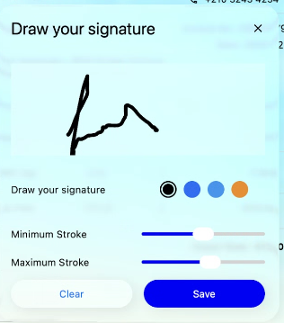

# Liquid Glass Effect in .NET MAUI Signature Pad (SfSignaturePad)

The Liquid Glass Effect introduces a modern, translucent design with adaptive color tinting and light refraction, creating a sleek, glass like user experience that remains clear and accessible. This section explains how to enable and customize the effect in the Syncfusion® .NET MAUI Signature Pad (SfSignaturePad) control.

## Apply liquid glass effect

Follow these steps to enable and configure the Liquid Glass Effect in the Signature Pad control:

### Step 1: Wrap the control inside glass effect view

To apply the Liquid Glass Effect to Syncfusion® .NET MAUI [Signature Pad](https://help.syncfusion.com/cr/maui/Syncfusion.Maui.SignaturePad.SfSignaturePad.html) control, wrap the control inside the [SfGlassEffectView](https://help.syncfusion.com/cr/maui/Syncfusion.Maui.Core.SfGlassEffectView.html) class.

For more details, refer to the `Liquid Glass Getting Started documentation`.

### Step 2: Customize the background

To achieve a glass like background in the Signature Pad, set the `Background` property to `Transparent`. The background will then be treated as a tinted color, ensuring a consistent glass effect across the controls.

The following code snippet demonstrates how to apply the Liquid Glass Effect to the `SfSignaturePad` control:



    <Grid>
    <Image Source="Wallpaper.png" Aspect="AspectFill">
        <core:SfGlassEffectView
            CornerRadius="20"
            HeightRequest="40"
            EffectType="Regular"
            EnableShadowEffect="True">
            <signature:SfSignaturePad
                x:Name="SignaturePad"
                Background="Transparent"
                StrokeColor="#1F2937"
                StrokeWidth="2"/>
        </core:SfGlassEffectView>
    </Grid>




using Syncfusion.Maui.Core;
using Syncfusion.Maui.SignaturePad;

var grid = new Grid
{
    BackgroundColor = Colors.Transparent
};

var image = new Image
{
    Source = "Wallpaper.png",
    Aspect = Aspect.AspectFill
};
grid.Children.Add(image);

var glassEffects = new SfGlassEffectView
{
    CornerRadius = 20,
    HeightRequest = 40,
    EffectType = LiquidGlassEffectType.Regular,
    EnableShadowEffect=True
};

var signaturePad = new SfSignaturePad
{
    Background = Colors.Transparent,
    StrokeColor = Color.FromArgb("#1F2937"),
    StrokeWidth = 2,
    HorizontalOptions = LayoutOptions.Fill,
    VerticalOptions = LayoutOptions.Fill
};

glassEffects.Content = signaturePad;

grid.Children.Add(glassEffects);
this.Content = grid;




The following screenshot illustrates SfSignaturePad within an acrylic container, with the dropdown using the glass effect.

N>
This feature is supported only on .NET 10 along with iOS 26 and macOS 26 