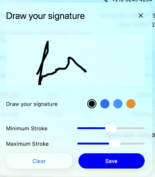

# Liquid Glass Effect in .NET MAUI SignaturePad (SfSignaturePad)

The Liquid Glass Effect introduces a modern, translucent design with adaptive color tinting and light refraction, creating a sleek, glass-like user experience that remains clear and accessible. This section explains how to enable and customize the effect in the Syncfusion® .NET MAUI SignaturePad (SfSignaturePad) control.

## Prerequisites

Before using the [SfSignaturePad](https://help.syncfusion.com/cr/maui/Syncfusion.Maui.SignaturePad.SfSignaturePad.html), Install the [Syncfusion.Maui.SignaturePad](https://www.nuget.org/packages/Syncfusion.Maui.SignaturePad) and [Syncfusion.Maui.Core](https://www.nuget.org/packages/Syncfusion.Maui.Core) NuGet packages in your .NET MAUI project. The `Syncfusion.Maui.Core` package is required for the [SfGlassEffectView](https://help.syncfusion.com/cr/maui/Syncfusion.Maui.Core.SfGlassEffectView.html) container used to host the Liquid Glass Effect.

For a step-by-step setup, refer to the [Getting Started](Getting-Started.md) documentation.

N>
* The Liquid Glass Effect is supported only on **.NET 10** targeting **macOS 26 or higher** and **iOS 26 or higher**.
* It is not supported on Android or Windows.

## Apply the Liquid Glass Effect

Follow these steps to enable and configure the Liquid Glass Effect in the SignaturePad control:

1. Add a sample image (for example, `Wallpaper.png`) to the `Resources/Images` folder of your .NET MAUI project. Set the build action to **MauiImage** so the image can be referenced by file name.
2. Wrap the `SfSignaturePad` control inside the [SfGlassEffectView](https://help.syncfusion.com/cr/maui/Syncfusion.Maui.Core.SfGlassEffectView.html) class.
3. Set the `Background` property of the `SfSignaturePad` to `Transparent` so that the glass-like effect is preserved across the control.

For more information about the Liquid Glass Effect, refer to the [Liquid Glass Getting Started documentation](https://help.syncfusion.com/maui/liquid-glass-ui/overview).

## Configure the SfGlassEffectView properties

The following table describes the key `SfGlassEffectView` properties used to configure the effect:

| Property | Type | Description |
| --- | --- | --- |
| `CornerRadius` | `double` | The radius of the rounded corners applied to the glass container. Default is `0`. |
| `HeightRequest` | `double` | The height of the glass container. |
| `EffectType` | `LiquidGlassEffectType` | The style of the Liquid Glass Effect. See the enum members below. |
| `EnableShadowEffect` | `bool` | Indicates whether a drop shadow is rendered behind the glass container. Default is `false`. |

The `LiquidGlassEffectType` enum exposes the following members:

* `Regular`
* `Clear`

The following code snippet applies the Liquid Glass Effect to the `SfSignaturePad` control:




<Grid>
    <Image Source="Wallpaper.png"
           Aspect="AspectFill" />
    <core:SfGlassEffectView CornerRadius="20"
                            HeightRequest="40"
                            EffectType="Regular"
                            EnableShadowEffect="True">
        <signaturePad:SfSignaturePad x:Name="SignaturePad"
                                     Background="Transparent"
                                     StrokeColor="#1F2937"
                                     MaximumStrokeThickness="2"
                                     MinimumStrokeThickness="2" />
    </core:SfGlassEffectView>
</Grid>




using Syncfusion.Maui.Core;
using Syncfusion.Maui.SignaturePad;

var grid = new Grid
{
    BackgroundColor = Colors.Transparent,
};

var image = new Image
{
    Source = "Wallpaper.png",
    Aspect = Aspect.AspectFill,
};
grid.Children.Add(image);

var glassEffects = new SfGlassEffectView
{
    CornerRadius = 20,
    HeightRequest = 40,
    EffectType = LiquidGlassEffectType.Regular,
    EnableShadowEffect = true,
};

var signaturePad = new SfSignaturePad
{
    BackgroundColor = Colors.Transparent,
    StrokeColor = Color.FromArgb("#1F2937"),
    StrokeWidth = 2,
    HorizontalOptions = LayoutOptions.Fill,
    VerticalOptions = LayoutOptions.Fill,
};

glassEffects.Content = signaturePad;
grid.Children.Add(glassEffects);

this.Content = grid;




The following screenshot illustrates the `SfSignaturePad` rendered inside a Liquid Glass container:

## See Also

* [Getting Started](getting-started.md)
* [Customization](customization.md)
* [Events and Methods](events-and-methods.md)
