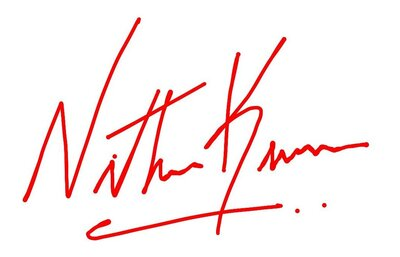

# Getting Started with .NET MAUI SignaturePad 

This section explains the steps required to add the SignaturePad control and its elements such as minimum and maximum stroke thickness, and stroke color. This section also covers how to save the signature as image, clear the existing signature in SignaturePad and handle the `DrawStarted` and `DrawCompleted` callbacks in the SignaturePad control.

## Creating an application with .NET MAUI

Create a new .NET MAUI application in Visual Studio.

 

## Adding SfSignaturePad reference

 Syncfusion .NET MAUI components are available in [nuget.org](https://www.nuget.org/). To add SfSignaturePad to your project, open the NuGet package manager in Visual Studio, search for Syncfusion.Maui.SignaturePad and then install it.

 

## Handler registration

In the MauiProgram.cs file, register the handler for Syncfusion core



using Syncfusion.Maui.Core.Hosting;
using Syncfusion.Maui.SignaturePad.Hosting;

namespace SignaturePadGettingStarted
{
    public static class MauiProgram
    {
        public static MauiApp CreateMauiApp()
        {
            var builder = MauiApp.CreateBuilder();
            builder
            .UseMauiApp<App>()
            .ConfigureSyncfusionCore()
            .ConfigureSyncfusionSignaturePad()
            .ConfigureFonts(fonts =>
            {
                fonts.AddFont("OpenSans-Regular.ttf", "OpenSansRegular");
            });

            return builder.Build();
        }
    }
}



## Initialize signature pad

Import the `SfSignaturePad` namespace and initialize the signature pad as shown below.





<ContentPage
    . . .
    xmlns:signaturePad="clr-namespace:Syncfusion.Maui.SignaturePad;assembly=Syncfusion.Maui.SignaturePad">
    <Grid>
        <signaturePad:SfSignaturePad />
    </Grid>
</ContentPage>





using Syncfusion.Maui.SignaturePad;

namespace SignaturePadGettingStarted
{
    public partial class MainPage : ContentPage
    {
        public MainPage()
        {
            InitializeComponent();
            // Creating a SignaturePad control.
            SfSignaturePad signaturePad = new SfSignaturePad();
            this.content = signaturePad;
        }
    }
}





## Customize signature stroke color

You can customize the stroke color of the SignaturePad control by using the `StrokeColor` property. The default stroke color is `Colors.Black`.





<signaturePad:SfSignaturePad StrokeColor="Red" />





SfSignaturePad signaturePad = new SfSignaturePad()
{
    StrokeColor = Colors.Red,
};





## Customize signature stroke thickness

The thickness of the stroke drawn can be customized by setting the `MinimumStrokeThickness` and `MaximumStrokeThickness` properties. The `MinimumStrokeThickness` defines the minimum thickness of the stroke and the `MaximumStrokeThickness` defines the maximum thickness of the stroke that can be draw based on the speed and impression we provide through gesture within its minimum and maximum stroke thickness ranges. So that the signature will be more realistic.





<signaturePad:SfSignaturePad MinimumStrokeThickness="1"
                             MaximumStrokeThickness="6" />





SfSignaturePad signaturePad = new SfSignaturePad()
{
    MinimumStrokeThickness = 1,
    MaximumStrokeThickness = 6,
};





## Save signature as image

You can save the signature drawn in the SignaturePad as an [`ImageSource`](https://docs.microsoft.com/en-us/dotnet/api/xamarin.forms.imagesource?view=xamarin-forms) using the `ToImageSource()` method which can further be synchronized with your devices and documents that need your signature.





<signaturePad:SfSignaturePad x:Name="signaturePad" />
<Button Text="Save"
        Clicked="OnSaveButtonClicked" />





SfSignaturePad signaturePad = new SfSignaturePad();
Button saveButton = new Button();
saveButton.Clicked += OnSaveButtonClicked;

private void OnSaveButtonClicked(object? sender, EventArgs e)
{
    ImageSource? source = signaturePad.ToImageSource();
}





## Clear the existing signature in SignaturePad

You can clear the signature drawn in the SignaturePad using the `Clear()` method as show in the below code snippet.





<signaturePad:SfSignaturePad x:Name="signaturePad" />
<Button Text="Clear"
        Clicked="OnClearButtonClicked" />





SfSignaturePad signaturePad = new SfSignaturePad();
Button clearButton = new Button();
clearButton.Clicked += OnClearButtonClicked;

private void OnClearButtonClicked(object? sender, EventArgs e)
{
    ImageSource? source = signaturePad.Clear();
}





## Events

### DrawStarted

This event will be triggered when we starts drawing in the signature pad. With this, `CancelEventArgs` will be passed. You can restrict the draw start action by setting `e.cancel` as `true`.





<signaturePad:SfSignaturePad DrawStarted="OnDrawStarted" />





SfSignaturePad signaturePad = new SfSignaturePad() {  DrawStarted += OnDrawStarted };
private void OnDrawStarted(object? sender, CancelEventArgs e)
{
    e.Cancel = false;
}





### DrawCompleted

This event will be triggered when we completed drawing in the signature pad.





<signaturePad:SfSignaturePad DrawCompleted="OnDrawCompleted" />





SfSignaturePad signaturePad = new SfSignaturePad() {  DrawCompleted += OnDrawCompleted };
private void OnDrawCompleted(object? sender, EventArgs e)
{
}



