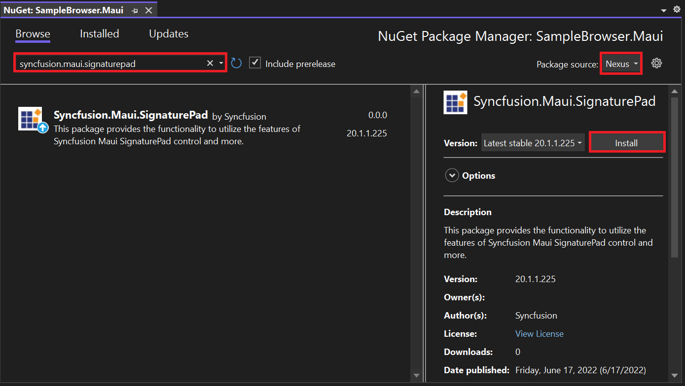

# Getting Started with .NET MAUI SignaturePad 

This section explains the steps required to add the SignaturePad control and its elements such as minimum and maximum stroke thickness, and stroke color. This section also covers how to save the signature as an image, clear the existing signature in SignaturePad and handle the [`DrawStarted`](https://help.syncfusion.com/cr/maui/Syncfusion.Maui.SignaturePad.SfSignaturePad.html#Syncfusion_Maui_SignaturePad_SfSignaturePad_DrawStarted) and [`DrawCompleted`](https://help.syncfusion.com/cr/maui/Syncfusion.Maui.SignaturePad.SfSignaturePad.html#Syncfusion_Maui_SignaturePad_SfSignaturePad_DrawCompleted) callbacks in the SignaturePad control.

To get start quickly with our .NET MAUI SignaturePad, you can check the below video.



## Creating an application with .NET MAUI

Create a new .NET MAUI application in Visual Studio.

 

## Adding SfSignaturePad reference

 The Syncfusion .NET MAUI components are available on [nuget.org](https://www.nuget.org/). To add the SfSignaturePad to your project, open the NuGet package manager in the Visual Studio, search for the Syncfusion.Maui.SignaturePad, and install it.

 

## Handler registration

In the MauiProgram.cs file, register the handler for Syncfusion Core.



using Syncfusion.Maui.Core.Hosting;

namespace SignaturePadGettingStarted
{
    public static class MauiProgram
    {
        public static MauiApp CreateMauiApp()
        {
            var builder = MauiApp.CreateBuilder();
            builder
            .UseMauiApp<App>()
            .ConfigureSyncfusionCore()
            .ConfigureFonts(fonts =>
            {
                fonts.AddFont("OpenSans-Regular.ttf", "OpenSansRegular");
            });

            return builder.Build();
        }
    }
}



## Initialize signature pad

Import the [`SfSignaturePad`](https://help.syncfusion.com/cr/maui/Syncfusion.Maui.SignaturePad.SfSignaturePad.html) namespace and initialize the SignaturePad as shown below.





<ContentPage
    . . .
    xmlns:signaturePad="clr-namespace:Syncfusion.Maui.SignaturePad;assembly=Syncfusion.Maui.SignaturePad">
    <Grid>
        <signaturePad:SfSignaturePad />
    </Grid>
</ContentPage>





using Syncfusion.Maui.SignaturePad;

namespace SignaturePadGettingStarted
{
    public partial class MainPage : ContentPage
    {
        public MainPage()
        {
            InitializeComponent();
            // Creating a SignaturePad control.
            SfSignaturePad signaturePad = new SfSignaturePad();
            this.content = signaturePad;
        }
    }
}





## Customize signature stroke color

Customize the stroke color of the SignaturePad control by using the [`StrokeColor`](https://help.syncfusion.com/cr/maui/Syncfusion.Maui.SignaturePad.SfSignaturePad.html#Syncfusion_Maui_SignaturePad_SfSignaturePad_StrokeColor) property. The default stroke color is `Colors.Black`.





<signaturePad:SfSignaturePad StrokeColor="Red" />





SfSignaturePad signaturePad = new SfSignaturePad()
{
    StrokeColor = Colors.Red,
};





## Customize signature stroke thickness

The thickness of the stroke drawn can be customized by setting the [`MinimumStrokeThickness`](https://help.syncfusion.com/cr/maui/Syncfusion.Maui.SignaturePad.SfSignaturePad.html#Syncfusion_Maui_SignaturePad_SfSignaturePad_MinimumStrokeThickness) and [`MaximumStrokeThickness`](https://help.syncfusion.com/cr/maui/Syncfusion.Maui.SignaturePad.SfSignaturePad.html#Syncfusion_Maui_SignaturePad_SfSignaturePad_MaximumStrokeThickness) properties. The [`MinimumStrokeThickness`](https://help.syncfusion.com/cr/maui/Syncfusion.Maui.SignaturePad.SfSignaturePad.html#Syncfusion_Maui_SignaturePad_SfSignaturePad_MinimumStrokeThickness) defines the minimum thickness of the stroke and the [`MaximumStrokeThickness`](https://help.syncfusion.com/cr/maui/Syncfusion.Maui.SignaturePad.SfSignaturePad.html#Syncfusion_Maui_SignaturePad_SfSignaturePad_MaximumStrokeThickness) defines the maximum thickness of the stroke that can be drawn based on the speed and impression we provide through gesture within its minimum and maximum stroke thickness ranges. So that the signature will be more realistic.





<signaturePad:SfSignaturePad MinimumStrokeThickness="1"
                             MaximumStrokeThickness="6" />





SfSignaturePad signaturePad = new SfSignaturePad()
{
    MinimumStrokeThickness = 1,
    MaximumStrokeThickness = 6,
};





## Saving the signature as an image

Save the signature drawn in the SignaturePad as an [`ImageSource`](https://learn.microsoft.com/en-us/dotnet/api/xamarin.forms.imagesource?view=xamarin-forms) using the [`ToImageSource()`](https://help.syncfusion.com/cr/maui/Syncfusion.Maui.SignaturePad.SfSignaturePad.html#Syncfusion_Maui_SignaturePad_SfSignaturePad_ToImageSource) method which can further be synchronized with your devices and documents that need your signature.





<signaturePad:SfSignaturePad x:Name="signaturePad" />
<Button Text="Save"
        Clicked="OnSaveButtonClicked" />





SfSignaturePad signaturePad = new SfSignaturePad();
Button saveButton = new Button();
saveButton.Clicked += OnSaveButtonClicked;

private void OnSaveButtonClicked(object? sender, EventArgs e)
{
    ImageSource? source = signaturePad.ToImageSource();
}





## Clear the existing signature in SignaturePad

Clear the signature drawn in the SignaturePad using the [`Clear()`](https://help.syncfusion.com/cr/maui/Syncfusion.Maui.SignaturePad.SfSignaturePad.html#Syncfusion_Maui_SignaturePad_SfSignaturePad_Clear) method as shown in the code snippet below:





<signaturePad:SfSignaturePad x:Name="signaturePad" />
<Button Text="Clear"
        Clicked="OnClearButtonClicked" />





SfSignaturePad signaturePad = new SfSignaturePad();
Button clearButton = new Button();
clearButton.Clicked += OnClearButtonClicked;

private void OnClearButtonClicked(object? sender, EventArgs e)
{
    ImageSource? source = signaturePad.Clear();
}





## Events

### DrawStarted

This event will be triggered when we start drawing in the SignaturePad. With this, [`CancelEventArgs`](https://learn.microsoft.com/en-us/dotnet/api/system.componentmodel.canceleventargs.-ctor?view=net-6.0#system-componentmodel-canceleventargs-ctor(system-boolean)) will be passed. Also, restrict the draw start action by setting [`e.cancel`](https://learn.microsoft.com/en-us/dotnet/api/system.componentmodel.canceleventargs.cancel?view=net-6.0#system-componentmodel-canceleventargs-cancel) as `true`.





<signaturePad:SfSignaturePad DrawStarted="OnDrawStarted" />





SfSignaturePad signaturePad = new SfSignaturePad()
{ 
    DrawStarted += OnDrawStarted
};
private void OnDrawStarted(object? sender, CancelEventArgs e)
{
    e.Cancel = false;
}





### DrawCompleted

This event will be triggered when we complete the drawing in the SignaturePad.





<signaturePad:SfSignaturePad DrawCompleted="OnDrawCompleted" />





SfSignaturePad signaturePad = new SfSignaturePad()
{
    DrawCompleted += OnDrawCompleted
};
private void OnDrawCompleted(object? sender, EventArgs e)
{
}



