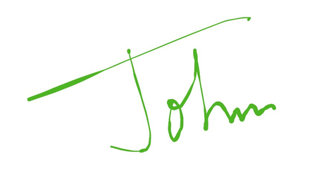

# Getting Started with .NET MAUI SignaturePad

This section guides you through setting up and configuring a [SignaturePad](https://help.syncfusion.com/cr/maui/Syncfusion.Maui.SignaturePad.SfSignaturePad.html) in your .NET MAUI application. Follow the steps below to add a basic SignaturePad to your project.

To get start quickly with our .NET MAUI SignaturePad, you can check the below video.



## Prerequisites

Before proceeding, ensure the following are in place:

1. Install [.NET 7 SDK](https://dotnet.microsoft.com/en-us/download/dotnet/7.0) or later.
2. Set up a .NET MAUI environment with Visual Studio 2022 (v17.3 or later) or VS Code. For VS Code users, ensure that the .NET MAUI workload is installed and configured as described [here](https://learn.microsoft.com/en-us/dotnet/maui/get-started/installation?view=net-maui-8.0&tabs=visual-studio-code).

## Step 1: Create a New MAUI Project

### Visual Studio

1.  Go to **File > New > Project** and choose the **.NET MAUI App** template.
2.  Name the project and choose a location, then click **Next**.
3.  Select the .NET framework version and click **Create**.

### Visual Studio Code

1.  Open the command palette by pressing `Ctrl+Shift+P`` and type **.NET:New Project** and enter.
2.  Choose the **.NET MAUI App** template.
3.  Select the project location, type the project name and press enter.
4.  Then choose **Create project**

## Step 2: Install the Syncfusion MAUI SignaturePad NuGet Package

1. In **Solution Explorer**, right-click the project and choose **Manage NuGet Packages**.
2. Search for [Syncfusion.Maui.SignaturePad](https://www.nuget.org/packages/Syncfusion.Maui.SignaturePad) and install the latest version.
Ensure the necessary dependencies are installed correctly, and the project is restored.

## Step 3: Register the handler

 [Syncfusion.Maui.Core](https://www.nuget.org/packages/Syncfusion.Maui.Core) Nuget is a dependent package for all Syncfusion controls of .NET MAUI. In the MauiProgram.cs file, register the handler for Syncfusion core.



using Syncfusion.Maui.Core.Hosting;

namespace SignaturePadGettingStarted
{
    public static class MauiProgram
    {
        public static MauiApp CreateMauiApp()
        {
            var builder = MauiApp.CreateBuilder();
            builder
            .UseMauiApp<App>()
            .ConfigureSyncfusionCore()
            .ConfigureFonts(fonts =>
            {
                fonts.AddFont("OpenSans-Regular.ttf", "OpenSansRegular");
            });

            return builder.Build();
        }
    }
}



## Step 4: Add a Basic SignaturePad

Import the [SfSignaturePad](https://help.syncfusion.com/cr/maui/Syncfusion.Maui.SignaturePad.SfSignaturePad.html) namespace and initialize the SignaturePad as shown below.





<ContentPage
    . . .
    xmlns:signaturePad="clr-namespace:Syncfusion.Maui.SignaturePad;assembly=Syncfusion.Maui.SignaturePad">
    <Grid>
        <signaturePad:SfSignaturePad />
    </Grid>
</ContentPage>





using Syncfusion.Maui.SignaturePad;

namespace SignaturePadGettingStarted
{
    public partial class MainPage : ContentPage
    {
        public MainPage()
        {
            InitializeComponent();
            // Creating a SignaturePad control.
            SfSignaturePad signaturePad = new SfSignaturePad();
            this.content = signaturePad;
        }
    }
}





## Customize signature stroke color

Customize the stroke color of the SignaturePad control by using the [StrokeColor](https://help.syncfusion.com/cr/maui/Syncfusion.Maui.SignaturePad.SfSignaturePad.html#Syncfusion_Maui_SignaturePad_SfSignaturePad_StrokeColor) property. The default stroke color is **Colors.Black**.





<signaturePad:SfSignaturePad StrokeColor="Red" />





SfSignaturePad signaturePad = new SfSignaturePad()
{
    StrokeColor = Colors.Red,
};





## Customize signature stroke thickness

The thickness of the stroke drawn can be customized by setting the [MinimumStrokeThickness](https://help.syncfusion.com/cr/maui/Syncfusion.Maui.SignaturePad.SfSignaturePad.html#Syncfusion_Maui_SignaturePad_SfSignaturePad_MinimumStrokeThickness) and [MaximumStrokeThickness](https://help.syncfusion.com/cr/maui/Syncfusion.Maui.SignaturePad.SfSignaturePad.html#Syncfusion_Maui_SignaturePad_SfSignaturePad_MaximumStrokeThickness) properties. The [MinimumStrokeThickness](https://help.syncfusion.com/cr/maui/Syncfusion.Maui.SignaturePad.SfSignaturePad.html#Syncfusion_Maui_SignaturePad_SfSignaturePad_MinimumStrokeThickness) defines the minimum thickness of the stroke and the [MaximumStrokeThickness](https://help.syncfusion.com/cr/maui/Syncfusion.Maui.SignaturePad.SfSignaturePad.html#Syncfusion_Maui_SignaturePad_SfSignaturePad_MaximumStrokeThickness) defines the maximum thickness of the stroke that can be drawn based on the speed and impression we provide through gesture within its minimum and maximum stroke thickness ranges. So that the signature will be more realistic.





<signaturePad:SfSignaturePad MinimumStrokeThickness="1"
                             MaximumStrokeThickness="6" />





SfSignaturePad signaturePad = new SfSignaturePad()
{
    MinimumStrokeThickness = 1,
    MaximumStrokeThickness = 6,
};





## Saving the signature as an image

Save the signature drawn in the SignaturePad as an [ImageSource](https://learn.microsoft.com/en-us/dotnet/api/xamarin.forms.imagesource?view=xamarin-forms) using the [ToImageSource()](https://help.syncfusion.com/cr/maui/Syncfusion.Maui.SignaturePad.SfSignaturePad.html#Syncfusion_Maui_SignaturePad_SfSignaturePad_ToImageSource) method which can further be synchronized with your devices and documents that need your signature.





<signaturePad:SfSignaturePad x:Name="signaturePad" />
<Button Text="Save"
        Clicked="OnSaveButtonClicked" />





SfSignaturePad signaturePad = new SfSignaturePad();
Button saveButton = new Button();
saveButton.Clicked += OnSaveButtonClicked;

private void OnSaveButtonClicked(object? sender, EventArgs e)
{
    ImageSource? source = signaturePad.ToImageSource();
}





## Clear the existing signature in SignaturePad

Clear the signature drawn in the SignaturePad using the [Clear()](https://help.syncfusion.com/cr/maui/Syncfusion.Maui.SignaturePad.SfSignaturePad.html#Syncfusion_Maui_SignaturePad_SfSignaturePad_Clear) method as shown in the code snippet below:





<signaturePad:SfSignaturePad x:Name="signaturePad" />
<Button Text="Clear"
        Clicked="OnClearButtonClicked" />





SfSignaturePad signaturePad = new SfSignaturePad();
Button clearButton = new Button();
clearButton.Clicked += OnClearButtonClicked;

private void OnClearButtonClicked(object? sender, EventArgs e)
{
    ImageSource? source = signaturePad.Clear();
}





## Events

### DrawStarted

This event will be triggered when we start drawing in the SignaturePad. With this, [CancelEventArgs](https://learn.microsoft.com/en-us/dotnet/api/system.componentmodel.canceleventargs.-ctor?view=net-6.0#system-componentmodel-canceleventargs-ctor(system-boolean)) will be passed. Also, restrict the draw start action by setting [e.cancel](https://learn.microsoft.com/en-us/dotnet/api/system.componentmodel.canceleventargs.cancel?view=net-6.0#system-componentmodel-canceleventargs-cancel) as **true**.





<signaturePad:SfSignaturePad DrawStarted="OnDrawStarted" />





SfSignaturePad signaturePad = new SfSignaturePad()
{ 
    DrawStarted += OnDrawStarted
};
private void OnDrawStarted(object? sender, CancelEventArgs e)
{
    e.Cancel = false;
}





### DrawCompleted

This event will be triggered when we complete the drawing in the SignaturePad.





<signaturePad:SfSignaturePad DrawCompleted="OnDrawCompleted" />





SfSignaturePad signaturePad = new SfSignaturePad()
{
    DrawCompleted += OnDrawCompleted
};
private void OnDrawCompleted(object? sender, EventArgs e)
{
}





N> You can refer to our [.NET MAUI SignaturePad](https://www.syncfusion.com/maui-controls/maui-signaturepad) feature tour page for its groundbreaking feature representations. You can also explore our [.NET MAUI SignaturePad Example](https://github.com/syncfusion/maui-demos/tree/master/MAUI/SignaturePad) that shows you how to render the SignaturePad in .NET MAUI.