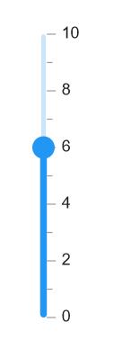

# Orientation

The [Orientation](https://help.syncfusion.com/cr/maui/Syncfusion.Maui.Sliders.SliderBase-1.html#Syncfusion_Maui_Sliders_SliderBase_1_Orientation) property allows you to show the slider in both horizontal and vertical directions. The default value of the [Orientation](https://help.syncfusion.com/cr/maui/Syncfusion.Maui.Sliders.SliderBase-1.html#Syncfusion_Maui_Sliders_SliderBase_1_Orientation) property is `Horizontal`.





<sliders:SfSlider Orientation="Vertical"
                  Minimum="0"
                  Maximum="10"
                  Value="5"
                  Interval="2"
                  ShowLabels="True"
                  ShowTicks="True"
                  MinorTicksPerInterval="1" />





SfSlider slider = new SfSlider()
{
    Orientation = SliderOrientation.Vertical,
    Minimum = 0,
    Maximum = 10,
    Value = 5,
    Interval = 2,
    ShowLabels = true,
    ShowTicks = true,
    MinorTicksPerInterval = 1
};





# Inverse the slider

Invert the slider using the [IsInversed](https://help.syncfusion.com/cr/maui/Syncfusion.Maui.Sliders.RangeView-1.html#Syncfusion_Maui_Sliders_RangeView_1_IsInversed) property. The default value of the [IsInversed](https://help.syncfusion.com/cr/maui/Syncfusion.Maui.Sliders.RangeView-1.html#Syncfusion_Maui_Sliders_RangeView_1_IsInversed) property is `False`.





<sliders:SfSlider Minimum="0"
                  Maximum="10"
                  Value="5"
                  IsInversed="True"
                  Interval="2"
                  ShowTicks="True"
                  ShowLabels="True"
                  MinorTicksPerInterval="1" />





SfSlider slider = new SfSlider()
{
    Minimum = 0,
    Maximum = 10,
    Value = 5,
    IsInversed = true,
    Interval = 2,
    ShowLabels = true,
    ShowTicks = true,
    MinorTicksPerInterval = 1
};





