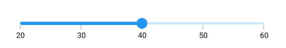

# Basic features  in Flutter Slider (SfSlider)
This section explains about how to add the numeric and date slider.

## Minimum

The minimum value that the user can select. The default value of [`min`](https://pub.dev/documentation/syncfusion_flutter_sliders/latest/sliders/SfSlider/min.html) property is 0.0 and it must be less than the [`max`](https://pub.dev/documentation/syncfusion_flutter_sliders/latest/sliders/SfSlider/max.html) value.

## Maximum

The maximum value that the user can select. The default value of [`max`](https://pub.dev/documentation/syncfusion_flutter_sliders/latest/sliders/SfSlider/max.html) property is 1.0 and it must be greater than the [`min`](https://pub.dev/documentation/syncfusion_flutter_sliders/latest/sliders/SfSlider/min.html) value.

## Value

It represents the value currently selected in the slider. The slider's thumb is drawn corresponding to this value.

For date values, the slider does not have auto interval support. So, it is mandatory to set [`interval`](https://pub.dev/documentation/syncfusion_flutter_sliders/latest/sliders/SfSlider/interval.html), [`dateIntervalType`](https://pub.dev/documentation/syncfusion_flutter_sliders/latest/sliders/SfSlider/dateIntervalType.html), and [`dateFormat`](https://pub.dev/documentation/syncfusion_flutter_sliders/latest/sliders/SfSlider/dateFormat.html) for date values.

**Numeric slider**

You can show numeric values in the slider by setting `double` values to the [`min`](https://pub.dev/documentation/syncfusion_flutter_sliders/latest/sliders/SfSlider/min.html), [`max`](https://pub.dev/documentation/syncfusion_flutter_sliders/latest/sliders/SfSlider/max.html) and [`value`](https://pub.dev/documentation/syncfusion_flutter_sliders/latest/sliders/SfSlider/value.html) properties.

### Horizontal




double _value = 4.0;

@override
Widget build(BuildContext context) {
  return MaterialApp(
      home: Scaffold(
          body: Center(
              child: SfSlider(
                min: 0.0,
                max: 10.0,
                value: _value,
                interval: 2,
                showLabels: true,
                onChanged: (dynamic newValue) {
                  setState(() {
                    _value = newValue;
                  });
                },
              )
          )
      )
   );
}




### Vertical




double _value = 4.0;

@override
Widget build(BuildContext context) {
  return MaterialApp(
      home: Scaffold(
          body: Center(
              child: SfSlider.vertical(
                min: 0.0,
                max: 10.0,
                value: _value,
                interval: 2,
                showLabels: true,
                onChanged: (dynamic newValue) {
                  setState(() {
                    _value = newValue;
                  });
                },
              )
          )
      )
   );
}




**Date slider**

You can show date values in the slider by setting `DateTime` values to the [`min`](https://pub.dev/documentation/syncfusion_flutter_sliders/latest/sliders/SfSlider/min.html), [`max`](https://pub.dev/documentation/syncfusion_flutter_sliders/latest/sliders/SfSlider/max.html) and [`value`](https://pub.dev/documentation/syncfusion_flutter_sliders/latest/sliders/SfSlider/value.html) properties.

N> You must import [`intl`](https://pub.dev/packages/intl) package for formatting date slider using the [`DateFormat`](https://pub.dev/documentation/intl/latest/intl/DateFormat-class.html) class.

### Horizontal




DateTime _value = DateTime(2002, 01, 01);

@override
Widget build(BuildContext context) {
  return MaterialApp(
      home: Scaffold(
          body: Center(
              child: SfSlider(
                min: DateTime(2000, 01, 01, 00),
                max: DateTime(2004, 12, 31, 24),
                value: _value,
                interval: 1,
                showLabels: true,
                dateFormat: DateFormat.y(),
                dateIntervalType: DateIntervalType.years,
                onChanged: (dynamic newValue) {
                  setState(() {
                    _value = newValue;
                  });
                },
              )
          )
      )
  );
}




### Vertical




DateTime _value = DateTime(2002, 01, 01);

@override
Widget build(BuildContext context) {
  return MaterialApp(
      home: Scaffold(
          body: Center(
              child: SfSlider.vertical(
                min: DateTime(2000, 01, 01, 00),
                max: DateTime(2004, 12, 31, 24),
                value: _value,
                interval: 1,
                showLabels: true,
                dateFormat: DateFormat.y(),
                dateIntervalType: DateIntervalType.years,
                onChanged: (dynamic newValue) {
                  setState(() {
                    _value = newValue;
                  });
                },
              )
          )
      )
  );
}




## Handle onChangeStart, onChanged, and onChangeEnd callbacks

**onChangeStart**

The `onChangeStart` callback is called when the user begins to interact with slider using a tap or drag action. This callback is only used to notify the user that the interaction has started and it does not change the value of the slider thumb.




double _value = 4.0;

@override
Widget build(BuildContext context) {
  return Scaffold(
    body: SfSlider(
      min: 0.0,
      max: 10.0,
      value: _value,
      onChangeStart: (dynamic startValue) {
        print('Interaction started');
      },
      onChanged: (dynamic newValue) {
        setState(() {
          _value = newValue;
        });
      },
    ),
  );
}




**onChangeEnd**

The `onChangeEnd` callback is called when the user stops to interact with slider using a tap or drag action. This callback is only used to notify the user that the interaction has ended and it does not change the value of the slider thumb.




double _value = 4.0;

@override
Widget build(BuildContext context) {
  return Scaffold(
    body: SfSlider(
      min: 0.0,
      max: 10.0,
      value: _value,
      onChanged: (dynamic newValue) {
        setState(() {
          _value = newValue;
        });
      },
      onChangeEnd: (dynamic endValue) {
        print('Interaction ended');
      },
    ),
  );
}




**onChanged**

The [`onChanged`](https://pub.dev/documentation/syncfusion_flutter_sliders/latest/sliders/SfSlider/onChanged.html) callback is called when the user selects a value through interaction.

N> The slider passes the new value to the callback but does not change its state until the parent widget rebuilds the slider with new value.

N> If it is null, the slider will be disabled.

### Horizontal




double _value = 4.0;

@override
Widget build(BuildContext context) {
  return MaterialApp(
      home: Scaffold(
           body: Center(
              child: SfSlider(
                min: 0.0,
                max: 10.0,
                value: _value,
                onChanged: (dynamic newValue) {
                  setState(() {
                    _value = newValue;
                  });
                },
              )
          )
      )
  );
}




### Vertical




double _value = 4.0;

@override
Widget build(BuildContext context) {
  return MaterialApp(
      home: Scaffold(
           body: Center(
              child: SfSlider.vertical(
                min: 0.0,
                max: 10.0,
                value: _value,
                onChanged: (dynamic newValue) {
                  setState(() {
                    _value = newValue;
                  });
                },
              )
          )
      )
  );
}




## Active color

It represents the color applied to the active track, thumb, overlay, and inactive dividers. The active side of the slider is between the [`min`](https://pub.dev/documentation/syncfusion_flutter_sliders/latest/sliders/SfSlider/min.html) value and the thumb.

### Horizontal




double _value = 4.0;

@override
Widget build(BuildContext context) {
  return MaterialApp(
      home: Scaffold(
          body: Center(
              child: SfSlider(
                min: 0.0,
                max: 10.0,
                value: _value,
                interval: 2,
                activeColor: Colors.red,
                showDividers: true,
                showTicks: true,
                showLabels: true,
                onChanged: (dynamic newValue) {
                  setState(() {
                    _value = newValue;
                  });
                },
              )
          )
      )
  );
}




### Vertical




double _value = 4.0;

@override
Widget build(BuildContext context) {
  return MaterialApp(
      home: Scaffold(
          body: Center(
              child: SfSlider.vertical(
                min: 0.0,
                max: 10.0,
                value: _value,
                interval: 2,
                activeColor: Colors.red,
                showDividers: true,
                showTicks: true,
                showLabels: true,
                onChanged: (dynamic newValue) {
                  setState(() {
                    _value = newValue;
                  });
                },
              )
          )
      )
  );
}




## Inactive color

It represents the color applied to the inactive track and active dividers.

The inactive side of the slider is between the thumb and the [`max`](https://pub.dev/documentation/syncfusion_flutter_sliders/latest/sliders/SfSlider/max.html) value.

### Horizontal




double _value = 4.0;

@override
Widget build(BuildContext context) {
  return MaterialApp(
      home: Scaffold(
          body: Center(
              child: SfSlider(
                min: 0.0,
                max: 10.0,
                value: _value,
                interval: 2,
                activeColor: Colors.red,
                inactiveColor: Colors.red.withOpacity(0.2),
                showDividers: true,
                showTicks: true,
                showLabels: true,
                onChanged: (dynamic newValue) {
                  setState(() {
                    _value = newValue;
                  });
                },
              )
          )
      )
  );
}




### Horizontal




double _value = 4.0;

@override
Widget build(BuildContext context) {
  return MaterialApp(
      home: Scaffold(
          body: Center(
              child: SfSlider.vertical(
                min: 0.0,
                max: 10.0,
                value: _value,
                interval: 2,
                activeColor: Colors.red,
                inactiveColor: Colors.red.withOpacity(0.2),
                showDividers: true,
                showTicks: true,
                showLabels: true,
                onChanged: (dynamic newValue) {
                  setState(() {
                    _value = newValue;
                  });
                },
              )
          )
      )
  );
}




### For customizing individual items

* Track - [`Link`](https://help.syncfusion.com/flutter/slider/track)
* Ticks - [`Link`](https://help.syncfusion.com/flutter/slider/ticks)
* Labels and dividers - `Link`
* Tooltip - [`Link`](https://help.syncfusion.com/flutter/slider/tooltip)
* Thumb and overlay - [`Link`](https://help.syncfusion.com/flutter/slider/thumb-and-overlay)
